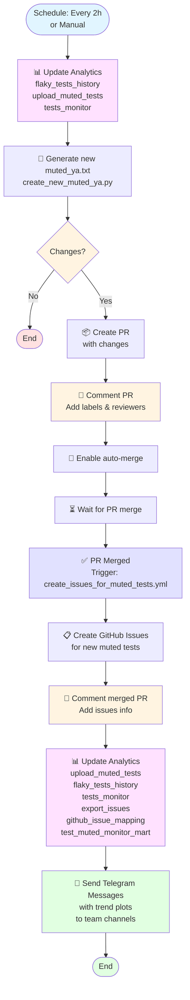
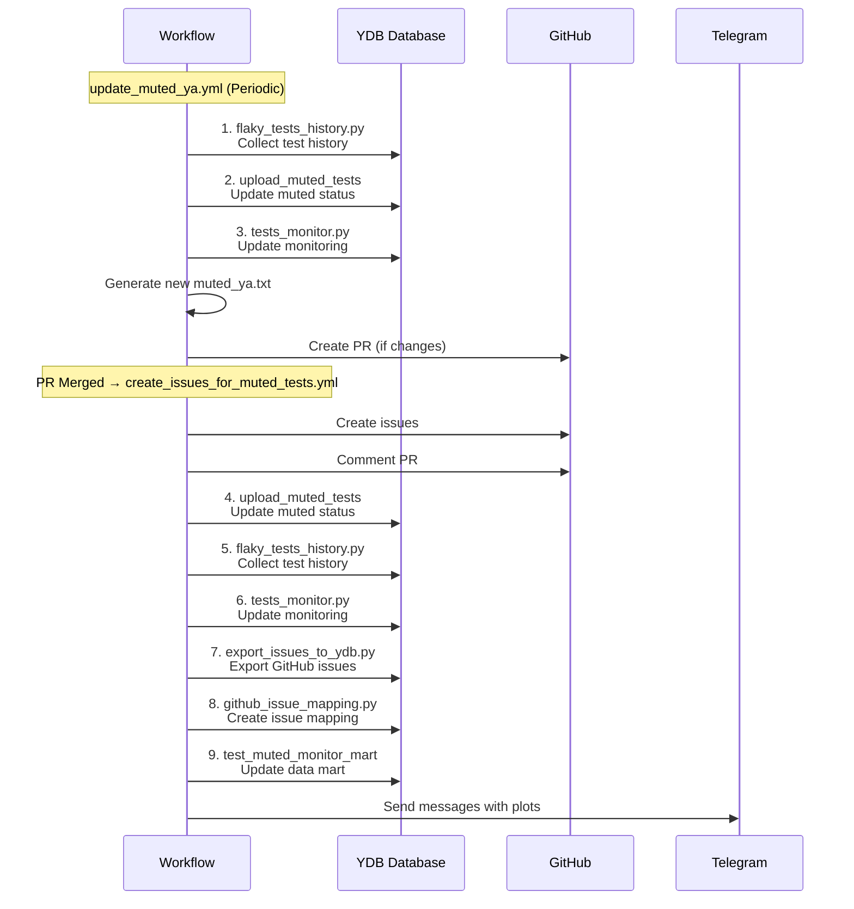

## 📖 Mute and Unmute Rules

---

### Mute a test if in the last 4 days:
- **3 or more failures AND runs (pass + fail) more than 10**
- **OR** 2 or more failures AND runs (pass + fail) not more than 10

### Unmute a test if in the last 7 days:
- **Runs (pass + fail + mute) >= 4**
- **AND no failures (fail + mute = 0)**

### Remove from mute if in the last 7 days:
- **No runs at all** (pass + fail + mute + skip = 0)

---

### Notes
- For all rules, only the last N days are considered (N=4 for mute, N=7 for unmute, N=7 for delete), including the current day.
- A "run" is any test execution with result pass, fail, or mute.
- A "failure" is a test execution with result fail or mute.
- Statistics aggregation is done by key (test_name, suite_folder, full_name, build_type, branch).

---

**Example:**
- If a test ran 15 times in 3 days with 3 failures — the test will be muted.
- If a test ran 5 times in 3 days with 2 failures — the test will be muted.
- If a test ran 4 times in 7 days and all passed successfully — the test will be unmuted.
- If a test didn't run at all in 7 days — it will be removed from mute.

## 🔄 Automated Workflow

### Automatic muted_ya.txt Updates
The `.github/workflows/update_muted_ya.yml` workflow automatically:
- Runs every 2 hours from 6:00 to 20:00 UTC
- Analyzes test data for the last 4-7 days
- Creates a PR with updated `muted_ya.txt` based on the rules above
- The PR should be approved to merge by CI Team @ydb-platform/ci

### Automatic Issue Creation
The `.github/workflows/create_issues_for_muted_tests.yml` workflow:
- Triggers after approval of PRs with `mute-unmute` label
- Creates GitHub issues for newly muted tests and close unmute
- Assigns issues to appropriate teams based on test ownership
- Links issues to the PR that introduced the mutes

## 📝 Manual mute/unmute management

### How to mute a test manually

- Open [muted_ya.txt](https://github.com/ydb-platform/ydb/blob/main/.github/config/muted_ya.txt) and add a test line.
- Create a PR, copy the title and description from the issue.
- Get confirmation from the test owner.
- After merging, link the PR and issue, notify the team.

**You can also:**
- Use the context menu in the PR report (see screenshot).
- Use [Test history dashboard](https://datalens.yandex/4un3zdm0zcnyr?tab=A4) to search and mute a test.

### How to unmute a test manually

- Open [muted_ya.txt](https://github.com/ydb-platform/ydb/blob/main/.github/config/muted_ya.txt) and remove the test line.
- Create a PR with title "UnMute {testname}".
- Get confirmation from the test owner.
- After merging, move the issue to Unmuted status, link the PR and issue.

## ⚡ Manual fast-unmute (close-issue shortcut)

Once you have fixed the tests tracked by a mute-issue, you can skip the default 7-day unmute wait by **manually closing the issue as Completed**. The `python3 .github/scripts/tests/manual_unmute.py sync` step on the next workflow run will:

1. Detect CLOSED+COMPLETED issues closed by a human (not by the bot).
2. For every test listed in the issue that is still muted, register a per-test row in the `mute_manual_unmute` YDB table.
3. Reopen the issue and post a comment explaining what is happening.

While a test is registered in that table, `create_new_muted_ya.py` evaluates it against a **shorter unmute window** defined in [mute_config.json](./mute_config.json):

- `manual_unmute_window_days` — how many days of history are aggregated (default: 2).
- `manual_unmute_min_runs` — minimum clean runs (pass+fail+mute) needed to unmute (default: 2).
- `mute_window_days` — days of monitor history for default `to_mute` thresholds and the upper bound of the post–fast-unmute mute ladder (default: 4).
- `unmute_window_days` / `delete_window_days` — aggregation windows for normal unmute / delete lists (default: 7).
- `manual_unmute_issue_closed_lookback_days` — how far back `manual_unmute.py` scans CLOSED+COMPLETED issues (default: 14).
- `manual_unmute_currently_muted_lookback_days` — monitor lookback when resolving latest `is_muted` per test (default: 30).

The usual "no failures in the window" rule still applies — if any of those tests fails during the window, the row is removed, a comment is posted on the issue, and the test returns to the default unmute criteria. When a test is successfully unmuted (by the regular pipeline using the short window), the row is cleaned up silently. Stale rows (older than 2 × window) are garbage-collected.

This flow is **per-test**: different tests from the same issue can graduate or fall back independently.

## 📊 Dashboard for analyzing muted and flaky tests

For analyzing test status, finding mute/unmute candidates, and tracking stability, use the interactive dashboard:

- [YDB Test Analytics Dashboard](https://datalens.yandex/4un3zdm0zcnyr)

**Dashboard capabilities:**
- View all muted tests by owner, full_name, status
- Quick search by test name or team (owner)
- Filter by status (flaky, muted, stable, etc.)
- History of runs and failures by day
- Tables of mute/unmute candidates (see corresponding tabs)
- Quick transition to creating mute-issues via link in the table

**Usage examples:**
- Find all muted tests for your team: select owner in the filter
- Find flaky candidates for mute: Flaky tab, filter by fail_count/run_count
- Find stable mutes for unmute: Stable tab, filter by success_rate

## 📋 Files generated by create_new_muted_ya.py

### 🔇 [to_mute.txt](mute_update/to_mute.txt)
**Content:** Mute candidates by new rules  
**Rules:** In 4 days (≥3 failures **AND** runs >10) **OR** (≥2 failures **AND** runs ≤10)  
**Usage:** Main file for mute decisions

### 🔊 [to_unmute.txt](mute_update/to_unmute.txt)
**Content:** Unmute candidates by new rules  
**Rules:** In 7 days ≥4 runs (pass+fail+mute), no failures (fail+mute=0)  
**Usage:** Main file for unmute decisions

### 🗑️ [to_remove_from_mute.txt](mute_update/to_remove_from_mute.txt)
**Content:** Tests to remove from mute  
**Rules:** No runs in 7 days  
**Usage:** Main file for removal from mute

## 📊 Additional analysis files

### 🔍 [muted_ya-deleted.txt](mute_update/muted_ya-deleted.txt)
**Content:** Tests from muted_ya minus deleted tests  
**Formula:** `muted_ya` - `deleted`  
**Usage:** Analysis of active tests in mute

### 🔍 [muted_ya-stable.txt](mute_update/muted_ya-stable.txt)
**Content:** Tests from muted_ya minus stable tests  
**Formula:** `muted_ya` - `stable`  
**Usage:** Analysis of unstable tests in mute

### 🔍 [muted_ya-stable-deleted.txt](mute_update/muted_ya-stable-deleted.txt)
**Content:** Tests from muted_ya minus stable and deleted  
**Formula:** `muted_ya` - `stable` - `deleted`  
**Usage:** Analysis of active unstable tests

### 🔍 [muted_ya-stable-deleted+flaky.txt](mute_update/muted_ya-stable-deleted+flaky.txt)
**Content:** Tests from muted_ya minus stable and deleted, plus flaky  
**Formula:** `muted_ya` - `stable` - `deleted` + `flaky`  
**Usage:** Creating GitHub issues

## 📋 Debug files (with details)

### 🔍 [muted_ya-deleted_debug.txt](mute_update/muted_ya-deleted_debug.txt)
**Content:** Details for tests muted_ya - deleted  
**Additional:** owner, success_rate, state, days_in_state

### 🔍 [muted_ya-stable_debug.txt](mute_update/muted_ya-stable_debug.txt)
**Content:** Details for tests muted_ya - stable  
**Additional:** owner, success_rate, state, days_in_state

### 🔍 [muted_ya-stable-deleted_debug.txt](mute_update/muted_ya-stable-deleted_debug.txt)
**Content:** Details for tests muted_ya - stable - deleted  
**Additional:** owner, success_rate, state, days_in_state

### 🔍 [muted_ya-stable-deleted+flaky_debug.txt](mute_update/muted_ya-stable-deleted+flaky_debug.txt)
**Content:** Details for tests muted_ya - stable - deleted + flaky  
**Additional:** owner, success_rate, state, days_in_state, pass_count, fail_count

---

## 🔄 File lifecycle

1. **Data analysis** → Creation of main action files
2. **Rule application** → Formation of three main files
3. **Additional analysis** → Creation of files for analyzing various combinations
4. **Issue creation** → Using `new_muted_ya.txt`

**All files are created in the `mute_update/` directory when running the script. The final mute file for workflow is `new_muted_ya.txt`.**

# Mute logic output files table

This table shows all files created by the mute logic script, with descriptions of their content and purpose.

## 📋 Main files

| File | Description | Rules | Usage |
|------|----------|---------|---------------|
| `to_mute.txt` | Mute candidates | In 4 days ≥2 failures **OR** (≥1 failure and runs ≤10) | Main file for mute decisions |
| `to_unmute.txt` | Unmute candidates | In 7 days ≥4 runs (pass+fail+mute), no failures (fail+mute=0) | Main file for unmute decisions |
| `to_remove_from_mute.txt` | Tests to remove from mute | No runs in 7 days | Main file for removal from mute |

## 📊 Additional analysis files

| File | Description | Formula | Usage |
|------|----------|---------|---------------|
| `muted_ya.txt` | All currently muted tests | aggregated over 4 days | Base for mute analysis |
| `muted_ya+to_mute.txt` | muted_ya + to_mute | | Analysis of potential mutes |
| `muted_ya-to_unmute.txt` | muted_ya - to_unmute | | Analysis of potential unmutes |
| `muted_ya-to_delete.txt` | muted_ya - to_delete | | Analysis of potential deletions |
| `muted_ya-to-delete-to-unmute.txt` | muted_ya - to_delete - to_unmute | | Analysis of active mutes |
| `muted_ya-to-delete-to-unmute+to_mute.txt` | (muted_ya - to_delete - to_unmute) + to_mute | | For final mute file |
| `new_muted_ya.txt` | Final mute file for workflow (duplicates muted_ya-to-delete-to-unmute+to_mute.txt) | copy of previous | Used for automatic update of .github/config/muted_ya.txt |

## 📋 Debug files (with details)

| File | Description | Additional information |
|------|----------|---------------------------|
| `muted_ya-deleted_debug.txt` | Details for tests muted_ya - deleted | owner, success_rate, state, days_in_state |
| `muted_ya-stable_debug.txt` | Details for tests muted_ya - stable | owner, success_rate, state, days_in_state |
| `muted_ya-stable-deleted_debug.txt` | Details for tests muted_ya - stable - deleted | owner, success_rate, state, days_in_state |
| `muted_ya-stable-deleted+flaky_debug.txt` | Details for tests muted_ya - stable - deleted + flaky | owner, success_rate, state, days_in_state, pass_count, fail_count |

---
## Muted Tests Workflow Diagram

### Main Workflow: Update Muted YA → PR Merge → Notifications

### Analytics Update Sequence

