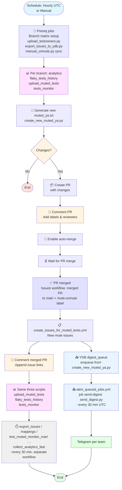
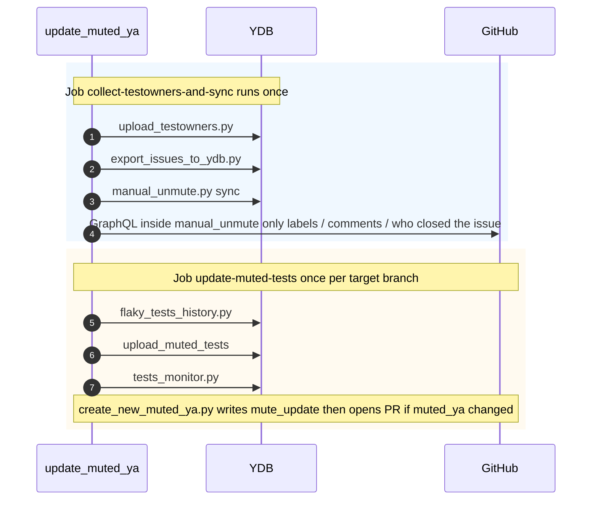
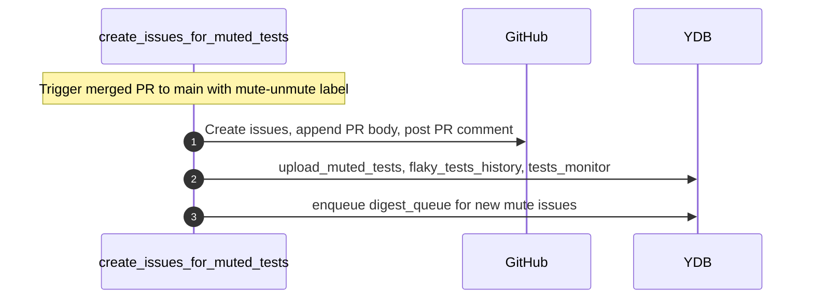
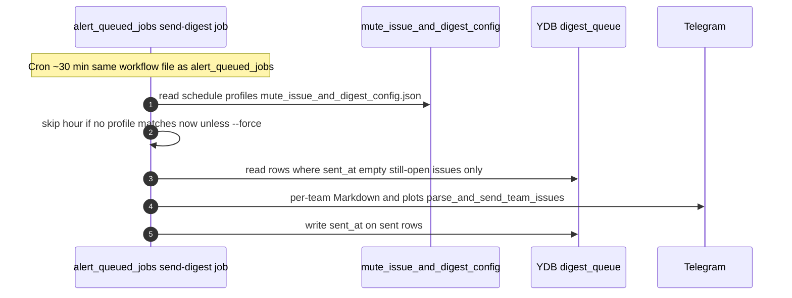

## 📖 Mute and Unmute Rules

---

### Mute a test if in the last 4 days:
- **3 or more failures AND runs (pass + fail) more than 10**
- **OR** 2 or more failures AND runs (pass + fail) not more than 10

### Unmute a test if in the last 7 days:
- **Runs (pass + fail + mute) >= 4**
- **AND no failures (fail + mute = 0)**

### Remove from mute if in the last 7 days:
- **No runs at all** (pass + fail + mute + skip = 0)

---

### Notes
- For all rules, only the last N days are considered (N=4 for mute, N=7 for unmute, N=7 for delete), including the current day.
- A "run" is any test execution with result pass, fail, or mute.
- A "failure" is a test execution with result fail or mute.
- Statistics aggregation is done by key (test_name, suite_folder, full_name, build_type, branch).

---

**Example:**
- If a test ran 15 times in 3 days with 3 failures — the test will be muted.
- If a test ran 5 times in 3 days with 2 failures — the test will be muted.
- If a test ran 4 times in 7 days and all passed successfully — the test will be unmuted.
- If a test didn't run at all in 7 days — it will be removed from mute.

---

### Fast track — start (manual fast-unmute)
- Fixed the tests → **close the mute issue as Completed**.
- Only a **human** close counts (not a bot). How it works in full: [Manual fast-unmute](#manual-fast-unmute-close-issue-shortcut) below.

### Fast track — unmute (short history window)
- Same idea as normal unmute, but only the **last ~2 calendar days** of history are checked.
- Need at least **2** runs (pass + fail + mute) and **no failures** (fail + mute = 0) in that window.

### Fast track — if the deadline passes while still muted
- After about **3** calendar days from the start of fast track, if the test is **still muted** in CI → the **normal 7-day** unmute rule applies again and the issue is **reopened**.

## 🔄 Automated Workflow

### Automatic muted_ya.txt Updates
The `.github/workflows/update_muted_ya.yml` workflow automatically:
- Runs every hour at :00 UTC
- Analyzes test data for the last 4-7 days
- Creates a PR with updated `muted_ya.txt` based on the rules above
- The PR should be approved to merge by CI Team @ydb-platform/ci

### Automatic Issue Creation
The `.github/workflows/create_issues_for_muted_tests.yml` workflow:
- Triggers after approval of PRs with `mute-unmute` label
- Creates GitHub issues for newly muted tests and close unmute
- Assigns issues to appropriate teams based on test ownership
- Links issues to the PR that introduced the mutes

## 📝 Manual mute/unmute management

### How to mute a test manually

- Open [muted_ya.txt](https://github.com/ydb-platform/ydb/blob/main/.github/config/muted_ya.txt) and add a test line.
- Create a PR, copy the title and description from the issue.
- Get confirmation from the test owner.
- After merging, link the PR and issue, notify the team.

**You can also:**
- Use the context menu in the PR report (see screenshot).
- Use [Test history dashboard](https://datalens.yandex/4un3zdm0zcnyr?tab=A4) to search and mute a test.

### How to unmute a test manually

- Open [muted_ya.txt](https://github.com/ydb-platform/ydb/blob/main/.github/config/muted_ya.txt) and remove the test line.
- Create a PR with title "UnMute {testname}".
- Get confirmation from the test owner.
- After merging, move the issue to Unmuted status, link the PR and issue.

## ⚡ Manual fast-unmute (close-issue shortcut)

Once you have fixed the tests tracked by a mute-issue, you can skip the default 7-day unmute wait by **manually closing the issue as Completed**. The `python3 .github/scripts/tests/manual_unmute.py sync` step on the next workflow run will:

1. Detect CLOSED+COMPLETED issues in the lookback window (`manual_unmute_issue_closed_lookback_days` in `mute_config.json`).
2. **Human-only trigger:** the *latest* GitHub *Close* event must be by a real user (`User` actor), not a bot. Known automation logins are ignored (see `BOT_LOGINS` in `manual_unmute.py`). If a bot closed the issue, fast-unmute does **not** start — this is intentional.
3. For every test listed in the issue body that is still muted in CI on the parsed branch(es), register a per-test row in the `fast_unmute_active` YDB table (`test_mute/fast_unmute_active`).
4. **Leave the issue closed**, add the `manual-fast-unmute` label, update org project **Status**, and post a “fast-unmute started” comment.

While a test is registered in that table, `create_new_muted_ya.py` evaluates it against a **shorter unmute window** defined in [mute_config.json](./mute_config.json):

- `manual_unmute_window_days` — how many days of history are aggregated for the short unmute path (default: 2).
- `manual_unmute_min_runs` — minimum clean runs (pass+fail+mute) needed to unmute (default: 2).
- `manual_unmute_ttl_calendar_days` — calendar days from row registration; if any row for the issue is still muted after this, the issue is reopened and all fast-unmute rows for that issue are cleared (default: 3).
- `mute_window_days` — days of monitor history for default `to_mute` thresholds and the upper bound of the post–fast-unmute mute ladder (default: 4).
- `unmute_window_days` / `delete_window_days` — aggregation windows for normal unmute / delete lists (default: 7).
- `manual_unmute_issue_closed_lookback_days` — how far back `manual_unmute.py` scans CLOSED+COMPLETED issues (default: 14).
- `manual_unmute_currently_muted_lookback_days` — monitor lookback when resolving latest `is_muted` per test (default: 30).

**While the deadline runs:** if a test is already **unmuted in CI**, only its row is removed; automation may post a short **progress** comment if other tests on the same issue are still tracked.

**All tests unmuted in CI before any deadline miss:** when the last row for the issue is removed for that reason, a **success** comment is posted, project **Status → Unmuted**, and the `manual-fast-unmute` label is removed (the issue stays **closed**).

**Deadline miss:** if at least one row passes `manual_unmute_ttl_calendar_days` while still muted, **all** rows for that GitHub issue number are removed, the issue is **reopened**, **Status → Muted**, one summary comment (who already unmuted vs who is still muted vs rows cleared early), and the label is removed.

## 📊 Dashboard for analyzing muted and flaky tests

For analyzing test status, finding mute/unmute candidates, and tracking stability, use the interactive dashboard:

- [YDB Test Analytics Dashboard](https://datalens.yandex/4un3zdm0zcnyr)

**Dashboard capabilities:**
- View all muted tests by owner, full_name, status
- Quick search by test name or team (owner)
- Filter by status (flaky, muted, stable, etc.)
- History of runs and failures by day
- Tables of mute/unmute candidates (see corresponding tabs)
- Quick transition to creating mute-issues via link in the table

**Usage examples:**
- Find all muted tests for your team: select owner in the filter
- Find flaky candidates for mute: Flaky tab, filter by fail_count/run_count
- Find stable mutes for unmute: Stable tab, filter by success_rate

## 📋 Files generated by create_new_muted_ya.py

### 🔇 [to_mute.txt](mute_update/to_mute.txt)
**Content:** Mute candidates by new rules  
**Rules:** In 4 days (≥3 failures **AND** runs >10) **OR** (≥2 failures **AND** runs ≤10)  
**Usage:** Main file for mute decisions

### 🔊 [to_unmute.txt](mute_update/to_unmute.txt)
**Content:** Unmute candidates by new rules  
**Rules:** In 7 days ≥4 runs (pass+fail+mute), no failures (fail+mute=0)  
**Usage:** Main file for unmute decisions

### 🗑️ [to_remove_from_mute.txt](mute_update/to_remove_from_mute.txt)
**Content:** Tests to remove from mute  
**Rules:** No runs in 7 days  
**Usage:** Main file for removal from mute

---

## 🔄 File lifecycle

1. **Data analysis** → Creation of main action files
2. **Rule application** → Formation of main outputs and other `mute_update/` artifacts used by the workflow
3. **Issue creation** → Using `new_muted_ya.txt`

**All files are created in the `mute_update/` directory when running the script. The final mute file for workflow is `new_muted_ya.txt`.**

# Mute logic output files table

This table shows all files created by the mute logic script, with descriptions of their content and purpose.

## 📋 Main files

| File | Description | Rules | Usage |
|------|----------|---------|---------------|
| `to_mute.txt` | Mute candidates | In 4 days ≥2 failures **OR** (≥1 failure and runs ≤10) | Main file for mute decisions |
| `to_unmute.txt` | Unmute candidates | In 7 days ≥4 runs (pass+fail+mute), no failures (fail+mute=0) | Main file for unmute decisions |
| `to_remove_from_mute.txt` | Tests to remove from mute | No runs in 7 days | Main file for removal from mute |

---
## Muted Tests Workflow Diagram

### Main workflow: update `muted_ya` → PR merge → issues → digest queue → Telegram

### What runs where (sequence)

There are **three pieces**: (1) every hour **`update_muted_ya.yml`** refreshes data and may open a mute PR; (2) after that PR merges, **`create_issues_for_muted_tests.yml`** creates GitHub issues and **enqueues `digest_queue`**; (3) on its own schedule, **`alert_queued_jobs.yml`** (job **Send mute digest**) runs **`send_digest.py`** and sends **Telegram** from that queue. Diagrams **1–2** are the mute repo path; **3** is the digest mailing path.

#### 1) Hourly: `update_muted_ya.yml` (one workflow run)

#### 2) After mute PR merged: `create_issues_for_muted_tests.yml`

#### 3) Mute digest to Telegram: `alert_queued_jobs.yml` (job Send mute digest)

Runs on a **different** timer than mute PRs (~every 30 min UTC in the same workflow file as CI queue alerts). **`send_digest.py`** uses [mute_issue_and_digest_config.json](./mute_issue_and_digest_config.json) to decide **which UTC hours / weekdays** to send. Same overview in flowchart form: [Mute digest queue to Telegram](#mute-digest-queue-to-telegram).

