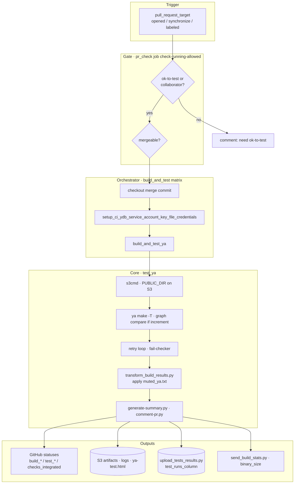

# CI Test Pipeline Architecture

Human-facing map of **build & test CI** (not analytics, release, or docs CI).
**Keep this file in sync** when changing test workflows, `test_ya`, or test scripts — see [Maintenance](#maintenance).

Related: data/analytics layer → [`.github/scripts/analytics/ARCHITECTURE.md`](../scripts/analytics/ARCHITECTURE.md) · mute rules → [`.github/config/mute_rules.md`](../config/mute_rules.md) · GitHub platform / multi-branch / security → [CI_PLATFORM.md](CI_PLATFORM.md)

## Layer legend

| Layer | Role | Examples |
|-------|------|----------|
| **Trigger** | What starts a run | PR open/sync, push to main, `workflow_dispatch` |
| **Gate** | Access / mergeability checks | `ok-to-test`, `CHECKS_SWITCH`, mergeable poll |
| **Orchestrator workflow** | Job matrix, checkout, secrets | `pr_check.yml`, `run_tests.yml` |
| **Composite action** | Reusable build+test wrapper | `build_and_test_ya` → `test_ya` |
| **Core runner** | ya make, retry, artifacts | `test_ya/action.yml` bash steps |
| **Post-process** | Reports, mute, comments | `transform_build_results.py`, `generate-summary.py` |
| **Ingestion** | Side effects after tests | S3 public logs, GitHub statuses, YDB upload |
| **Downstream** | Outside this doc's scope | Analytics marts, mute PRs, Telegram |

## End-to-end flow (PR-check)



## Action stack (always this order)

```
workflow (pr_check / postcommit / run_tests / regression_*)
  └── build_and_test_ya          # s3cmd prefix, passes secrets/vars JSON
        └── test_ya              # ya make, retry, reports, upload
              ├── s3cmd          # (via build_and_test_ya)
              └── build          # cmake/ninja — separate path, not used in PR-check
```

**Rule:** workflows should call `build_and_test_ya`, not `test_ya` directly (except legacy/special cases).

## Workflow → action → key scripts → output

Status: **active** | **manual / dispatch** | **scheduled off**

| Workflow | Trigger | `build_and_test_ya` presets | Primary outputs |
|----------|---------|----------------------------|-----------------|
| `pr_check.yml` | `pull_request_target` | relwithdebinfo, release-asan (+ tsan/msan via labels) | PR statuses, S3 logs, YDB rows (`job_name=PR-check`) |
| `postcommit_relwithdebinfo.yml` | push main/stable | relwithdebinfo | Postcommit signal in YDB |
| `postcommit_asan.yml` | push main/stable | release-asan | ASAN postcommit signal |
| `run_tests.yml` | `workflow_call` / `workflow_dispatch` | caller-defined | Extra/manual test runs |
| `regression_run*.yml` | dispatch (cron mostly off) | matrix presets via `run_tests` | Full regression coverage |
| `run_and_debug_tests.yml` | dispatch | debug / coredumps | Developer debugging |
| `build_and_test_ya.yml` | dispatch | various | Standalone build+test |

Not covered here (separate domains): `collect_analytics_*`, `update_muted_ya`, `docs_*`, `cherry_pick_*`, `build_binaries`, `docker_publish`.

## PR-check specifics

File: `.github/workflows/pr_check.yml`

| Topic | Behavior |
|-------|----------|
| Event | `pull_request_target` (runs in base repo context; checkout uses **merge commit** SHA) |
| Merge commit | Gate job outputs `commit_sha` from `pr.merge_commit_sha` — can be **stale**; see [CI_PLATFORM.md § traps](CI_PLATFORM.md#known-ydb-traps-production-verified) ([#36673](https://github.com/ydb-platform/ydb/issues/36673)) |
| Concurrency | One run per PR; cancelled on new push; label-only events use fake group to avoid cancelling |
| Re-trigger labels | `ok-to-test`, `rebase-and-check` only |
| External forks | Tests run only after maintainer adds `ok-to-test` |
| Feature flag | `vars.CHECKS_SWITCH` JSON → `pr_check == true` |
| Runners | `auto-provisioned`, label `build-preset-{relwithdebinfo\|release-asan}` |
| Matrix default | `ydb/`, test sizes `small,medium`, increment=true |
| Sanitizer extras | `run-tsan-tests`, `run-msan-tests`, `run-sanitizer-tests` labels |
| Integrated status | Job `update_integrated_status` requires 4 green contexts: `build_*` + `test_*` for relwithdebinfo and release-asan |

## `test_ya` internals (what one job does)

| Step | Script / tool | Purpose |
|------|---------------|---------|
| Init | pip install, `TMP_DIR`, `PUBLIC_DIR` | S3-backed public artifact dir |
| Graph compare | `graph_compare.py` (if `increment=true`) | Select tests affected by diff |
| ya make | `./ya -T …` in systemd scope | Build + test with retries |
| Report | `report_analyzer.py`, `fail-checker.py` | Failure counts, summaries |
| Mute filter | `transform_build_results.py` + `muted_ya.txt` | Mark muted tests in report |
| PR comment | `generate-summary.py`, `comment-pr.py` | Collapsible summary on PR |
| Analytics ingest | `upload_tests_results.py` | Write to YDB (needs SA + `YDB_QA_CONFIG`) |
| Binary stats | `send_build_stats.py` | `binary_size` table |
| Status API | curl commit statuses | `build_{preset}`, `test_{preset}` |

Retry: controlled by `test_retry_count` input; TSAN/MSAN default retry=1 and `IS_TEST_RESULT_IGNORED=1`.

## Config & secrets (common)

| Name | Kind | Used for |
|------|------|----------|
| `CHECKS_SWITCH` | repo variable (JSON) | Enable/disable workflows per environment |
| `YDB_QA_CONFIG` | repo variable (JSON) | Table paths for analytics upload in CI |
| `CI_YDB_SERVICE_ACCOUNT_KEY_FILE_CREDENTIALS` | secret | YDB write from `test_ya` |
| `AWS_*`, `REMOTE_CACHE_*` | secret / var | S3 artifacts, ya remote cache |
| `GH_PERSONAL_ACCESS_TOKEN` | secret | Collaborator check in PR gate |
| `muted_ya.txt` | repo file | Mute rules consumed at test report time |

Build presets: `relwithdebinfo`, `release-asan`, `release-tsan`, `release-msan`, `debug`, `release`.

## Mute integration (boundary)

Mute **decisions** live in analytics/mute workflows (`update_muted_ya` → `tests_monitor` → PR to `muted_ya.txt`).
Mute **enforcement** in CI happens inside `test_ya` via `transform_build_results.py` reading `.github/config/muted_ya.txt`.

For mute workflow architecture see `mute_rules.md` and analytics `ARCHITECTURE.md`.

## Key file locations

| Path | Role |
|------|------|
| `.github/workflows/pr_check.yml` | Main pre-commit pipeline |
| `.github/actions/build_and_test_ya/` | Standard entry for build+test |
| `.github/actions/test_ya/` | Core ya make + reports + upload |
| `.github/actions/s3cmd/` | S3 public artifact upload |
| `.github/scripts/tests/` | Report transform, summary, mute helpers |
| `.github/config/muted_ya*.txt` | Per-sanitizer mute lists |
| `.github/config/stable_tests_branches.json` | Branch list for regression |
| `.github/workflows/automerge_pr.yaml` | Scheduled automerge; in-job polling for cron gaps ([#44180](https://github.com/ydb-platform/ydb/pull/44180)) |
| `ydb/ci/rightlib/automerge.py` | Automerge logic; base refresh before push |

## Maintenance

### When you MUST update this file

Same PR as the code change if you touch:

- `.github/workflows/pr_check.yml`, `postcommit_*.yml`, `regression_*.yml`, `run_tests.yml`, `run_and_debug_tests.yml`
- `.github/actions/test_ya/**`, `build_and_test_ya/**`, `s3cmd/**`
- `.github/scripts/tests/**` when behavior affects pipeline outputs (statuses, S3 layout, upload)
- New workflow that calls `build_and_test_ya` / `test_ya`
- Platform traps, multi-branch policy, security rules → [CI_PLATFORM.md](CI_PLATFORM.md)

Update: diagram edge, workflow table row, PR-check table if gate logic changed.

### PR checklist

```markdown
- [ ] Change reflected in CI_PIPELINE.md (diagram and/or table)
- [ ] Platform / multi-branch / security: CI_PLATFORM.md if applicable
- [ ] GitHub Actions semantics verified against current docs (see CI_PLATFORM.md)
- [ ] Shared action change: multi-branch checklist in CI_PLATFORM.md
- [ ] merge_commit / checkout ref: [#36673](https://github.com/ydb-platform/ydb/issues/36673)
- [ ] Scheduled workflow: cron gap / in-job polling if critical ([#44180](https://github.com/ydb-platform/ydb/pull/44180))
- [ ] New GitHub status context → update `update_integrated_status` in pr_check if needed
- [ ] New job_name in YDB upload → analytics ARCHITECTURE.md
- [ ] Fork/external PR flow if changing pull_request_target gate
- [ ] No unreviewed docs extensions or remote curl|sh ([CI_PLATFORM.md](CI_PLATFORM.md))
```

### For Cursor agents

Skills (routers): `.cursor/rules/ci-testing.mdc`, `.cursor/rules/analytics.mdc` — read this file + CI_PLATFORM.md / ARCHITECTURE.md for details.
