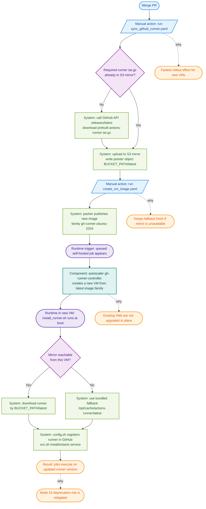

# GitHub Actions Runner Update Rollout (Node 20 to Node 24 Example)

This note describes how to safely roll out the Node 20 deprecation-related updates for GitHub Actions in this repository.

## What changed in this PR

- `actions/checkout` was updated from `@v4` to `@v5` in workflows.
- Self-hosted runner image default was updated in `ydb/ci/gh-runner-image/ydbtech.pkr.hcl`:
  - `github_runner_version: 2.323.0 -> 2.327.1`

Why this matters:
- GitHub is deprecating Node 20 for JavaScript actions.
- `actions/checkout@v5` requires Actions Runner `>= 2.327.1`.

## Important behavior

- Workflow YAML changes (`checkout@v5`) start affecting runs as soon as these workflow files are used.
- Runner version changes do **not** apply instantly after merge.
- New runner version is used only after infrastructure refresh:
  - runner mirror update,
  - VM image rebuild,
  - new VMs provisioned from the updated image.
- While the fleet is mixed (some runners `< 2.327.1`, some `>= 2.327.1`), any job that lands on an outdated long‑lived/self‑hosted runner will fail once the workflow uses `actions/checkout@v5`.
- To avoid this window of CI breakage, schedule a short pre‑merge or immediate post‑merge maintenance to drain or upgrade non‑ephemeral runner groups (or temporarily disable scheduled workflows targeting those runners) until the majority of capacity is on runners `>= 2.327.1`.

## Safe rollout plan

1. Merge this PR.
2. Run workflow `sync_github_runner.yaml` manually (`workflow_dispatch`).
3. Run workflow `create_vm_image.yaml` manually (`workflow_dispatch`).
4. Allow autoscaler to provision new `auto-provisioned` VMs.
5. Gradually rotate old runners (natural churn or controlled batch replacement).

## Rollout flow diagram

### Step details: what happens and why it matters

1. **Run `sync_github_runner.yaml`**
   - What happens:
     - `ydb/ci/sync_github_runner.sh` checks whether the required runner archive is already present in S3 mirror.
     - If it is missing, the script calls GitHub API (`actions/runner/releases/latest`), gets the release URL, downloads the prebuilt runner tarball, and uploads it to S3.
     - It updates the mirror pointer object at `<RUNNER_MIRROR_S3_BUCKET_PATH>/latest` (in script: `BUCKET_PATH/latest`).
   - Why important:
     - New VMs pick runner from mirror first, so this gives the fastest rollout effect.
     - Does not require waiting for a new VM image to start using a fresh runner binary.

2. **Run `create_vm_image.yaml`**
   - What happens:
     - Packer rebuilds the runner VM image from `ydb/ci/gh-runner-image`.
     - The image includes bundled fallback runner under `/opt/cache/actions-runner/latest`.
     - A new image is published in family `gh-runner-ubuntu-2204`.
   - Why important:
     - Keeps fallback path current if mirror is unavailable.
     - Reduces risk of launching VMs with stale bundled runner.
   - If you skip this step:
     - Most runs still work while mirror is healthy (primary path).
     - Risk appears when mirror is unreachable: VM falls back to bundled runner from image, which can be stale.

3. **Autoscaler (`gh-runner-controller`) provisions new VMs**
   - What happens:
     - Controller service (`ydb/ci/gh-runner-controller`) monitors queued self-hosted jobs and decides when extra runners are needed.
     - It resolves latest image by family and starts new `auto-provisioned` VMs.
     - At VM boot time (runtime event, not part of `create_vm_image.yaml`), `install_runner.sh` tries mirror first; if that fails, it uses bundled fallback.
   - Why important:
     - This is the point where infrastructure change becomes effective for real jobs.
     - Existing VMs are not upgraded in place; only newly provisioned VMs get updated components.

4. **What `install_runner.sh` does (runtime on each new VM)**
   - Downloads runner from mirror using `AGENT_MIRROR_URL_PREFIX/latest`; if it fails, uses bundled fallback from image.
   - Registers runner in GitHub (`config.sh --unattended --disableupdate`) and starts it as a system service (`svc.sh`).
   - This script is executed on VM boot by cloud-init; it is not executed by `create_vm_image.yaml`.

5. **Rotate old runners gradually**
   - What happens:
     - Old VMs leave naturally or are replaced in controlled batches.
   - Why important:
     - Avoids capacity drops and rollout spikes.
     - Lets you verify stability while traffic shifts to updated runners.

## Where infra update happens

- Runner mirror refresh: `.github/workflows/sync_github_runner.yaml`
  - executes `ydb/ci/sync_github_runner.sh`
- VM image build: `.github/workflows/create_vm_image.yaml`
  - runs `packer build` in `ydb/ci/gh-runner-image`
- New VM provisioning: `ydb/ci/gh-runner-controller`
  - scaler resolves latest image by family and starts new VMs

## Verification checklist

- In a fresh job log, open `Set up job` and verify `Runner version >= 2.327.1`.
- Confirm no `Node.js 20 actions are deprecated` warning appears for checkout.
- Confirm jobs on `self-hosted, auto-provisioned` labels execute normally.

## Rollback (if needed)

- Fast rollback: temporarily revert `actions/checkout` to `@v4`.
- Infra rollback: revert runner image version and rebuild image.
- Avoid using `ACTIONS_ALLOW_USE_UNSECURE_NODE_VERSION=true` except as emergency short-term mitigation.

