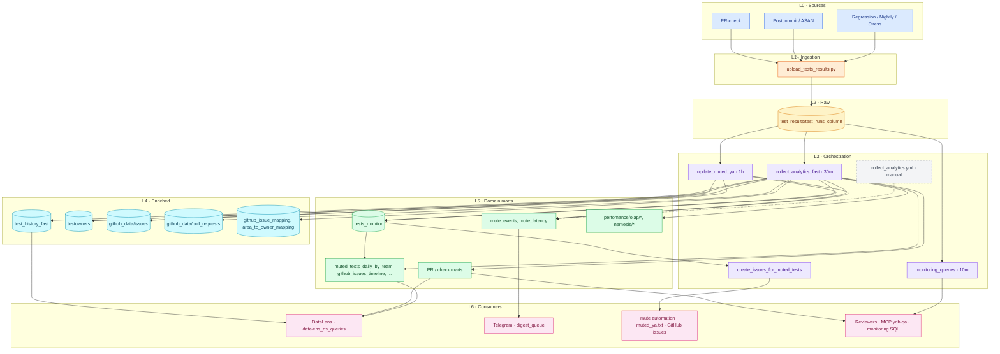
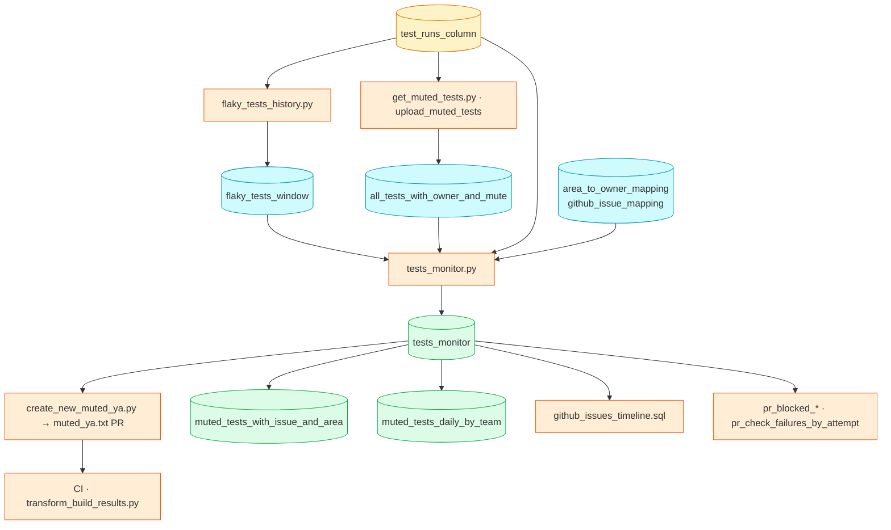
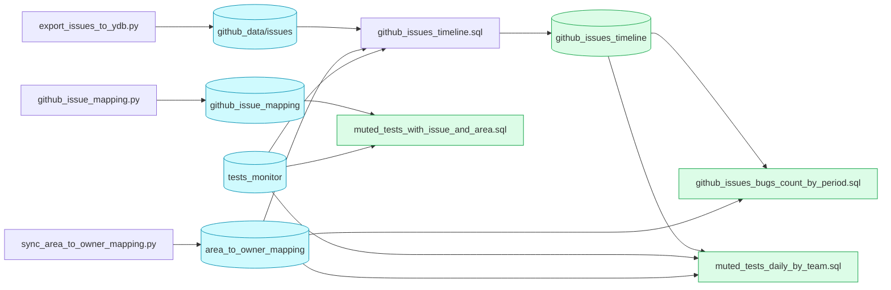
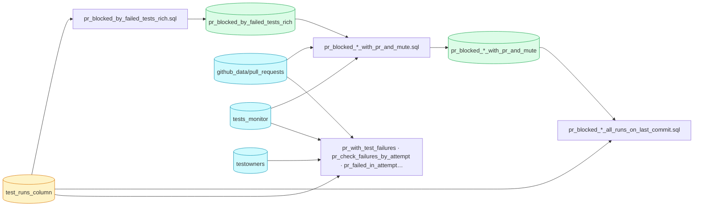

# CI Analytics Architecture

Human-facing map of the pipeline ([issue #44312](https://github.com/ydb-platform/ydb/issues/44312)).
**Keep this file in sync** when adding workflows, scripts, YDB tables, or consumers — see [Maintenance](#maintenance).

## Layer legend (colors on diagram)

| Layer | Color | Role | Examples |
|-------|-------|------|----------|
| **L0 Sources** | Blue | CI produces test results | PR-check, Postcommit, Regression |
| **L1 Ingestion** | Orange | Write raw rows to YDB | `upload_tests_results.py` |
| **L2 Raw storage** | Amber | Append-only fact table | `test_results/test_runs_column` |
| **L3 Orchestration** | Purple | Scheduled / triggered jobs | `collect_analytics_fast`, `update_muted_ya` |
| **L4 Enriched** | Cyan | History, GitHub mirror, owners | `test_history_fast`, `github_data/*` |
| **L5 Domain marts** | Green | SQL-built tables for analytics | `pr_blocked_by_*`, `mute_*`, BI marts |
| **L6 Consumers** | Pink | Dashboards, bots, automation | DataLens, Telegram, mute PRs, ad-hoc YQL |
| **Legacy / manual** | Gray | Deprecated or not in cron | `collect_analytics.yml`, `datalens_ds_queries/` |

## Data flow (overview)



## Table dependency maps

Overview diagram above shows **workflows and layers**. This section shows **YDB table-level reads/writes** for SQL marts and Python collectors.

**Cross-workflow note:** `tests_monitor` is **written** by `update_muted_ya` (hourly) and **read** by many marts in `collect_analytics_fast` (every 30m). Timeline/mute BI marts assume `tests_monitor` is already populated.

**Execution order** in `collect_analytics_fast.yml` (same job, order matters for dependent marts):

1. Enriched exports: `testowners`, `test_history_fast`, GitHub `issues` / `pull_requests`, `github_issue_mapping`, `area_to_owner_mapping`
2. `github_issues_timeline.sql` ← needs `issues`, `area_to_owner_mapping`, **`tests_monitor`**
3. `github_issues_bugs_count_by_period.sql` ← needs `github_issues_timeline`
4. `muted_tests_with_issue_and_area.sql`, `muted_tests_daily_by_team.sql` ← need **`tests_monitor`**, `github_issues_timeline` (daily mart also)
5. PR-blocked marts (mostly from `test_runs_column`; `*_with_pr_and_mute*` also need `tests_monitor` + `pull_requests`)

DataLens chain order is documented in `data_mart_queries/datalens_ds_queries/team_view_data_pipes.sql`.

### Mute decision chain



### GitHub / issues chain



### PR-blocked chain



### Perf / nemesis (separate domain)

| Source | Mart SQL | Output |
|--------|----------|--------|
| `perfomance/olap/tests_results` | `perfomance_olap_suites_mart.sql`, `perfomance_olap_mart.sql` | `perfomance/olap/fast_results*` |
| `nemesis/tests_results` | `stability_aggregate_mart.sql` | `nemesis/aggregated_mart` |

Monitoring SQL under `monitoring_queries/` reads these marts and core tables (read-only alerts).

### Python collectors (non-SQL writes)

| Script | Workflow | Writes | Main reads |
|--------|----------|--------|------------|
| `upload_tests_results.py` | `test_ya` | `test_runs_column` | CI artifacts |
| `test_history_fast.py` | `collect_analytics_fast` | `test_history_fast` | `test_runs_column` |
| `upload_testowners.py` | `collect_analytics_fast`, `update_muted_ya` | `testowners` | repo `CODEOWNERS` |
| `export_issues_to_ydb.py` | both | `github_data/issues` | GitHub API |
| `export_pull_requests_to_ydb.py` | `collect_analytics_fast` | `github_data/pull_requests` | GitHub API |
| `github_issue_mapping.py` | `collect_analytics_fast` | `github_issue_mapping` | GitHub API |
| `sync_area_to_owner_mapping.py` | `collect_analytics_fast` | `area_to_owner_mapping` | config / GitHub |
| `flaky_tests_history.py` | `update_muted_ya` | `flaky_tests_window_*` | `test_runs_column` |
| `get_muted_tests.py` | `update_muted_ya` | `all_tests_with_owner_and_mute` | `muted_ya.txt`, YDB |
| `tests_monitor.py` | `update_muted_ya`, `create_issues_for_muted_tests` | `tests_monitor` | `test_runs_column`, `flaky_tests_window`, `all_tests_with_owner_and_mute`, mappings, prior `tests_monitor` |
| `mute_latency_from_failure.py` | `collect_analytics_fast` | `mute_events`, `mute_latency`, … | `test_runs_column`, mute state |

### Mart SQL registry (`collect_analytics_fast` + manual)

Cron marts only (`datalens_ds_queries/` are manual DataLens layers on top). Regenerate reads column:

```bash
python3 .github/scripts/analytics/list_mart_dependencies.py --markdown
```

| SQL | Writes (`--table_path`) | Reads (`FROM`/`JOIN`) |
|-----|-------------------------|------------------------|
| `datamart_postcommit_retry.sql` | `test_results/test_results/analytics/postcommit_retry` | `test_runs_column` |
| `github_issues_timeline.sql` | `test_results/analytics/github_issues_timeline` | `github_data/issues`, `area_to_owner_mapping`, **`tests_monitor`** |
| `github_issues_bugs_count_by_period.sql` | `test_results/analytics/github_issues_bugs_count_by_period` | `area_to_owner_mapping`, `github_issues_timeline` |
| `muted_tests_with_issue_and_area.sql` | `test_results/analytics/muted_tests_with_issue_and_area` | `area_to_owner_mapping`, `github_issue_mapping`, `fast_unmute_active`, **`tests_monitor`** |
| `muted_tests_daily_by_team.sql` | `test_results/analytics/muted_tests_daily_by_team` | `area_to_owner_mapping`, `github_issues_timeline`, **`tests_monitor`** |
| `perfomance_olap_suites_mart.sql` | `perfomance/olap/fast_results_siutes` | `perfomance/olap/tests_results` |
| `perfomance_olap_mart.sql` | `perfomance/olap/fast_results` | `perfomance/olap/tests_results` |
| `pr_check_stats.sql` | `analytics/pr_check_stats` | `test_runs_column` |
| `pr_blocked_by_failed_tests_rich.sql` | `test_results/analytics/pr_blocked_by_failed_tests_rich` | `test_runs_column` |
| `pr_blocked_by_failed_tests_rich_with_pr_and_mute.sql` | `test_results/analytics/pr_blocked_by_failed_tests_rich_with_pr_and_mute` | `pr_blocked_by_failed_tests_rich`, `pull_requests`, **`tests_monitor`** |
| `pr_blocked_by_failed_tests_rich_with_pr_and_mute_all_runs_on_last_commit.sql` | `test_results/analytics/pr_blocked_by_failed_tests_rich_all_runs_on_last_commit` | `pr_blocked_by_failed_tests_rich_with_pr_and_mute`, `test_runs_column` |
| `pr_with_test_failures.sql` | `test_results/analytics/pr_blocked_by_tests` | `test_runs_column`, `pull_requests`, `testowners` |
| `pr_check_failures_by_attempt.sql` | `test_results/analytics/pr_check_failures_by_attempt` | `test_runs_column`, `pull_requests`, `testowners`, **`tests_monitor`** |
| `pr_failed_in_attempt_but_not_run_in_next.sql` | `test_results/analytics/pr_failed_in_attempt_but_not_run_in_next` | `test_runs_column`, `pull_requests` |
| `pr_failed_tests_validation_through_mute_rules.sql` | — (**manual** / ad-hoc) | `test_runs_column`, `pull_requests`, **`tests_monitor`** |
| `stability_aggregate_mart.sql` | `nemesis/aggregated_mart` | `nemesis/tests_results` |

## Workflow → script → YDB table → consumer

Status: **active** | **legacy (manual)** | **manual-only SQL**

| Workflow | Script / step | YDB output | Consumer |
|----------|---------------|------------|----------|
| `test_ya` action | `upload_tests_results.py` | `test_results/test_runs_column` | all downstream |
| `collect_analytics_fast` | `test_history_fast.py` | `test_results/analytics/test_history_fast` | DataLens, investigations |
| `collect_analytics_fast` | `upload_testowners.py` | `test_results/analytics/testowners` | mute, ownership marts |
| `collect_analytics_fast` | `export_issues_to_ydb.py` | `github_data/issues` | mute, timeline marts |
| `collect_analytics_fast` | `export_pull_requests_to_ydb.py` | `github_data/pull_requests` | PR marts |
| `collect_analytics_fast` | `github_issue_mapping.py` | `test_results/analytics/github_issue_mapping` | BI |
| `collect_analytics_fast` | `sync_area_to_owner_mapping.py` | `test_results/analytics/area_to_owner_mapping` | team marts |
| `collect_analytics_fast` | `data_mart_executor.py` + `*.sql` | see `collect_analytics_fast.yml` | DataLens, ad-hoc |
| `collect_analytics_fast` | `mute_latency_from_failure.py` | `mute_events`, `mute_latency`, … | mute analytics |
| `update_muted_ya` | `flaky_tests_history.py`, `tests_monitor.py` | `flaky_tests_window_*`, `tests_monitor` | mute decisions |
| `update_muted_ya` | mute scripts | `muted_ya.txt` PR | CI mute rules |
| `create_issues_for_muted_tests` | monitor + `export_issues` | issues in GitHub | mute issues |
| `telegram_scheduled_notifications` | `.github/scripts/telegram/send_digest.py` | reads `digest_queue` | Telegram |
| `monitoring_queries` | `monitoring_queries_executor.py` | none (read-only alerts) | on-call / ops |
| `collect_analytics.yml` | monitor scripts | same as mute path | **legacy**, manual |
| `data_mart_queries/datalens_ds_queries/*.sql` | — | — | **manual-only** DataLens |

Table path registry: `.github/config/ydb_qa_config.json` (repo) and GitHub variable **`YDB_QA_CONFIG`** (CI — must stay in sync).

## Maintenance

### When you MUST update this file

Same PR as the code change if you touch any of:

- `.github/scripts/analytics/**` (new/changed script or SQL mart)
- `.github/workflows/collect_analytics*.yml`, `update_muted_ya.yml`, `create_issues_for_muted_tests.yml`, `monitoring_queries.yml`
- `.github/config/ydb_qa_config.json` (new table alias/path) — **and** GitHub Actions variable `YDB_QA_CONFIG`
- A new **consumer** (DataLens dashboard, Telegram profile, mute rule source)

Update: diagram (new node/edge), **table dependency maps** (mart registry / domain DAG), table row, layer legend if adding a new layer.

### PR checklist (humans & agents)

```markdown
- [ ] Change is reflected in ARCHITECTURE.md (diagram, **mart registry**, and/or workflow table)
- [ ] New mart SQL: update domain DAG + run `list_mart_dependencies.py --markdown` to verify registry reads
- [ ] New YDB table: alias in `.github/config/ydb_qa_config.json` **and** in repo variable `YDB_QA_CONFIG` (CI reads vars, not the file)
- [ ] Verified alias sync: `gh api repos/ydb-platform/ydb/actions/variables/YDB_QA_CONFIG --jq '.value'` vs local JSON
- [ ] Mart SQL has `-- consumed by:` comment (optional but helpful)
```

### Local sync check

```bash
python3 .github/scripts/analytics/check_architecture_sync.py
python3 .github/scripts/analytics/check_architecture_sync.py --base origin/main
```

Fails if analytics paths changed in git diff but `ARCHITECTURE.md` did not.

### For Cursor agents

**Canonical detail stays in this file** — overview + [table dependency maps](#table-dependency-maps). Update in the same PR as code changes.
