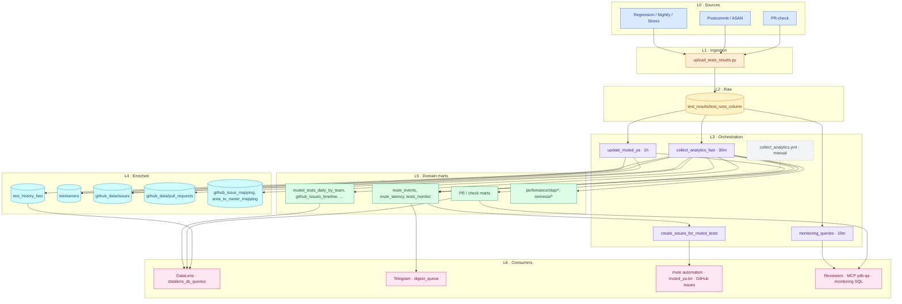
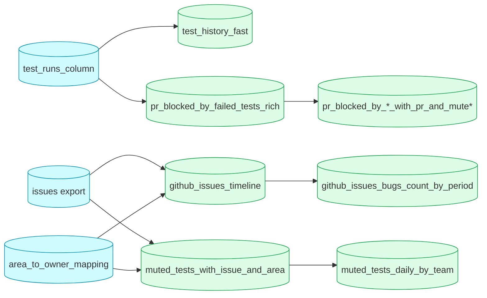

# CI Analytics Architecture

Human-facing map of the pipeline ([issue #44312](https://github.com/ydb-platform/ydb/issues/44312)).
**Keep this file in sync** when adding workflows, scripts, YDB tables, or consumers — see [Maintenance](#maintenance).

## Layer legend (colors on diagram)

| Layer | Color | Role | Examples |
|-------|-------|------|----------|
| **L0 Sources** | Blue | CI produces test results | PR-check, Postcommit, Regression |
| **L1 Ingestion** | Orange | Write raw rows to YDB | `upload_tests_results.py` |
| **L2 Raw storage** | Amber | Append-only fact table | `test_results/test_runs_column` |
| **L3 Orchestration** | Purple | Scheduled / triggered jobs | `collect_analytics_fast`, `update_muted_ya` |
| **L4 Enriched** | Cyan | History, GitHub mirror, owners | `test_history_fast`, `github_data/*` |
| **L5 Domain marts** | Green | SQL-built tables for analytics | `pr_blocked_by_*`, `mute_*`, BI marts |
| **L6 Consumers** | Pink | Dashboards, bots, automation | DataLens, Telegram, mute PRs, ad-hoc YQL |
| **Legacy / manual** | Gray | Deprecated or not in cron | `collect_analytics.yml`, `datalens_ds_queries/` |

## Data flow (overview)



## Mart dependency chain (selected)

Order matters for marts built in one workflow run:



## Workflow → script → YDB table → consumer

Status: **active** | **legacy (manual)** | **manual-only SQL**

| Workflow | Script / step | YDB output | Consumer |
|----------|---------------|------------|----------|
| `test_ya` action | `upload_tests_results.py` | `test_results/test_runs_column` | all downstream |
| `collect_analytics_fast` | `test_history_fast.py` | `test_results/analytics/test_history_fast` | DataLens, investigations |
| `collect_analytics_fast` | `upload_testowners.py` | `test_results/analytics/testowners` | mute, ownership marts |
| `collect_analytics_fast` | `export_issues_to_ydb.py` | `github_data/issues` | mute, timeline marts |
| `collect_analytics_fast` | `export_pull_requests_to_ydb.py` | `github_data/pull_requests` | PR marts |
| `collect_analytics_fast` | `github_issue_mapping.py` | `test_results/analytics/github_issue_mapping` | BI |
| `collect_analytics_fast` | `sync_area_to_owner_mapping.py` | `test_results/analytics/area_to_owner_mapping` | team marts |
| `collect_analytics_fast` | `data_mart_executor.py` + `*.sql` | see `collect_analytics_fast.yml` | DataLens, ad-hoc |
| `collect_analytics_fast` | `mute_latency_from_failure.py` | `mute_events`, `mute_latency`, … | mute analytics |
| `update_muted_ya` | `flaky_tests_history.py`, `tests_monitor.py` | `flaky_tests_window_*`, `tests_monitor` | mute decisions |
| `update_muted_ya` | mute scripts | `muted_ya.txt` PR | CI mute rules |
| `create_issues_for_muted_tests` | monitor + `export_issues` | issues in GitHub | mute issues |
| `telegram_scheduled_notifications` | `send_digest.py` | reads `digest_queue` | Telegram |
| `monitoring_queries` | `monitoring_queries_executor.py` | none (read-only alerts) | on-call / ops |
| `collect_analytics.yml` | monitor scripts | same as mute path | **legacy**, manual |
| `datalens_ds_queries/*.sql` | — | — | **manual-only** DataLens |

Table path registry: `.github/config/ydb_qa_config.json` (repo) and GitHub variable **`YDB_QA_CONFIG`** (CI — must stay in sync).

## Maintenance

### When you MUST update this file

Same PR as the code change if you touch any of:

- `.github/scripts/analytics/**` (new/changed script or SQL mart)
- `.github/workflows/collect_analytics*.yml`, `update_muted_ya.yml`, `create_issues_for_muted_tests.yml`, `monitoring_queries.yml`
- `.github/config/ydb_qa_config.json` (new table alias/path) — **and** GitHub Actions variable `YDB_QA_CONFIG`
- A new **consumer** (DataLens dashboard, Telegram profile, mute rule source)

Update: diagram (new node/edge), table row, layer legend if adding a new layer.

### PR checklist (humans & agents)

```markdown
- [ ] Change is reflected in ARCHITECTURE.md (diagram and/or table)
- [ ] New YDB table: alias in `.github/config/ydb_qa_config.json` **and** in repo variable `YDB_QA_CONFIG` (CI reads vars, not the file)
- [ ] Verified alias sync: `gh api repos/ydb-platform/ydb/actions/variables/YDB_QA_CONFIG --jq '.value'` vs local JSON
- [ ] Mart SQL has `-- consumed by:` comment (optional but helpful)
```

### Local sync check

```bash
python3 .github/scripts/analytics/check_architecture_sync.py
python3 .github/scripts/analytics/check_architecture_sync.py --base origin/main
```

Fails if analytics paths changed in git diff but `ARCHITECTURE.md` did not.

### For Cursor agents

Router: `.cursor/rules/analytics.mdc` (pitfalls, templates). **Canonical detail stays in this file** — update diagram/table in the same PR as code changes.
