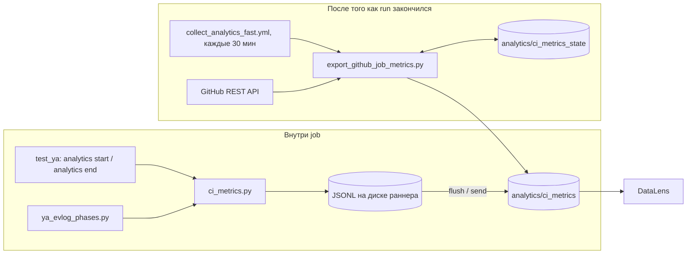

# CI analytics

Тайминги CI в YDB: фазы сборки, job и step. Одна таблица
`analytics/ci_metrics`, дашборд —
[DataLens](https://datalens.yandex/135ob2ntmr0ok?_share_link=public&state=37b19302682&tab=citab01).

Профили компиляции сюда не входят.

| Задача | Куда |
| --- | --- |
| Скопировать буфер в другой проект | [`collector/`](collector/README.md) |
| Добавить измерение / фазу / колонку в YDB CI | [`github_actions/`](github_actions/README.md#добавить-измерение) |
| Что уже лежит в таблице | [`github_actions/`](github_actions/README.md#что-уже-пишется) |

## Как это работает

Два независимых пути в одну таблицу.



1. **Внутри job.** Шаги пишут JSONL и заливают закрытые строки. Так измеряются
   фазы `ya make` — того, чего нет в GitHub API.
2. **После run.** Отдельный job раз в 30 минут спрашивает у GitHub, сколько
   шли job и step, и пишет те же колонки. Чтобы не выгружать одно и то же
   каждые полчаса, крон помнит «до какого момента уже залил» в
   `analytics/ci_metrics_state`. Это не измерения — дашборд туда не смотрит.

Чтобы на дашборде связать фазу с job: у фазы в `labels` лежит
`parent_span_id = job-456`, у строки этого job в колонке `span_id` то же
`job-456`.

`collector/` про GitHub не знает. `github_actions/` добавляет колонки Actions и
выгрузку.

## Первый запуск таблиц

```bash
python3 .github/scripts/utils/analytics/github_actions/provision_tables.py
```

Повторный запуск ничего не ломает: `CREATE TABLE IF NOT EXISTS`. В
`collect_analytics_fast.yml` вызывается перед выгрузкой.

## Тесты

```bash
python3 -m unittest discover -s .github/scripts/utils/tests/analytics/collector -p 'test_*.py'
python3 -m unittest discover -s .github/scripts/utils/tests/analytics/ci -p 'test_*.py'
```
