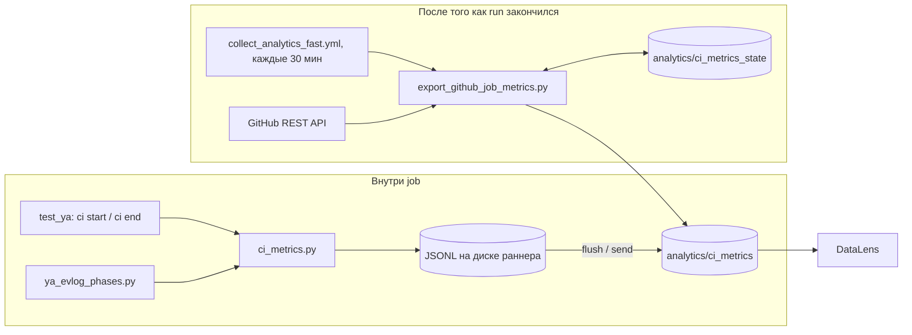

# CI analytics

Тайминги CI в YDB: сколько шла каждая фаза сборки, каждый job и каждый step.
Данные лежат в одной таблице `analytics/ci_metrics`, дашборд —
[DataLens](https://datalens.yandex/135ob2ntmr0ok?_share_link=public&state=37b19302682&tab=citab01).

Профили компиляции сюда не входят.

## Как это работает

В таблицу ведут два независимых пути.



1. **Внутри job.** Шаги пишут события в локальный JSONL и периодически
   заливают закрытые строки в YDB. Так измеряются фазы `ya make` — то, что
   GitHub про себя не знает.
2. **После завершения run.** Отдельный job раз в 30 минут читает GitHub API и
   пишет длительности самих job и step. Своё состояние (докуда дошёл, какие run
   ещё идут, какие надо перечитать) он держит в `analytics/ci_metrics_state`, а
   не в таблице с данными.

Сшиваются пути через labels: у каждой фазы внутри job
`labels.parent_span_id = job-{github_job_id}`, а у строки самого job
`span_id = job-{github_job_id}`. То есть фазу можно сопоставить с job и
посмотреть, сколько времени job потратил вне `ya make`.

## Пакеты

- [`collector/`](collector/README.md) — JSONL-буфер и заливка в YDB. Ничего не
  знает про GitHub, копируется в другой проект как есть.
- [`github_actions/`](github_actions/README.md) — колонки GitHub Actions поверх
  collector, выгрузка job/step, таксономия `source` / `name`, инструкции по
  интеграции.

## Первый запуск

Таблицы не создаются на горячем пути записи, их надо создать один раз:

```bash
python3 .github/scripts/utils/analytics/github_actions/provision_tables.py
```

Идемпотентно (`CREATE TABLE IF NOT EXISTS`), в `collect_analytics_fast.yml`
вызывается перед каждой выгрузкой.

## Тесты

```bash
python3 -m unittest discover -s .github/scripts/utils/tests/analytics/collector -p 'test_*.py'
python3 -m unittest discover -s .github/scripts/utils/tests/analytics/ci -p 'test_*.py'
```
