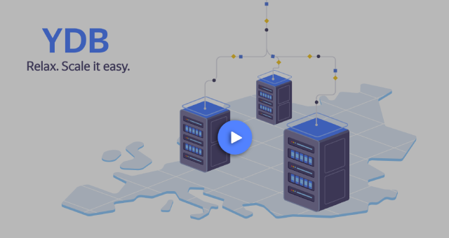

 

## YDB

[Website](https://ydb.tech) |
[Documentation](https://ydb.tech/docs/en/) |
[Official Repository](https://github.com/ydb-platform/ydb) |
[Blog](https://blog-redirect.ydb.tech) |
[YouTube](https://www.youtube.com/c/YDBPlatform) |
[Discord](https://discord.gg/R5MvZTESWc) |
[Telegram](https://t.me/ydb_en) |
[LinkedIn](https://www.linkedin.com/company/ydb-platform) |
[X](https://x.com/YDBPlatform)

YDB is an open source Distributed SQL Database that combines high availability and scalability with strict consistency and ACID transactions.

## Main YDB Advantages

YDB was designed from scratch to respond to the growing demand for scalable interactive web services. Scalability, strict consistency, and effective cross-row transactions were a must for such an OLTP-like workload. YDB was built by people with strong backgrounds in databases and distributed systems who have experience developing a NoSQL database and the MapReduce system for one of the largest search engines in the world.

Basic YDB features:

- Both row-oriented and column-oriented [tables](https://ydb.tech/docs/en/concepts/datamodel/table) for transactional and analytical workloads. Also, [persistent queues (topics)](https://ydb.tech/docs/en/concepts/topic) for moving data around.
- Fault-tolerant configuration that survives disk, node, rack, or even datacenter outages.
- Automatic disaster recovery with minimum latency disruptions for applications.
- Independent horizontal scalability of storage and compute layers.
- ACID transactions across multiple nodes and tables with strict consistency.
- Rich [SQL dialect (YQL)](https://ydb.tech/docs/en/yql/reference/) for data manipulation and schema definition.
- [PostgreSQL-compatible mode](https://ydb.tech/docs/en/postgresql/intro) for table operations and [Kafka-compatible mode](https://ydb.tech/docs/en/reference/kafka-api/) for topics.
- YDB clusters can be deployed with [Ansible](https://ydb.tech/docs/en/devops/ansible/), [Kubernetes](https://ydb.tech/docs/en/devops/kubernetes/), or [manually](https://ydb.tech/docs/en/devops/manual/).

### Fault-tolerant Configurations

YDB can be deployed in three availability zones (datacenters). A cluster remains available for both reads and writes during a complete outage of a single zone. Availability zones and regions are covered in more detail [in documentation](https://ydb.tech/en/docs/concepts/databases#regions-az).

### Horizontal Scalability

Unlike traditional relational databases, YDB [scales out](https://en.wikipedia.org/wiki/Scalability#Horizontal_or_scale_out), providing developers with the capability to simply extend clusters with computation or storage resources to handle increasing load. YDB has disaggregated storage and compute layers, which allow you to scale storage and compute resources independently.

Current production installations have over 10000 nodes, store petabytes of data, and handle millions of distributed transactions per second.

### Automatic Disaster Recovery

YDB's built-in automatic recovery support allows it to seamlessly survive hardware failures. After unpredictable disk, node, rack, or even datacenter failure, YDB remains fully available for reads and writes and automatically restores required data redundancy.

### Multitenant and Serverless Database

YDB supports multitenant and serverless setups. A user can run a YDB cluster and create several databases that share one pool of storage and have different compute nodes. Alternatively, a user can run several serverless databases that share one pool of compute resources to utilize them effectively.

## Supported Platforms

### Minimal system requirements

YDB runs on x86 64-bit platforms with at least 8 GB of RAM.

### Operating Systems

In most production environments, YDB runs on 64-bit x86 machines working under Ubuntu Linux.

For development purposes, it is regularly tested that YDB can be compiled and run under the latest versions of MacOS and Microsoft Windows.

## Getting Started

If you want to experiment with YDB, start with the [Quick Start guide](https://ydb.tech/docs/en/quickstart). It will yield a single-node cluster suitable for functional testing, app development, and similar tasks.

Suppose you want to jump into more serious scenarios like testing YDB fault tolerance, running performance benchmarks, or even running production or preproduction workloads. In that case, you'll need a full-fledged multi-node YDB cluster that can be deployed with either [Ansible](https://ydb.tech/docs/en/devops/ansible/initial-deployment) for bare metal or virtual machines or [Kubernetes](https://ydb.tech/docs/en/devops/kubernetes/initial-deployment) for containers.

## How to Build from Source Code

Instructions on how to build YDB server (ydbd) and client (ydb) binaries are provided in [BUILD.md](BUILD.md). Also, see documentation on [Ya Make build system](https://ydb.tech/docs/en/contributor/build-ya).

## How to Contribute

We are glad to welcome new contributors! The [contributor's guide](CONTRIBUTING.md) provides more details on how to get started as a contributor.

There's also a separate section of [YDB documentation for contributors](https://ydb.tech/docs/en/contributor/), mostly with more technical content.

## Success Stories

Visit YDB [website](https://ydb.tech/) for the latest success stories and user scenarios.

