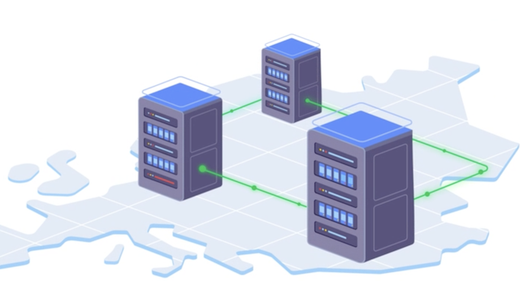

 

## YDB Platform

[Website](https://ydb.tech) |
[Documentation](https://ydb.tech/docs) |
[Official Repository](https://github.com/ydbplatform/) |
[YouTube Channel](https://www.youtube.com/channel/UCHrVUvA1cRakxRP3iwA-yyw)

YDB is a fault-tolerant Distributed SQL DBMS that combines high availability and scalability and supports ACID transactions with strict consistency.

  

## Main YDB advantages

YDB is not based on any existent database management software that's why YDB development team has less boundaries in implementing DistributedSQL database for modern applications.

Basic YDB features:

  - Fault-tolerant configuration that survive disk, node, rack or even datacenter outage
  - Horizontal scalability
  - Automatic disaster recovery with minimum latency disruptions for applications
  - Standard SQL for data manipulation and scheme definition
  - ACID transactions across multiple nodes and tables with strict consistency

### Fault-tolerant configurations

YDB Platform could be deployed in three different zones. Cluster remains both read and write available during complete outage of a single zone (datacenter).

Clusters. availability zones and regions are covered in more detail [in documentation](docs/en/core/concepts/databases.md#regions-az).

### Horizontal scalability

Unlike traditional RDMBS YDB [scales horizontally](https://en.wikipedia.org/wiki/Scalability#Horizontal_or_scale_out) providing developers with capability to simply extends cluster with computation or storage resources to handle increasing load.

Current production installations have more than 10,000 nodes, store petabytes of data and handle more than 100,000 distributed transactions per second.

### Automatic disaster recovery

YDB Platform has built-in automatic recovery in case of a hardware failure. After unpredictable disk, node, rack or even datacenter failure YDB platform remains fully available for read and write load. No manual intervention required.

## Supported platforms

### Minimal system requirements

YDB runs on x86 64bit platforms with minimum 8 GB of RAM.

### Operating systems

We have major experience running production systems on machins working under Ubuntu Linux.

For development purposes we test that YDB could be built and run under latest versions of MacOS and Microsoft Windows on a regular basis.

## Getting started with YDB in 5 minutes

1. Install YDB Platform: using [pre-built executables](ydb/docs/ru/core/getting_started/ydb_local.md), build it from source or [use Docker container](ydb/docs/en/core/getting_started/ydb_docker.md).
1. Start local cluster or container and run [YQL query](ydb/docs/en/core/yql/reference/index.md) via [YDB CLI](docs/en/core/reference/ydb-cli/index.md).
1. Access YDB Embedded UI via browser for schema navigation, query execution and other database development related tasks.
1. Run available [example application](ydb/docs/en/core/reference/ydb-sdk/example/example-go.md).
1. Develop an application using [YDB SDK](ydb/docs/en/core/reference/ydb-sdk)

## How to build

### Prerequisites

In order to build ydbd you should have following tools installed on your system:

1. Git command line tool
1. clang 11 or higher
1. cmake
1. antlr3
1. libantlr3c
1. libantlr3c-dev

Building YDB Embedded UI requires following tools:

1. [NVM](https://github.com/nvm-sh/nvm) – a version manager for node.js
1. [NPM](https://www.npmjs.com/) – node package manager

### Build process

#### Build embedded UI

1. curl -o- https://raw.githubusercontent.com/nvm-sh/nvm/v0.39.1/install.sh | bash
2. nvm install 14
3. git clone https://github.yandex-team.ru/data-ui/ydb-embedded-ui-opensource
4. cd ydb-embedded-ui-opensource
5. npm ci
6. npm run build:embedded
7. cp -r build/ target_dir

#### Build ydbd

1. `git clone https://github.com/ydb-platform/ydb.git`
1. cp ydb_embedded_ui NODATA
1. `cd ydb/apps/ydbd`
1. `cmake ../ && make`

## How to deploy

* Deploy a cluster [using Kubernetes](ydb/docs/en/core/deploy/orchestrated/concepts.md).
* Deploy a cluster using [pre-built executables](ydb/docs/ru/core/getting_started/ydb_local.md).

## How to contribute

We are glad to welcome new contributors to YDB Platform project!

1. Please read [contributor's guide](CONTRIBUTING).
2. We can accept your work to YDB Platform after you have read CLA text.
3. Please don't forget to add a note to your pull request, that you agree to the terms of the CLA. More information can be found in [CONTRIBUTING](CONTRIBUTING) file.

## Success stories

See YDB Platform [official web site](https://ydb.tech/) for the latest success stories and projects using YDB Platform.
