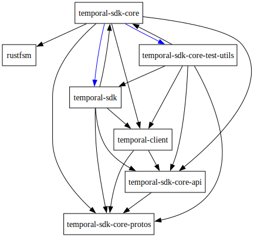

# Temporal Core SDK

Core SDK that can be used as a base for other Temporal SDKs. It is currently used as the base of:

- [TypeScript SDK](https://github.com/temporalio/sdk-typescript/)
- [Python SDK](https://github.com/temporalio/sdk-python/)
- [.NET SDK](https://github.com/temporalio/sdk-dotnet/)
- [Ruby SDK](https://github.com/temporalio/sdk-ruby/)

# Documentation

Core SDK documentation can be generated with `cargo doc`, output will be placed in the
`target/doc` directory.

[Architecture](ARCHITECTURE.md) doc provides some high-level information about how Core SDK works
and how language layers interact with it.

For the reasoning behind the Core SDK, see blog post:

- [Why Rust powers Temporal’s new Core SDK](https://temporal.io/blog/why-rust-powers-core-sdk).

# Development

You will need the `protoc` [protobuf compiler](https://grpc.io/docs/protoc-installation)
installed to build Core.

This repo is composed of multiple crates:

- temporal-sdk-core-protos `./sdk-core-protos` - Holds the generated proto code and extensions.
- temporal-client `./client` - Defines client(s) for interacting with the Temporal gRPC service.
- temporal-sdk-core-api `./core-api` - Defines the API surface exposed by Core.
- temporal-sdk-core `./core` - The Core implementation.
- temporal-sdk-core-c-bridge `./core-c-bridge` - Provides C bindings for Core.
- temporal-sdk `./sdk` - A (currently prototype) Rust SDK built on top of Core. Used for testing.
- rustfsm `./fsm` - Implements a procedural macro used by core for defining state machines
  (contains subcrates). It is Temporal-agnostic.

Visualized (dev dependencies are in blue):



All the following commands are enforced for each pull request:

## Building and testing

You can build and test the project using cargo:
`cargo build`
`cargo test`

Run integ tests with `cargo integ-test`. By default it will start an ephemeral server. You can also
use an already-running server by passing `-s external`.

Run load tests with `cargo test --test heavy_tests`.

## Formatting

To format all code run:
`cargo fmt --all`

## Linting

We are using [clippy](https://github.com/rust-lang/rust-clippy) for linting.
You can run it using:
`cargo clippy --all -- -D warnings`

## Debugging

The crate uses [tracing](https://github.com/tokio-rs/tracing) to help with debugging. To enable it
globally for tests, insert the below snippet at the start of the test. By default, tracing data is
output to stdout in a (reasonably) pretty manner.

```rust
crate::telemetry::telemetry_init_fallback();
```

The passed in options to initialization can be customized to export to an OTel collector, etc.

To run integ tests with OTel collection on, you can use `integ-with-otel.sh`. You will want to make
sure you are running the collector via docker, which can be done like so:

`docker-compose -f docker/docker-compose.yaml -f docker/docker-compose-telem.yaml up`

If you are working on a language SDK, you are expected to initialize tracing early in your `main`
equivalent.

## Proto files

This repo uses a subtree for upstream protobuf files. The path `sdk-core-protos/protos/api_upstream`
is a subtree. To update it, use:

`git pull --squash --rebase=false -s subtree ssh://git@github.com/temporalio/api.git master --allow-unrelated-histories`

Do not question why this git command is the way it is. It is not our place to interpret git's ways.
This same approach can be taken for updating `sdk-core-protos/protos/api_cloud_upstream` from the
`api-cloud` repo.

The java testserver protos are also pulled from the sdk-java repo, but since we only need a
subdirectory of that repo, we just copy the files with read-tree:

```bash
# add sdk-java as a remote if you have not already
git remote add -f -t master --no-tags testsrv-protos git@github.com:temporalio/sdk-java.git
# delete existing protos
git rm -rf sdk-core-protos/protos/testsrv_upstream
# pull from upstream & commit
git read-tree --prefix sdk-core-protos/protos/testsrv_upstream -u testsrv-protos/master:temporal-test-server/src/main/proto
git commit
```

## Fetching Histories

Tests which would like to replay stored histories rely on that history being made available in
binary format. You can fetch histories in that format like so (from a local docker server):

`cargo run --bin histfetch {workflow_id} [{run_id}]`

You can change the `TEMPORAL_SERVICE_ADDRESS` env var to fetch from a different address.

## Style Guidelines

### Error handling

Any error which is returned from a public interface should be well-typed, and we use
[thiserror](https://github.com/dtolnay/thiserror) for that purpose.

Errors returned from things only used in testing are free to use
[anyhow](https://github.com/dtolnay/anyhow) for less verbosity.

# The Rust "SDK"

This repo contains a *prototype* Rust sdk in the `sdk/` directory. This SDK should be considered
pre-alpha in terms of its API surface. Since it's still using Core underneath, it is generally
functional. We do not currently have any firm plans to productionize this SDK. If you want to write
workflows and activities in Rust, feel free to use it - but be aware that the API may change at any
time without warning and we do not provide any support guarantees.

