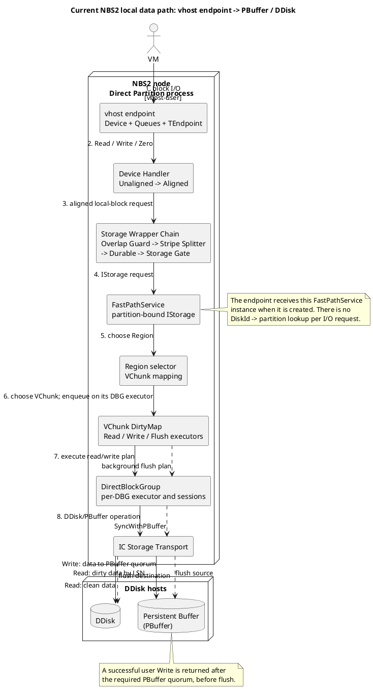

# Текущий NBS2 data path от локального vhost endpoint

Статус: описание существующей реализации на ревизии
`3529cbcc660f1bb87c2e4e691675f584589f047b`.

Scope документа — локальный vhost endpoint, который создаёт
`TPartitionActor` для direct partition. Это не целевой путь NBS1 → NBS2 по
RDMA. Диаграмма выполнена на уровне C4 Component: она показывает значимые
runtime-компоненты и отдельно выделяет синхронный I/O и фоновый flush.

## Схема



Упрощённая форма для архитектурного RFC:

```text
partition-bound vhost endpoint
    -> request adaptation and guards
    -> FastPathService
    -> VChunk / DirectBlockGroup data engine
    -> PBuffer or DDisk
```

## Как endpoint привязан к partition

`TPartitionActor` создаёт набор `TDirectBlockGroup`, затем один
`TFastPathService` для своей partition. После получения начального quorum
`Locked`-сессий от всех DBG actor вызывает `VhostServer->StartEndpoint(...)` и
передаёт тот же `FastPathService` как `IStorage` и `ITraceService`.

Таким образом, маршрутизация до partition уже завершена к моменту открытия
endpoint. На каждом I/O нет registry/dispatcher, который искал бы partition по
`DiskId`.

## Синхронная часть запроса

Фактическая цепочка вызовов внутри vhost server:

```text
vhost Device/Queue
  -> TEndpoint
  -> TUnalignedDeviceHandler
  -> TAlignedDeviceHandler
  -> TOverlappedRequestsGuardStorageWrapper
  -> TSplitRequestsStorageWrapper
  -> TDurableStorageWrapper
  -> TStorageGate
  -> TFastPathService
```

- `TEndpoint` определяется по cookie vhost device, преобразует запрос в
  `ReadBlocksLocal`, `WriteBlocksLocal` или `ZeroBlocks` и завершает исходный
  vhost request полученным результатом.
- Device handlers проверяют диапазон, размер SG-list и alignment. Для
  unaligned write/zero выполняется read-modify-write; большие запросы могут
  быть разделены на подзапросы.
- Overlap Guard упорядочивает пересекающиеся write/zero. Stripe Splitter делит
  запрос на границах stripe. Durable повторяет retriable-запросы, в том числе
  после смены generation. Storage Gate позволяет атомарно detach/attach
  underlying storage.
- `TFastPathService` выбирает `Region`; `TRegion` выбирает `VChunk`.
  `TVChunk` переводит диапазон в локальные координаты и переносит исполнение с
  vhost thread на executor соответствующего DBG. VChunk назначается DBG по
  `vChunkIndex % dbgCount`.

## Read

`TVChunk` получает из `BlocksDirtyMap` один или несколько read hints. Для
каждого участка hint определяет актуальное местоположение данных:

- `LSN == 0` — чтение с одного из подходящих DDisk hosts;
- `LSN != 0` — чтение версии с указанным LSN из PBuffer.

Read executor выбирает host и при необходимости делает hedged/retry attempt.
`TDirectBlockGroup` дожидается подходящей `Locked`-сессии и передаёт операцию в
`TICStorageTransport`; далее запрос отправляется DDisk/PBuffer actor через
ActorSystem/interconnect.

## Write и фоновый flush

Обычный пользовательский write в этом пути не записывает данные сразу в
DDisk. `TWriteRequestExecutor` выбирает режим записи через Oracle:

- indirect write — `WriteBlocksToManyPBuffers` через выбранный coordinator;
- direct write/fallback — отдельные `WriteBlocksToPBuffer`.

Успешный ответ возвращается после достижения необходимого quorum PBuffer.
Завершённые размещения фиксируются в `BlocksDirtyMap`, после чего `TVChunk`
отдельно планирует flush. `TFlushRequestExecutor` вызывает
`TDirectBlockGroup::SyncWithPBuffer`, указывая source PBuffer host, destination
DDisk host и набор сегментов. После успешного sync соответствующие записи
обновляются в dirty map и могут быть очищены.

Следствие: на компонентной диаграмме `PBuffer` является частью основного
write/read data path, а `DDisk` — синхронным источником clean reads и
назначением фонового flush.

## Ограничения текущего пути

- `TFastPathService::ZeroBlocksLocal` не реализован и завершается abort.
- Это локальный auto-vhost endpoint direct partition; здесь нет RDMA frontend
  и проверки NBS1 session/writer identity.
- `ClientId` при создании этого endpoint сейчас задан как `"client-1"`.
- Наличие `TDurableStorageWrapper` означает автоматические повторы retriable
  write-запросов. Для удалённого NBS1 → NBS2 пути их допустимость должна
  определяться отдельно протоколом сессии и правилами идемпотентности.

## Привязка компонентов к коду

| Компонент | Основная реализация |
|---|---|
| Создание FastPath и vhost endpoint | [`partition_direct_actor.cpp`](../ydb/core/nbs/cloud/blockstore/libs/storage/partition_direct/partition_direct_actor.cpp) |
| vhost queues, endpoint и wrapper chain | [`server.cpp`](../ydb/core/nbs/cloud/blockstore/libs/vhost/server.cpp) |
| Aligned/unaligned request adaptation | [`device_handler.cpp`](../ydb/core/nbs/cloud/blockstore/libs/service/device_handler.cpp), [`aligned_device_handler.cpp`](../ydb/core/nbs/cloud/blockstore/libs/service/aligned_device_handler.cpp), [`unaligned_device_handler.cpp`](../ydb/core/nbs/cloud/blockstore/libs/service/unaligned_device_handler.cpp) |
| Request guards, split, retry и attach/detach | [`overlapped_requests_guard_wrapper.cpp`](../ydb/core/nbs/cloud/blockstore/libs/service/overlapped_requests_guard_wrapper.cpp), [`split_requests_wrapper.cpp`](../ydb/core/nbs/cloud/blockstore/libs/service/split_requests_wrapper.cpp), [`durable_wrapper.cpp`](../ydb/core/nbs/cloud/blockstore/libs/service/durable_wrapper.cpp), [`storage_gate.cpp`](../ydb/core/nbs/cloud/blockstore/libs/service/storage_gate.cpp) |
| Region/VChunk routing | [`fast_path_service.cpp`](../ydb/core/nbs/cloud/blockstore/libs/storage/partition_direct/fast_path_service.cpp), [`region.cpp`](../ydb/core/nbs/cloud/blockstore/libs/storage/partition_direct/region.cpp), [`vchunk.cpp`](../ydb/core/nbs/cloud/blockstore/libs/storage/partition_direct/vchunk.cpp) |
| Read/write/flush execution | [`read_request_single_location.cpp`](../ydb/core/nbs/cloud/blockstore/libs/storage/partition_direct/read_request_single_location.cpp), [`read_request_multiple_location.cpp`](../ydb/core/nbs/cloud/blockstore/libs/storage/partition_direct/read_request_multiple_location.cpp), [`write_request.cpp`](../ydb/core/nbs/cloud/blockstore/libs/storage/partition_direct/write_request.cpp), [`flush_request.cpp`](../ydb/core/nbs/cloud/blockstore/libs/storage/partition_direct/flush_request.cpp) |
| DBG sessions and storage operations | [`direct_block_group_impl.cpp`](../ydb/core/nbs/cloud/blockstore/libs/storage/partition_direct/direct_block_group_impl.cpp) |
| Actor/interconnect transport | [`ic_storage_transport.cpp`](../ydb/core/nbs/cloud/blockstore/libs/storage/storage_transport/ic_storage_transport.cpp), [`ic_storage_transport_actor.cpp`](../ydb/core/nbs/cloud/blockstore/libs/storage/storage_transport/ic_storage_transport_actor.cpp) |
