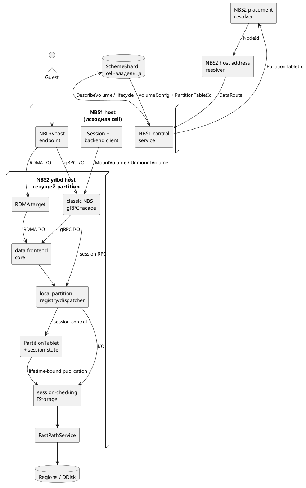
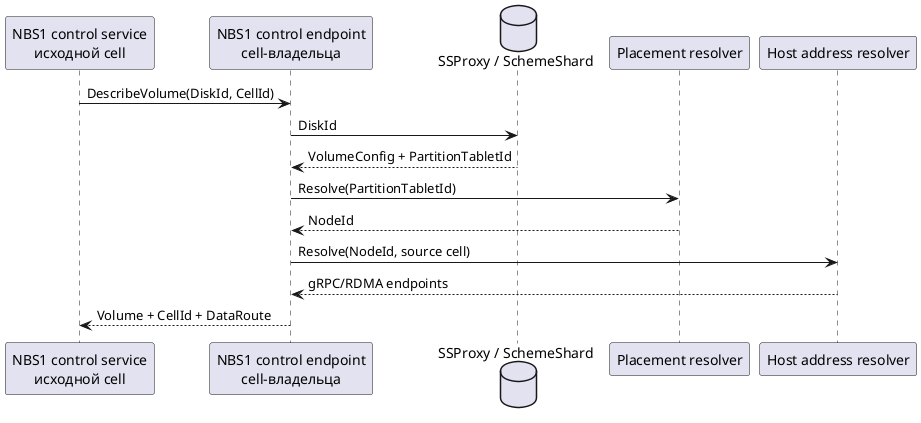
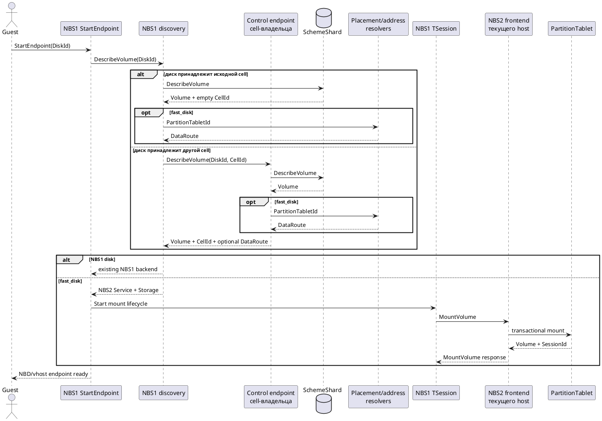
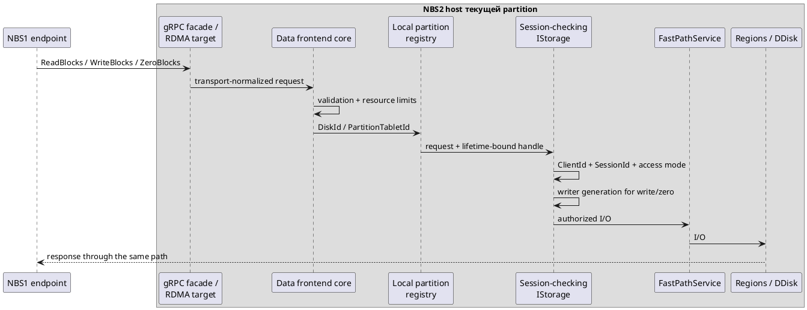
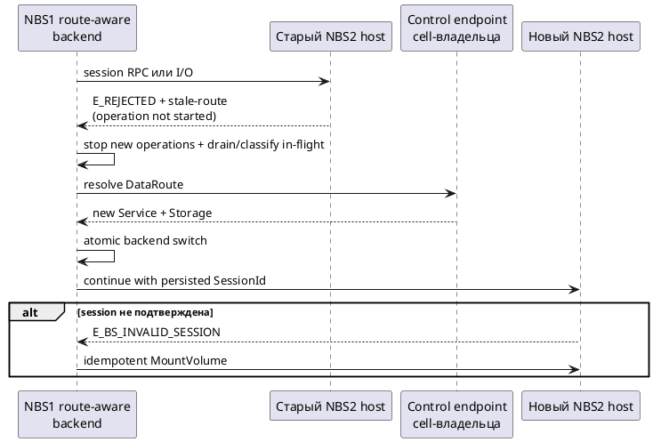

# RFC: интеграция NBS1 control plane с NBS2 backend

## 1. Метаданные

| Поле                                             | Значение                                   |
|--------------------------------------------------|--------------------------------------------|
| Статус                                           | Черновик                                   |
| Авторы                                           | TBD                                        |
| Рецензенты                                       | TBD                                        |
| Создан                                           | 2026-08-11                                 |
| Обновлён                                         | 2026-08-14                                 |
| Целевая ревизия YDB                              | `3529cbcc660f1bb87c2e4e691675f584589f047b` |
| Кандидат на source revision classic NBS contract | `5e95a6646c3cc8af5797ba307f99ec9431aaecbe` |

Связанные документы:

- [обзор и текущие решения](../nbs2_shards/README.md);
- [исследование и архитектурное обоснование](../nbs2_shards/architecture.md);
- [MVP-1/MVP-2: gRPC и RDMA benchmark](../nbs2_shards/mvp_benchmark.md);
- [MVP-3: функциональная интеграция](../nbs2_shards/mvp_functional.md);
- [production и выкатка](../nbs2_shards/production.md).

Этот RFC фиксирует предлагаемую границу системы и обязательные свойства решения. Детали реализации будут проработаны отдельно.

> **Комментарий к переработке:** отсутствие отдельного редакторского комментария к разделу пока не означает, что его содержание согласовано. Дополнительные комментарии появятся на следующих шагах после структуризации документа.

В документе `cell` обозначает NBS shard, внутри которого могут одновременно работать NBS1 и NBS2.
Исходная cell — cell, в которой NBS1 выполняет `StartEndpoint`;
cell-владелец — cell, в SchemeShard которой зарегистрирован диск.
Для локального диска это одна и та же cell, для меж-cell доступа — разные.

## 2. Контекст, цели и границы

### 2.1. Решаемая проблема

В NBS2 появляется новый тип диска, далее условно называемый `fast_disk`, но существующая инфраструктура NBS1 пока не умеет работать с ним как с обычным диском. Пользователь не может через единый NBS1 workflow найти такой диск по `DiskId`, подключить его и выполнять read-write I/O как внутри своей cell, так и между cells.

Необходимо сделать NBS2-диски доступными через существующую пользовательскую и административную модель NBS1, сохранив корректность сессий и конкурентной записи, восстановление после отказов и прежнее поведение NBS1-дисков. Отдельный пользовательский путь для NBS2 нежелателен, поскольку он разделит управление дисками, клиентские сценарии и эксплуатационные инструменты.

> **Комментарий к переработке:** возможно, следует изменить формулировку «через существующую пользовательскую и административную модель NBS1»: сейчас неясно, что именно подразумевается под административной моделью.

### 2.2. Цели

Решение должно:

1. Сохранить NBS1 единой пользовательской точкой входа для discovery, административных операций и создания guest-facing NBD/vhost endpoint.
2. Сделать `fast_disk` доступным по единому `DiskId` как внутри исходной cell, так и между cells.
3. Выбирать NBS1 или NBS2 backend по authoritative metadata диска и вычисленному runtime-маршруту, не меняя существующие пути NBS1-дисков.
> "authoritative metadata" - валидно ли оставить просто "metadata"?
4. Предоставить NBS2-реализацию совместимых session RPC и gRPC/RDMA I/O с общей validation/error model.
5. Сохранять корректность session и writer authorization после restart, migration, hard failure и смены маршрута.
> переформулировать. Варианты предложить на согласование
6. Не допускать автоматического повтора изменяющей операции с неопределённым результатом без явно определённой дедупликации.
> пояснить

### 2.3. Границы решения

В рамках решения:

- `DescribeVolume`, create/delete/resize, `StartEndpoint` и создание guest-facing socket остаются в NBS1;
- `fast_disk` создаётся только в NBS2, а полное описание volume хранится в SchemeShard cell-владельца;
- NBS1 `TSession` отправляет classic `MountVolume`/`UnmountVolume` выбранному NBS2 backend;
- NBS2 выполняет session RPC и I/O только для локальной partition текущей incarnation;
- первый вариант поддерживает только single-partition `fast_disk`.

В решение не входят:

- отдельный пользовательский control plane NBS2;
- прямой пользовательский `MountVolume` для `fast_disk` в обход `StartEndpoint` и управляемой NBS1 `TSession`;
- отдельный NBS1 -> NBS2 контракт `RegisterSession`/`UnregisterSession` поверх classic `MountVolume`/`UnmountVolume`;
- NBS2-клиент для discovery, mount или I/O к NBS1-дискам;
- использование local NBS2 vhost socket как backend управляемого NBS1 endpoint;
- отдельный benchmark-only RDMA protocol;
- межузловой forwarding из NBS2 frontend через tablet pipe или actor interconnect;
- обязательный перевод существующего data path NBS1-дисков на placement-aware маршрутизацию;
- multi-partition `fast_disk`;
- полный внутренний контракт create/delete/resize: этот RFC фиксирует внешнюю принадлежность операций и создание `fast_disk` в NBS2, но не их детальную реализацию.

### 2.4. Текущее состояние и ограничения

На текущий момент сквозной интеграции NBS1 и NBS2 нет:

- NBS1 не распознаёт `fast_disk` и не умеет строить для него backend client;
- NBS2 не предоставляет полное совместимое подмножество classic NBS API для session management и I/O; существующий local vhost решает только node-local сценарий;
- механизм NBS cells маршрутизирует только NBS1 backend и не умеет находить host текущей NBS2 partition;
- SchemeShard хранит описание диска и tablet IDs, но не сообщает текущий host partition;
- существующий NBS2 vhost registry индексирует endpoints по socket path, а не по `DiskId` или tablet ID;
>  NBS2 vhost registry - что за модуль
- NBS2 не хранит требуемое persistent session/writer state;
- NBS1-клиент не умеет атомарно переключать связанную пару NBS2 session/data backend, а существующая retry-логика может небезопасно повторить write.

Для интеграции требуются совместимый NBS2 backend API, поддержка NBS2 в cells discovery, placement и address resolution, local partition registry, persistent session/writer authorization и безопасное восстановление маршрута.

## 3. Предлагаемое решение

### 3.1. Обзор решения

NBS1 сохраняет пользовательский и административный control plane, discovery и создание NBD/vhost endpoint. NBS2 создаёт и обслуживает `fast_disk`, предоставляя совместимые с NBS1 операции управления сессией и I/O.

После discovery NBS1 определяет реализацию диска и его cell. NBS1-диски продолжают использовать существующие пути. Для `fast_disk` NBS1 находит host текущей NBS2 partition и направляет туда запросы независимо от того, находится диск в исходной или другой cell.

| Расположение диска | Реализация диска | `MountVolume`/`UnmountVolume` | I/O |
|---|---|---|---|
| Cell-владелец совпадает с исходной | NBS1 | Локальный NBS1 service | Существующий локальный NBS1 storage path |
| Cell-владелец совпадает с исходной | NBS2 | gRPC на host локальной NBS2 partition | gRPC/RDMA на тот же NBS2 host |
| Cell-владелец отличается от исходной | NBS1 | NBS1 service выбранного host cell-владельца | Существующий cells gRPC/RDMA путь к NBS1 |
| Cell-владелец отличается от исходной | NBS2 | gRPC на host NBS2 partition в cell-владельце | gRPC/RDMA на тот же NBS2 host |

`StartEndpoint` остаётся в NBS1. Для `fast_disk` control-plane операции выполняются по gRPC, а I/O — по gRPC или RDMA на том же NBS2 host. NBS2 frontend обслуживает только локальную partition и не пересылает запросы между hosts.

### 3.2. Граница ответственности NBS1 и NBS2

| Область | Ответственный компонент |
|---|---|
| Внешний discovery и административный API | NBS1 control service |
| Создание guest-facing NBD/vhost endpoint | NBS1 `StartEndpoint` |
| Постоянное описание volume и tablet IDs | SchemeShard cell-владельца |
| Создание и обслуживание данных `fast_disk` | NBS2 |
| Вычисление текущего NBS2 runtime route | Два новых логических компонента cell-владельца: placement resolver и host address resolver. Будут ли они отдельными модулями или расширениями существующих компонентов, пока не определено |
| Жизненный цикл клиентской session | NBS1 `TSession` |
| Обработка `MountVolume`/`UnmountVolume` для `fast_disk` | NBS2 frontend и локальная PartitionTablet |
| Authoritative session/writer authorization '> переформулировать на русском. можно комментарием-пояснением' | PartitionTablet |
| I/O `fast_disk` | Локальный session-checking path NBS2 partition |

### 3.3. Основные архитектурные решения

1. NBS1 остаётся единой внешней точкой control plane и всегда создаёт пользовательский endpoint.
2. `fast_disk` имеет явный согласованный признак типа диска, например отдельное значение `StorageMediaKind`; создаётся только в NBS2, а его постоянная metadata хранится в SchemeShard cell-владельца.
3. Для `fast_disk` обязательный `DataRoute` задаёт связанные NBS2 gRPC `Service` и gRPC/RDMA `Storage` одного host; отсутствие поддерживаемого маршрута не включает legacy NBS1 fallback.
4. NBS2 session/data path использует strict affinity: NBS1 подключается к host текущей partition, а frontend не выполняет межузловой forwarding.
5. Classic `MountVolume`/`UnmountVolume` являются единственным session contract выбранного NBS2 backend; дополнительный `RegisterSession`/`UnregisterSession` не вводится.
> это было выше. Оставить только тут?
6. PartitionTablet транзакционно хранит server-side session/writer state, а partition-owned I/O path проверяет его для каждого запроса.
7. Для single-partition `fast_disk` обязательный `VolumeDirect` не используется; необходимость volume-level компонента пересматривается при появлении multi-partition volumes.
8. Существующие local и cells data paths NBS1-дисков сохраняются.
> это было выше. Оставить только тут?
9. Local auto-vhost NBS2 выключен для `fast_disk`, которым управляет NBS1, но остаётся доступным для автономных конфигураций.
10. NBS2 frontend работает внутри `ydbd`; compatibility sidecar не требуется.

> **Комментарий к переработке:** после смыслового пересмотра нужно проверить, все ли перечисленные решения действительно требуют отдельной фиксации. Решения, уже однозначно заданные нормативным текстом других разделов, следует убрать из этого списка.

## 4. Архитектура

### 4.1. Контекстная диаграмма



> **Комментарий к переработке:** проверить читаемость диаграммы после рендеринга PlantUML и при необходимости разделить её на system-context и component diagrams.

### 4.2. Компоненты и их роли

| Компонент | Ответственность | Текущее состояние | Требуемые изменения |
|---|---|---|---|
| NBS1 `TSession` и backend client | Управление mount/remount/unmount и отправка I/O через одну согласованную пару session/data clients | Работают с NBS1 backend | Выбирать NBS2 по `DataRoute`; при смене маршрута координировать session RPC и I/O, атомарно переключать связанные `Service`/`Storage` и не повторять write с неопределённым результатом |
| NBS1 control service | Discovery, administrative lifecycle, `StartEndpoint` | Обслуживает NBS1 volumes | Распознавать `fast_disk`, инициировать его lifecycle и возвращать либо разрешать `DataRoute` |
| SSProxy/SchemeShard | Authoritative volume description с `VolumeConfig` и tablet IDs | Уже хранит metadata volume | Хранить явный признак типа диска, например `StorageMediaKind=fast_disk`; placement не записывать как постоянную metadata |
| Placement resolver | По `PartitionTabletId` из описания volume определять `NodeId`, на котором сейчас активна partition | Готовый authoritative источник соответствия не выбран; Node Whiteboard недостаточен | Определить источник истины, freshness/generation результата, ошибки, cache/retry semantics и ограничение placement подходящими NBS2 hosts |
| NBS2 host address resolver | По `NodeId` возвращать доступные исходной cell адреса gRPC/RDMA frontend на этом узле | Источник и контракт такого соответствия не определены | Определить источник адресов и правила выбора routable endpoints с учётом сети, TLS/authentication и конфигурации исходной cell |
| Classic NBS gRPC facade | Session RPC и gRPC data requests | Полного NBS2 facade нет | Реализовать совместимое подмножество classic service и передавать запрос локальной partition |
| RDMA target | RDMA data requests | Есть classic NBS реализация | Сначала попытаться перенести существующий target целиком; при неприемлемых зависимостях реализовать минимальный wire-compatible adapter |
| Data frontend core | Общая для gRPC/RDMA проверка запроса, контроль ресурсов, диспетчеризация к локальной partition и преобразование результата в classic NBS response | Общего NBS2 core для gRPC/RDMA нет | Реализовать transport-independent path; authoritative session/writer state в нём не хранить |
| Local partition registry/dispatcher | Находить активную локальную incarnation partition и её session/data handlers по `DiskId`/`PartitionTabletId`; отклонять stale route без межузлового forwarding | Существующий vhost registry индексируется по socket path и не решает эту задачу | Добавить атомарную публикацию и отзыв lifetime-bound пары session-control target и I/O handle |
| PartitionTablet | Persistent session/writer state и публикация локальных handles | Direct partition и I/O существуют | Добавить транзакционные mount/unmount, fencing и безопасный lifecycle handles |
| Session-checking `IStorage` | Проверка session/access/writer перед I/O | Отсутствует | Реализовать actor hop, wrapper или расширение `FastPathService` после измерения hot path |
| `FastPathService` | I/O в Regions/DDisk | Используется local vhost напрямую | Принимать только авторизованные запросы через выбранный session-checking path |

> **Комментарий к переработке:** при дальнейшей проработке проверить по коду точность колонок «Текущее состояние» и «Требуемые изменения».

#### 4.2.1. Координация операций в NBS1 backend client

Под координацией backend operations понимается не последовательное выполнение всех запросов. Она требуется только на границе смены `DataRoute`, когда нельзя независимо заменить session client (`Service`) и data client (`Storage`). Route-aware слой должен:

1. Приостановить приём новых `MountVolume`, remount, `UnmountVolume` и I/O для переключаемого backend.
2. Завершить операции с известным результатом, а запросы, оборванные с неопределённым результатом, классифицировать отдельно.
3. Не повторять автоматически write с неопределённым результатом.
4. Атомарно заменить связанную пару `Service`/`Storage`.
5. Возобновить операции с сохранённым `SessionId` либо выполнить remount после `E_BS_INVALID_SESSION`.

Точный механизм синхронизации остаётся открытым вопросом раздела 10.1; требования к безопасному переключению описаны в разделе 5.5.

#### 4.2.2. Placement resolver

Placement resolver отвечает только на вопрос, где сейчас запущена конкретная NBS2 partition:

```text
PartitionTabletId -> NodeId [+ placement/incarnation generation]
```

`PartitionTabletId` берётся из `TBlockStoreVolumeDescription`, полученного через SSProxy/SchemeShard. Resolver не ищет диск по `DiskId` и не выбирает сетевой адрес. Он должен использовать authoritative или обладающий доказанной актуальностью источник размещения tablets, учитывать restart/migration и отличать отсутствие активной partition от временной недоступности источника данных.

Результат может содержать generation/epoch, если это потребуется для cache invalidation, диагностики или проверки согласованности `DataRoute`. Placement/configuration должны гарантировать запуск direct partition только на hosts с включёнными NBS2 service и frontend; resolver не должен строить маршрут при нарушении этого условия. Точный компонент и источник истины пока не выбраны.

#### 4.2.3. NBS2 host address resolver

Host address resolver ничего не публикует сам. Он получает найденный `NodeId` и контекст исходной cell, после чего возвращает адреса NBS2 frontend, по которым NBS1 может обратиться к этому узлу:

```text
NodeId + source cell -> gRPC endpoint + optional RDMA endpoint + transport properties
```

Отдельно требуется определить, откуда resolver получает соответствие `NodeId -> endpoints`: из статической конфигурации, node directory, динамического registry или другого источника. Выбор адреса должен учитывать routability между cells, secure/insecure gRPC mode, TLS и authentication policy. Из результата placement resolver и host address resolver формируется `DataRoute`.

#### 4.2.4. Data frontend core

Data frontend core устраняет расхождение поведения gRPC и RDMA data paths. Получив нормализованный transport adapter-ом запрос, он:

- проверяет обязательные поля `DiskId`, `ClientId` и `SessionId`;
- проверяет тип операции, диапазон блоков, overflow, alignment, границы volume и соответствие write payload запрошенному диапазону;
> это уже есть в текущих "сервисах" над fastPathService
- применяет общие лимиты на количество запросов, объём in-flight data и удерживаемую сетевыми буферами память;
- передаёт запрос в local partition registry/dispatcher;
- преобразует внутренний результат или ошибку в единый classic NBS response/error model.

Core не является источником session/writer authorization и не принимает решение о допустимости конкретного writer. Эти проверки выполняет partition-owned session-checking path после выбора локальной partition.

#### 4.2.5. Local partition registry/dispatcher

NBS2 frontend принимает запрос на конкретном `ydbd` host, но из одного `DiskId` нельзя безопасно заключить, что нужная partition всё ещё активна именно на этом host. Registry связывает внешний запрос с объектами текущей локальной incarnation:

- partition при активации атомарно регистрирует пару session-control target и session-checking `IStorage` handle;
- facade и data frontend core находят эту пару по `DiskId`/`PartitionTabletId`;
- dispatcher передаёт mount/unmount session-control target, а I/O — соответствующему `IStorage` handle;
- при shutdown или migration partition атомарно отзывает оба объекта;
- если пары нет или она отозвана, registry возвращает stale-route error до начала операции и не пытается переслать запрос на другой host.

Lifetime binding нужен, чтобы session RPC и I/O не были направлены объектам старой partition incarnation после route change. Правила обработки уже выданных handles и in-flight операций являются частью safe handoff, описанного в разделах 5.4 и 5.5.

Direct partition может запускаться только на host с включёнными NBS2 service и frontend. Placement/configuration должны обеспечивать это свойство; одной регистрации tablet constructors на узле недостаточно.

### 4.3. Metadata, discovery и выбор backend

#### 4.3.1. Постоянная metadata и тип диска

SchemeShard является единым источником постоянного `TBlockStoreVolumeDescription`, содержащего `VolumeConfig` и tablet IDs. В описании volume нужен явный признак, по которому NBS1 отличает `fast_disk` от NBS1-диска; таким признаком может быть отдельное значение `StorageMediaKind`.

NBS1 create path должен переводить признак `StorageMediaKind=fast_disk` в создание direct NBS2 tablets. Classic NBS backend не должен создавать диск этого типа. Изменяемое расположение partition разрешается отдельно и не записывается как постоянная volume metadata.

Единственный внешний идентификатор volume — логический `DiskId`. Его уникальность между доступными discovery cells обеспечивается внешним control plane или проверкой конфигурации, а не текущим алгоритмом cells discovery.

#### 4.3.2. Разрешение cell и placement

Пустой `CellId` означает принадлежность диска исходной cell, но не выбор локального backend. Для NBS1-диска отсутствие `DataRoute` выбирает существующий local `StorageProvider`; для `fast_disk` требуется прямой NBS2 client даже внутри своей cell.

В меж-cell `DescribeVolume` `Headers.CellId` идентифицирует и валидирует уже выбранную cell-владельца, но не определяет конкретный NBS2 host. NBS1 control endpoint, ответивший на `DescribeVolume`, не обязан совпадать с NBS2 runtime endpoint.

Для `fast_disk` cell-владелец выполняет следующую цепочку разрешения:



Для диска исходной cell роли `Source` и `Owner` на этой логической диаграмме принадлежат одной cell. Возврат `DataRoute` показан как результат discovery и не фиксирует его wire-представление: это могут быть поля `DescribeVolume` или отдельный resolve RPC.

Точный источник `PartitionTabletId -> NodeId` и способ публикации endpoints остаются открытыми вопросами. Текущая публикация tablet state в Node Whiteboard не является готовым authoritative resolver.

#### 4.3.3. Ошибки discovery

Если SchemeShard не находит `DiskId`, NBS1 возвращает `E_NOT_FOUND`. Временная недоступность SchemeShard, placement resolver или host address resolver является retriable ошибкой и не должна маскироваться под отсутствие диска.

#### 4.3.4. Административный lifecycle

Административные lifecycle operations остаются в NBS1. Для `CreateVolume(StorageMediaKind=fast_disk)` NBS1 должен инициировать создание NBS2 metadata/tablets и зарегистрировать полное описание volume в SchemeShard. Runtime session lifecycle делегируется NBS2 backend. Детальный create/delete/resize контракт определяется отдельно.

### 4.4. Контракт NBS2 backend

#### 4.4.1. Граница совместимости

NBS2 frontend реализует совместимое подмножество classic protobuf service `NCloud.NBlockStore.NProto.TBlockStoreService` из зафиксированной source revision, кандидат которой указан в метаданных RFC. Ответы используют classic NBS semantics и не оборачиваются в YDB Operations.

#### 4.4.2. Поддерживаемые операции

| RPC | Назначение |
|---|---|
| `Ping` | Compatibility/liveness check конкретного NBS2 endpoint |
| `MountVolume` | Создание или идемпотентное восстановление session в локальной PartitionTablet |
| `UnmountVolume` | Отзыв session в локальной PartitionTablet |
| `ReadBlocks` | Чтение через общий frontend core |
| `WriteBlocks` | Запись через общий frontend core |
| `ZeroBlocks` | Discard/write-zeroes после готовности внутреннего NBS2 path |

`DescribeVolume` остаётся операцией NBS1 и не входит в runtime API NBS2 frontend.

#### 4.4.3. Контракт `DataRoute`

`DataRoute` является вычисленным результатом discovery, а не вторым источником истины о принадлежности диска. Он должен содержать достаточно информации для создания связанной пары NBS2 backend clients:

- обязательный gRPC endpoint для `MountVolume`/`UnmountVolume` и data fallback;
- опциональный RDMA endpoint;
- поддерживаемые data transports;
- гарантию принадлежности session- и data-endpoints одному NBS2 host/incarnation;
- опциональную generation маршрута для обновления cache и диагностики.

Для распознанного `fast_disk` поддерживаемый `DataRoute` обязателен; отсутствие или непонимание маршрута является ошибкой совместимости. Точное wire-представление остаётся открытым вопросом.

#### 4.4.4. Использование транспортов

`MountVolume` и `UnmountVolume` выполняются по gRPC. Data I/O выполняется по gRPC или RDMA на том же NBS2 host. Оба data transport используют общий backend contract, validation и error model.

RDMA adapter использует совместимые classic NBS message IDs и wire layout, включая соответствующие data operations `ReadBlocksLocal`/`WriteBlocksLocal`.

### 4.5. Runtime flows

#### 4.5.1. Discovery, mount и создание endpoint



Режим remote mount для `fast_disk` выбирается по NBS2 backend route, а не по `CellId`: даже для диска своей cell `MountVolume` отправляется по сети в NBS2 frontend. Стабильный список NBS1 control endpoints cell-владельца используется для первичного discovery и повторного placement resolve.

> **Комментарий к переработке:** проверить читаемость sequence diagram после рендеринга и при необходимости отдельно показать local и cross-cell ветки.

#### 4.5.2. NBS2 data path



gRPC и RDMA adapters проверяют формат сообщения и ограничения транспорта, после чего передают I/O в общий frontend core. Core одинаково проверяет `DiskId`, session fields, диапазон блоков, payload и resource limits, включая количество и суммарный объём in-flight запросов.

Данные запроса и связанные сетевые буферы должны оставаться доступными до полного завершения read/write. Диапазон проверяется на overflow, alignment и выход за границы volume; write payload должен точно соответствовать запрошенному диапазону.

#### 4.5.3. Strict affinity

Frontend не обслуживает partition через межузловой tablet pipe. Local registry получает от partition связанную и привязанную к lifetime текущей incarnation пару session-control target и `IStorage` handle. Оба объекта публикуются и отзываются атомарно.

Запрос по `DiskId`/`PartitionTabletId` передаётся только локальному объекту пары. Отсутствие пары означает устаревший placement и приводит к `E_REJECTED` с отдельным машиночитаемым stale-route indication до начала операции.

## 5. Корректность и управление состоянием

### 5.1. Гарантии корректности

1. Authoritative session, access mode и writer state транзакционно хранятся в PartitionTablet, а не в process-local frontend.
2. Каждый I/O проверяет принадлежность session клиенту и разрешённый access mode.
3. Каждая изменяющая операция проверяет актуальный writer generation.
4. Новая incarnation partition не принимает изменяющие операции, пока crash-safe механизм не исключил запись через старую incarnation.
5. Успешная смена writer не допускает последующей фиксации уже принятой операции предыдущего writer.
6. Write с неопределённым результатом не повторяется автоматически без дедупликации по `RequestId` или другой явно зафиксированной семантики.
7. Stale-route indication разрешает повтор операции только если гарантирует, что операция на старом host не начиналась.
8. gRPC и RDMA используют одинаковые session, validation и error semantics.

### 5.2. Session lifecycle

#### 5.2.1. Владение и сохранение состояния

NBS1 управляет жизненным циклом пользовательского endpoint, а его `TSession` инициирует `MountVolume`, periodic remount и `UnmountVolume`. Для `fast_disk` эти RPC отправляются по gRPC в NBS2 frontend на host из `DataRoute`.

Frontend проверяет strict affinity и передаёт запрос локальной PartitionTablet. Успешный `MountVolume` возвращается только после сохранения session state в PartitionTablet; response содержит полный classic `Volume`, непустой `SessionId` и согласованный `InactiveClientsTimeout`. `SessionId` не может существовать только в process-local состоянии frontend.

Process-local registry хранит лишь lifetime-bound routing handles. После рестарта frontend registry восстанавливается из регистраций живых partitions. Потеря registry не даёт права авторизовать операцию, но сама по себе не аннулирует сохранённую session.

#### 5.2.2. Mount и идемпотентное восстановление

Classic mount request не содержит `SessionId`. PartitionTablet должна находить существующую session по устойчивой client identity и параметрам mount либо создавать и фиксировать новую. Повторный mount с той же identity и эквивалентными параметрами возвращает актуальный `SessionId` и не увеличивает writer generation повторно.

Transport `RequestId` не может быть единственным ключом идемпотентности, поскольку periodic remount использует новый `RequestId`. Точная роль `InstanceId`, `IdempotenceId` и `MountSeqNumber` должна быть определена; `MountSeqNumber` участвует в writer fencing, но не является единственным ключом идемпотентности.

#### 5.2.3. Unmount и terminal result

`UnmountVolume` транзакционно отзывает session в той же PartitionTablet. Повтор после потерянного успешного ответа для той же client identity возвращает сохранённый успешный terminal result. Требуемый срок хранения terminal result остаётся открытым вопросом.

#### 5.2.4. Inactivity и recovery

Должны быть определены семантика `InactiveClientsTimeout`, автоматическое завершение неактивных sessions и взаимодействие с periodic remount. После restart или migration NBS1 сначала обновляет placement route; remount требуется только после `E_BS_INVALID_SESSION`.

> **Комментарий к переработке:** после определения точной persistent state machine добавить PlantUML state diagram. До этого нельзя изображать предполагаемые состояния как зафиксированный контракт.

### 5.3. Writer fencing

Partition должна хранить данные, позволяющие по `Headers.ClientId` и `SessionId` определить актуальную session, access mode и writer generation. Writer generation определяется по сохранённой session и не передаётся в каждом classic I/O request.

Проверки generation только в начале I/O недостаточно: write предыдущего writer может уже выполняться во время смены generation. До успешного ответа на mount нового writer система должна:

1. Отозвать право старой generation начинать новые изменяющие операции.
2. Дождаться завершения или безопасного отклонения уже принятых изменяющих операций старой generation.
3. Только после этого активировать и подтвердить нового writer.

Альтернативой является проверка generation в точке фактической фиксации записи. Конкретный механизм должен быть частью session state machine.

Поведение одновременно выполняющихся записей в пересекающиеся диапазоны блоков должно быть явно определено и одинаково для gRPC и RDMA.

### 5.4. Partition incarnation и handoff

При managed shutdown или migration local registry атомарно отзывает пару session-control target и I/O handle, запрещает приём новых запросов старой incarnation и обрабатывает уже принятые session RPC и I/O до активации новой incarnation. Они должны быть завершены, безопасно отклонены либо переведены в явно определённое состояние с неопределённым результатом.

Этого недостаточно при crash или сетевом разделении. Необходим crash-safe placement/incarnation lease либо доказанная гарантия существующего tablet/DDisk lifecycle, физически запрещающая старой incarnation писать после активации новой.

Конкретная граница session-проверки — actor hop через partition, wrapper над `FastPathService` или расширение `FastPathService` — выбирается после измерения влияния на hot path, но выбранный механизм обязан сохранять перечисленные гарантии.

### 5.5. Восстановление маршрута и retry safety

Если local session-control target или I/O handle отсутствует либо отозван до начала операции, старый host возвращает `E_REJECTED` со stale-route indication. Route-aware слой NBS1:

1. Приостанавливает отправку новых I/O и session RPC.
2. Повторно получает `DataRoute` через стабильные control endpoints cell-владельца.
3. Обрабатывает или дожидается in-flight операций согласно их известному либо неопределённому результату.
4. Атомарно переключает связанные `Service` и `Storage` под существующей `TSession`.
5. Сохраняет `SessionId`, если новая incarnation подтверждает persisted session; после `E_BS_INVALID_SESSION` выполняет remount через новый `Service`.



`E_REJECTED` без stale-route indication и transport error после передачи запроса не доказывают, что write безопасно повторить. При полном падении host transport error запускает resolve и переключение backend для последующих запросов, но не автоматический replay write с неопределённым результатом.

Read может быть повторён согласно отдельному retry contract. Mount/unmount разрешается повторять только после определения устойчивого idempotency contract. Текущий switchable client и durable retry NBS1 этим требованиям не соответствуют и должны быть доработаны.

Для раннего нагрузочного прототипа допустимы закреплённый placement и ручное восстановление. Production-вариант должен восстанавливать route автоматически.

### 5.6. Error model

#### 5.6.1. Discovery и routing

| Ситуация | Наблюдаемый результат |
|---|---|
| Disk отсутствует или path имеет неверный scheme type | `E_NOT_FOUND` |
| SchemeShard, placement resolver или NBS2 host address resolver временно недоступен | `E_REJECTED` |
| Неверный `CellId` в меж-cell `DescribeVolume` | `E_REJECTED` |
| Partition отсутствует на выбранном host или route устарел до начала операции | `E_REJECTED` + машиночитаемый stale-route indication |

#### 5.6.2. Validation и capabilities

| Ситуация | Наблюдаемый результат |
|---|---|
| Неверный range, alignment или payload | `E_ARGUMENT` |
| Отключённый zero/discard | `E_NOT_IMPLEMENTED` |
| Неподдерживаемая frontend geometry | Discovery успешен; `MountVolume` возвращает детерминированный `E_NOT_IMPLEMENTED` или `E_ARGUMENT` |

Unsupported capability не должна маскироваться под отсутствие диска или приводить cells к поиску другого backend.

#### 5.6.3. Session

| Ситуация | Наблюдаемый результат |
|---|---|
| Конфликт read-write mount | `E_BS_MOUNT_CONFLICT` |
| Неизвестная, завершённая или stale session в data request | `E_BS_INVALID_SESSION` |
| Повтор `UnmountVolume` для уже отозванной session той же client identity | Идемпотентный успешный terminal result |

#### 5.6.4. Transport и неопределённый результат

| Ситуация | Наблюдаемый результат |
|---|---|
| Разрыв соединения во время mount/unmount | Transport error; повтор разрешён только по idempotency contract |
| Разрыв соединения после передачи I/O | Transport error без stale-route indication; автоматический retry write запрещён |

Внутренние NBS2 ошибки преобразуются только в коды зафиксированной classic NBS revision. Пользовательский сетевой запрос не должен приводить к `Y_ABORT` или другой process-wide invariant failure.

## 6. Совместимость, безопасность и эксплуатация — черновик

### 6.1. Wire- и API-совместимость

- classic NBS protobuf package, полный service name, номера полей, коды ошибок, IDs RDMA-сообщений и wire layout копируются из одной зафиксированной source revision;
- solution-specific optional поля, enum values и error indications добавляются обратно совместимо, получают новые номера и документируются относительно этой revision;
- изменение source revision требует protobuf compatibility tests, RDMA wire tests и повторного E2E через NBS1;
- существующие NBS1-диски без `DataRoute` обслуживаются по прежним путям;
- добавление `fast_disk` не меняет discovery или backend selection для существующих media kinds;
- capability, которую NBS2 backend не поддерживает, не рекламируется guest-у;
- gRPC session API и gRPC/RDMA data adapters проверяются общим набором frontend contract tests;
- namespace и protobuf symbol conflicts между YDB, NBS2 и classic NBS выявляются build/compatibility tests.

### 6.2. Сеть, TLS и аутентификация

NBS2 frontend переиспользует совместимые настройки и эксплуатационные правила NBS1. Необходимые отклонения должны быть явно перечислены и обоснованы.

Сохраняются совместимыми:

- идентификаторы cells и настройки подключений: gRPC/RDMA ports, transport, timeouts и connection count;
- `SecureGrpcPort`, доверенный CA (`CA`, `RootCertsFile`), client/server certificates и существующий способ передачи authentication metadata;
- передача и проверка classic NBS client identity для `MountVolume`/`UnmountVolume`;
- допуск session RPC только от разрешённых NBS1 cells;
- модель сетевой защиты RDMA целевого deployment; TLS для RDMA этим RFC не предлагается.

Публикуются только routable endpoints, доступные из разрешённых исходных cells. Если адрес зависит от исходной cell, она передаётся явно либо надёжно определяется по аутентифицированному соединению.

### 6.3. Listener и конфигурация frontend

Базовый вариант регистрирует classic NBS service на общем YDB gRPC server внутри `ydbd`; запрос маршрутизируется по полному имени service. RDMA target запускается в том же процессе на отдельном конфигурируемом `RdmaPort`.

Окончательный выбор между общим server и отдельным gRPC listener определяется:

- доступностью endpoint из сети NBS1 cells;
- допустимостью открытия YDB-порта для этого трафика;
- совместимостью TLS/authentication и connection parameters;
- необходимостью независимо открывать или закрывать classic NBS traffic.

Выбор listener не меняет распределение CPU, памяти или actor-system ресурсов внутри `ydbd`.

NBS2 frontend выключен по умолчанию. Выключенный frontend не регистрирует classic service или RDMA target и не меняет обычные пути `ydbd`.

### 6.4. Ограничение ресурсов и QoS

Frontend должен ограничивать размер сообщения, request timeout, память, число workers, количество и объём in-flight requests. Очереди и память должны быть ограничены так, чтобы нагрузка frontend не могла неконтролируемо влиять на другие сервисы `ydbd`.

Frontend сохраняет совместимость с параметрами throttling/QoS NBS1, но не создаёт второй независимый контур ограничения IOPS или bandwidth. До production выбирается один слой NBS2, применяющий каждое ограничение.

### 6.5. Метрики, логи и диагностика

Форматы request logs, метрик и диагностики должны быть совместимы с принятыми в NBS1 правилами. Нужны наблюдаемость и диагностика для:

- discovery и placement/address resolve;
- `MountVolume`/`UnmountVolume`, session state и inactivity timeout;
- gRPC/RDMA requests и frontend queues;
- stale routes, reconnect, backend switch и remount;
- validation, throttling и internal error mapping.

### 6.6. Выкатка, остановка и откат

`fast_disk` нельзя создавать или показывать endpoint hosts, пока capability gate не подтвердит поддержку значения `StorageMediaKind` для `fast_disk`, `DataRoute`, NBS2 `MountVolume`/`UnmountVolume` и fail-closed поведения всеми потенциальными NBS1 hosts и целевыми NBS2 hosts.

Выкатка, остановка и откат не должны приводить к потере контроля над активными sessions. Mixed-version NBS1 host без полной поддержки `fast_disk` обязан завершаться ошибкой совместимости, а не строить legacy или смешанный backend.

Local auto-vhost постоянно выключен для `fast_disk`, которыми управляет NBS1, чтобы не создавать второй путь к данным вне общей session/writer model.

> **Комментарий к переработке:** весь раздел остаётся черновым; его содержание нужно проверить после выбора listener, authentication model, QoS layer и rollout mechanism.

## 7. Риски и места повышенного внимания

### 7.1. Места повышенного внимания при реализации

Следующие пункты являются обязательными штатными сценариями, а не рисками архитектуры:

1. Атомарная публикация и отзыв связанной пары session-control target и I/O handle.
2. Сериализация новых и in-flight session RPC/I/O при переключении backend.
3. Различение stale route до начала операции и transport error с неопределённым результатом.
4. Идемпотентность mount/unmount после потерянного ответа или route change.
5. Buffer lifetime, overflow/alignment/bounds validation и in-flight resource limits.
6. Drain изменяющих операций предыдущего writer до подтверждения нового writer.
7. Единое ordering overlapping writes для gRPC и RDMA.
8. Fail-closed backend selection при отсутствии `DataRoute` или требуемых capabilities.
9. Неизменность discovery и data paths всех существующих NBS1 media kinds.
10. Восстановление route после полного падения host без replay write с неопределённым результатом.

### 7.2. Технические риски

1. **Dependency graph classic NBS proto/RDMA stack окажется неприемлемым для `ydbd`.**

   Снижение риска: ранний dependency spike; сначала перенос существующего RDMA target целиком, затем минимальный wire-compatible adapter только при подтверждённой необходимости.

2. **Не найдётся crash-safe механизма, исключающего запись старой partition incarnation после hard failure или network partition.**

   Снижение риска: placement lease/epoch либо формальное подтверждение требуемых гарантий tablet/DDisk lifecycle до активации новой incarnation.

3. **Дополнительные network/processing hops или единый frontend actor станут bottleneck.**

   Снижение риска: сравнение direct NBS2, gRPC и RDMA paths, профилирование, queue metrics; несколько I/O actors/vhost queues только после подтверждения bottleneck.

4. **NBS2 endpoints cell-владельца окажутся недоступны из исходной cell или несовместимы с security policy.**

   Снижение риска: ранняя проверка routability, TLS/authentication, mount identity и connection parameters для всех поддерживаемых направлений между cells.

5. **Нагрузка frontend неприемлемо повлияет на другие сервисы `ydbd`.**

   Снижение риска: обязательные resource limits, изолированные очереди, метрики и production thresholds.

6. **Mixed-version rollout позволит создать `fast_disk` до готовности всех потенциальных hosts.**

   Снижение риска: deployment-wide capability gate и fail-closed поведение во всех точках backend selection.

## 8. Рассмотренные альтернативы

| Вариант | Преимущества | Недостатки / причина решения | Решение |
|---|---|---|---|
| Placement-aware strict-affinity frontend внутри `ydbd` | Прямой gRPC/RDMA path к локальной partition; нет лишнего межузлового hop | Требует placement resolution и route recovery в NBS1 | **Предлагается** |
| Произвольный NBS2 frontend host с forwarding | Упрощает выбор frontend для клиента | Добавляет actor-interconnect hop в RDMA hot path и скрывает stale placement | Не выбран |
| Compatibility sidecar | Отделяет compatibility surface от `ydbd` | Добавляет IPC, routing и deployment surface, не устраняя доступ к локальной partition | Не выбран |
| Прямой tablet pipe из NBS1 | Переиспользует YDB tablet routing | Не использует требуемый gRPC/RDMA contract и переносит YDB routing details в legacy NBS | Не выбран |
| `MountVolume` в NBS1 и отдельные `RegisterSession`/`UnregisterSession` в NBS2 | Оставляет session orchestration на стороне NBS1 | Разделяет одну session между двумя backends и вводит новый внутренний контракт | Не выбран |
| Обязательный `VolumeDirect` перед partition | Даёт место для volume-level координации | Лишний уровень для single-partition path | Не выбран сейчас; пересмотреть для multi-partition |
| Local NBS2 vhost socket | Простой node-local direct path | Обходит управляемый NBS1 endpoint/session contract и не поддерживает cross-cell access | Не выбран |
| Расширение draft `Ydb.Nbs` вместо classic NBS surface | Нативный NBS2/YDB API | Требует отдельного adapter в NBS1 и не переиспользует существующий cells gRPC/RDMA contract | Не выбран |

Кодовые доказательства и расширенное сравнение после согласования RFC должны быть приведены в соответствие в [architecture.md](../nbs2_shards/architecture.md).

## 9. Проверка и принятие решения

### 9.1. Сценарии проверки

#### Routing и обратная совместимость

1. NBS1 находит локальный `fast_disk`, получает placement-aware route и выбирает remote mount semantics при пустом `CellId`.
2. NBS1 в одной cell находит NBS2-диск в другой cell и использует routable endpoints конкретного NBS2 host.
3. Existing local и cross-cell NBS1-диски продолжают использовать прежние data paths.
4. Host без поддержки `fast_disk`, `DataRoute` или NBS2 session RPC возвращает compatibility error и не строит смешанный backend.

#### Session, recovery и fencing

5. Stale placement приводит к отличимому stale-route error, resolve и атомарному переключению `Service`/`Storage`; remount выполняется только после `E_BS_INVALID_SESSION`.
6. Restart frontend и migration partition сохраняют persisted session и позволяют доставить `UnmountVolume` текущей incarnation.
7. Полное падение host обновляет route для последующих запросов без автоматического replay write с неопределённым результатом.
8. Новый writer не подтверждается до завершения или безопасного отклонения уже принятых writes предыдущей generation.
9. Повтор `MountVolume` после потерянного ответа не создаёт вторую session и не увеличивает writer generation; повтор `UnmountVolume` безопасен.
10. Stale route во время mount/unmount приводит к resolve и идемпотентному повтору на текущем host.

#### Transport contract

11. Один workload использует gRPC `MountVolume` и затем gRPC I/O через frontend host текущей partition.
12. Тот же workload использует gRPC `MountVolume` и classic NBS RDMA I/O на том же host без forwarding.
13. gRPC и RDMA используют одинаковые validation, session, writer и error semantics.

Performance acceptance thresholds и полная failure matrix определяются в планах соответствующих этапов, а не в этом RFC.

### 9.2. Критерии принятия RFC

Перед принятием RFC reviewer должен подтвердить:

1. Границу ответственности NBS1/NBS2 и поддержку четырёх вариантов маршрута.
2. Нормативный контракт `DataRoute`, источник placement и правила публикации routable endpoints.
3. Strict-affinity session/data path и отсутствие межузлового forwarding.
4. Модель authoritative session state, writer fencing и partition-incarnation safety.
5. Классификацию stale route, transport errors и безопасных retry.
6. Wire compatibility, listener, authentication и capability gate для mixed-version rollout.
7. Единственный слой throttling/QoS и обязательные resource limits.
8. Сценарии проверки, достаточные для подтверждения нормативных гарантий RFC.

> **Комментарий к переработке:** объём и наполнение reviewer checklist нужно повторно оценить после разрешения открытых вопросов; checklist не должен дублировать весь документ.

### 9.3. Последующие документы

До согласования RFC существующие MVP/production документы остаются без изменений и могут описывать предыдущую gateway-модель. После принятия архитектурных решений отдельным явным шагом актуализируются:

- [исследование и архитектурное обоснование](../nbs2_shards/architecture.md);
- [MVP-1/MVP-2: gRPC и RDMA benchmark](../nbs2_shards/mvp_benchmark.md);
- [MVP-3: функциональная интеграция](../nbs2_shards/mvp_functional.md);
- [production и выкатка](../nbs2_shards/production.md).

## 10. Открытые вопросы

### 10.1. Routing и placement

| Вопрос | Связанный раздел | Требуемый этап решения |
|---|---|---|
| Как представить `DataRoute`: optional fields `DescribeVolume` или отдельный `ResolveVolumeEndpoint` RPC? Как зафиксировать принадлежность session/data endpoints одному host/incarnation? | 4.4.3 | До принятия RFC |
| Какой компонент authoritative для `PartitionTabletId -> NodeId`, как ограничить placement подходящими hosts и получить routable gRPC/RDMA endpoints с учётом исходной cell? | 4.2, 4.3.2 | До принятия RFC |
| Как NBS1 координирует mount/remount/unmount и I/O во время смены маршрута, атомарно переключает `Service`/`Storage`, кодирует stale-route indication и интегрирует recovery с durable retry? | 4.2.1, 5.5 | До автоматического recovery |
| Как control plane обеспечивает уникальность `DiskId` между cells или обнаруживает несколько успешных результатов discovery? | 4.3.1 | До production rollout |

### 10.2. Session state и writer fencing

| Вопрос | Связанный раздел | Требуемый этап решения |
|---|---|---|
| Как выглядит persistent session state machine: client identity, idempotency key, terminal result, `InstanceId`, `IdempotenceId`, `MountSeqNumber`, generation, timeout, remount и cleanup? | 5.2 | До production |
| Как реализовать local registry, session checking и handoff: actor hop, wrapper или расширение `FastPathService`? | 4.2, 5.4 | До выбора production data path |
| Какой lease/epoch или существующая tablet/DDisk гарантия запрещает старой incarnation писать после hard failure или network partition? | 5.4 | До production |
| Как упорядочиваются concurrent writes в пересекающиеся диапазоны? | 5.3 | До фиксации data contract |

### 10.3. Frontend и transports

| Вопрос | Связанный раздел | Требуемый этап решения |
|---|---|---|
| Можно ли зарегистрировать classic NBS service на общем YDB gRPC server или требуется отдельный listener? | 6.3 | До production configuration |
| На каком единственном слое NBS2 применяются IOPS/bandwidth throttling и QoS? | 6.4 | До production |
| Приемлем ли dependency graph существующего classic RDMA target или нужен минимальный adapter? | 7.2 | На раннем dependency spike |

### 10.4. Administrative lifecycle и rollout

| Вопрос | Связанный раздел | Требуемый этап решения |
|---|---|---|
| Каков точный NBS1 -> NBS2 contract create/delete/resize, значение `StorageMediaKind` для `fast_disk` и его translation в direct tablets? | 2.3, 4.3.4 | В отдельной lifecycle-проработке |
| Как capability gate подтверждает поддержку `StorageMediaKind=fast_disk`, `DataRoute` и session RPC всеми потенциальными NBS1/NBS2 hosts? | 6.6 | До создания первого production `fast_disk` |

> **Комментарий к переработке:** состав, формулировки и этапы решения открытых вопросов нужно проверить на следующем шаге. Отсутствие отдельных комментариев к вопросу пока не означает, что его содержание согласовано.
