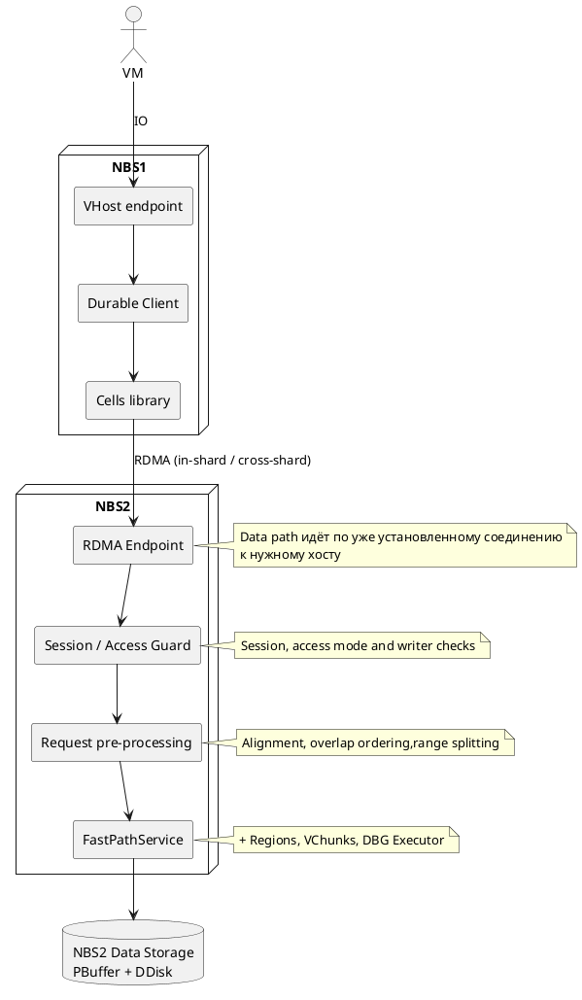
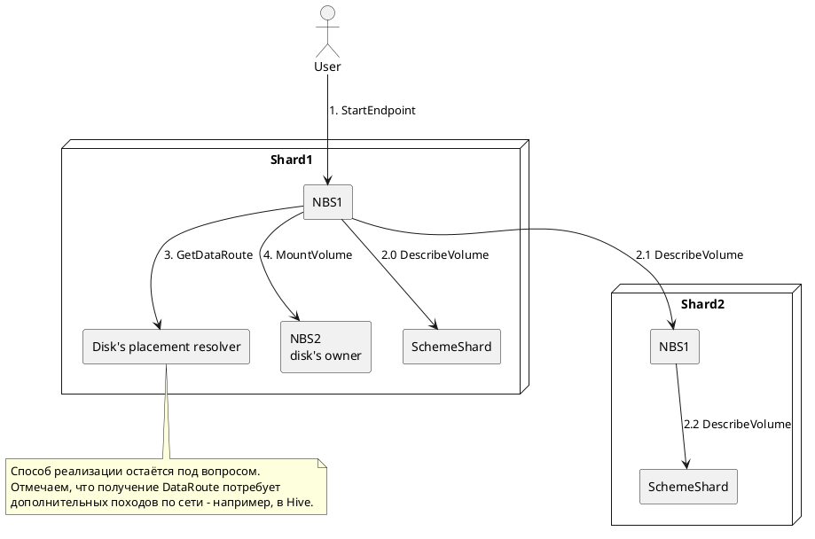
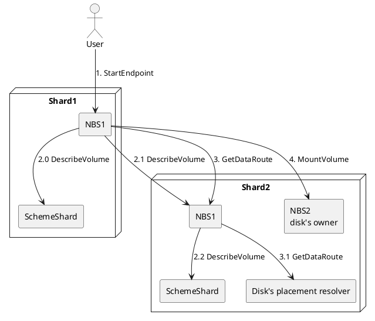
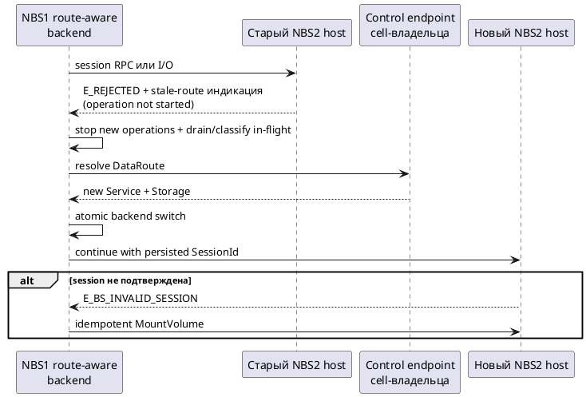

# RFC: интеграция NBS1 control plane с NBS2 backend

## 1. Метаданные

| Поле                                             | Значение                                   |
|--------------------------------------------------|--------------------------------------------|
| Статус                                           | Черновик                                   |
| Авторы                                           | TBD                                        |
| Рецензенты                                       | TBD                                        |
| Создан                                           | 2026-08-11                                 |
| Обновлён                                         | 2026-08-27                                 |
| Целевая ревизия YDB                              | `409f857c9f1ec487f12ef947c14f238b820b7ee3` |
| Source revision classic NBS contract             | `953e9966ce94d1724ccdb3e6676ac1f6036f04ae` |

Документы:

- **Актуальные:**
  - [README.md](README.md) — точка входа в актуальные документы и краткий обзор решения;
  - [rfc3.md](rfc3.md) — текущая версия RFC (этот документ);
  - [mvp_benchmark.md](mvp_benchmark.md) — план разработки и проверки нагрузочных MVP-1/MVP-2.
- **Старая проработка, неактуальна:**
  - [rfc.md](archive/rfc.md) — первая версия RFC;
  - [rfc2.md](archive/rfc2.md) — промежуточная редакция RFC;
  - [README.md](archive/README.md) — обзор исходной проработки;
  - [architecture.md](archive/architecture.md) — исходное архитектурное исследование;
  - [nbs2_current_vhost_data_path.md](archive/nbs2_current_vhost_data_path.md) — описание исследованного NBS2 data path;
  - [mvp_benchmark.md](archive/mvp_benchmark.md) — план нагрузочных MVP;
  - [mvp_functional.md](archive/mvp_functional.md) — план функционального MVP;
  - [production.md](archive/production.md) — исходный план production-доведения;
  - [test.puml](archive/test.puml) — черновая диаграмма.

Этот RFC фиксирует предлагаемую границу системы и обязательные свойства решения. Детали реализации будут проработаны отдельно.

В документе `cell` обозначает NBS shard, внутри которого могут одновременно работать NBS1 и NBS2.
Исходная cell — cell, в которой NBS1 выполняет `StartEndpoint`;
cell-владелец — cell, в SchemeShard которой зарегистрирован диск.
Для локального диска это одна и та же cell, для меж-cell доступа — разные.

## 2. Решаемая проблема

В NBS2 появляется новый тип диска, далее условно называемый `fast_disk`, но существующая инфраструктура NBS1 пока не умеет работать с ним как с обычным диском. Пользователь не может через единый NBS1 workflow найти такой диск по `DiskId`, подключить его и выполнять read-write I/O как внутри своей cell, так и между cells.

Необходимо сделать NBS2-диски доступными через NBS1, сохранив корректность сессий и конкурентной записи, восстановление после отказов и прежнее поведение NBS1-дисков. Отдельный пользовательский путь для NBS2 нежелателен, поскольку он разделит управление дисками, клиентские сценарии и эксплуатационные инструменты.

## 3. Предлагаемое решение

### 3.1. Обзор решения

NBS1 сохраняет пользовательский и административный control plane, discovery и создание vhost endpoint. NBS2 создаёт и обслуживает `fast_disk`, предоставляя совместимые с NBS1 операции управления сессией и I/O.

После discovery NBS1 определяет реализацию диска и его cell. NBS1-диски продолжают использовать существующие пути. Для `fast_disk` NBS1 находит host текущей NBS2 partition и направляет туда запросы независимо от того, находится диск в исходной или другой cell.

| Расположение диска | Реализация диска | `MountVolume`/`UnmountVolume` | I/O |
|---|---|---|---|
| Cell-владелец совпадает с исходной | NBS1 | Локальный NBS1 service | Существующий локальный NBS1 storage path |
| Cell-владелец отличается от исходной | NBS1 | NBS1 service выбранного host cell-владельца | Существующий cells gRPC/RDMA путь к NBS1 |
| Cell-владелец совпадает с исходной | NBS2 | gRPC на host локальной NBS2 partition | gRPC/RDMA на тот же NBS2 host |
| Cell-владелец отличается от исходной | NBS2 | gRPC на host NBS2 partition в cell-владельце | gRPC/RDMA на тот же NBS2 host |

`StartEndpoint` остаётся в NBS1. Для `fast_disk` control-plane операции выполняются по gRPC, а I/O — по gRPC или RDMA на том же NBS2 host. NBS2 frontend обслуживает только локальную partition и не пересылает запросы между hosts.

### 3.2. Высокоуровневая архитектура

#### Data Path

#### Control Path

##### Диск в том же шарде

##### Диск в другом шарде

### 3.3. Основные архитектурные решения

1. NBS1 остаётся единой внешней точкой control plane и всегда создаёт пользовательский endpoint.
2. `fast_disk` имеет явный согласованный признак типа диска, например отдельное значение `StorageMediaKind`; создаётся только в NBS2, а его постоянная metadata хранится в SchemeShard cell-владельца.
3. Для `fast_disk` обязательный `DataRoute` задаёт связанные NBS2 gRPC `Service` и gRPC/RDMA `Storage` одного host; отсутствие поддерживаемого маршрута не включает legacy NBS1 fallback.
4. NBS2 session/data path использует strict affinity: NBS1 подключается к хосту с нужной tablet, между хостами io запросы не ходят.
5. Classic `MountVolume`/`UnmountVolume` являются единственным сессионным контрактом выбранного NBS2 backend; дополнительный `RegisterSession`/`UnregisterSession` не вводится.
6. PartitionTablet транзакционно хранит server-side session/writer state, а partition-owned I/O path проверяет его для каждого запроса.
7. Multi-partition `fast_disk` не реализуется, `VolumeDirect` не является обязательным.
8. Существующие local и cells data paths NBS1-дисков сохраняются.
9. Local auto-vhost NBS2 выключен для `fast_disk`, которым управляет NBS1, но остаётся доступным для автономных конфигураций.

### 3.4. Контракт NBS2 backend

#### 3.4.1. Граница совместимости

NBS2 frontend реализует совместимое подмножество classic protobuf service `NCloud.NBlockStore.NProto.TBlockStoreService` из source revision, указанной в метаданных RFC.

#### 3.4.2. Поддерживаемые операции

| RPC | Назначение |
|---|---|
| `Ping` | Compatibility/liveness check конкретного NBS2 endpoint |
| `MountVolume` | Создание или идемпотентное восстановление session  |
| `UnmountVolume` | Отзыв session |
| `ReadBlocks` | Чтение |
| `WriteBlocks` | Запись |
| `ZeroBlocks` | Discard/write-zeroes после готовности внутреннего NBS2 path |

`DescribeVolume` остаётся операцией NBS1 и не входит в runtime API NBS2 frontend.

#### 3.4.3. Контракт `DataRoute`

`DataRoute` является вычисленным результатом discovery и не является вторым источником истины о принадлежности диска. Он должен содержать достаточно информации для создания связанной пары NBS2 backend clients:

- обязательный gRPC endpoint для `MountVolume`/`UnmountVolume` и data fallback;
- опциональный RDMA endpoint;
- поддерживаемые data transports;
- гарантию принадлежности session- и data-endpoints одному NBS2 host/incarnation;
  > требуется пояснение
- опциональную generation маршрута для обновления cache и диагностики.
  > требуется пояснение

Для распознанного `fast_disk` поддерживаемый `DataRoute` обязателен; отсутствие или непонимание маршрута является ошибкой совместимости.

#### 3.4.4. Использование транспортов

`MountVolume` и `UnmountVolume` выполняются по gRPC. Data I/O выполняется по gRPC или RDMA на том же NBS2 host. Оба data transport используют общий backend contract, validation и error model.

RDMA adapter использует совместимые classic NBS message IDs и wire layout (бинарное представление).

## 5. Корректность и управление состоянием

### 5.1. Гарантии корректности

1. Authoritative session, access mode и writer state хранятся в PartitionTablet.
2. Каждый I/O проверяет принадлежность сессии клиенту и разрешённый режим доступа (rw/ro).
3. Каждая изменяющая операция проверяет актуальный writer generation.
4. При смене поколения writer сначала завершаются принятые операции, затем разрешаются операции от нового.
5. Write с неопределённым результатом не повторяется автоматически без дедупликации по `RequestId` или другой явно зафиксированной семантики.
6. gRPC и RDMA используют одинаковые session, validation и error semantics.

### 5.2. Session lifecycle

#### 5.2.1. Владение и сохранение состояния

NBS1 управляет жизненным циклом пользовательского endpoint, а его `TSession` инициирует `MountVolume` и `UnmountVolume`. Для `fast_disk` эти RPC отправляются по gRPC в NBS2 из `DataRoute`.

NBS2 проверяет strict affinity и передаёт запрос локальной PartitionTablet. Успешный `MountVolume` возвращается только после сохранения session state в PartitionTablet; response содержит полный classic `Volume`, непустой `SessionId`.

#### 5.2.2. Mount и идемпотентное восстановление

Classic mount request не содержит `SessionId`. PartitionTablet должна надёжно находить существующую session по устойчивой client identity и параметрам mount либо создавать и фиксировать новую. Повторный mount с той же identity и эквивалентными параметрами возвращает актуальный `SessionId` и не увеличивает writer generation повторно.

Transport `RequestId` не может быть единственным ключом идемпотентности, поскольку periodic remount использует новый `RequestId`. Точная роль `InstanceId`, `IdempotenceId` и `MountSeqNumber` должна быть определена; `MountSeqNumber` участвует в writer fencing, но не является единственным ключом идемпотентности.
> требуется доп разбор предложенного варианта

#### 5.2.3. Unmount и terminal result

`UnmountVolume` транзакционно отзывает session в той же PartitionTablet.

> **Комментарий к переработке:** после определения точной persistent state machine добавить PlantUML state diagram. До этого нельзя изображать предполагаемые состояния как зафиксированный контракт.

### 5.3. Writer fencing

Partition должна хранить данные, позволяющие по `Headers.ClientId` и `SessionId` определить актуальную session, access mode и writer generation. Writer generation определяется по сохранённой session и не передаётся в каждом classic I/O request.

Проверки generation только в начале I/O недостаточно: write предыдущего writer может уже выполняться во время смены generation. До успешного ответа на mount нового writer система должна:

1. Отозвать право старой generation начинать новые изменяющие операции.
2. Дождаться завершения или безопасного отклонения уже принятых изменяющих операций старой generation.
3. Только после этого активировать и подтвердить нового writer.

Поведение одновременно выполняющихся записей в пересекающиеся диапазоны блоков должно уже реализовано.

### 5.4. Partition incarnation и handoff
> требуется пояснение и переформулирование пункта
> Partition incarnation - это tablet generation?
При managed shutdown или migration local registry атомарно отзывает пару session-control target и I/O handle, запрещает приём новых запросов старой incarnation и обрабатывает уже принятые session RPC и I/O до активации новой incarnation. Они должны быть завершены, безопасно отклонены либо переведены в явно определённое состояние с неопределённым результатом.

Этого недостаточно при crash или сетевом разделении. Необходим crash-safe placement/incarnation lease либо доказанная гарантия существующего tablet/DDisk lifecycle, физически запрещающая старой incarnation писать после активации новой.

Конкретная граница session-проверки — actor hop через partition, wrapper над `FastPathService` или расширение `FastPathService` — выбирается после измерения влияния на hot path, но выбранный механизм обязан сохранять перечисленные гарантии.

### 5.5. Восстановление маршрута и retry safety

Если таблетка переехала с хоста, старый host возвращает ошибку индикацией необходимости заново настроить маршрут. Route-aware слой NBS1:

1. Приостанавливает отправку новых I/O и session RPC.
2. Повторно получает `DataRoute` через стабильные control endpoints cell-владельца.
3. Обрабатывает или дожидается in-flight операций согласно их известному либо неопределённому результату.
4. Атомарно переключает связанные `Service` и `Storage` под существующей `TSession`.
5. Сохраняет `SessionId`, если новая incarnation подтверждает persisted session; после `E_BS_INVALID_SESSION` выполняет remount через новый `Service`.

---
> требуется пояснение
`E_REJECTED` без stale-route indication и transport error после передачи запроса не доказывают, что write безопасно повторить. При полном падении host transport error запускает resolve и переключение backend для последующих запросов, но не автоматический replay write с неопределённым результатом.
> требуется пояснение

Read может быть повторён согласно отдельному retry contract. Mount/unmount разрешается повторять только после определения устойчивого idempotency contract. Текущий switchable client и durable retry NBS1 этим требованиям не соответствуют и должны быть доработаны.

Для раннего нагрузочного прототипа допустимы закреплённый placement и ручное восстановление. Production-вариант должен восстанавливать route автоматически.

---
## Открытые вопросы
1. Необходимо описать переезд виртуальной машины
2. Необходимо описать переезд таблетки диска
3. Необходимо доработать сценарии разрыва соединения nbs1->nbs2
4. Нужен ли external boot?
  - есть ли у hive slo по скорости перевоза умершей таблетки? Опасение: из-за hive увеличится latency на сценарии переездов таблеток. В том числе и на выкатках релизов при blue-green
