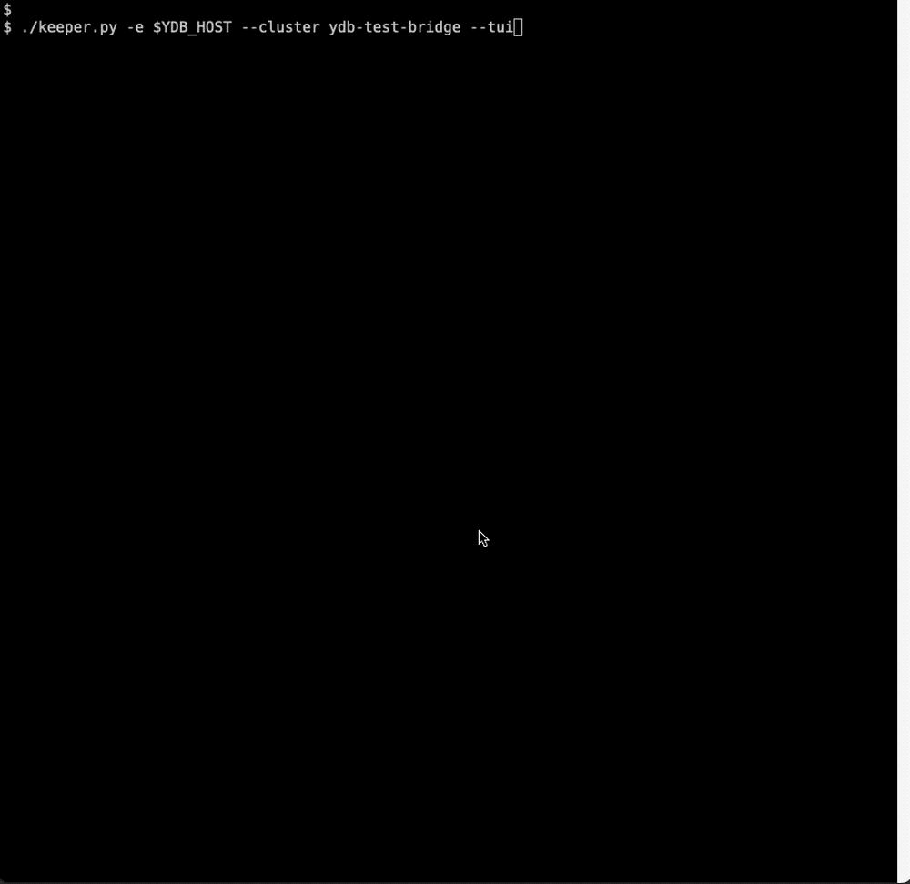

# Bridge keeper demo

**Не используйте данную утилиту в продакшене!**

YDB поддерживает работу в режиме [Bridge](https://ydb.tech/docs/ru/concepts/bridge?version=main). CLI утилита `keeper.py` реализует демо-версию `Bridge keeper'a`: выполняет мониторинг состояния кластера, управляет частями кластера, называемыми [pile](https://ydb.tech/docs/ru/concepts/glossary?version=main#pile), и отображает состояние кластера в TUI.

По умолчанию утилита автоматически выполняет failover, отказавших частей кластера:
* переводит в режим `DISCONNECTED`
* при необходимости назначает здоровый pile `PRIMARY`

## Установка

Установка зависимостей:
```
pip3 install textual requests
```

Для работы `keeper'a` требуется наличие YDB CLI. По умолчанию автоматически находит в `PATH`. Требуется установить YDB CLI из `main` или ветки `rc-bridge`. Также `ydbd` должен быть из `main` либо `rc-bridge`.

## Использование

Пример использования:
```
./keeper.py -e <EXAMPLE.COM> --cluster ydb-test-bridge --tui
```



## Параметры

| Параметр | По умолчанию | Описание |
|---|---|---|
| `--endpoint` | — | Хост YDB для получения информации о кластере. |
| `--endpoints` | — | Ручное указание endpoints кластера; укажите как минимум по три из каждого pile. |
| `--ydb` | из PATH | Путь к исполняемому файлу YDB CLI. |
| `--disable-auto-failover` | false | Отключить автоматический failover. |
| `--log-level` | INFO | Уровень логирования: `DEBUG`, `INFO`, `WARNING`, `ERROR`, `CRITICAL`. |
| `--cluster` | cluster | Имя кластера для отображения. |
| `--tui` | false | Включить TUI. |
| `--tui-refresh` | 1.0 | Интервал обновления TUI в секундах. |
| `--https` | false | Использовать HTTPS для healthcheck-запросов viewer. |

Примечание: должен быть указан один из параметров `--endpoint` или `--endpoints`.

