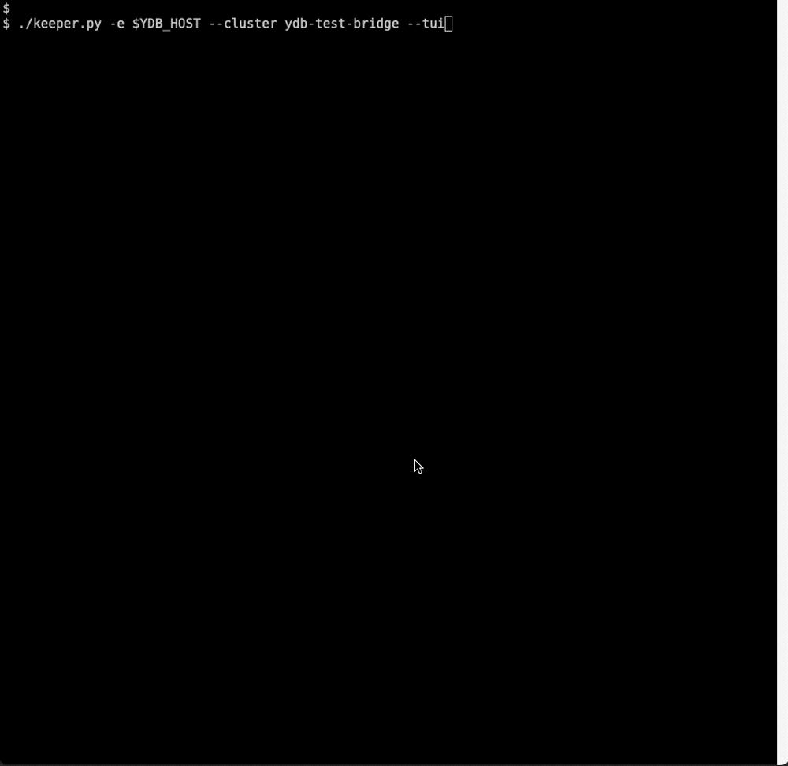

# Bridge skipper demo

**Do not use this utility in production!**

YDB supports operating in [Bridge](https://ydb.tech/docs/en/concepts/bridge?version=main) mode. The CLI utility `skipper.py` implements a demo version of a `Bridge keeper`: it monitors the cluster state, manages parts of the cluster called [pile](https://ydb.tech/docs/en/concepts/glossary?version=main#pile), and displays the cluster state in a TUI.

By default, the utility automatically performs failover for failed parts of the cluster:
- switches them to `DISCONNECTED`
- assigns a healthy pile as `PRIMARY` if needed

Demo version limitations:
- only two piles are supported
- the state of the compute part of the cluster is not taken into account

## Installation

Install dependencies:
```
pip3 install textual requests pyyaml
```

YDB CLI is required for `skipper` to work. By default, it is automatically located via `PATH`. You need the YDB CLI from `main` or the `rc-bridge` branch. `ydbd` should also be from `main` or `rc-bridge`.

## Usage

Example:
```
./skipper.py -e <EXAMPLE.COM> -s ~/ydb-test-bridge-state.json --cluster ydb-test-bridge --tui
```

Example with additional authentication parameters:
```
./skipper.py --ydb-auth-opts "--user suser --password-file password.txt" -e <EXAMPLE.COM> -s ~/ydb-test-bridge-state.json --cluster ydb-test-bridge --tui
```



## Parameters

| Parameter | Default | Description |
|---|---|---|
| `--endpoint` | — | YDB host used to obtain cluster information. |
| `--state` | — | Path to the file where the skipper stores its state. |
| `--ydb` | from PATH | Path to the YDB CLI executable. |
| `--ydb-auth-opts` | - | Authentication/TLS options for YDB CLI (single string; multiple options allowed). |
| `--disable-auto-failover` | false | Disable automatic failover. |
| `--log-level` | INFO | Logging level: `TRACE`, `DEBUG`, `INFO`, `WARNING`, `ERROR`, `CRITICAL`. |
| `--cluster` | cluster | Cluster name to display. |
| `--tui` | false | Enable TUI. |
| `--tui-refresh` | 1.0 | TUI refresh interval in seconds. |
