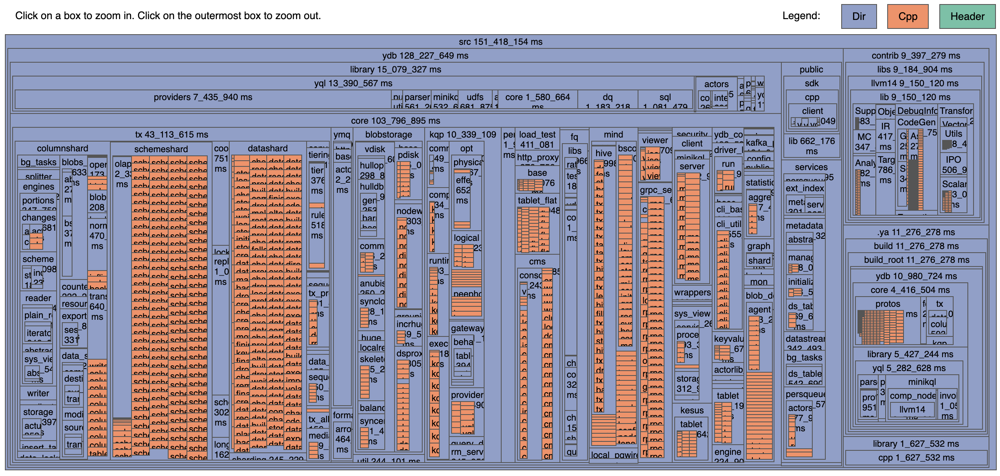

# Build Bloat

A tool used to visualize Clang's compilation profiles.

It helps to answer the following questions:
- Which directories/files have the longest impact on build time?
- Which headers have the longest impact on build time?

## How to use

You have to generate compilation profiles using `-ftime-trace` as a compilation flag. 

With the `ya` tool, it can be done with the following command:

`ya make <your usual arguments> --output=~/some_output_build_dir -DCOMPILER_TIME_TRACE --add-result=.json`

After the build is complete, run:

`ya tool python3 main.py --build-dir ~/some_output_build_dir --html-dir-cpp html_cpp_impact --html-dir-headers html_headers_impact`

Then, open `html_cpp_impact/index.html`, `html_headers_impact/index.html`
