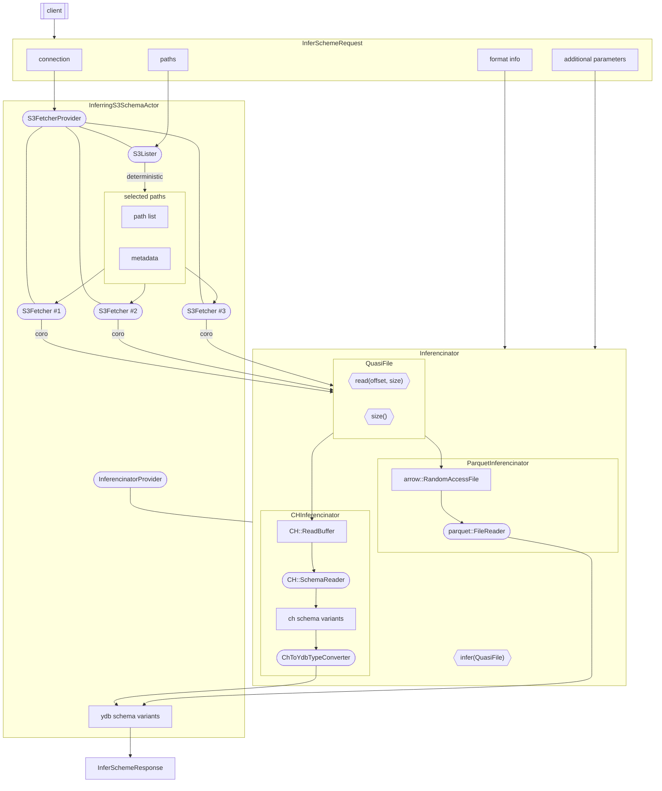

# Inferencinator design

## Plan as a text

1. We get a request for inference. It's expected to have:
    * *paths* we infer for (files or directories) — data is essential to guess it's schema
    * *connection* to S3 we read from — a way to turn *paths* into data
    * *file format* (e.g. csv_with_names, parquet) — simple for user to tell, tricky to guess
    * *additional parameters* — e.g. we might want to tweak amount of processed rows
2. We want to turn *paths* into readable sources
    1. Using *connection* from request, we can open `IHttpGateway` to S3 and build `S3FetcherProvider` around it
    2. We need to turn directory paths into file paths. For that we'll use `S3Lister`
        * Also, it can fetch metadata like file sizes in the same request
        * It has to have a deterministic behavior, if we want to always give the same answer for the same data
    3. When we have those paths, we may create an `S3Fetcher` for each, that will be responsible for retrieving corresponding *files*
3. It's suggested to have an `Inferencinator` interface 

1. Мы получаем запрос на вывод. Ожидается, что в нём будут
    * *paths* — пути, для которых мы выводим схему
    * *connection* — соединение к S3, откуда брать *paths*
    * *file format* (например, `csv_with_names`, `parquet`) — несложно указать пользователю, не всегда тривиально угадываются
    * *additional parameters* — потенциально, захотим подёргать какие-то параметры или даже дать их подёргать пользователю (например, число строк, из которых будет выводиться тип)
2. Хотим превратить *paths* в читаемые *файлы*
    1. Откроем `IHttpGateway` к указанному *connection*, завернём в `S3FetcherProvider`
    2. Нужно превратить каталожки из *paths* в список путей к файлам. Для этого заведём `S3Lister`
        * В том же запросе к S3 он может получать метаданные, в частности, размеры файлов
        * Если хотим по тем же данным отдавать ту же схему, листинг должен быть детерминированным
    3. Получив пути до файлов, для каждого можем создать `S3Fetcher` — через него мы будем тянуть *файлы*
3. Предлагается завести интерфейс `Inferencinator`, который будут реализовывать выводители конкретных форматов
    * Единственный метод у интерфейса — `vector<Ydb::Column> Infer(IRandomAccessFile)`
        * Этот `IRandomAccessFile` идейно похож на `arrow::io::RandomAccessFile`. В *s3 read actor* он реализуется через корутину. Эта роль предлагается отдать `S3Fetcher`'у
    * Зарегестрируем выводители форматов в `InferencinatorProvider`, который будет держать `InferingActor`
    * Из *file format* получаем нужный `Inferencinator`, через него прогоняем набор *файлов* из пункта 2 — получаем *схему*
4. Отдаём *схему* — радуемся, мы прекрасны

## Plan as a picture

### Side-note

`S3Lister` == `TS3FileQueue` ?

`S3Fetcher` == `TS3ReadCoroImpl` ?

### Arrow inference

1. Пропускается указанное число строк. Если нужного числа строк нет, падает
2. Пробуем вычитать имена