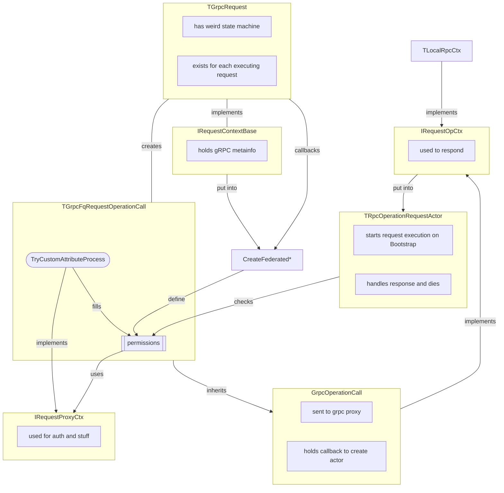

## Current state

```mermaid
flowchart TB

subgraph ctx_base[IRequestContextBase]
    ctx_base_text["holds gRPC metainfo"]
end

subgraph grpc_req[TGrpcRequest]
    grpc_req_text1["has weird state machine"]
    grpc_req_text2["exists for each executing request"]
end

grpc_req ---|implements| ctx_base

subgraph op_call[GrpcOperationCall]
    op_call_text1["sent to grpc proxy"]
    op_call_text2["holds callback to create actor"]
end

grpc_req ---|creates| fq_op_call

subgraph req_actor[TRpcOperationRequestActor]
    req_actor_text1["starts request execution on Bootstrap"]
    req_actor_text2["handles response and dies"]
end

subgraph req_op_ctx[IRequestOpCtx]
    req_op_ctx_text1["used to respond"]
end

subgraph req_proxy_ctx[IRequestProxyCtx]
    req_proxy_ctx_text1["used for auth and stuff"]
end

op_call -->|implements| req_op_ctx
req_op_ctx -->|"put into"| req_actor

local_ctx[TLocalRpcCtx]

local_ctx -->|implements| req_op_ctx

subgraph fq_op_call[TGrpcFqRequestOperationCall]
    permissions[[permissions]]
    custom_attr([TryCustomAttributeProcess])
end

custom_attr -->|implements| req_proxy_ctx
custom_attr -->|fills| permissions
permissions -->|uses| req_proxy_ctx
req_actor -->|checks| permissions

fq_op_call -->|inherits| op_call

create_funcs["CreateFederated*"]
create_funcs -->|define| permissions
ctx_base -->|"put into"| create_funcs

grpc_req --> |callbacks| create_funcs
```

