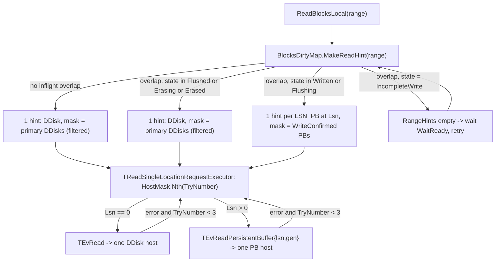

# NBS 2.0 — Partition / PersistentBuffer / DDisk Architecture

This is an internal architecture note for the new (NBS 2.0) blockstore in
`ydb/core/nbs/cloud/blockstore`. It describes the protocol between the
**Partition** (volume-side actor that serves user reads/writes) and the
**PersistentBuffer (PB) / DDisk** pair living in `ydb/core/blobstorage/ddisk`.

> The legacy `ydb/core/blockstore` does NOT use any of this. Only
> `ydb/core/nbs/cloud/blockstore/libs/storage/partition_direct` does.

## 1. Components and topology

A storage unit for one volume is a **DirectBlockGroup** of fixed size
**5 hosts**:

- `DirectBlockGroupHostCount = 5`
- `QuorumDirectBlockGroupHostCount = 3`

(`ydb/core/nbs/cloud/blockstore/libs/common/constants.h:11,14`)

Per host two actors live:

- **DDisk** — final, persistent location of user data on the local PDisk.
- **PersistentBuffer (PB)** — WAL-like staging area in front of DDisk.
  Same-host as its DDisk peer, but addressed independently.

Both actors are the same C++ class `TDDiskActor`
(`ydb/core/blobstorage/ddisk/ddisk_actor.h`), distinguished by the
`IsPersistentBufferActor` flag and by which state machine they `Become()`:
- `StateFuncDDisk` — `ddisk_actor.cpp:230-272`
- `StateFuncPersistentBuffer` — `ddisk_actor.cpp:274-312`
- `StateFuncTerminate` — `ddisk_actor.cpp:314-324`

Service ids:
- `MakeBlobStorageDDiskId(node, pdisk, slot)`
- `MakeBlobStoragePersistentBufferId(node, pdisk, slot)`

### Per-vChunk role assignment

Per **vChunk**, the 5 hosts are split into 3 *primary* + 2 *hand-off*:

```cpp
// ydb/core/nbs/cloud/blockstore/libs/storage/partition_direct/dirty_map/location.h
enum class ELocation: ui16 {
    PBuffer0..2  / HOPBuffer0..1   // PB primary + hand-off
    DDisk0..2    / HODDisk0..1     // DDisk primary + hand-off
    Unknown,
};
```

The mapping rotates per-vChunk so different vChunks distribute primary slots
across the 5 hosts. The rotation is built by
`THostStatusList::MakeRotating`
(`ydb/core/nbs/cloud/blockstore/libs/storage/partition_direct/model/host_status.cpp:19-36`):

```cpp
// for i in [0, primaryCount):
//   host[(i + vChunkIndex) % hostCount] := Primary
// remaining hosts := HandOff
```

With `primaryCount = 3, hostCount = DirectBlockGroupHostCount = 5` (built by
`TVChunkConfig::Make`,
`ydb/core/nbs/cloud/blockstore/libs/storage/partition_direct/model/vchunk_config.cpp:10-20`):

| vChunkIndex | Primary host indexes | HandOff host indexes |
|---|---|---|
| 0 | {0, 1, 2} | {3, 4} |
| 1 | {1, 2, 3} | {4, 0} |
| 2 | {2, 3, 4} | {0, 1} |
| 3 | {3, 4, 0} | {1, 2} |
| 4 | {4, 0, 1} | {2, 3} |

(then it wraps: vChunkIndex 5 == vChunkIndex 0, etc.)

The PB role list and the DDisk role list of one vChunk are produced by two
independent `MakeRotating` calls with the same `vChunkIndex`
(`vchunk_config.cpp:13-19`), so within a vChunk the primary PB at host index
`k` is paired with the primary DDisk at host index `k`. Combined with BSC's
same-host pairing of `Nodes[k].DDiskId` and
`Nodes[k].PersistentBufferDDiskId` (see §13.3), this is what makes the
steady-state flush co-located on one physical node.

`PrimaryPBuffers = PBuffer0|PBuffer1|PBuffer2`,
`HandOffPBuffers = HOPBuffer0|HOPBuffer1`, analogous masks for DDisks
(those `ELocation` names are slot-roles, not host indexes — `PBuffer0..2`
mean "the 3 primary PBs of this vChunk", which the rotation maps onto
different host indexes depending on `vChunkIndex`).

Result of the rotation: across 5 successive vChunks every host serves as
primary exactly 3 times and as hand-off exactly 2 times, so flush/erase
traffic is balanced across the 5 hosts of the DBG.

### Object hierarchy on the partition side

Volume → Region (4 GiB each) → vChunk → DirectBlockGroup (5 hosts):

- `TFastPathService` (`partition_direct/fast_path_service.{h,cpp}`) — entry
  point implementing `IStorage`. Owns Regions, generates LSNs.
- `TRegion` (`partition_direct/region.{h,cpp}`) — holds vChunks for a region.
- `TVChunk` (`partition_direct/vchunk.{h,cpp}`) — owns the per-vChunk
  `BlocksDirtyMap` and orchestrates write/flush/erase.
- `IDirectBlockGroup` (`partition_direct/direct_block_group.h`,
  impl in `direct_block_group_impl.{h,cpp}`) — wire-protocol facade with
  the 5 hosts. Exposes ops `Read/WriteBlocksTo{DDisk,PBuffer}`,
  `WriteBlocksToManyPBuffers`, `SyncWithPBuffer`, `EraseFromPBuffer`,
  `RestoreDBGPBuffers`, `ListPBuffers`, `Dump`.
- `NTransport::TICStorageTransport` (`storage_transport/`) — converts
  IDirectBlockGroup calls into actor messages targeting the right
  `MakeBlobStorage*Id` service id over interconnect.
  - `TICStorageTransportActor` (`storage_transport/ic_storage_transport_actor.{h,cpp}`)
    is the actual relay actor.

## 2. Connection setup (preamble)

Before any I/O, the partition issues `TEvConnect` to each PB and DDisk it
talks to (`TICStorageTransport::Connect` →
`ic_storage_transport_actor.cpp:103-128`). The DDisk validates
`TQueryCredentials{TabletId, Generation, DDiskInstanceGuid, RequestKind}`
on every subsequent request via `ValidateConnection` / `CheckQuery`
(`ddisk_actor.h:478-563`). A partition with a stale generation gets
`SESSION_MISMATCH`.

PB-to-PB requests reuse the partition's tablet creds but set
`RequestKind = REQUEST_KIND_INTERNAL`
(`write_persistent_buffers_request_actor.cpp:202-206`).

## 3. The hot path — write

The partition supports two write modes (`EWriteMode` in
`config/protos/storage.proto:10-17`); selected per write in
`vchunk.cpp:392-422` via `TStorageConfig::GetWriteMode()`:

```proto
enum EWriteMode {
    PBufferReplication   = 0;   // main / production
    DirectPBuffersFilling = 1;
}
```

There are **two** distinct "defaults" in play, and they disagree — worth
keeping straight when reading volume configs:
- proto3 wire default for an unset `WriteMode` field is the enum-0 value,
  i.e. `PBufferReplication`
  (`ydb/core/nbs/cloud/blockstore/config/protos/storage.proto:10-17`).
- The C++ fallback in `TStorageConfig` when the proto field is **absent
  entirely** is `DefaultWriteMode = DirectPBuffersFilling`
  (`ydb/core/nbs/cloud/blockstore/config/config.cpp:34-36`, plumbed
  through the `BLOCKSTORE_CONFIG_GETTER` macro at `config.cpp:99-114`).

In production NBS volumes the field is set explicitly:
**`PBufferReplication` is the main mode**, and is what the architecture
diagram in §11, the coordinator selection via
`Oracle.SelectBestPBufferHost`, and the per-PB fan-out actor
`TWritePersistentBuffersRequestActor` are designed around.
`DirectPBuffersFilling` is kept around as an alternate path mainly for
tests and as a fallback when the coordinator path is disabled.

### 3.1 `DirectPBuffersFilling` — partition replicates

`TWriteWithDirectReplicationRequestExecutor`
(`partition_direct/write_with_direct_replication_request.cpp`):

```
Run():
    SendWriteRequest(PBuffer0)  -> TEvWritePersistentBuffer
    SendWriteRequest(PBuffer1)  -> TEvWritePersistentBuffer
    SendWriteRequest(PBuffer2)  -> TEvWritePersistentBuffer
    ScheduleHedging()  // after HedgingDelay, fire to HOPBuffer0/1 too
```

- 3 independent unicasts from the partition; PBs are dumb storage.
- Quorum: **>= 3 of 5** primary OK → reply success to user
  (`write_request.cpp:107`).
- On any primary PB failure, the partition fires a request to a hand-off PB
  (`write_request.cpp:113-128`). Order: HOPBuffer0, then HOPBuffer1.
- Hedging: speculative writes to hand-offs after `WriteHedgingDelay`
  (`write_with_direct_replication_request.cpp:48-65`).

### 3.2 `PBufferReplication` — coordinator PB replicates (DEFAULT)

`TWriteWithPbReplicationRequestExecutor`
(`partition_direct/write_with_pb_replication_request.cpp`):

```
Run():
    SendWriteRequestToManyPBuffers({PBuffer0, PBuffer1, PBuffer2})
        -> TEvWritePersistentBuffers (plural)
    ScheduleHedging()  // after HedgingDelay, send another
                       // SendWriteRequestToManyPBuffers({PBuffer2,
                       //                                  HOPBuffer0,
                       //                                  HOPBuffer1})
```

- Partition picks **one coordinator PB** via `Oracle.SelectBestPBufferHost`
  (`direct_block_group_impl.cpp:531`) — see also `partition_direct/model/oracle.cpp`
  for the actual selection logic.
- Sends a single `TEvWritePersistentBuffers` carrying the data **and the
  list of all destination PB ids** (`PersistentBufferIds`). Constructed at
  `ic_storage_transport_actor.cpp:263-271`.
- Coordinator PB does the fan-out (see §3.3).
- Coordinator returns one `TEvWritePersistentBuffersResult` containing one
  `TResult{PersistentBufferId, TEvWritePersistentBufferResult}` per
  destination — partition still gets per-PB statuses.
- Quorum: **>= 3 of 5** primary OK.
  (`write_with_pb_replication_request.cpp:129`).
- If <3 succeeded after the coordinator returned, partition retries missing
  slots via a second `TEvWritePersistentBuffers` with hand-off ids
  (`write_with_pb_replication_request.cpp:151-162`).

This is the mode shown in the architecture diagram (Tablet→PB2→{PB1,PB3}).

### 3.3 Coordinator PB fan-out

`StateFuncPersistentBuffer` forwards `TEvWritePersistentBuffers` (and
`TEvReadThenWritePersistentBuffers`) to a per-PB child actor
`TWritePersistentBuffersRequestActor` registered in the same mailbox
(`ddisk_actor.cpp:184, 305-310`).

In `TWritePersistentBuffersRequestActor::Handle(TEvWritePersistentBuffers)`
(`write_persistent_buffers_request_actor.cpp:189-239`):

1. Uses `REQUEST_KIND_INTERNAL` credentials.
2. For each `pbId` in `PersistentBufferIds` (including itself), sends a plain
   `TEvWritePersistentBuffer` over interconnect with
   `FlagSubscribeOnSession`. Same payload is shared via `TRope`.
3. Schedules a `TEvWakeup` at `ReplyTimeoutMicroseconds` — partial replies are
   returned at timeout, late ones discarded.
4. Subscribes for `TEvInterconnect::TEvNodeDisconnected` and marks the
   corresponding PB as ERROR if the link drops
   (`write_persistent_buffers_request_actor.cpp:59-75`).
5. After all in-flight PB replies are received (or on timeout), packs them
   into a single `TEvWritePersistentBuffersResult`.

Important consequences:

- **No internal quorum on the PB side.** The coordinator just fans out and
  returns whatever it got. Quorum logic stays on the partition.
- **Bandwidth amplification**: the coordinator sends N-1 copies of the
  payload over interconnect. In `DirectPBuffersFilling` mode the partition
  pays this cost itself; in `PBufferReplication` mode the coordinator
  uplinks 2× the payload.
- **Coordinator-failure blast radius**: a failing coordinator becomes the
  entire request's failure. Hedging + Oracle host selection is what mitigates
  this.

### 3.4 `TEvReadThenWritePersistentBuffers` (re-replication variant)

Same fan-out as above but the payload is fetched on the coordinator first
via `TEvReadPersistentBuffer(lsn, generation)` against itself
(`write_persistent_buffers_request_actor.cpp:153-187`). Lets the system
re-replicate an already-buffered record without re-uploading the data from
the partition. Used in tests today and in handoff/restore paths.

## 3.5 The hot path — read

Reads in `partition_direct` are **partition-driven, state-machine-routed,
single-unicast**: every read sub-range is dispatched to **exactly one**
DDisk *or* PB. There is **no read quorum, no reconciliation, no
Oracle-based load balancing on the read path**. The write side already
established full-quorum durability before any LSN reached a "readable"
state (§5), so trusting one peer is safe.

### 3.5.1 Decision logic — `TBlocksDirtyMap::MakeReadHint`

Source of truth:
`ydb/core/nbs/cloud/blockstore/libs/storage/partition_direct/dirty_map/dirty_map.cpp:310-375`.

The dirty map colours the requested vChunk-range by overlapping inflight
LSNs and emits one `TReadRangeHint` per contiguous sub-range:

```cpp
// dirty_map.cpp:313-316 — fast path: no inflight overlap → one hint, read DDisk
if (!Inflight.HasOverlaps(range)) {
    result.RangeHints.push_back(MakeReadRangeHint({}, /*lsn=*/0, range, 0));
    return result;
}

// dirty_map.cpp:320-336 — enumerate overlapping LSNs
Inflight.EnumerateOverlapping(range, [&](auto& item) {
    const auto readMask = item.Value.ReadMask();
    if (readMask.Empty()) {                       // PBufferIncompleteWrite
        shouldWaitQuorum = true;
        result.WaitReady = item.Value.GetQuorumReadyFuture();
        result.RangeHints.clear();
        return EEnumerateContinuation::Stop;
    }
    if (!readMask.OnlyDDisk()) {                  // PBufferWritten/Flushing → PB
        ranges.push_back({.Key = item.Key, .Range = item.Range});
    }
    // PBufferFlushed/Erasing/Erased contribute nothing → DDisk by default.
    return EEnumerateContinuation::Continue;
});
```

The state→source mapping (`TInflightInfo::ReadMask`,
`partition_direct/dirty_map/inflight_info.cpp:113-134`) is fixed:

| `TInflightInfo` state | Read source for that sub-range | Mask                            |
| --- | --- | --- |
| `PBufferIncompleteWrite` | (blocked, wait for quorum) | empty                            |
| `PBufferWritten` | PB at this LSN | `WriteConfirmed` PBs of this inflight |
| `PBufferFlushing` | PB at this LSN | `WriteConfirmed` PBs of this inflight |
| `PBufferFlushed`  | DDisk | all-ones (filtered below)        |
| `PBufferErasing`  | DDisk | all-ones (filtered below)        |
| `PBufferErased`   | DDisk | all-ones (filtered below)        |
| (no inflight overlap) | DDisk | all-ones (filtered below)        |

A read can therefore be split into **PB-read for some LSNs + DDisk-read
for some sub-ranges + DDisk-read for everything else**, all in the same
user request.

### 3.5.2 Mask filtering for DDisk hints

For "DDisk" hints (`lsn == 0`), `MakeReadRangeHint`
(`dirty_map.cpp:802-823`) restricts the mask:

```cpp
THostMask result = mask.Exclude(DisabledHosts);
for (THostIndex h: result) {
    if (!DDiskStates[h].CanReadFromDDisk(range)) result.Reset(h);
}
```

A DDisk is dropped from the read mask when:
- it is in `DisabledHosts`, or
- its `TDDiskState` is `Fresh` and the requested range is above the
  DDisk's read watermark (the DDisk hasn't been bulk-filled up to here
  yet — see `TDDiskDataCopier`, §4.3),
- otherwise `CanReadFromDDisk` accepts it.

The final mask is asserted non-empty (`dirty_map.cpp:815`). When all 3
primary DDisks are filtered out for some range, the read aborts there.

PB-hint masks (`lsn > 0`) are NOT filtered against DDisk state — they
use the `WriteConfirmed` mask of the inflight as-is.

### 3.5.3 Host selection and retry — `TReadSingleLocationRequestExecutor`

`partition_direct/read_request_single_location.cpp:60-115`:

```cpp
auto host = hint.HostMask.Nth(TryNumber);   // bit-ordered: first match on attempt 0, next on 1, …
if (!host) { Reply(E_REJECTED); return; }   // mask exhausted
const bool fromDDisk = hint.Lsn == 0;
auto future = fromDDisk
    ? DirectBlockGroup->ReadBlocksFromDDisk (vChunkIndex, *host, hint.VChunkRange, sglist, traceId)
    : DirectBlockGroup->ReadBlocksFromPBuffer(vChunkIndex, *host, hint.Lsn, hint.VChunkRange, sglist, traceId);
```

`OnReadResponse` (`read_request_single_location.cpp:123-155`) on error
bumps `TryNumber` and re-enters `Run()`; the next bit in the same mask
is tried. After `TryNumber == 3` the read fails with the last error.

Consequences:
- Up to **4 attempts per hint** (try indices 0..3), all against the same
  mask. Each attempt is one unicast.
- Practical reach: DDisk-mode reads can touch up to all 3 primary DDisks
  (after Fresh/Disabled filtering); PB-mode reads can touch up to all
  PBs that confirmed the original write (3 primary + 0..2 hand-offs).
- **Host pick is `HostMask.Nth(TryNumber)`, i.e. bit-ordered, NOT
  Oracle-ranked.** There is no read-side analogue of
  `Oracle.SelectBestPBufferHost`. If you ever want load-aware read
  placement, this is the call site to instrument.

### 3.5.4 Multi-coloured ranges — `TReadMultipleLocationRequestExecutor`

`partition_direct/read_request_executor.cpp:21-30` picks
`TReadMultipleLocationRequestExecutor` when `RangeHints.size() > 1`.
`partition_direct/read_request_multiple_location.cpp:13-132`:

- Splits the caller's `Sglist` into N sub-sglists by byte offset
  (`:35-67`) so every sub-request writes into the correct slice of the
  user buffer.
- Wraps each `TReadRangeHint` in its own
  `TReadSingleLocationRequestExecutor` and runs all N in parallel
  (`:98-108`).
- First sub-request to error fails the whole read (`:110-128`); success
  needs all N to complete (`:130-132`).

Each sub-request remains a single unicast, possibly DDisk for one
sub-range and PB for another.

### 3.5.5 Wire layer

`TDirectBlockGroup::ReadBlocksFromDDisk`
(`partition_direct/direct_block_group_impl.cpp:181-253`) sends
`TEvRead` via `StorageTransport->ReadFromDDisk`, carrying
`TBlockSelector{vChunkIndex, range.Start*BlockSize, range.Size()*BlockSize}`,
`TReadInstruction(true)`, and the user `Sglist` to land payload into.

`TDirectBlockGroup::ReadBlocksFromPBuffer`
(`partition_direct/direct_block_group_impl.cpp:255-`) sends
`TEvReadPersistentBuffer` with the same selector plus `lsn` (and the
session's `Credentials.Generation`).

PB-side handler `TDDiskActor::Handle(TEvReadPersistentBuffer)`
(`ydb/core/blobstorage/ddisk/ddisk_actor_persistent_buffer.cpp:619-743`):

1. Looks up `PersistentBuffers[(TabletId, Generation)].Records[lsn]`
   (`:661-679`). Missing → `MISSING_RECORD`.
2. If `pr.Data.size() > 0` — record is in the **in-memory cache**
   (capped by `PBufferConfig.MaxInMemoryCache`, default 128 MiB per PB)
   — reply immediately from memory (`:717-719`).
3. Otherwise schedule one or more `TPersistentBufferPartIoOp` uring
   reads, one per contiguous sector run (`:720-742`); reply once all
   parts complete. A cold-fetched record is inserted into
   `PersistentBuffersInMemoryCacheUptime` (`:302-303, :368-369`) for
   future hits.

So the read-from-PB path is **"from memory if cached, from local PDisk
via direct I/O otherwise"** — not unconditionally memory-only.

### 3.5.6 Concurrency — locks the read takes

Two locks held for the lifetime of a single hint, armed in
`read_request_single_location.cpp:17-23` and released in
`TRangeLock::~TRangeLock`
(`partition_direct/dirty_map/range_locker.cpp:19-32`):

- **PB read (`Lsn > 0`)** → `TBlocksDirtyMap::LockPBuffer(lsn)` →
  `TInflightInfo::LockPBuffer`
  (`partition_direct/dirty_map/inflight_info.cpp:231-243`). While
  `PBuffersLockCount > 0` the LSN is **removed from `ReadyToErase`**, so
  it cannot be erased while a read is in progress. On unlock, if the
  LSN has meanwhile reached `PBufferFlushed`, it is re-registered into
  `ReadyToErase`.
- **DDisk read (`Lsn == 0`)** → `TBlocksDirtyMap::LockDDiskRange(range, mask)`
  (`partition_direct/dirty_map/dirty_map.cpp:602-624`). The range is
  recorded in `InflightDDiskReads`. `MakeFlushHint` checks
  `InflightDDiskReads.HasOverlaps(item->Range)` (`dirty_map.cpp:402-406`)
  and **skips flushing overlapping LSNs** while the read is inflight
  (re-inserting them into `ReadyToFlush`). Plus the invariant at
  `:614-617` rules out in-progress flushes targeting any DDisk inside
  the read mask.

So reads coexist with the steady-state flush/erase loop with **zero
extra wire messages** — the locks are pure in-process bookkeeping on
the partition.

### 3.5.7 Entry path on the partition

`TVChunk::ReadBlocksLocal` →
`partition_direct/vchunk.cpp:74, 277-377`:

```cpp
// vchunk.cpp:286-291 — until restore-on-start completes, reads are rejected
if (!DirtyMapRestored) { promise.SetValue({.Error = MakeError(E_REJECTED, ...)}); return; }

// vchunk.cpp:300
readHint = BlocksDirtyMap.MakeReadHint(vchunkRange);

// vchunk.cpp:308-338 — PBufferIncompleteWrite blocked the read; park on WaitReady and retry
if (readHint.RangeHints.empty()) {
    Executor->ExecuteSimple([..]{ executor->WaitFor(waitReady); self->DoReadBlocksLocal(...); });
    return;
}

// vchunk.cpp:345-352
auto requestExecutor = CreateReadRequestExecutor(...);
```

### 3.5.8 Read-side flow diagram



(For requests spanning multiple LSN-coloured sub-ranges,
`TReadMultipleLocationRequestExecutor` fans this out into N parallel
single-host sub-reads — see §3.5.4.)

### 3.5.9 Things to remember about reads

- Reads NEVER trigger a flush. The partition reads directly from a PB
  while the LSN is in `PBufferWritten` / `PBufferFlushing`. The DDisk
  becomes the read source only after flush quorum is reached (i.e. the
  LSN has advanced past §5.2's `FlushDesired == FlushConfirmed` gate).
- "PB read is in-memory" is true on a cache hit (`pr.Data` populated)
  and false on a miss — cold reads do a direct-I/O fetch via uring on
  the PB's local PDisk.
- Up to 4 host attempts per hint, all against the same per-hint mask.
  No fan-out, no consensus.
- Read-vs-flush and read-vs-erase races are resolved in-process via
  `TRangeLock`; no extra messages cross the wire for serialisation.

## 4. The background path — flush PB → DDisk

Two cooperating mechanisms.

### 4.1 `SyncWithPBuffer` — DDisk pulls from PB

The partition's per-vChunk machinery decides which (PB-source, DDisk-dest)
flushes to issue (see §6 dirty-map state machine). For each pair,
`TFlushRequestExecutor` (`partition_direct/flush_request.cpp:42-57`) sends
**`TEvSyncWithPersistentBuffer` to the DDisk** at `ddiskHostIndex`. The
message carries:
- The `DDiskId` of the source PB (`pbufferConnection.DDiskId`)
- A list of `{TBlockSelector, lsn, generation}` segments to flush

In the destination DDisk, `HandleSync<TSyncWithPersistentBufferPolicy>`
(`ddisk_actor_sync.cpp:63-207`):

1. Allocates a `TSyncInFlight` and registers each segment with
   `SegmentManager` (deduplicates ranges and outdates older flushes for the
   same range).
2. For each segment, sends `TEvReadPersistentBuffer` to the source PB
   service id (computed from the `DDiskId` field of the request via
   `MakeBlobStoragePersistentBufferId`).
3. When data comes back (`TEvReadPersistentBufferResult`), DDisk
   allocates/uses the chunk for `(tabletId, vChunkIndex)`
   (auto-`IssueChunkAllocation` if missing) and writes via internal
   `TInternalSyncWriteOp` → `DirectUringOp`.
4. Once all writes for a syncId are acked
   (`TEvPrivate::TEvInternalSyncWriteResult`), `ReplySync` sends
   `TEvSyncWithPersistentBufferResult` with one `SegmentResult` per
   segment.

So **the destination DDisk is the orchestrator** of a flush, not the PB
and not the partition. Two scenarios:
- **Same-host** (`pbufferHostIndex == ddiskHostIndex`): DDisk and PB on the
  same node, the read happens via local interconnect. This is the steady-
  state path (and the one drawn in the diagram).
- **Cross-host**: typically used for hand-off recovery — the destination
  DDisk pulls the missing range from a peer's PB. The partition decides
  who reads from whom by setting `pbufferHostIndex != ddiskHostIndex`.

### 4.2 `TEvSyncWithDDisk` — DDisk-to-DDisk repair

Mirror of `SyncWithPersistentBuffer` but reads from another DDisk instead
of a PB (`ddisk_actor_sync.cpp:37-61, 213-215`). Same code path, different
source actor type. Used to re-replicate between DDisks.

### 4.3 `TDDiskDataCopier` — bulk fresh-watermark repair

`partition_direct/ddisk_data_copier.{h,cpp}` performs a sliding-window read
(using the same read-from-quorum executors that serve user reads) and
`WriteBlocksToDDisk` (`TEvWrite`) to the destination. Used when a DDisk is
in `Fresh` state (only partially filled) to bulk-fill it from peers.

It writes raw `TEvWrite` to the destination DDisk only — it does NOT touch
PB records or the LSN-keyed flush+erase loop.

## 5. Erase — partition-driven, gated by full-quorum flush

> **LSN forward reference.** LSN = Log Sequence Number. Per-partition
> monotonically-increasing `ui64`, generated by
> `TFastPathService::GenerateSequenceNumber`
> (`partition_direct/fast_path_service.cpp:308-311`). **One LSN is
> assigned per user `WriteBlocksLocal` call** and tags that one write
> end-to-end: every PB replica receives the same LSN, every per-(source,
> destination) flush carries the same LSN, every per-PB erase targets
> the same LSN. The state machine introduced in §5.1 tracks one
> `TInflightInfo` per LSN — `PBufferIncompleteWrite → PBufferWritten →
> PBufferFlushing → PBufferFlushed → PBufferErasing → PBufferErased` are
> all states of the same LSN. See §6 for full identity, persistence and
> on-disk key format.

The partition is the eraser. It knows data is durable because every flush
response that lands on a DDisk transitions the LSN's state machine — only
when **all required DDisks have confirmed** does the LSN move to
`PBufferFlushed` and become eligible for erase.

### 5.0 When flush and erase actually run

Neither flush nor erase is timer-driven; both are reactive and batched.

`TVChunk::DoFlush()` is called from exactly two places
(`partition_direct/vchunk.cpp`):
- `OnWriteBlocksResponse`, immediately after every successful user
  write (`vchunk.cpp:478`).
- `UpdateDirtyMap`, once at vChunk start right after the restore-list
  has been replayed (`vchunk.cpp:255`).
- It is **not** called from `OnFlushResponse` and there is **no
  periodic timer**.

`TVChunk::DoErase()` is called from exactly two places:
- `OnFlushResponse`, immediately after a flush batch completes
  (`vchunk.cpp:528`).
- `UpdateDirtyMap`, once at vChunk start (`vchunk.cpp:256`).

Both `MakeFlushHint` / `MakeEraseHint` have a **batch-size gate**: they
early-return with no hints when the corresponding ready-queue size is
`< SyncRequestsBatchSize`
(`partition_direct/dirty_map/dirty_map.cpp:381-383`, `:433-435`).
`SyncRequestsBatchSize` defaults to `10`
(`config/config.cpp:30`).

Consequences for steady-state behaviour — **traffic is bursty per
vChunk**:
- Up to 9 freshly-written LSNs can sit in PB on a vChunk without ever
  being flushed.
- If user writes stop, ready-queue LSNs stay parked until either more
  writes arrive (more `DoFlush`) or restart re-runs `UpdateDirtyMap`.
- A failed flush re-registers the LSN in `ReadyToFlush` via
  `TInflightInfo::FlushFailed`
  (`partition_direct/dirty_map/inflight_info.cpp:179-187`), but the
  actual retry RPC only fires on the next `DoFlush` — i.e. on the next
  user write to that vChunk (or restart). Same for `EraseFailed`
  (`inflight_info.cpp:222-229`): the failed LSN waits in `ReadyToErase`
  until the next `DoErase`, which only fires on the next flush response
  on this vChunk (or restart).

Per LSN, in steady state, the wire-level work is fixed:
- 1× `TEvWritePersistentBuffers` to the coordinator PB
  (mode `PBufferReplication`), or 3-5× `TEvWritePersistentBuffer` from
  the partition (mode `DirectPBuffersFilling`).
- 3× `TEvSyncWithPersistentBuffer` (one per primary DDisk; LSN entries
  are batched per `(source PB, destination DDisk)` route across LSNs of
  the same DoFlush call).
- 3× `TEvBatchErasePersistentBuffer` (one per primary PB that received
  the write; LSN entries are batched per target PB across LSNs of the
  same DoErase call).

### 5.1 Per-LSN state machine

Each successfully-written LSN has a `TInflightInfo`
(`partition_direct/dirty_map/inflight_info.h`):

```
PBufferIncompleteWrite  --(Restore quorum)-->  PBufferWritten
PBufferWritten          --RequestFlush()---->  PBufferFlushing
PBufferFlushing         --ConfirmFlush()
                          when FlushDesired == FlushConfirmed -->  PBufferFlushed
                                                                   (Lsn registered to ReadyToErase)
PBufferFlushed          --RequestErase()---->  PBufferErasing
PBufferErasing          --ConfirmErase()
                          when EraseConfirmed == EraseRequested -->  PBufferErased
                                                                     (LSN removed from Inflight map)
```

Bitmasks per `TInflightInfo`: `WriteRequested`, `WriteConfirmed`,
`FlushDesired`, `FlushRequested`, `FlushConfirmed`, `EraseRequested`,
`EraseConfirmed`. One bit per `ELocation`.

The same state also fixes the **read source** for any user read that
overlaps this LSN's range (`TInflightInfo::ReadMask`,
`inflight_info.cpp:113-134`): `PBufferWritten`/`PBufferFlushing` →
read from a `WriteConfirmed` PB at this LSN; `PBufferFlushed`/
`PBufferErasing`/`PBufferErased` → read from a primary DDisk;
`PBufferIncompleteWrite` → blocked until quorum is reached. See §3.5.1
for the full read decision logic.

### 5.2 Gates in detail

After the write executor returns, `TVChunk` calls
`BlocksDirtyMap.WriteFinished(lsn, range, requested, confirmed)`. If
`confirmed.Count() < QuorumDirectBlockGroupHostCount` the LSN is **not even
inserted** into the inflight map (`dirty_map.cpp:417-440`).

`TVChunk::DoFlush` (called after every successful write and after every
flush response, `vchunk.cpp:475, 525`) asks the dirty map for batched
hints via `MakeFlushHint`:

```cpp
// dirty_map.cpp:375-385
for (ELocation destination: DesiredDDisks) {
    if (!DDiskStates[destination].NeedFlushToDDisk(item->Range))
        continue;
    const ELocation source = val.RequestFlush(destination);
    if (source != ELocation::Unknown)
        result.AddHint(source, destination, item->Key, item->Range);
}
```

`DesiredDDisks` is initialized to the three primary DDisks
(`dirty_map.h:269`). For each destination, `RequestFlush` picks the best
source PB (preferring the same-host PB, falling back to any other
confirmed PB) and records the route in `FlushRequested` / `FlushDesired`.
Each (source, destination) pair becomes one `TFlushRequestExecutor`.

Per LSN this means **3 flushes** in steady state — typically
`PBuffer0→DDisk0`, `PBuffer1→DDisk1`, `PBuffer2→DDisk2`.

When `TFlushRequestExecutor` gets `TEvSyncWithPersistentBufferResult` it
splits results into `flushOk`/`flushFailed` lists per LSN
(`flush_request.cpp:65-89`). The partition feeds them back via
`BlocksDirtyMap.FlushFinished(route, flushOk, flushFailed)`, which calls
`ConfirmFlush` per LSN:

```cpp
// inflight_info.cpp:159-175
void TInflightInfo::ConfirmFlush(TRoute route) {
    ...
    FlushConfirmed.Set(route.Destination);
    if (FlushDesired == FlushConfirmed) {
        State = EState::PBufferFlushed;
    }
    if (State == EState::PBufferFlushed && PBuffersLockCount == 0) {
        ReadyQueue->Register(Lsn, IReadyQueue::EQueueType::Erase);
    }
}
```

This is the durability gate: `FlushDesired == FlushConfirmed` means every
DDisk we asked has confirmed.

A failed flush calls `FlushFailed` (`inflight_info.cpp:177-186`), which
clears `FlushRequested` for that destination and re-registers the LSN in
`ReadyToFlush` for retry — the LSN never reaches `PBufferFlushed` until
every desired DDisk eventually confirms.

Hard invariant inside `RequestErase`:

```cpp
// inflight_info.cpp:198
Y_ABORT_UNLESS(FlushConfirmed.Count() >= QuorumDirectBlockGroupHostCount);
```

The partition will crash rather than erase a record that hasn't been
flushed to ≥3 DDisks.

(For *when* the partition actually issues the flushes/erases that drive
this state machine — and the `SyncRequestsBatchSize = 10` batching gate —
see §5.0.)

### 5.3 Erase fan-out

Once an LSN sits in `ReadyToErase`, `TVChunk::OnFlushResponse → DoErase`
(`vchunk.cpp:528-558`) drains it via `MakeEraseHint`:

```cpp
// dirty_map.cpp:407-411
for (auto l: PBufferLocations) {                  // all 5 PB slots
    if (!DisabledLocations.Get(l) && val.RequestErase(l)) {
        result.AddHint(l, item->Key, item->Range);
    }
}
```

`RequestErase` returns true only for PBs where `WriteRequested.Get(location)`
was true (the PBs that actually got the data — original 3 plus any
hand-offs the write fell back to).

For each `(PBufferX, [lsn1, lsn2, …])` pair, one `TEraseRequestExecutor` is
spawned (`erase_request.cpp`). It goes through
`IDirectBlockGroup::EraseFromPBuffer` →
`StorageTransport::EraseFromPBuffer` →
`TICStorageTransportActor::HandleErasePersistentBuffer` and lands on the
target PB as a single `TEvBatchErasePersistentBuffer` with
`(lsn, generation)` pairs (`ic_storage_transport_actor.cpp:441-455`).

**Erase is one PB at a time, NOT replicated** — each PB independently
zeros its sector header on its local PDisk
(`ddisk_actor_persistent_buffer.cpp:884-941`) and replies
`TEvErasePersistentBufferResult`.

`BlocksDirtyMap.EraseFinished(location, eraseOk, eraseFailed)` calls
`ConfirmErase` per LSN (`dirty_map.cpp:467-492`). When
`EraseConfirmed == EraseRequested` (every targeted PB acked), the LSN
reaches `PBufferErased` and gets removed from the dirty map. A failed PB
erase clears its bit and re-queues the LSN in `ReadyToErase` for retry, so
the LSN keeps tying up PB space until every targeted PB acks. (Lost
replies due to a PB session loss are reported as failures by the storage
transport — `TICStorageTransportActor::~TICStorageTransportActor` rejects
pending requests with `ERROR` — so the dirty map will retry.)

## 6. LSN — what it is

LSN = **Log Sequence Number**. Per-partition (per-volume) monotonically-
increasing `ui64`. Generated at `WriteBlocksLocal` time:

```cpp
// fast_path_service.cpp:308-311
ui64 TFastPathService::GenerateSequenceNumber() {
    return ++SequenceGenerator;
}
```

`SequenceGenerator` is a `std::atomic<ui64>` member of `TFastPathService`
(`fast_path_service.h:35`). NOT persisted across partition restarts; the
**Generation** field of the partition tablet (bumped on every restart) is
what guarantees uniqueness across restarts. The on-disk PB record key is
`(TabletId, Generation, Lsn)`:

```cpp
// ydb/core/blobstorage/ddisk/persistent_buffer.h:14-20
struct TPersistentBufferRecordId {
    ui64 TabletId;
    ui32 Generation;
    ui64 Lsn;
    friend constexpr std::strong_ordering operator <=>(...) = default;
};
```

The LSN identifies **one write operation** end-to-end. Same LSN even when
the write is replicated to multiple PBs/DDisks/hand-offs. It is the join
key everywhere downstream:

| Where | Purpose |
|---|---|
| `persistent_buffer_header.h:19` (`TRecord::Lsn`) | Stamped in PB sector header on disk |
| `persistent_buffer.h:33` (`std::map<ui64, TRecord>`) | PB in-memory record index |
| `TEvWritePersistentBuffer/s` wire | Tag for the write |
| `TEvReadPersistentBuffer{lsn,generation}` | Exact-key read |
| `TEvBatchErasePersistentBuffer{[lsn,gen]…}` | Erase target |
| `TEvSyncWithPersistentBuffer{[selector,lsn,gen]…}` | Per-segment flush key |
| `TBlocksDirtyMap::Inflight` (range-map keyed by LSN) | Partition state machine |
| `TSet<ui64> ReadyToFlush/ReadyToErase` | O(1) min-LSN access for cut-log |
| `BlocksDirtyMap.RestorePBuffer(lsn, range, location)` (vchunk.cpp:244-249) | Recovery |

What it is NOT:
- Not a tablet/Cerberus log LSN.
- Not globally ordered across partitions/tablets.
- Not a per-block stamp — it tags a whole write range.
- Not visible to clients.

## 7. Wire-level message catalog

All messages (`enum TEv` in `ydb/core/blobstorage/ddisk/ddisk.h:16-44`):

```
EvConnect / EvConnectResult                           // session setup
EvDisconnect / EvDisconnectResult
EvWrite / EvWriteResult                               // direct DDisk write (TInternalSync uses this internally)
EvRead / EvReadResult                                 // direct DDisk read
EvSyncWithPersistentBuffer / ...Result                // background flush PB->DDisk (target: DDisk)
EvSyncWithDDisk / ...Result                           // DDisk->DDisk repair
EvWritePersistentBuffer / ...Result                   // single PB write
EvReadPersistentBuffer / ...Result                    // single PB read by lsn
EvErasePersistentBuffer / ...Result                   // erase by lsn floor (sweeps lsn <= X)
EvBatchErasePersistentBuffer                          // erase explicit list of (lsn,generation)
EvListPersistentBuffer / ...Result                    // list all records (used for restore)
EvWritePersistentBuffers / ...Result                  // PB-replication coordinator entry point
EvReadThenWritePersistentBuffers                      // re-replicate already-buffered record
EvGetPersistentBufferInfo / EvPersistentBufferInfo    // local-only diagnostics
```

Proto definitions: `ydb/core/protos/blobstorage_ddisk.proto`.

Key payloads carry their data via `TRope` payloads attached to the
`TEvent` (4 KiB-aligned), so the protobuf record only carries metadata.

`TQueryCredentials` (`ddisk.h:47-79`) is on every request:
```
TQueryCredentials {
    ui64 TabletId;
    ui32 Generation;
    std::optional<ui64> DDiskInstanceGuid;
    ERequestKind RequestKind;            // controls sender/session and DDisk seqno validation
};
```

`TBlockSelector` (`ddisk.h:81-109`) addresses a region within a chunk:
```
TBlockSelector {
    ui64 VChunkIndex;
    ui32 OffsetInBytes;   // multiple of SectorSize
    ui32 Size;            // multiple of SectorSize, nonzero
};
```

## 8. Replication map — who replicates what

| Step | Replicates to N peers? | Done by |
|---|---|---|
| User WRITE — `DirectPBuffersFilling` mode | yes, 3 peers | **Partition** sends 3× `TEvWritePersistentBuffer` |
| User WRITE — `PBufferReplication` mode (default) | yes, 3 peers | **Coordinator PB** receives `TEvWritePersistentBuffers` and unicasts `TEvWritePersistentBuffer` to each |
| User WRITE — hand-off | 1 extra peer | **Partition** chooses HOPBuffer0/1 (mode A) or appends them to the next `TEvWritePersistentBuffers` (mode B) |
| Re-replicate already-buffered data | yes | **Coordinator PB** via `TEvReadThenWritePersistentBuffers` (reads itself, then fans out) |
| ERASE PB record | no | **Partition** sends per-PB `TEvBatchErasePersistentBuffer` to every PB that received the write |
| Background FLUSH PB → DDisk | no (per call) | **Destination DDisk** orchestrates per-segment pull from one PB (route given by partition) |
| Background bulk repair (Fresh DDisk) | no (per call) | **Partition** reads via quorum, writes to one DDisk |
| DDisk → DDisk sync | no | **Destination DDisk** pulls from one peer DDisk |

## 9. Recovery (PB restart and partition restart)

PB-side recovery: `TDDiskActor::StartRestorePersistentBuffer`
(`ddisk_actor_persistent_buffer.cpp:73-110`) reads its own owned chunks
back from PDisk and rebuilds the in-memory `PersistentBuffers` map by
walking each chunk's sector headers. Headers checksum-validated (XXH3).
Erase markers (zero sectors) and barriers (`PersistentBufferBarriersManager`)
are honoured during replay.

Partition-side recovery: `TVChunk::DoStart` (`vchunk.cpp:256-272`):
1. Calls `IDirectBlockGroup::RestoreDBGPBuffers(vChunkIndex)` which lists
   PB records on every host (via `TEvListPersistentBuffer`).
2. `UpdateDirtyMap(response)` — for each (Lsn, Range, HostIndex) entry,
   calls `BlocksDirtyMap.RestorePBuffer(...)` to seed the per-LSN state
   machine.
3. After restore, immediately runs `DoFlush()` and `DoErase()` to drain any
   already-flushable / already-erasable LSNs.

`TInflightInfo::RestorePBuffer` (`inflight_info.cpp:69-91`) brings an LSN
to `PBufferWritten` once `WriteConfirmed.Count() >= QuorumDirectBlockGroupHostCount`,
otherwise leaves it in `PBufferIncompleteWrite` so the system can re-replicate
it via `TEvReadThenWritePersistentBuffers` / direct re-writes.

## 10. Where to look for what

### Partition side (`ydb/core/nbs/cloud/blockstore/`)

| Concern | File |
|---|---|
| Entry point (IStorage impl) | `libs/storage/partition_direct/fast_path_service.{h,cpp}` |
| Region (4 GiB grouping) | `libs/storage/partition_direct/region.{h,cpp}` |
| vChunk orchestration | `libs/storage/partition_direct/vchunk.{h,cpp}` |
| vChunk slot config | `libs/storage/partition_direct/vchunk_config.{h,cpp}` |
| Write executors | `libs/storage/partition_direct/write_request.{h,cpp}` (base), `write_with_direct_replication_request.{h,cpp}`, `write_with_pb_replication_request.{h,cpp}` |
| Read executor | `libs/storage/partition_direct/read_request_*.{h,cpp}` |
| Flush executor (PB → DDisk) | `libs/storage/partition_direct/flush_request.{h,cpp}` |
| Erase executor | `libs/storage/partition_direct/erase_request.{h,cpp}` |
| Background fresh-DDisk filler | `libs/storage/partition_direct/ddisk_data_copier.{h,cpp}` |
| Restore-on-start | `libs/storage/partition_direct/restore_request.{h,cpp}` |
| 5-host wire facade | `libs/storage/partition_direct/direct_block_group.h`, `direct_block_group_impl.{h,cpp}` |
| Mock/in-mem alternates | `libs/storage/partition_direct/direct_block_group_{mock,in_mem}.{h,cpp}` |
| Per-LSN state machine | `libs/storage/partition_direct/dirty_map/inflight_info.{h,cpp}` |
| Dirty map (per-vChunk) | `libs/storage/partition_direct/dirty_map/dirty_map.{h,cpp}` |
| Range locker | `libs/storage/partition_direct/dirty_map/range_locker.{h,cpp}` |
| Location masks (PBuffer*/DDisk* enum) | `libs/storage/partition_direct/dirty_map/location.{h,cpp}` |
| Oracle (host selection) | `libs/storage/partition_direct/model/oracle.{h,cpp}` |
| Host state/stats | `libs/storage/partition_direct/model/host_{state,stat}.{h,cpp}` |
| Storage transport facade | `libs/storage/storage_transport/storage_transport.{h,cpp}`, `ic_storage_transport.{h,cpp}` |
| Storage transport actor (relay) | `libs/storage/storage_transport/ic_storage_transport_actor.{h,cpp}` |
| Storage transport events | `libs/storage/storage_transport/ic_storage_transport_events.{h,cpp}` |
| Constants (QuorumDirectBlockGroupHostCount = 3, etc.) | `libs/common/constants.h` |
| Write mode proto | `config/protos/storage.proto` |
| Write mode enum/converter | `config/config.{h,cpp}` |

### PB / DDisk side (`ydb/core/blobstorage/ddisk/`)

| Concern | File |
|---|---|
| Public events / API | `ddisk.h` |
| Event proto | `../../protos/blobstorage_ddisk.proto` |
| Actor (DDisk + PB share class) | `ddisk_actor.{h,cpp}` |
| PB-specific paths (Write/Read/Erase impl) | `ddisk_actor_persistent_buffer.cpp` |
| Read/Write direct DDisk paths | `ddisk_actor_read_write.cpp` |
| Sync (PB↔DDisk and DDisk↔DDisk) | `ddisk_actor_sync.cpp` |
| Connect/Disconnect | `ddisk_actor_connect.cpp` |
| Boot / chunk-map recovery | `ddisk_actor_boot.cpp` |
| Chunk allocation | `ddisk_actor_chunks.cpp` |
| Coordinator PB child actor (fan-out) | `write_persistent_buffers_request_actor.{h,cpp}` |
| In-memory PB record types | `persistent_buffer.h` |
| On-disk PB sector header | `persistent_buffer_header.h` |
| Erase barriers | `persistent_buffer_barriers_manager.{h,cpp}` |
| Free-space allocator | `persistent_buffer_space_allocator.{h,cpp}` |
| Sync segment manager | `segment_manager.{h,cpp}` |
| Direct (uring) IO ops | `direct_io_op.{h,cpp}` |
| Format / config | `ddisk_config.h`, `defs.h` |
| Monitoring | `persistent_buffer_mon.{h,cpp}` |

### Tests worth knowing about

| Test | What it covers |
|---|---|
| `ddisk/ut/ddisk_actor_ut.cpp` | DDisk+PB actor wire protocol, including `TEvReadThenWritePersistentBuffers` |
| `partition_direct/dirty_map/dirty_map_ut.cpp` | Full write→flush→erase state machine, including cross-node flush, hand-off, and erase failure retries |
| `partition_direct/dirty_map/inflight_info_ut.cpp` | LSN state machine in isolation |
| `partition_direct/write_request_ut.cpp` | Both write executor modes |
| `partition_direct/ddisk_data_copier_ut.cpp` | Background bulk Fresh-DDisk filler |
| `partition_direct/partition_direct_ut.cpp` | End-to-end with both write modes |

## 11. Diagram (verified from code)

The architecture diagram (Russian-language image) accurately depicts the
**`PBufferReplication`** mode and the steady-state flush/erase cycle:

```
HOT PATH (red, mode B = PBufferReplication):
  1.  Tablet -> PB2          : TEvWritePersistentBuffers (with [PB1,PB2,PB3])
  2A. PB2    -> PB1          : TEvWritePersistentBuffer
  2B. PB2    -> PB3          : TEvWritePersistentBuffer
  3A. PB1    -> PB2          : TEvWritePersistentBufferResult
  3B. PB3    -> PB2          : TEvWritePersistentBufferResult
  4.  PB2    -> Tablet       : TEvWritePersistentBuffersResult [{PB1, OK},{PB2, OK},{PB3, OK}]

BACKGROUND PATH (blue):
  5.  Tablet -> DDisk3       : TEvSyncWithPersistentBuffer (source=PB3)
  6.  DDisk3 -> PB3          : TEvReadPersistentBuffer
  7.  PB3    -> DDisk3       : TEvReadPersistentBufferResult (data, written via uring)
  8.  DDisk3 -> Tablet       : TEvSyncWithPersistentBufferResult
  9.  Tablet -> PB(1,2,3)    : TEvBatchErasePersistentBuffer  [diagram shows only PB3]
  10. PB(1,2,3) -> Tablet    : TEvErasePersistentBufferResult [diagram shows only PB3]

Diagram simplifications:
- Only one flush is shown (DDisk3); in reality 3 flushes (DDisk0,1,2).
- Only one erase is shown (PB3); in reality 3 erases (PB1,2,3).
- HODDisk0/1 omitted entirely; they exist (location.h) but are only used
  for hand-off scenarios.
- PB4/PB5 are the hand-off PBs, drawn but not active in steady state.
```

## 12. Gotchas / non-obvious behaviours

- **`EWriteMode` has two disagreeing "defaults"** (see also §3):
  - proto3 wire default for an unset `WriteMode` field is enum-0, i.e.
    `PBufferReplication`
    (`config/protos/storage.proto:10-17`).
  - C++ `TStorageConfig` fallback when the proto field is absent
    entirely is `DefaultWriteMode = DirectPBuffersFilling`
    (`config/config.cpp:34-36`, plumbed via the
    `BLOCKSTORE_CONFIG_GETTER` macro at `config.cpp:99-114`).
  - The selector is `vchunk.cpp:392-422`; whichever value emerges from
    `TStorageConfig::GetWriteMode()` picks
    `TWriteWithPbReplicationRequestExecutor` vs
    `TWriteWithDirectReplicationRequestExecutor`. Production volume
    configs set `WriteMode = PBufferReplication` explicitly.
- **Coordinator selection (`Oracle.SelectBestPBufferHost`)**
  (`partition_direct/model/oracle.cpp:144-180`):
  - Pure load-balancing on `Stats[h].InflightCount(operation)`. Ties
    broken uniformly at random via reservoir sampling.
  - No latency, no success-rate, no PB free-space weighting in the
    selection itself.
  - Health gating is a separate concern in `TOracle::Think`
    (`oracle.cpp:103-142`): a host moves Online → Sufferer on the first
    error, and Sufferer → Offline when any of (a) `ErrorCount ≥
    MinErrorsCountBeforeGoingOffline (10) && FromFirstError >
    MaxDurationBeforeGoingOffline (10 s)`, (b) `ErrorCount ≥
    ErrorsCountForGoingOffline (1000)`, (c) `HostPBufferUsedSize ≥
    ErrorsTotalSizeForGoingOffline (100 MiB)`. Defaults live at
    `oracle.cpp:45-73`. Offline hosts are filtered out of
    `hostIndexes` before `SelectBestPBufferHost` is even called.
- **Cross-host `SyncWithPBuffer` — exact triggering rule**:
  - Source-PB selection happens in `TInflightInfo::RequestFlush`
    (`partition_direct/dirty_map/inflight_info.cpp:136-160`). For a
    given destination DDisk host index, it prefers the **same host
    index** PB (`WriteConfirmed.Get(destination)` → return
    `destination` itself); only when the co-located PB did NOT confirm
    the original write does it fall back to *the first* PB in
    `WriteConfirmed`'s iteration order. So cross-host flushes are
    triggered by missing same-host write-confirmation (lost write
    quorum, dead primary PB, hand-off fallback), not by load.
  - `DesiredDDisks` is restricted to the 3 primary DDisks of the
    vChunk (`dirty_map.cpp:248`). A DDisk in `TDDiskState::EState::Fresh`
    (`partition_direct/dirty_map/dirty_map.h:124-161`) is filtered out
    per-range by `NeedFlushToDDisk` (`dirty_map.cpp:391-395, 414-417`)
    before `RequestFlush` is called for that destination — its LSNs are
    not flushed via the per-LSN path but are instead bulk-filled later
    by `TDDiskDataCopier` (§4.3).
- **Erase / barriers — only the per-record path is ever exercised today**:
  - `partition_direct` only ever sends `TEvBatchErasePersistentBuffer`
    (per-record), via
    `TEraseRequestExecutor::EraseFromPBuffer` →
    `TICStorageTransportActor::HandleEraseFromPBuffer`
    (`storage_transport/ic_storage_transport_actor.cpp:425-455`). Each
    erase zeros the record's PB sector header on the local PDisk
    (`ddisk_actor_persistent_buffer.cpp:884-941`).
  - The barrier-style path (`TEvErasePersistentBuffer` →
    `BarrierErasePersistentBuffer`) is implemented on the DDisk-actor
    side (`ddisk_actor_persistent_buffer.cpp:1043-1090`) and is only
    chosen when an `TEvErasePersistentBuffer` arrives AND `erases.size()
    ≥ 2` AND `PersistentBufferSpaceAllocator.GetFreeSpace() ≥ 2` AND
    `PersistentBufferBarriersManager.CanMoveBarrier(tabletId,
    MaxBarriersLimit)`. Since `partition_direct` never sends
    `TEvErasePersistentBuffer`, this path is dormant in current
    production NBS traffic — it exists for other DDisk users / future
    flows. `PersistentBufferBarriersManager` and the erase-barrier
    sector layout still matter for PB recovery (zero-sectors and
    barriers are both honoured during replay).
- `TWritePersistentBuffer.GetPayloadAlignment() = DataAlignment = 4096`
  (`ddisk.h:14`). All payloads are 4 KiB aligned for direct I/O.

## 13. Allocation — how a partition gets its DDisks/PBs from BSC

Sections 1-12 assume the partition already knows its 5 DDiskIds + 5 PBIds per
DBG. This section traces where those identifiers come from, who reports them,
and how the partition stitches them into the topology described in §1.

### 13.1 Pool model in BSC (one-time, cluster-level)

#### Three things to internalize before reading the rest

1.  **A "DDisk pool" is just a labeled bag of PDisk slots**
    (`TStoragePoolInfo` flagged with `DDisk = true`,
    `cmds_ddisk.cpp:56`). It is **not** marked "for data" or "for PB" — the
    pool record has no role field. The pool only carries:
    - a `Name`,
    - a `PDiskFilter` (which PDisks of the box are eligible),
    - a `Geometry` (`NumFailRealms=1`, `NumFailDomainsPerFailRealm=5`,
      `NumVDisksPerFailDomain=1`),
    - a capacity hint `NumDDiskGroups`.

    Whether a slot from this pool ends up serving as a data DDisk or a PB
    is decided **at allocation time** by the partition's request, not by
    the pool definition. Phase 1 (`DefineDDiskPool`) only creates the
    `TGroupInfo` containers and places data-side VSlots; the role counters
    stay at 0 until phase 2 (`TEvControllerAllocateDDiskBlockGroup`) runs.
    See "Two-phase lifecycle" at the end of §13.1.

2.  **A DBG is one record that holds BOTH roles, not two separate
    groups.** Look at the on-wire shape
    (`blobstorage.proto:1649-1664`):

    ```proto
    TResponse {
        message TNode {
            TDDiskId DDiskId = 1;                 // data slot k
            TDDiskId PersistentBufferDDiskId = 2; // PB    slot k (same host)
        }
        uint64 DirectBlockGroupId = 1;
        repeated TNode Nodes = 3;                 // size = 5
    }
    ```

    One DBG = 5 `TNode`s, each with a `(DDiskId, PersistentBufferDDiskId)`
    **pair**. So a single DBG carries **5 data DDisks AND 5 PBs (10
    entities)**, paired by `Nodes[k]` — and BSC always co-locates
    `Nodes[k].DDiskId` and `Nodes[k].PersistentBufferDDiskId` on the same
    host (§13.3). There is **no** "data DBG" vs "PB DBG"; the partition
    never asks for either separately.

3.  **The partition tells BSC which pool to use for each role on every
    request.** `TEvControllerAllocateDDiskBlockGroup` carries two
    independent name fields (`blobstorage.proto:1602-1603`):

    ```proto
    optional string DDiskPoolName                 = 1; // for data DDisks
    optional string PersistentBufferDDiskPoolName = 2; // for PBs
    ```

    Both fields are required for every query. They may name the **same**
    pool or **different** pools. Per-role pool selection lives entirely
    in this request — the pools themselves are agnostic.

#### The two operating modes

|                  | Single pool                                  | Two pools                                                                  |
| ---------------- | -------------------------------------------- | -------------------------------------------------------------------------- |
| Pool definitions | one `DefineDDiskPool` (e.g. `ddp1`)          | two `DefineDDiskPool` (e.g. `ddp_data` and `ddp_pb`) with different filters |
| Allocate request | `DDiskPoolName == PersistentBufferDDiskPoolName` | `DDiskPoolName != PersistentBufferDDiskPoolName`                       |
| What BSC does    | picks both data DDisks and PBs from the same pool record (the same set of PDisks); within that one pool, data slots and PB slots are independent VSlot rows that may even land on the same PDisk | picks data DDisks from `ddp_data`'s PDisks and PBs from `ddp_pb`'s PDisks (disjoint when filters are disjoint) |
| Co-location      | trivial: PB and DDisk of slot `k` share the same node *and* PDisk | PB and DDisk of slot `k` share the **same node**; their PDisks are different (driven by the disjoint filters) |
| Default          | yes — both `*PoolName` config fields default to `ddp1` (`config.cpp:32-33`) | no |

The default in `TStorageConfig` is the single-pool layout
(`DDiskPoolName = PersistentBufferDDiskPoolName = "ddp1"`). The code path
at `ddisk.cpp:246-252` and `:333-345` handles both layouts uniformly: it
just looks up each name independently in `Self->StoragePools` and runs
the per-pool allocator on each.

#### When does an admin want one vs two?

Use **one pool** when:
- All eligible PDisks have the same medium/profile (e.g. all NVMe),
  same expected wear, same IOPS budget.
- You want the simplest admin experience — one filter, one capacity number,
  no risk of mis-sizing one half.
- You don't have spare faster/smaller drives to dedicate to PBs.

Use **two pools** when:
- You want **physical isolation between the PB and data workloads**:
  - PB writes are small, sequential, latency-critical, and short-lived
    (each LSN is erased after the corresponding DDisk flush — §5).
  - DDisk writes are larger, more throughput-oriented, and long-lived
    (the data lives there forever).
  - Putting PBs on dedicated faster/lower-latency drives keeps the hot
    path away from data-DDisk seek/queue contention, and the data drives
    no longer eat the per-LSN erase IOPS.
- You want **different sizing budgets per role**:
  - PBs only need to absorb the unflushed-write window (seconds–minutes),
    so they can be small.
  - DDisks need to hold the whole volume forever, so they're bulk capacity.
- You want **different fault profiles** (e.g. PBs on a small set of
  high-endurance drives, data on bulk-but-cheaper drives).

Concrete reference setup — your own
`junk/ydb_setup_scripts/perf1/perf1_5_dynnodes_ext_storage_ddisks/setup.sh:498-535`
defines exactly this two-pool split:
```
ddp_data: PDiskFilter { Type: SSD, Kind: 1 }   // bulk SSDs for data
ddp_pb:   PDiskFilter { Type: SSD, Kind: 2 }   // separate SSDs for PBs
```

#### Hard pool constraints (apply to both modes)

`cmds_ddisk.cpp` (combined with the partition-side asserts) imposes:
- `NumFailRealms = 1` (single realm).
- `NumVDisksPerFailDomain = 1`.
- `ErasureSpecies = none` (forced by `cmds_ddisk.cpp:40`).
- `storagePool.DDisk = true` (forced by `cmds_ddisk.cpp:56`).
- `NumFailDomainsPerFailRealm` **must equal 5** —
  this is read by BSC as both `numDDisksInGroup` and
  `numPersistentBuffersInGroup` (`ddisk.cpp:248,251`),
  and the partition asserts `pbufferIds.size() ==
  ddisksIds.size() == DirectBlockGroupHostCount(=5)` in
  `direct_block_group_impl.cpp:97-98`.
- `NumDDiskGroups` is the admin-chosen capacity (in DBGs) for that pool.

#### Two-phase lifecycle: pool-define vs partition-allocate

A DDisk pool is set up in two distinct phases, and **role information for
its VSlots only exists after phase 2**. This is the single most common
source of confusion when staring at `/viewer/v2/storage` on a freshly
configured cluster.

Phase 1 — `DefineDDiskPool` (admin command, cluster-level):
- BSC writes the `TStoragePoolInfo` row (`cmds_ddisk.cpp:5-94`).
- The standard `config_fit_groups` machinery then eagerly creates
  `storagePool.NumGroups` (= `NumDDiskGroups`) `TGroupInfo` records flagged
  `IsDDisk = true`, each placing its 5 data-side VSlots on PDisks that
  match the pool's `PDiskFilter`
  (`config_fit_groups.cpp:899-914` — same `CreateGroup()` loop used for
  regular pools).
- **Nothing is touched on the role counters.**
  `Schema::VSlot::DDiskNumVChunksClaimed` and
  `Schema::VSlot::PersistentBufferRefs` stay at 0 on every VSlot in the
  pool. No `Schema::DirectBlockGroupClaims` rows exist yet.

Phase 2 — `TEvControllerAllocateDDiskBlockGroup` (per partition tablet,
runtime):
- For each `Query` the partition tablet issues
  (`partition_direct_actor.cpp:197-222`), `TTxAllocateDDiskBlockGroup`
  picks 5 data slots and 5 PB slots (§13.3) and bumps
  `DDiskNumVChunksClaimed` / `PersistentBufferRefs` on the chosen VSlots
  (`ddisk.cpp:557-567`). The pair is persisted to
  `Schema::DirectBlockGroupClaims` keyed by `(tabletId, directBlockGroupId)`.
- It is only **here** that a VSlot acquires a role.

So in a cluster that has defined a DDisk pool but has not yet booted any
partition_direct partition tablet (no NBS volume created, or NBS service
not started), every VSlot in the pool reports both role counters as 0 —
the pool is "defined but unused".

#### What a BSC group actually contains (and what it doesn't)

A BSC `TGroupInfo` flagged `IsDDisk = true` is a **data-side container**:
its VSlot members are exactly the 5 data DDisks of one DBG (one per
fail-domain, per `config_fit_groups`). The matching 5 PB VSlots of that
DBG are **not** members of the group — they are referenced from
`Schema::DirectBlockGroupClaims.PersistentBufferDDiskId[k]` (a row keyed
by `(tabletId, directBlockGroupId)`, see `blobstorage_ddisk.proto:306-314`).

Consequences:
- A single PB VSlot can be referenced by **many** DBGs (its
  `PersistentBufferRefs` is a count, not a 1:1 link — §13.3, "PBs are
  sized in references") without being a fail-domain member of any of
  those DBGs' BSC groups.
- A VSlot's BSC `GroupId` (the standard group-membership field) reflects
  only its data-DDisk role. A VSlot can additionally carry the PB role
  for arbitrary DBGs on top of that.

Consequences for the viewer (`/viewer/v2/storage`):
- The page enumerates VSlots by `TGroupInfo` membership, so a DBG pool
  with `NumDDiskGroups = N` shows up as `N` cards (one per BSC group),
  each holding its 5 data-side VSlots. There is **no** "PB card";
  `IsDDisk = true` groups are the *only* DBG-pool groups BSC tracks.
- In phase 1 (idle pool) all VSlots report `DDiskRole = none` — the
  viewer's per-VSlot role is computed from
  `(DDiskNumVChunksClaimed > 0, PersistentBufferRefs > 0)` and both are
  0. Links default to the data‑DDisk monitor page.
- After phase 2 in a **single-pool** layout, the same set of VSlots
  carries both roles (same node *and* PDisk, §13.1 table), so most
  VSlots in the cards end up with `DDiskRole = both` and the viewer
  tooltip offers both the DDisk and the PB monitor link.
- After phase 2 in a **two-pool** layout (`ddp_data` ≠ `ddp_pb`), the
  cards of `ddp_data`'s groups contain data-only VSlots
  (`DDiskRole = data`) and the cards of `ddp_pb`'s groups contain
  VSlots whose data side was never claimed by any DBG. Those PB VSlots
  do sit in `IsDDisk = true` BSC groups (created by `config_fit_groups`
  the same way), but their `DDiskNumVChunksClaimed` stays 0, so they
  render as `DDiskRole = pb`.
- A PB VSlot that is **not** a member of any `TGroupInfo` (impossible
  in either standard layout because every pool VSlot is fitted into one
  of `NumGroups` BSC groups) would be invisible to the Groups page and
  reachable only via per‑VSlot views. This corner case does not arise
  in practice but is worth noting because it explains the asymmetry:
  the data side of every DBG always appears on the Groups page; the PB
  side only appears via the data-side `TGroupInfo` membership of the
  VSlot that happens to host the PB role.

### 13.2 Allocation request — what the partition tablet sends

When a partition tablet boots and has no DBGs yet, it opens a tablet-pipe to
the BSController and sends **one** `TEvControllerAllocateDDiskBlockGroup`
(`partition_direct_actor.cpp:197-222`):

```cpp
// partition_direct_actor.cpp:201-219
auto request = std::make_unique<TEvBlobStorage::TEvControllerAllocateDDiskBlockGroup>();
request->Record.SetDDiskPoolName(StorageConfig->GetDDiskPoolName());
request->Record.SetPersistentBufferDDiskPoolName(
    StorageConfig->GetPersistentBufferDDiskPoolName());
request->Record.SetTabletId(TabletID());

for (size_t i = 0; i < NumDirectBlockGroups; i++) {
    auto* query = request->Record.AddQueries();
    query->SetDirectBlockGroupId(i);
    query->SetTargetNumVChunks(regionsCount);
}
```

Concrete numbers:
- `NumDirectBlockGroups = 32` (hardcoded, `partition_direct_actor.h:51`).
- `regionsCount = ceil(blockCount * blockSize / RegionSize)`; `RegionSize`
  is 4 GiB (`libs/common/constants.h`).
- `TargetNumVChunks` is the per-DDisk capacity reservation — see §13.6.

Important shape facts:
- **One round-trip** carries the whole topology — 32 `Query`s in,
  32 `Response`s out, and **each query produces one full DBG (5 DDisks +
  5 PBs)**. The partition does *not* issue separate requests for
  "DDisks of group i" and "PBs of group i"; both come back in the same
  `TResponse.Nodes[k]` pair (§13.4).
- The pool names are **request-level fields**, applied to every query in
  this request:
  - `DDiskPoolName` is consulted for the data slots of every DBG.
  - `PersistentBufferDDiskPoolName` is consulted for the PB slots of every DBG.
- The partition tablet doesn't pick the names per-write or per-DBG — it
  just forwards what its `TStorageConfig` says (i.e. what was set in the
  volume's `TStorageServiceConfig` at create time;
  `fast_path_service.cpp:147,154`). Defaults are `ddp1` for both
  (`config.cpp:32-33`); the gRPC create path sets both to the volume's
  storage-pool name (`grpc_services/rpc_nbs.cpp:62-63`); a custom volume
  config can set them to two different names.

The proto exposes a richer `DirectBlockGroupOperations` field for
deletion/reassign/grow operations on existing DBGs
(`blobstorage.proto:1608-1646`), but the partition currently only uses the
"compat" `Queries` field which is just "define from scratch with these
parameters" (a Transform step in BSC translates it,
`ddisk.cpp:242-266`).

### 13.3 BSC allocator — how a single DBG gets composed

`TBlobStorageController::TTxAllocateDDiskBlockGroup` in
`ydb/core/mind/bscontroller/ddisk.cpp:6-579` is the transaction handler.

For each query the transaction creates **one DBG record with two arrays**
(`ddisk.cpp:438-468`):
- `ddiskRecord[0..numDDisks-1]` — the data DDisk slots.
  Filled with `numDDisks = ddiskPool.NumFailDomainsPerFailRealm = 5`
  calls to `getDDiskPool().AllocateDDisk(...)`.
- `persistentBufferDDiskId[0..numPersistentBuffers-1]` — the PB slots.
  Filled with `numPersistentBuffers = pbPool.NumFailDomainsPerFailRealm
  = 5` calls to `getPersistentBufferPool().AllocatePersistentBuffer(...)`.

`getDDiskPool()` and `getPersistentBufferPool()` (`ddisk.cpp:333-345`)
are independent lazy lookups by name into `Self->StoragePools`. If both
names are the same, both lambdas resolve to the same `TStoragePoolRecord`
and the data + PB allocations contend within it; if the names differ,
each role draws from its own pool, and a PDisk in the data pool can never
host a PB (and vice versa).

`TStoragePoolRecord::AllocateDDisk` (`ddisk.cpp:65-119`) is the data slot
picker:

1. Maintains a sorted multimap `DDiskPerClaim` of `(chunksClaimed, ddiskId)`
   ordered by the least-loaded DDisk first.
2. Picks the DDisk with the smallest current claim that
   - is in the same RealmGroup/Realm as the in-progress group,
   - is in a fail-domain (`Domain` key) not already used in this group,
   - has enough free capacity (`numChunks ≤ chunksMax - chunksClaimed`).
3. Among ties, prefers nodes/PDisks with the lowest current count of
   already-placed DDisks for this group (anti-collocation within node, then
   within PDisk, then within DDisk).
4. Increments `ClaimPerDDisk[ddisk]` and updates `DDiskPerClaim` accordingly.

Then `AllocatePersistentBuffer` runs `numPersistentBuffersInGroup` times
(`ddisk.cpp:158-207`). The crucial **per-index pairing** happens at the
caller (`ddisk.cpp:444-451`):

```cpp
// for each new PB slot index i:
THashSet<TDDiskId> ddisks;
if (persistentBufferDDiskId->size() < ddiskRecord->size()) {
    const auto& rec = ddiskRecord->Get(persistentBufferDDiskId->size());
    if (rec.HasDDiskId()) {
        ddisks.insert(rec.GetDDiskId());      // co-location target = data DDisk i
    }
}
getPersistentBufferPool().AllocatePersistentBuffer(persistentBufferIds, ddisks, {});
```

i.e. when allocating `PBuffer[k]`, BSC passes `DDisk[k]` as the
co-location hint. Inside `AllocatePersistentBuffer` the search is then:

```cpp
// ddisk.cpp:188-205 (simplified)
for (TDDiskId ddId : ddisks) {                       // {DDisk[k]} from the caller
    if (auto pbId = tryNode(ddId.NodeId)) return pbId;
}
for (TNodeId nodeId : preferredNodes) {              // user-supplied hints (empty on first alloc)
    if (auto pbId = tryNode(nodeId)) return pbId;
}
for (const auto& [nodeId, _] : PersistentBuffersPerNode) {
    if (auto pbId = tryNode(nodeId)) return pbId;
}
```

Concretely: for each DDisk in the group, BSC first tries to find a PB on the
**same node** (preferring PBs that have not yet been used, then the
least-used). If that fails (no PDisk on that node matches the PB filter), it
falls back to any node in the same realm/domain-disjoint set.

Result: in a healthy cluster `PBuffer[k]` and `DDisk[k]` of a DBG live on
the **same physical host**. This is the structural assumption used by
`SyncWithPersistentBuffer` in §4.1 — the "same-host" flush is the default
because BSC arranged it that way.

Note the asymmetric capacity accounting:
- Data DDisks are sized in **chunks** —
  `pool.AllocateDDisk(group, numChunks=targetNumVChunks)` claims
  `numChunks` against `chunksMax - chunksClaimed`
  (`ddisk.cpp:82-84,103-114`).
- PBs are sized in **references** —
  `AllocatePersistentBuffer` doesn't take a `numChunks` parameter, it
  just bumps `PersistentBufferRefs` on the chosen PB VSlot
  (`ddisk.cpp:179-183` + `:456-458`). So **one PB VSlot can be shared
  by many DBGs** (across the same or different tablets); their actual
  on-disk sizing is driven by the DDisk's local config
  (`PBufferConfig.MaxChunks/MaxInMemoryCache`, see `ut_blobstorage/ddisk.cpp:36-38`),
  not by the BSC allocator.

Per-DDisk bookkeeping updated by the transaction
(`ddisk.cpp:557-567`):
- `Schema::VSlot::DDiskNumVChunksClaimed += numChunks` (per data DDisk)
- `Schema::VSlot::PersistentBufferRefs += 1` (per PB use)

The full allocation is persisted to `Schema::DirectBlockGroupClaims` keyed
by `(tabletId, directBlockGroupId)` — a `TDirectBlockGroupAllocation` blob
defined in `ydb/core/protos/blobstorage_ddisk.proto:306-314`.

### 13.4 BSC response — what the partition receives

`TEvControllerAllocateDDiskBlockGroupResult`
(`blobstorage.proto:1649-1675`) carries the full DBG layout back. Two
encodings exist; the partition uses the compat `Responses` field:

```proto
// blobstorage.proto:1649-1664
message TEvControllerAllocateDDiskBlockGroupResult {
    message TResponse {
        message TNode {
            TDDiskId DDiskId = 1;                // data slot
            TDDiskId PersistentBufferDDiskId = 2; // matching PB slot (same host)
        }
        uint64 DirectBlockGroupId = 1;
        uint32 ActualNumVChunks = 2;
        repeated TNode Nodes = 3;                 // size = NumFailDomainsPerFailRealm
    }
    EReplyStatus Status = 1;
    optional string ErrorReason = 2;
    repeated TResponse Responses = 3;             // one per Query (= 32 for NBS)
    ...
}
```

So the answer to "does BSC report PBs and DDisks?" is **yes** — both, paired
per host index within each DBG, all 32 DBGs in one reply.

Partition consumer
(`partition_direct_actor.cpp:278-321`,
`TPartitionActor::HandleControllerAllocateDDiskBlockGroupResult`):

```cpp
// partition_direct_actor.cpp:294-309 (simplified)
TDirectBlockGroupsConnections ids;
for (size_t i = 0; i < NumDirectBlockGroups; i++) {
    auto* dbgConn = ids.AddDirectBlockGroupConnections();
    const auto& response = msg->Record.GetResponses()[i];
    for (const auto& node: response.GetNodes()) {
        auto* c = dbgConn->AddConnections();
        c->MutableDDiskId()->CopyFrom(node.GetDDiskId());
        c->MutablePersistentBufferDDiskId()->CopyFrom(
            node.GetPersistentBufferDDiskId());
    }
}
ExecuteTx(ctx, CreateTx<TStorePartitionIds>(std::move(ids)));
```

### 13.5 Persistence + bring-up on the partition side

The partition stores the ids in its **own tablet-local DB** so that
subsequent restarts don't re-allocate. The transaction is
`TStorePartitionIds`:

- proto: `TDirectBlockGroupsConnections` /
  `TDirectBlockGroupConnections` / `TConnection { DDiskId, PersistentBufferDDiskId }`
  (`partition_direct/proto/partition_direct.proto`)
- tx body: `partition_direct/part_storepartitionids.cpp:13-41`
- tx db: `partition_direct/part_database.{h,cpp}` (and round-trip test
  `part_database_ut.cpp`).

On `Complete`, the tx calls `TPartitionActor::Start`
(`partition_direct_actor.cpp:224-276`) which materializes the topology:

```cpp
// partition_direct_actor.cpp:148-186 (CreateDirectBlockGroups)
for (size_t i = 0; i < NumDirectBlockGroups; i++) {
    auto& conn = directBlockGroupsConnections.GetDirectBlockGroupConnections(i);
    std::vector<TDDiskId> ddiskIds, pbIds;
    for (const auto& c: conn.GetConnections()) {
        ddiskIds.push_back(c.GetDDiskId());
        pbIds.push_back(c.GetPersistentBufferDDiskId());
    }
    directBlockGroups.emplace_back(std::make_shared<TDirectBlockGroup>(
        actorSystem, storageConfig, scheduler, timer,
        executors[i], tabletId, /*gen*/1, /*index*/i,
        std::move(ddiskIds), std::move(pbIds)));
}
```

Each `TDirectBlockGroup` then opens 10 sessions via `TICStorageTransport`
(5× DDisk + 5× PB, see §2 / `TEvConnect`).

### 13.6 Mapping regions/vChunks → DBGs

The volume is a flat block range. The partition layers two divisions over it:

```
volume blocks
  └── Region (4 GiB)            -> TRegion
        └── vChunk (VChunkSize) -> TVChunk    bound to one DBG
              └── DBG (5 hosts) -> TDirectBlockGroup
                    └── DDisk_k / PBuffer_k on host_k
```

Region-to-vChunk and vChunk-to-DBG assignment is **stripe-based** and
deterministic:

```cpp
// partition_direct/region.cpp:38-43
const ui32 vChunksPerRegionCount = RegionSize / vChunkSize;
for (size_t i = 0; i < vChunksPerRegionCount; ++i) {
    const size_t vChunkIndex =
        (regionIndex * vChunksPerRegionCount) + static_cast<ui32>(i);
    const size_t dbgIndex = i % directBlockGroups.size();
    ...
}
```

So inside one Region the `i`-th vChunk goes to DBG `i mod 32`. Different
regions reuse the same DBGs because `dbgIndex` only depends on the
in-region offset `i`, not on `regionIndex`. The wire-level `VChunkIndex`
is `regionIndex * vChunksPerRegionCount + i` and is what shows up in
`TBlockSelector` (§7).

`TargetNumVChunks` in the allocation request is set to `regionsCount`
(`partition_direct_actor.cpp:215-219`): once you know each DDisk in DBG-`d`
will serve every Region's `i = d % numDBGs` slot, you need exactly
`regionsCount` vChunks worth of capacity reserved on that DDisk.

The DDisk side **does not** preallocate physical chunks for these vChunks.
A chunk is only reserved on the PDisk lazily, when the first write or sync
arrives:

```cpp
// ddisk_actor_read_write.cpp:80-84 and ddisk_actor_sync.cpp:277-281
if (chunkRef.PendingEventsForChunk.empty() && !chunkRef.ChunkIdx) {
    IssueChunkAllocation(creds.TabletId, selector.VChunkIndex);
}
```

`IssueChunkAllocation` (`ddisk_actor_chunks.cpp:9-12`) talks to the local
PDisk via `TEvChunkReserve`. The `ChunkRefs` map (`ddisk_actor.h:373`,
`TabletId -> VChunkIndex -> TChunkRef{ChunkIdx,...}`) is the on-DDisk
materialization of the vChunk index that the partition picked.

### 13.7 How a write picks WHICH PBs to write to (within a DBG)

Once a vChunk is fixed (and therefore the DBG is fixed), the per-vChunk
**role mask** from §1 is what selects the 5 hosts within that DBG:

- `PrimaryPBuffers` ⊂ {PBuffer0, PBuffer1, PBuffer2} — the 3 hosts that
  the write fans out to.
- `HandOffPBuffers`  ⊂ {HOPBuffer0, HOPBuffer1} — the 2 hosts the partition
  may fall back / hedge to.

The (vChunkIndex-rotated) `(index + vChunkIndex) % 5` mapping in
`vchunk_config.cpp:17` ensures **different vChunks pick different primary
hosts**, so over many vChunks the load is balanced across the DBG.

For the **`PBufferReplication` mode** the partition additionally picks a
**coordinator PB** among the primaries via
`Oracle.SelectBestPBufferHost` (`partition_direct/model/oracle.{h,cpp}`,
called from `direct_block_group_impl.cpp:531`). Selection rule:

```cpp
// oracle.cpp:144-160 (excerpt)
auto getInflight = [...](ui8 hostIndex) {
    return Stats[hostIndex].InflightCount(operation);
};
// pick the hostIndex with min(getInflight); ties broken uniformly at random
```

So coordinator selection is **inflight-count load balancing across the
primary PBs of that DBG**, ties broken at random. The Oracle is per-DBG;
each of the 32 DBGs has its own `HostStatistics` / `HostStates`.

### 13.8 How a flush picks the (PB-source, DDisk-dest) pair

Already covered in §4-§5 in detail; summary in the context of allocation:

- Within a DBG, `BlocksDirtyMap.MakeFlushHint` (`dirty_map.cpp:375-385`)
  emits one `(source PB, destination DDisk)` route per primary DDisk
  (so 3 per LSN in steady state).
- `RequestFlush(destination)` (`inflight_info.cpp`) prefers the
  same-host PB; falls back to any other PB that has confirmed the write
  (so a hand-off PB can serve a primary DDisk's flush if the primary PB
  for that host died).
- The destination DDisk then pulls from the source PB (§4.1). Because BSC
  co-located PB[k] and DDisk[k] on the same host, the steady-state pull
  is local-interconnect.

### 13.9 Hard constraints / shape numbers (cheat sheet)

| Symbol | Value | Source |
|---|---|---|
| `DirectBlockGroupHostCount` | 5 | `libs/common/constants.h:11` |
| `QuorumDirectBlockGroupHostCount` | 3 | `libs/common/constants.h:14` |
| `NumDirectBlockGroups` | 32 (per partition) | `partition_direct_actor.h:51` |
| `RegionSize` | 4 GiB | `libs/common/constants.h` |
| Slots per DBG | 5 DDisks + 5 PBs (paired by host index) | `blobstorage.proto:1649-1664`, `ddisk.cpp:438-468` |
| Pool `NumFailDomainsPerFailRealm` | must equal 5 (both pools) | partition asserts in `direct_block_group_impl.cpp:97-98` |
| Pool `NumFailRealms` | must equal 1 | BSC asserts in `cmds_ddisk.cpp` |
| Pool `NumVDisksPerFailDomain` | must equal 1 | BSC asserts in `cmds_ddisk.cpp` |
| `NumDDiskGroups` (pool capacity) | admin-chosen | `DefineDDiskPool.NumDDiskGroups` |
| `TargetNumVChunks` per DBG per DDisk | `ceil(volumeSize / RegionSize)` | `partition_direct_actor.cpp:215-219` |
| `DDiskPoolName` (request) | per-volume `TStorageConfig`, default `ddp1` | `config.cpp:32` |
| `PersistentBufferDDiskPoolName` (request) | per-volume `TStorageConfig`, default `ddp1` | `config.cpp:33` |
| Single-pool layout | both names equal → both roles drawn from same PDisks | `ut_blobstorage/ddisk.cpp:48-78` |
| Two-pool layout | distinct names + disjoint `PDiskFilter`s → physical role separation | your `setup.sh:498-535` |

**Implication for a custom load test** that wants to talk to DDisks/PBs
directly without taking the partition_direct code wholesale:
- Either set both pools' `NumFailDomainsPerFailRealm` to `5` to keep the
  partition-side asserts happy, or
- Replace `DirectBlockGroupHostCount` with your own constant (e.g. `3` for
  a 3-host cluster) and rebuild — every per-vChunk role mask and the
  `direct_block_group_impl.cpp` size asserts depend on this number, so do
  it once at the top.

### 13.10 Flow diagram

```mermaid
sequenceDiagram
    autonumber
    participant Admin
    participant BSC as BSController
    participant T as Partition tablet
    participant DBG as 32x TDirectBlockGroup
    participant H as 5 hosts (DDisk_k + PB_k each)

    Note over Admin,BSC: one-time (two-pool example; single-pool: just one DefineDDiskPool with name=ddp1)
    Admin->>BSC: DefineDDiskPool(ddp_data, PDiskFilter{Kind=1}, Geometry{NumFailDomainsPerFailRealm=5,...}, NumDDiskGroups=N1)
    Admin->>BSC: DefineDDiskPool(ddp_pb,   PDiskFilter{Kind=2}, Geometry{NumFailDomainsPerFailRealm=5,...}, NumDDiskGroups=N2)
    BSC-->>BSC: store pool definitions; no DDisks/PBs materialized yet

    Note over T,BSC: every tablet boot, only if no DBGs in tablet-local DB
    T->>BSC: TEvControllerAllocateDDiskBlockGroup\n  DDiskPoolName=ddp_data  (or ddp1 in single-pool mode)\n  PersistentBufferDDiskPoolName=ddp_pb  (or ddp1 in single-pool mode)\n  TabletId=T\n  Queries[i=0..31]{DirectBlockGroupId=i, TargetNumVChunks=R}
    BSC->>BSC: TTxAllocateDDiskBlockGroup\n  for each of 32 queries:\n    AllocateDDisk x5 from data pool\n    AllocatePersistentBuffer x5 from PB pool, hint=DDisk_k node\n  result: 32 DBG records, each = 5 (DDisk,PB) pairs co-located by host\n  persist into Schema::DirectBlockGroupClaims
    BSC-->>T: TEvControllerAllocateDDiskBlockGroupResult\n  Responses[i=0..31].Nodes[k=0..4]{DDiskId, PersistentBufferDDiskId}

    T->>T: TStorePartitionIds tx -> tablet local DB
    T->>DBG: build 32x TDirectBlockGroup(ddiskIds[5], pbIds[5])
    DBG->>H: 10x TEvConnect per DBG (5 DDisk + 5 PB)
    H-->>DBG: 10x TEvConnectResult{DDiskInstanceGuid}
    Note over DBG,H: ready for hot path (sections 3-5)
```

### 13.11 Where to look next

| Concern | File |
|---|---|
| Partition emits allocate request | `partition_direct_actor.cpp:197-222` |
| Partition consumes allocate result | `partition_direct_actor.cpp:278-321` |
| Persist ids in tablet local DB | `partition_direct/part_storepartitionids.cpp`, `part_database.{h,cpp}` |
| Build 32x DBG topology | `partition_direct_actor.cpp:148-186` |
| Per-vChunk -> DBG striping | `partition_direct/region.cpp:38-55` |
| BSC allocator (DDisk picker) | `mind/bscontroller/ddisk.cpp:65-119` |
| BSC allocator (PB co-locator) | `mind/bscontroller/ddisk.cpp:150-207` |
| BSC tx + persistence | `mind/bscontroller/ddisk.cpp:233-579`, `Schema::DirectBlockGroupClaims` in `mind/bscontroller/scheme.h` |
| Pool definition | `mind/bscontroller/cmds_ddisk.cpp:5-130` |
| Request/Result proto | `protos/blobstorage.proto:1595-1675` |
| DDisk on-disk chunk lazy allocation | `blobstorage/ddisk/ddisk_actor_chunks.cpp`, `ddisk_actor.h:373` (`ChunkRefs`) |
| Coordinator PB selection (per write) | `partition_direct/model/oracle.{h,cpp}` |
