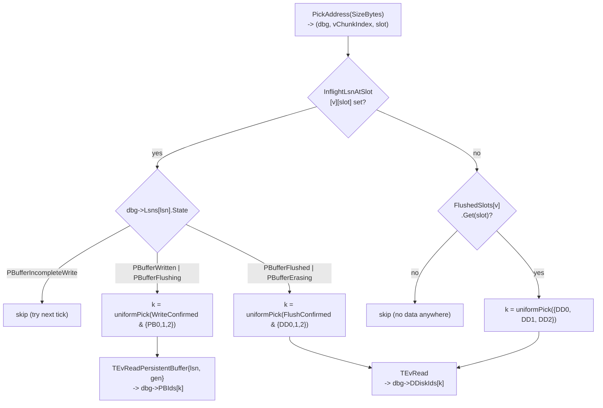
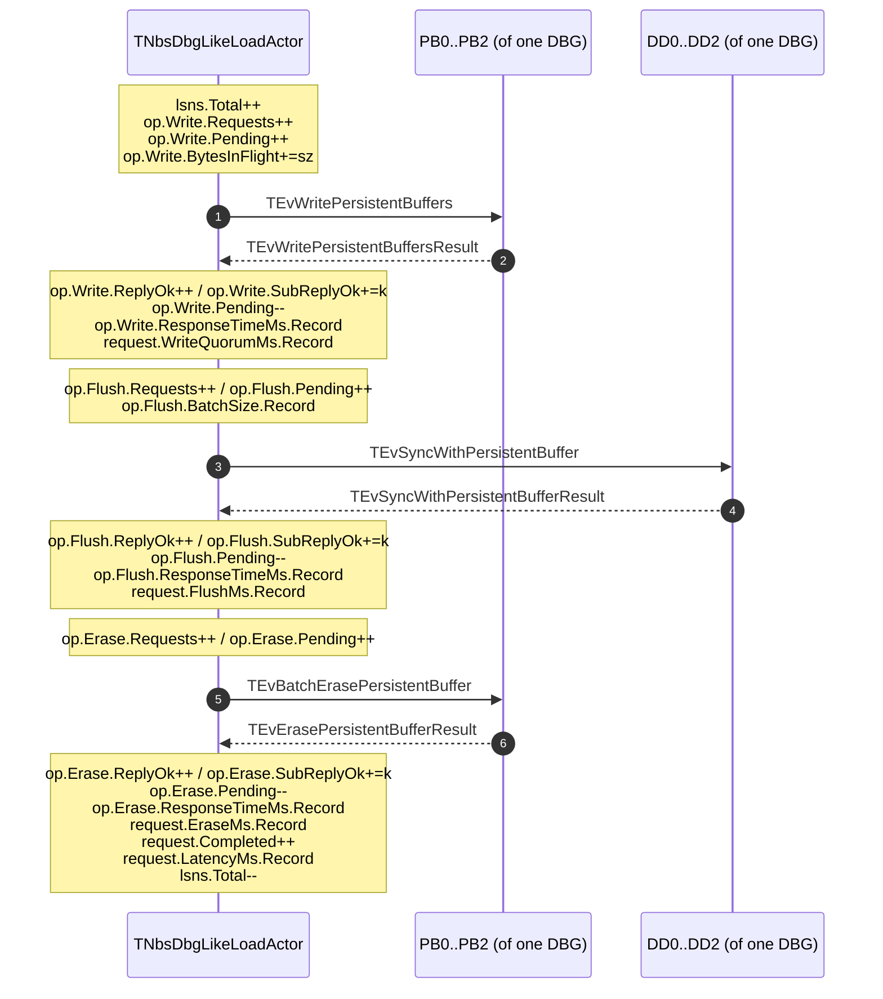
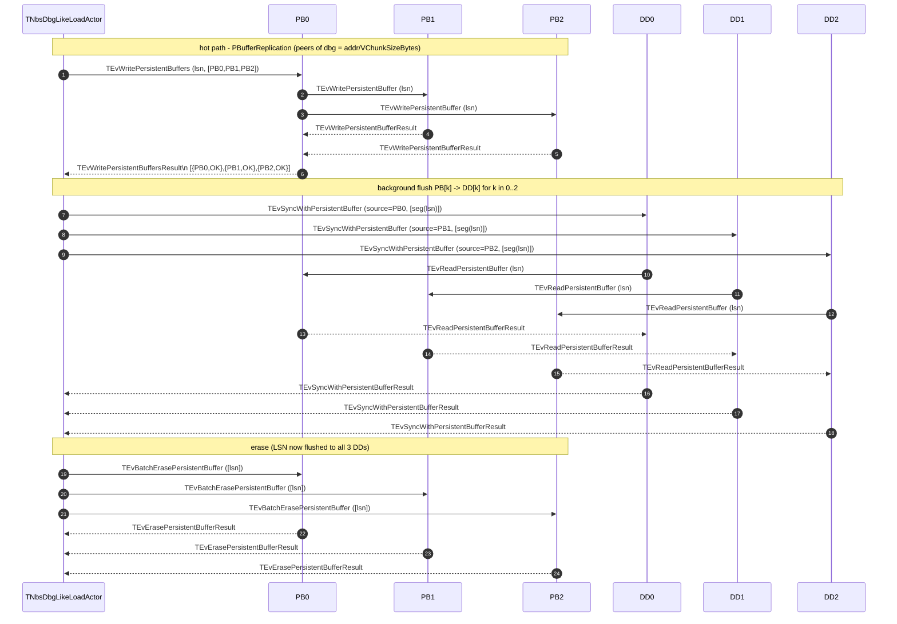

# NBS-DBG-like Load Actor

This is a design / spec note for a **multi-DBG, NBS-DBG-like** load actor that
lives in `ydb/core/load_test`. It mirrors the partition-side hot/cold path
described in [nbs_architecture.md](./01_nbs_architecture.md) §1-§5, but skips
all of the partition machinery that is not needed for a benchmark
(`TFastPathService`, `TRegion`, `TVChunk`, vhost endpoint, `LoadActorAdapter`,
`Oracle`, hand-off, hedging, dirty-map, tablet-local DB persistence).

It is **not** a wrapper around the real partition. It is a stand-alone load
generator that uses the same wire protocol as the partition speaks to PB +
DDisk and the same allocate API the partition uses to talk to BSC.

> **Architecture v2.1 — merged tablet.** The original spec described a single
> `TNbsDbgLikeWorker` that did both the NBS tablet logic (LSN state machine,
> PB / DDisk wire, flush + erase) *and* the load generation (address sampler,
> in-flight budget, pacing, latency measurement). v2 split these into a
> long-lived `TNbsDbgLikeWorker` and a per-Run `TNbsDbgLikeLoadActor`. v2.1
> folds the worker straight into the persistent tablet (the worker actor is
> gone) and keeps only the per-Run load actor:
>
> - `TNbsDbgLikeLoadTablet` (`nbs_dbg_like_load_tablet.{h,cpp}`) — the
>   **NBS tablet logic** (per-LSN state machine, write/flush/erase wire
>   protocol, read routing, peer connect/disconnect, Solomon counters under
>   `load_actor/tag=<tag>/...`) is implemented inline on the persistent
>   tablet itself. Peer pre-connect (`Conn[]`) is the single source of truth
>   for connection guids; once a DBG's 10 peers are connected, its
>   `TPerDbgState` slot is populated and the tablet starts accepting
>   `TEvNbsWrite` / `TEvNbsRead`. There is no separate worker actor.
> - `TNbsDbgLikeLoadActor` (`nbs_dbg_like_load.{h,cpp}`) — the **load
>   generator**: address sampler (`PickAddress`), `MaxInFlight`
>   budget, `ReadRatio` pacing, `Sequential` / random mode,
>   per-Run latency histograms and run-level metrics. It is **per-Run**;
>   spawned by the service actor (`TLoadActor`) via `CreateNbsDbgLikeLoadActor`
>   with the tablet ID from `TNbsDbgLikeLoad.NbsDbgLikeTabletId`. On
>   completion it sends `TEvLoadTestFinished` to the service actor.
>
> The two sides communicate via three minimalistic messages defined in
> [ydb/core/protos/load_test.proto](ydb/core/protos/load_test.proto):
> `TNbsWrite { Address, SizeBytes, PayloadId }` (+ `TRope` payload),
> `TNbsRead { Address, SizeBytes }`, and (tablet self-event /
> pipe-delivered) `TConfigureTablet { … }`. The tablet replies with
> `TNbsWriteResult { Status }` and
> `TNbsReadResult { Status, optional PayloadId }` — rope payloads are
> attached to the actor event and referenced by `PayloadId`, mirroring
> `NDDisk::TWriteInstruction` / `TReadResult`. The load actor times every
> request itself from its own `Send` / receive timestamps. The same three events
> can also be delivered to the tablet over a tablet pipe, which is what
> the unit tests use to drive deterministic per-block payloads through
> the merged-worker path. See §12 for the message catalog and the rest of
> this document for which side owns each piece of state.

> See also [nbs_architecture.md §13](./01_nbs_architecture.md) for the BSC
> allocation pool model and the on-wire shape of
> `TEvControllerAllocateDDiskBlockGroup{,Result}` — this doc reuses that
> machinery without changing it.


## 1. Scope

The actor drives **N DirectBlockGroups** (`NumDirectBlockGroups`, default 1,
production-like value 32). Each DBG = 5 paired
`(DDisk, PersistentBuffer)` slots distributed across 5 BSC fail-domains.
All N DBGs are allocated from BSC in **one** `TEvControllerAllocateDDiskBlockGroup`
round-trip on Bootstrap (one `Query` per DBG) and freed in **one** dealloc
round-trip on shutdown — same shape as a real partition tablet
(`partition_direct_actor.cpp:197-222`).

"5 fail-domains" is the protocol-level unit (`NumFailDomainsPerFailRealm = 5`,
[nbs_architecture.md §13.1](./01_nbs_architecture.md)); how those map to physical
hosts depends on the pool's `DomainLevelEnd`. With the standard
`DomainLevelEnd: 256` config that puts each PDisk in its own fail-domain
([my_cluster_setup.md](./my_cluster_setup.md)), the 5 slots land on 5 distinct
PDisks distributed across however many hosts the pool covers — e.g. on a
3-host × 4-PDisk cluster, BSC's anti-collocation tiebreaker spreads them
roughly 2+2+1 across the hosts. The "3 primary + 2 hand-off" role split (see
[nbs_architecture.md §1](./01_nbs_architecture.md)) is across the same 5
fail-domains; hand-off slots are therefore typically on the same physical
hosts as primaries, just on different PDisks.

The doc says "5 hosts" in a few places below as shorthand for "the 5
fail-domains of one DBG". Read it as fail-domains.

In v1 it implements:

- Hot path: `PBufferReplication` only (one `TEvWritePersistentBuffers` to a
coordinator PB **of the chosen DBG**, fan-out to that DBG's PB0/PB1/PB2).
Quorum = 3 of 5 primary, **per-DBG**.
- Background flush PB[k] -> DDisk[k] for `k in {0,1,2}`, **per DBG**, gated
by `WriteConfirmed.count() >= 3` for that LSN. Same-host pairs always; no
cross-host flush.
- Erase: per-PB `TEvBatchErasePersistentBuffer` for every PB **of the LSN's
DBG** that received the write (3 PBs in steady state), gated by
`SyncRequestsBatchSize`.
- Optional reads (`ReadRatio > 0`) — random-address reads routed to **PB
or DDisk** depending on the per-LSN dirty state at the chosen address
(mirrors `TBlocksDirtyMap::MakeReadHint`,
[nbs_architecture.md §3.5.1](./01_nbs_architecture.md)). Reads never
trigger a flush; they exercise both the PB read path
(`TEvReadPersistentBuffer` against a `WriteConfirmed` PB of the LSN's
DBG) and the DDisk read path (`TEvRead` against a primary DDisk of the
LSN's DBG). See §11 for the full routing rules.
- Address-to-DBG mapping (see §2): the actor exposes a flat user-level
address space of width `NumDirectBlockGroups * TargetNumVChunks * VChunkSizeBytes`; each generated address picks the DBG, `VChunkIndex`, and
in-vChunk offset via integer division / modulo (§2.1).

Out of scope in v1 (see §20):

- Hand-off (HOPBuffer3/4, HODDisk3/4) and write hedging.
- `DirectPBuffersFilling` mode (3 unicast writes from the actor itself).
- Per-vChunk role rotation (always `{PB0,PB1,PB2}` primary; no
`(index + vChunkIndex) % 5` shuffle). Balance comes from the address
sampler across DBGs and across `TargetNumVChunks` (§2.1); the partition's
vChunk rotation is not replicated here.
- `TEvSyncWithDDisk`, `TDDiskDataCopier`, restore
(`RestoreDBGPBuffers`, `TEvReadThenWritePersistentBuffers`),
`PersistentBufferBarriersManager`.
- Service-side DBG registry / start-form dropdown UI: the actor owns its
DBGs.

## 2. Why N DBGs and how addresses map to them

A single DBG is the smallest unit that exercises the full partition protocol —
write quorum is across the 5 hosts of one DBG; flush is from one DBG's PB to
the same DBG's DDisk; erase is per PB of that same DBG. So `NumDirectBlockGroups = 1` is enough to benchmark the protocol end-to-end.

Going beyond one DBG matters because the production partition uses **32
DBGs** (`NumDirectBlockGroups = 32`, `partition_direct_actor.h:51`) and
spreads its workload across them. With one DBG the load actor can only push
the cluster as hard as the 5 fail-domains of *that* DBG can absorb; with N
DBGs it can drive ~N×5 fail-domains, i.e. cover the whole BSC pool.
Important: this is **not** the same as running N parallel actors (one DBG
each) — those would each carry their own LSN counter, separate hot-path
budgets, and N independent `(TabletId, Generation)` keys. One actor with N
DBGs uses **one** LSN counter and **one** `(TabletId, Generation)` (matching
how `TFastPathService` is one-per-volume across all 32 DBGs of that volume),
which is what makes the per-LSN state machine stay simple.

### 2.1 Address space

Each DBG reserves `TargetNumVChunks` vChunks of up to `VChunkSizeBytes`
each (from `TAllocConfig` at tablet Create / actor alloc). The worker exposes
a **flat user-level address space** of width

```text
UserSpaceBytes = M_eff * TargetNumVChunks * VChunkSizeBytes
```

where `**M_eff**` is the number of DBGs this run actually uses: by default
all `**N**` DBGs allocated at Create (`TAllocConfig.NumDirectBlockGroups`),
or the first `**M**` DBGs when `TWorkloadConfig.NumDirectBlockGroupsToUse`
is set to a value in `**[1, N]**` ( `**0` = use all** ).

Every write/read picks an address `addr` in `[0, UserSpaceBytes)`
(sequentially or randomly per `Sequential`) and maps it to a DBG, a
`VChunkIndex`, and an in-vChunk offset:

```text
bytesPerDbg     = TargetNumVChunks * VChunkSizeBytes
dbgIndex        = addr / bytesPerDbg                    // [0, M_eff)
rem             = addr % bytesPerDbg
vChunkIndex     = rem / VChunkSizeBytes                 // [0, TargetNumVChunks)
offsetInVChunk  = rem % VChunkSizeBytes                 // [0, VChunkSizeBytes)
```

The per-run `**ReadWriteSizeKiB**` (`TWorkloadConfig`, KiB) sets the wire
request size `SizeBytes = ReadWriteSizeKiB * 1024` (validated: ≥ 4 KiB,
multiple of 4 KiB, and `SizeBytes <= VChunkSizeBytes`). Random `addr` is
aligned to `SizeBytes` so `TBlockSelector` stays sector-consistent.

This is the stripe that mirrors reserving multiple vChunks per DBG at BSC,
flattened into one linear space the sampler walks.

Each LSN therefore belongs to exactly one DBG, decided at issue time from
the address. All downstream events for that LSN (write reply, flush, erase,
optional read) target peers **of that LSN's DBG** only — no cross-DBG
chatter. Per-DBG state (`TPerDbgState` in §10) holds the LSN map, the
per-coordinator inflight counters, and the 10 connection handles for that
DBG.

### 2.1.1 Who owns what (v2.1 merged tablet)

The flat-address sampler lives entirely on the **load actor**. The
**tablet (merged worker)** sees a flat `Address` + `SizeBytes` on every
`TNbsWrite` / `TNbsRead` and decodes it locally using
`BytesPerDbg = TargetNumVChunks * VChunkSizeBytes`. Both sides therefore
need to agree on `VChunkSizeBytes`, `TargetNumVChunks`, and the effective
DBG count `M_eff`: the alloc-shape values come from `TAllocConfig`
(preserved across Runs); `M_eff` and the per-Run `IoSizeBytes` are
installed on the tablet via `TConfigureTablet` (a self-event the tablet
sends itself at the start of every `Run`, also addressable over a tablet
pipe, see §3 and §23.5).

| Concern                              | Owner       |
| ------------------------------------ | ----------- |
| `PickAddress`, `Sequential`, `Rng`, `NextAddress`         | load actor  |
| `M_eff` (`NumDirectBlockGroupsToUse` slice)               | load actor *and* tablet (tablet needs it to validate addresses) |
| Address-to-`(dbg, vChunk, offset)` decoding               | tablet (merged worker) |
| LSN allocation, `Lsns` map, flush + erase loop            | tablet (merged worker) |
| Read routing (PB vs DDisk)                                | tablet (merged worker) |
| In-flight tracking for back-pressure (`MaxInFlight`) | load actor  |
| LSN-level back-pressure (`MaxInflightLsns`)               | tablet (merged worker) |
| Latency timestamps (start/finish)                         | load actor (tablet reply carries `Status` only) |
| Per-stage histograms (`WriteQuorumMs`, `FlushMs`, `EraseMs`) | tablet (merged worker, Solomon) |
| Per-Run aggregates (Writes/Reads issued/ok, bytes, p50/p99) | load actor |

### 2.2 What is shared vs per-DBG


| Resource                             | Scope                          | Why                                                                                                                                           |
| ------------------------------------ | ------------------------------ | --------------------------------------------------------------------------------------------------------------------------------------------- |
| `(TabletId, Generation)` credentials | actor-wide                     | Single key for BSC + connect handshake; matches how a partition tablet uses one tablet id across all 32 DBGs.                                 |
| `SequenceGenerator` (LSN counter)    | actor-wide                     | Mirrors `TFastPathService::SequenceGenerator` (`fast_path_service.cpp:308-311`). LSNs are globally unique within the actor, even across DBGs. |
| `MaxInFlight` budget              | actor-wide                     | One global cap on outstanding writes + reads. Per-DBG inflight is a derived gauge.                                               |
| `MaxInflightLsns` budget             | actor-wide                     | Caps total LSNs across all DBGs in the actor's memory.                                                                                        |
| `Lsns` map                           | per-DBG (`TPerDbgState::Lsns`) | Mirrors per-vChunk dirty map (`TVChunk::BlocksDirtyMap`).                                                                                     |
| `ReadyToErase` set                   | per-DBG                        | Same.                                                                                                                                         |
| `InFlightTo[PB[k]]` counters         | per-DBG                        | Coordinator round-robin is per-DBG.                                                                                                           |
| Last-reported `FreeSpace` per PB     | per-DBG                        | Monitoring metric; averaged per DBG, then min/max across DBGs in §14.                                                                        |
| 10 wire connections (5 PB + 5 DD)    | per-DBG                        | Each DBG has its own peers from BSC.                                                                                                          |


Multiple parallel **runs** (Service-level) = multiple `TabletId`s, each
covering its own N DBGs.

## 3. Inputs (proto)

New `TEvLoadTestRequest.TNbsDbgLikeLoad` in
[ydb/core/protos/load_test.proto](ydb/core/protos/load_test.proto).

The implemented proto splits the §3 schema into three nested messages
(plus the `TNbs{Write,Read}{,Result}` worker contract):

- `TAllocConfig` — alloc-shape fields persisted by the tablet at Create
time (`TabletId`, `DDiskPoolName`, `PersistentBufferDDiskPoolName`,
`NumDirectBlockGroups`, `TargetNumVChunks`,
`VChunkSizeBytes`, `TabletStoragePools`, `HostsPerDbg`). The tablet
reads it from `TEvNbsLoadTabletAllocateGroups.AllocConfig`.
- `TConfigureTablet` — **worker-only knobs**, sent by the parent tablet
to the long-lived worker at the start of every Run: `MaxInflightLsns`,
`FlushBatchSize`, `EraseBatchSize`, `SyncRequestsBatchSize`,
`PBufferReplyTimeoutMicroseconds`,
`NumDirectBlockGroupsToUse` (so the worker can
validate that incoming `TNbsWrite.Address` is in range for the active
DBG slice), and `IoSizeBytes` (the per-Run I/O size; the worker rejects
mismatched `TNbsWrite.SizeBytes`).
- `TWorkloadConfig` — **load-actor-only knobs**, delivered to the load
actor via `TNbsDbgLikeLoad.WorkloadConfig` when the service actor starts
the actor: `Tag`, `DurationSeconds`, `DelayBeforeMeasurementsSeconds`,
`NumDirectBlockGroupsToUse`, `ReadWriteSizeKiB`, `MaxInFlight`,
`ReadRatio`, `Sequential`. It also carries `TabletConfig TConfigureTablet`
so a single run request can deliver both halves; the load actor forwards
`TabletConfig` to the tablet via `TEvConfigureTablet` at Bootstrap.

The §3 listing below shows the flat union of fields for readability; the
proto layout in the tree is the split form above.

```proto
message TNbsDbgLikeLoad {
    optional uint64 Tag = 1;
    optional uint32 DurationSeconds = 2;
    optional uint32 DelayBeforeMeasurementsSeconds = 3 [default = 15];

    // ---- Credentials ------------------------------------------------------
    // TabletId is the credential the PB / DDisk actors validate on every
    // request (see TQueryCredentials, blobstorage/ddisk/ddisk.h:47-79).
    // Defaults to Tag so each load run picks a unique TabletId and DBGs
    // from different runs do not collide at BSC.
    // Generation is bumped by a real partition tablet on every restart;
    // the load actor never restarts, so 1 is fine. Bump it manually only
    // if you want to reuse a leaked TabletId after a previous crash.
    optional uint64 TabletId = 4;
    optional uint32 Generation = 5 [default = 1];

    // ---- Group identification (BSC pool names + DBG ids) ------------------
    // The actor sends TEvControllerAllocateDDiskBlockGroup on Bootstrap with
    // NumDirectBlockGroups Queries and uses the 5 (DDiskId,
    // PersistentBufferDDiskId) pairs of every Response[i] from the response.
    // No DDiskId / PBId fields here -- BSC is the only source of host ids.
    optional string DDiskPoolName = 6 [default = "ddp1"];
    optional string PersistentBufferDDiskPoolName = 7 [default = "ddp1"];

    // NumDirectBlockGroups -- number of DBGs this actor owns. The actor
    // allocates DBG ids in the contiguous range
    // [0; NumDirectBlockGroups)
    // from BSC under the same TabletId in a SINGLE
    // TEvControllerAllocateDDiskBlockGroup with NumDirectBlockGroups Queries
    // (matches partition_direct_actor.cpp:201-219). Default 1 = legacy
    // single-DBG behaviour. Production-like value is 32, which matches
    // NumDirectBlockGroups in partition_direct_actor.h:51. Each DBG opens
    // 10 wire connections (5 PB + 5 DDisk), so total connections =
    // 10 * NumDirectBlockGroups.
    optional uint32 NumDirectBlockGroups = 22 [default = 1];

    // TargetNumVChunks is the per-DDisk capacity reservation (in vChunks)
    // that BSC bookkeeps in the pool. The partition sets it to
    // ceil(volumeSize / RegionSize=4GiB) (partition_direct_actor.cpp:215-219).
    // It bounds VChunkIndex: writing to VChunkIndex >= TargetNumVChunks on
    // a given DDisk will fail. The worker's flat address space includes all
    // vChunks 0..TargetNumVChunks-1 per DBG (see §2.1). The same value is used
    // for every Query in the multi-DBG allocate request.
    optional uint32 TargetNumVChunks = 9 [default = 1];

    // ---- vChunk addressing ------------------------------------------------
    // VChunkIndex selects which vChunk inside EACH DBG to write to (the
    // wire-level TBlockSelector.VChunkIndex field, blobstorage/ddisk/ddisk.h:81-109).
    // The DDisk lazily allocates one PDisk chunk per (TabletId, VChunkIndex)
    // (ddisk_actor_chunks.cpp:9-12) and routes all writes for that pair into
    // that single physical chunk. v1 uses the same VChunkIndex on every DBG
    // (independent VSlots per DBG, so no collision).
    optional uint64 VChunkIndex = 11 [default = 0];

    // VChunkSizeBytes is the upper bound on the in-vChunk offset the actor
    // generates. With NumDirectBlockGroups DBGs and TargetNumVChunks vChunks
    // per DBG, the user-level address space is
    // NumDirectBlockGroups * TargetNumVChunks * VChunkSizeBytes wide; see §2.1.
    // VChunkSizeBytes MUST match (or be a divisor of) the cluster's actual
    // PDisk chunk size: the DDisk reads ChunkSize = DiskFormat->ChunkSize
    // at boot (ddisk_actor_persistent_buffer.cpp:30) and writes past that
    // fail. 128 MiB is the in-tree default (DefaultVChunkSize,
    // constants.h:30) and the value used by all existing DDisk tests
    // (device_test_tool_ddisk_test.h:279).
    optional uint64 VChunkSizeBytes = 12 [default = 134217728]; // 128 MiB

    // false = random addresses within NumDirectBlockGroups *
    // TargetNumVChunks * VChunkSizeBytes (more realistic, naturally spreads
    // load across all DBGs and vChunks);
    // true  = sequential round-robin over the same flat space (easier to
    // reason about latencies; the round-robin walks DBGs interleaved
    // because consecutive addresses fall into the same DBG only until
    // VChunkSizeBytes is hit, then wrap to the next DBG).
    // The PB itself is keyed by LSN, not offset, so this only affects how
    // writes lay out on the destination DDisks after flush.
    optional bool   Sequential = 13 [default = false];

    // ---- Workload ---------------------------------------------------------
    // NumDirectBlockGroupsToUse: 0 = all N DBGs from alloc; else use first M (1..N).
    optional uint32 NumDirectBlockGroupsToUse = 4 [default = 0];

    // ReadWriteSizeKiB: KiB; read/write payload. Must be >= 4, multiple of 4,
    // and ReadWriteSizeKiB * 1024 <= VChunkSizeBytes.
    optional uint32 ReadWriteSizeKiB = 14 [default = 4];

    // MaxInFlight caps concurrent in-flight writes + reads across ALL
    // DBGs (global cap). For multi-DBG runs you typically want this to
    // scale with NumDirectBlockGroups so each DBG has comparable
    // per-DBG inflight to the single-DBG case.
    optional uint32 MaxInFlight = 15;

    // MaxInflightLsns caps the total size of all per-DBG Lsns maps
    // (sum across DBGs). An LSN sits in its DBG's map from "write sent"
    // through "all 3 erases acked", which is much longer than the write
    // RTT (it includes flush + erase). When this cap is hit, the actor
    // stops issuing new writes (back-pressure) until something reaches
    // PBufferErased and is dropped. Default 4096 = ~16 MiB of state at
    // ~4 KiB per LSN tracker; raise it for high NumDirectBlockGroups so
    // every DBG can hold its own steady-state window.
    optional uint32 MaxInflightLsns = 16 [default = 4096];

    // Deprecated for TNbsDbgLikeLoadTablet: erase now fires on SyncRequestsBatchSize gate alone.
    optional uint32 FillRatio = 17 [default = 50];   // retained for wire compatibility
    optional uint32 ReadRatio = 18 [default = 0];    // % reads relative to writes

    // SyncRequestsBatchSize mirrors the partition's
    // TStorageConfig::SyncRequestsBatchSize
    // (nbs/cloud/blockstore/config/config.cpp:30, default 10). It is the
    // per-DBG ready-queue MINIMUM: DoFlush / DoErase early-return on a DBG
    // until that DBG's ready queue (StateCount[PBufferWritten] for flush,
    // ReadyToErase.size() for erase) reaches this value. This reproduces the
    // partition's bursty steady state (up to SyncRequestsBatchSize-1 LSNs can
    // sit unflushed/unerased in PB on a quiet DBG; see nbs_architecture.md
    // §5.0). Bypassed during drain so the shutdown sweep can still finalize.
    // Set to 1 to disable the gate entirely (every reply triggers
    // flush/erase). See §8 / §9 for how the gate composes with the per-
    // destination batch caps below.
    optional uint32 SyncRequestsBatchSize = 23 [default = 10];

    // FlushBatchSize / EraseBatchSize are per-destination caps applied AFTER
    // the SyncRequestsBatchSize gate above. They are NOT partition-derived
    // (the real partition has no per-destination cap -- see
    // dirty_map.cpp:375-385, 407-411): arbitrary trade-offs where bigger
    // batch = fewer round-trips but higher per-LSN tail latency, smaller
    // batch = lower latency, more ops. 1 / 1 gives the most "partition-like"
    // per-call behaviour (no synthetic batching).
    optional uint32 FlushBatchSize = 19 [default = 16];
    optional uint32 EraseBatchSize = 20 [default = 32];

    // PBufferReplyTimeoutMicroseconds is forwarded onto the wire
    // (TEvWritePersistentBuffers.ReplyTimeoutMicroseconds in
    // protos/blobstorage_ddisk.proto:182,191). Microseconds is dictated by
    // the wire field, not a free choice. Default 50000 us = 50 ms matches
    // the partition's DefaultPBufferReplyTimeout
    // (nbs/cloud/blockstore/config/config.cpp:13). Tune up for slow disks.
    optional uint32 PBufferReplyTimeoutMicroseconds = 21 [default = 50000];
}
```

Conscious omissions vs the existing per-PB / per-DDisk load actors:

- No `DDiskId` / `PBId` fields. They come from BSC via the alloc round-trip
(§5), one set per DBG.
- No write-mode selector — only `PBufferReplication` is implemented in v1.
- No hand-off / hedging knobs.
- No `Hosts[5*N]` manual override; the BSC alloc round-trip is the only
path.
- No per-DBG override of `ReadWriteSizeKiB` / `ReadRatio` — every
DBG gets the same workload-shaping config; per-DBG load divergence is a
property of the address sampler (§7), not of separate config blobs.

## 4. Lifecycle

The end-to-end Create / Run / Delete lifecycle for the tablet variant is in
§23.5.1. v2.1 collapses the worker into the tablet, so the only per-Run
actor is `TNbsDbgLikeLoadActor`.

**Tablet (`TNbsDbgLikeLoadTablet`) — long-lived, hosts the merged worker logic:**

1. **Boot**: KV-flat base loads `Dbgs[]` from local DB, tablet kicks off
   peer pre-connect (§23.4.1). As each DBG's 10 peers (5 PB + 5 DD) become
   `Connected` the tablet populates that DBG's `TPerDbgState` slot
   (`DDGuid`, `PBGuid`, `DDiskActor`, `PBActor`, `PbIndexById`, slot
   tracking vectors).
2. **Idle (`Phase = Ready`)**: no load running ⇒ no LSNs ⇒ no PB / DDisk
   traffic; the tablet still keeps connections alive across Runs.
3. **Configured**: on every `TConfigureTablet` (a self-event the tablet
   posts to itself at the start of every Run, also addressable over a
   tablet pipe) it first does a best-effort sweep of any residual LSNs
   left over from a prior Run, then updates `MaxInflightLsns`,
   `FlushBatchSize`, `EraseBatchSize`, `SyncRequestsBatchSize`,
   `PBufferReplyTimeoutMicroseconds`,
   `NumDirectBlockGroupsToUse`, `IoSizeBytes`.
4. **Running (`Phase = WorkerRunning`)**: handles `TNbsWrite` /
   `TNbsRead` from the load actor (or from a tablet-pipe client; tests
   drive deterministic per-block payloads this way). Each write goes
   through `WriteQuorum → Flush → Erase`; the load actor sees only the
   `TNbsWriteResult` at write-quorum.
5. **Shutdown**: on `TxClearAll` (Delete) or `PassAway`, the tablet
   disconnects every peer and tears down its KV-flat base.

**Load actor (`TNbsDbgLikeLoadActor`) — per-Run:**

1. **Bootstrap**: spawned by the service actor (`TLoadActor`) via
   `CreateNbsDbgLikeLoadActor(cmd, parent, counters, tag)`. Opens a
   tablet pipe to `NbsDbgLikeTabletId`, sends `TEvNbsLoadTabletGetSummary`
   to learn `NumDirectBlockGroups` / `VChunkSizeBytes` / `TargetNumVChunks`,
   forwards `TWorkloadConfig.TabletConfig` to the tablet as
   `TEvConfigureTablet`, then validates `ReadWriteSizeKiB` and schedules
   a `TEvPoisonPill` at `DurationSeconds`, starts emitting `TNbsWrite` /
   `TNbsRead`.
2. **Run**: maintains the `MaxInFlight` budget,
   picks addresses via `PickAddress`, sends `TNbsWrite { addr, size,
   PayloadId }` with a per-write `TRope` payload to the tablet, records
   `now - SentAt` on the reply.
3. **Drain**: on `TEvPoisonPill` clears its in-flight cap, waits for
   outstanding `TNbs*Result` events, then sends `TEvLoadTestFinished`
   (§15) to the parent service actor and `PassAway`s.

## 5. BSC allocation — what the actor sends and what it gets back

Identical wire shape to the partition's allocation request
(`partition_direct_actor.cpp:197-222`,
`partition_direct_actor.cpp:278-321`), with
`Queries.size() == NumDirectBlockGroups`:

```cpp
auto request = std::make_unique<
    TEvBlobStorage::TEvControllerAllocateDDiskBlockGroup>();
request->Record.SetDDiskPoolName(cmd.GetDDiskPoolName());
request->Record.SetPersistentBufferDDiskPoolName(
    cmd.GetPersistentBufferDDiskPoolName());
request->Record.SetTabletId(TabletId);              // TabletId = Tag

for (ui32 i = 0; i < NumDirectBlockGroups; ++i) {
    auto* q = request->Record.AddQueries();
    q->SetDirectBlockGroupId(i);
    q->SetTargetNumVChunks(TargetNumVChunks);             // typically 1
}

NTabletPipe::SendData(ctx, BscPipe, request.release());
```

The BSC reply matches `nbs_architecture.md §13.4`:

```cpp
const auto& responses = msg->Record.GetResponses();
Y_ABORT_UNLESS(responses.size() == NumDirectBlockGroups);
Dbgs.resize(NumDirectBlockGroups);
for (ui32 i = 0; i < NumDirectBlockGroups; ++i) {
    auto& dbg = Dbgs[i];
    dbg.DbgIndex          = i;
    dbg.DirectBlockGroupId = i;
    Y_ABORT_UNLESS(responses[i].NodesSize() == 5);
    for (size_t k = 0; k < 5; ++k) {
        dbg.DDiskIds[k] = responses[i].GetNodes(k).GetDDiskId();
        dbg.PBIds[k]    = responses[i].GetNodes(k).GetPersistentBufferDDiskId();
    }
}
```

Reference points:

- BSC pool selection / per-role pool resolution and the per-index PB-DDisk
co-location: `nbs_architecture.md §13.1-§13.3`,
[ydb/core/mind/bscontroller/ddisk.cpp](ydb/core/mind/bscontroller/ddisk.cpp)
lines 244-253 (pool name lookup), 444-451 (PB co-located with DDisk[k]).
- Reply consumption pattern in the partition (32-query form, our N-query
form is identical):
[ydb/core/nbs/cloud/blockstore/libs/storage/partition_direct/partition_direct_actor.cpp](ydb/core/nbs/cloud/blockstore/libs/storage/partition_direct/partition_direct_actor.cpp)
lines 278-321.
- Test-side example (1 query):
[ydb/core/blobstorage/ut_blobstorage/ddisk.cpp](ydb/core/blobstorage/ut_blobstorage/ddisk.cpp)
lines 67-84.

The actor stores the `10 * NumDirectBlockGroups` ids only in process
memory. There is no tablet-local DB persistence — on actor restart the run
starts from scratch.

BSC capacity: a single allocate request consumes
`NumDirectBlockGroups` slots out of the pool's `NumDDiskGroups` budget.
The pool must be sized accordingly (typical: pool `NumDDiskGroups >= NumDirectBlockGroups`). On a too-small pool BSC fails the request with
`ErrorReason` set per response.

## 6. Group identity and idempotency

`(TabletId, DirectBlockGroupId)` is the key in
`Schema::DirectBlockGroupClaims`. The actor uses
`(TabletId,  i)` for `i in [0, NumDirectBlockGroups)`.
Re-issuing the same allocate with the same set of keys returns the same
`10 * NumDirectBlockGroups` ids (idempotent — `mind/bscontroller/ddisk.cpp:294-302`
prefetches each row and reuses it).

In normal operation the actor allocates once and frees once. The idempotency
is a safety net only — e.g. if the BSC pipe drops mid-allocate and the actor
retries the whole batch, BSC returns the same ids for every Query.

## 7. Hot path — write (PBufferReplication only, v1)

Per `nbs_architecture.md §3.2` / §3.3.

In v2 the hot path is split between the two actors:

- **Load actor** picks an address in the flat user-level space (§2.1) and
  sends a single `TNbsWrite { Address, SizeBytes }` to the worker; the
  load actor stamps `SentAt = Now()` into its own in-flight map (keyed
  by `Cookie`) and tracks in-flight count against the `MaxInFlight` cap.
- **Worker** decodes the address into `(dbgIndex, vChunkIndex, offset)`,
  allocates an LSN, sends `TEvWritePersistentBuffers` to the chosen
  coordinator PB of that DBG, and on quorum (success or failure) emits
  exactly one `TNbsWriteResult { Status }` back to the load actor.
  Flush + erase run asynchronously in the worker after the load actor
  has already been told "write done".

The pseudocode below is the worker's side (one address per `TNbsWrite`):

```text
// === Load actor side ===========================================
PickAddress(SizeBytes):
    // M_eff = Dbgs.size() (after optional NumDirectBlockGroupsToUse slicing; default N).
    UserSpaceBytes = M_eff * TargetNumVChunks * VChunkSizeBytes
    if Sequential:
        addr = NextAddress; NextAddress = (NextAddress + SizeBytes) % UserSpaceBytes
    else:
        addr = uniformRandom aligned to SizeBytes in [0, UserSpaceBytes - SizeBytes]
    return addr

SendNext():                              // load actor
    SizeBytes = ReadWriteSizeKiB * 1024     // KiB from TWorkloadConfig; validated
    while WriteInFlight + ReadInFlight < MaxInFlight:
        addr = PickAddress(SizeBytes)
        cookie = ++NextWriteCookie
        Inflight[cookie] = {Address=addr, SizeBytes, SentAt=Now()}
        Send(WorkerActorId, TNbsWrite{Address=addr, SizeBytes}, cookie)
        ++WriteInFlight

// === Worker side ===============================================
HandleNbsWrite(msg, sender, cookie):
    SizeBytes = msg.SizeBytes
    bytesPerDbg = TargetNumVChunks * VChunkSizeBytes
    dbgIndex = msg.Address / bytesPerDbg
    rem = msg.Address % bytesPerDbg
    vChunkIndex = rem / VChunkSizeBytes
    offsetInVChunk = rem % VChunkSizeBytes
    // clamp if offsetInVChunk + SizeBytes > VChunkSizeBytes (edge cases)
    // back-pressure on the worker's own LSN map (MaxInflightLsns):
    if TotalLsns() >= MaxInflightLsns:
        reply TNbsWriteResult{Status=BUSY} to sender, cookie
        return
    dbg            = &Dbgs[dbgIndex]
    lsn            = ++SequenceGenerator                // global
    coordK         = chooseCoordinator(dbg)             // 0,1 or 2
    coordPB        = dbg->PBIds[coordK]
    dbg->Lsns[lsn] = TWriteInfo{
                         .Lsn=lsn, .Size=SizeBytes,
                         .VChunkIndex=vChunkIndex,
                         .OffsetInVChunk=offsetInVChunk,
                         .WriteStart=Now(),
                         .WriteRequested={PB0,PB1,PB2},
                         .Origin={sender, cookie},     // <-- where to reply
                     }
    dbg->InflightLsnAtSlot[vChunkIndex][offsetInVChunk / SizeBytes] = lsn   // §11.3
    send TEvWritePersistentBuffers{
             creds{TabletId, Generation, DDiskInstanceGuid=dbg->PBGuid[coordK]},
             BlockSelector{vChunkIndex, offsetInVChunk, SizeBytes},
             lsn,
             PersistentBufferIds=[dbg->PBIds[0..2]],
             ReplyTimeoutMicroseconds=PBufferReplyTimeoutMicroseconds,
             payload=GetPayload(TNbsWrite.PayloadId)
         }
        -> coordPB
    ++dbg->WritesInFlight
    ++dbg->InFlightTo[coordK]
```

`TotalLsns()` is `sum(dbg.Lsns.size() for dbg in Dbgs)` — `MaxInflightLsns`
is a global cap (§3 / §2.2). For multi-DBG the natural per-DBG share is
`MaxInflightLsns / NumDirectBlockGroups`, but the global form lets a quiet
DBG temporarily lend its share to a busy one.

`chooseCoordinator(dbg)` in v1 is a per-DBG helper:

```text
// Round-robin among that DBG's PB0/PB1/PB2 with a min(in-flight) tie-break.
return argmin(k in {0,1,2} : dbg.InFlightTo[k])
```

This is a stripped-down per-DBG `Oracle.SelectBestPBufferHost`
(`partition_direct/model/oracle.cpp:144-160`; the production Oracle is
also per-DBG, see `nbs_architecture.md §13.7`); a full Oracle (host stats,
window scoring) is out of scope for v1.

```text
OnWritePersistentBuffersResult(msg, lsn, dbgIndex):       // worker
    dbg = &Dbgs[dbgIndex]
    info = dbg->Lsns[lsn]
    for each subResult in msg.Results:
        // subResult.PersistentBufferId points back to one of dbg->PBIds[0..2]
        info.WriteConfirmed[locationOf(subResult.PersistentBufferId, dbg)]
            = (subResult.Status == OK)
    quorumOk = (info.WriteConfirmed.count() >= 3)
    if quorumOk:
        info.State = PBufferWritten
    // reply the load actor now — flush/erase happen asynchronously after this.
    send TNbsWriteResult{Status = quorumOk ? OK : ERROR}
        -> info.Origin.Actor with info.Origin.Cookie
    --dbg->WritesInFlight
    --dbg->InFlightTo[coordKOf(msg)]
    DoFlush(dbg); DoErase(dbg)
```

The `(lsn, dbgIndex)` tuple is the key the worker's `OnWritePersistentBuffers
Result` handler needs to look the entry up. It is carried via the
`TEvWritePersistentBuffers` event's `Cookie` field (no proto changes needed):
`Cookie = (lsn << 16) | dbgIndex` (16 bits is enough for
`NumDirectBlockGroups <= 32` with plenty of head-room). The `Origin` field
of `TWriteInfo` (the load actor's `TActorId` + its own write cookie) is
the *separate* hand-back path used for emitting `TNbsWriteResult`.

Quorum policy in v1: `>= 3 of 3 primary` (no hand-off), **per-DBG**. If
any of the 3 primaries of that DBG fails, the LSN is dropped from
`dbg->Lsns` (counted as a write failure) and never enters the flush/erase
pipeline; the other DBGs are unaffected. v2 (§20) introduces hand-off.

## 8. Cold path — flush (PB[k] -> DDisk[k])

Per `nbs_architecture.md §4.1` / §5.2. Runs **per-DBG**: `DoFlush(dbg)` is
called from `OnWritePersistentBuffersResult` / `OnSyncWithPersistentBufferResult`
on a single DBG, not as a global sweep.

```text
DoFlush(dbg):
    // SyncRequestsBatchSize gate (mirrors the partition's MakeFlushHint
    // early-return, dirty_map.cpp:381-383). Per DBG, count of LSNs in
    // PBufferWritten state plays the role of the partition's
    // ReadyToFlush.size(). Bypassed during drain so the shutdown sweep can
    // finalize. PHASE_DONE early-returns at the very top (omitted here).
    if Phase == Running
       and dbg->StateCount[PBufferWritten] < SyncRequestsBatchSize:
        return
    pendingByDest[DD0..2] = {}                       // dbg-local
    for lsn, info in dbg->Lsns:
        if info.State != PBufferWritten: continue
        for k in {0, 1, 2}:
            if info.WriteConfirmed[PB[k]]
                and not info.FlushRequested[DD[k]]
                and pendingByDest[DD[k]].size() < FlushBatchSize:
                info.FlushDesired[DD[k]]   = true
                info.FlushRequested[DD[k]] = true
                pendingByDest[DD[k]].push_back(
                    Segment{
                        BlockSelector{VChunkIndex, info.OffsetInVChunk, info.Size},
                        lsn, generation })
    for k in {0, 1, 2}:
        if pendingByDest[DD[k]].empty(): continue
        send TEvSyncWithPersistentBuffer{
                 creds {TabletId, Generation,
                        DDiskInstanceGuid=dbg->DDGuid[k]},
                 DDiskId=dbg->PBIds[k],          // source PB on same host
                 segments=pendingByDest[DD[k]],
                 cookie = dbgIndex                // for the result handler
             }
            -> dbg->DDiskIds[k]
        for seg in pendingByDest[DD[k]]:
            dbg->Lsns[seg.lsn].State = PBufferFlushing
```

Source/destination always co-located on the same host (BSC arranged it via
the per-index pairing rule, `mind/bscontroller/ddisk.cpp:444-451` —
`PB[k]` lands on `DDisk[k]`'s node when possible). With multi-DBG this
holds **per DBG** (each DBG was allocated independently with the same
co-location rule), so flushes still stay local-interconnect.

```text
OnSyncWithPersistentBufferResult(msg, dbgIndex):
    dbg = &Dbgs[dbgIndex]                             // recovered from Cookie
    for each segmentResult in msg.SegmentResults:
        info = dbg->Lsns[seg.lsn]
        info.FlushConfirmed[DD[k]] = (segmentResult.Status == OK)
    for lsn in msg.SegmentResults.lsns:
        info = dbg->Lsns[lsn]
        if info.FlushConfirmed == info.FlushDesired:
            info.State = PBufferFlushed
            dbg->ReadyToErase.insert(lsn)
            dbg->FlushedSlots[info.VChunkIndex].Set(
                info.OffsetInVChunk / info.Size)              // §11.3
    DoFlush(dbg); DoErase(dbg)
```

If a per-segment flush failed, the LSN's `FlushRequested[DD[k]]` is cleared
and the LSN is re-queued for retry on the next `DoFlush(dbg)` tick — same
behaviour as
[partition_direct/dirty_map/inflight_info.cpp:177-186](ydb/core/nbs/cloud/blockstore/libs/storage/partition_direct/dirty_map/inflight_info.cpp).

## 9. Cold path — erase

Per `nbs_architecture.md §5.3`. Runs **per-DBG**.

```text
DoErase(dbg):
    // SyncRequestsBatchSize gate (mirrors the partition's MakeEraseHint
    // early-return, dirty_map.cpp:433-435). Bypassed during drain so the
    // shutdown sweep can finalize. PHASE_DONE early-returns at the top.
    if Phase == Running
       and dbg->ReadyToErase.size() < SyncRequestsBatchSize:
        return
    pendingByPB[PB0..2] = {}                               // dbg-local
    for lsn in dbg->ReadyToErase:
        info = dbg->Lsns[lsn]
        for k in {0, 1, 2}:
            if info.WriteConfirmed[PB[k]]
                and not info.EraseRequested[PB[k]]
                and pendingByPB[PB[k]].size() < EraseBatchSize:
                info.EraseRequested[PB[k]] = true
                pendingByPB[PB[k]].push_back({lsn, generation})
        if info.EraseRequested.subsetOf(info.WriteConfirmed):
            info.State = PBufferErasing
    for k in {0, 1, 2}:
        if pendingByPB[PB[k]].empty(): continue
        send TEvBatchErasePersistentBuffer{
                 creds, erases = pendingByPB[PB[k]],
                 cookie = dbgIndex }
            -> dbg->PBIds[k]
```

Erase is per-PB and **not replicated** (each PB independently zeros its
sector header on its local PDisk —
`ddisk_actor_persistent_buffer.cpp:884-941`).

```text
OnErasePersistentBufferResult(msg, dbgIndex, batchCookie):
    dbg = &Dbgs[dbgIndex]
    for (lsn, status) in batch:
        if status == OK: dbg->Lsns[lsn].EraseConfirmed[PB[k]] = true
        else:            dbg->Lsns[lsn].EraseRequested[PB[k]] = false  // retry
    for lsn in batch:
        info = dbg->Lsns[lsn]
        if info.EraseConfirmed == info.EraseRequested:
            info.State = PBufferErased
            slot = info.OffsetInVChunk / info.Size
            v    = info.VChunkIndex
            // CAS-erase: drop only if no newer write took over the slot. §11.3
            auto it = dbg->InflightLsnAtSlot[v].find(slot)
            if it != end and it->second == lsn:
                dbg->InflightLsnAtSlot[v].erase(it)
            dbg->Lsns.erase(lsn)
            dbg->ReadyToErase.erase(lsn)
            // FlushedSlots[v].Set(slot) was set in §8 and is NOT cleared
            // here — the on-DDisk copy survives PB erase, so DDisk reads
            // of this slot remain valid forever (§11.1).
```

A failed PB erase clears its bit and re-queues the LSN for retry on the next
`DoErase(dbg)` tick — same as
[ydb/core/nbs/cloud/blockstore/libs/storage/partition_direct/dirty_map/dirty_map.cpp](ydb/core/nbs/cloud/blockstore/libs/storage/partition_direct/dirty_map/dirty_map.cpp)
lines 467-492.

`SyncRequestsBatchSize` gates **batching density** per DBG (same value
governs flush in §8 and erase here). With the default `10`, up to 9
PBufferWritten LSNs may sit unflushed on a quiet DBG until either more
writes arrive (which re-triggers `DoFlush`) or drain bypasses the gate;
likewise up to 9 ReadyToErase LSNs may sit untouched. This is the load-
actor analogue of the partition's bursty steady state described in
[nbs_architecture.md §5.0](./01_nbs_architecture.md). Set to `1` to disable
the gate (every reply triggers flush/erase — useful when you want to
isolate latency contributions of individual events). Note: when the
write rate stops, parked LSNs only resume on drain; this is consistent
with partition behaviour at restart, see [§9 of nbs_architecture.md](./01_nbs_architecture.md).

## 10. Per-LSN state machine and per-DBG state container

`TWriteInfo` is a flat in-actor record (no `TVChunk` grouping). It lives
in the **per-DBG** `Lsns` map; an LSN has one `TWriteInfo` in exactly
one DBG (the one its address mapped to in §7).

```cpp
enum class ELocation : uint8_t {
    PB0=0, PB1=1, PB2=2, PB3=3, PB4=4,
    DD0=0, DD1=1, DD2=2, DD3=3, DD4=4    // separate masks; same indexing
};

enum class EState {
    PBufferIncompleteWrite,  // < 3 confirmations so far
    PBufferWritten,          // >= 3 confirmations, eligible for flush
    PBufferFlushing,
    PBufferFlushed,          // FlushConfirmed == FlushDesired; ready to erase
    PBufferErasing,
    PBufferErased,           // dropped from dbg->Lsns
};

struct TWriteInfo {
    ui64        Lsn;
    ui32        Size;
    ui64        OffsetInVChunk;
    TInstant    WriteStart;
    EState      State = EState::PBufferIncompleteWrite;

    // Where to send the TNbsWriteResult when write quorum is reached
    // (or definitively fails). Populated by HandleNbsWrite; consumed
    // exactly once in OnWritePersistentBuffersResult. v2 only.
    NActors::TActorId OriginActor;
    ui64              OriginCookie = 0;

    // Stamps for the per-stage histograms (§14.1):
    TInstant    WrittenAt;           // -> WriteQuorumMs
    TInstant    FlushedAt;           // -> FlushMs

    std::bitset<5> WriteRequested;   // PB-indexed
    std::bitset<5> WriteConfirmed;   // PB-indexed
    std::bitset<5> FlushDesired;     // DDisk-indexed
    std::bitset<5> FlushRequested;   // DDisk-indexed
    std::bitset<5> FlushConfirmed;   // DDisk-indexed
    std::bitset<5> EraseRequested;   // PB-indexed
    std::bitset<5> EraseConfirmed;   // PB-indexed
};

struct TPerDbgState {
    ui32                          DbgIndex;            // 0..N-1
    ui64                          DirectBlockGroupId;  // BaseDBGId + DbgIndex

    std::array<TDDiskId, 5>       DDiskIds;            // from BSC
    std::array<TDDiskId, 5>       PBIds;               // from BSC
    std::array<ui64,    5>        DDGuid;              // from TEvConnectResult (DDisk)
    std::array<ui64,    5>        PBGuid;              // from TEvConnectResult (PB)
    std::bitset<5>                DDConnected;
    std::bitset<5>                PBConnected;

    TMap<ui64, TWriteInfo>     Lsns;                // per-DBG dirty map
    TSet<ui64>                    ReadyToErase;        // per-DBG

    // Per-vChunk, per-slot address coverage maps used by the read router
    // (§11). One entry per slot, where slot = offsetInVChunk / SizeBytes
    // and `SizeBytes = ReadWriteSizeKiB * 1024` is fixed within a Run.
    //
    //   InflightLsnAtSlot[v][slot] -> most recent LSN currently in
    //                                 dbg->Lsns whose write covered
    //                                 (v, slot * SizeBytes, SizeBytes);
    //                                 unset (= 0) when no inflight LSN
    //                                 covers that slot. Set at write
    //                                 issue (§7), cleared in
    //                                 OnErasePersistentBufferResult (§9)
    //                                 when the LSN reaches PBufferErased
    //                                 *iff* this slot still points at it
    //                                 (a newer write may have already
    //                                 overwritten the entry).
    //
    //   FlushedSlots[v][slot]      -> true iff any LSN previously hit
    //                                 PBufferFlushed at (v, slot). Set in
    //                                 OnSyncWithPersistentBufferResult
    //                                 (§8) the moment the LSN transitions
    //                                 to PBufferFlushed; never cleared
    //                                 (the data on DDisk survives erase
    //                                 of the PB record). Read by §11 to
    //                                 gate DDisk reads of slots that have
    //                                 no inflight LSN — without this
    //                                 gate, the actor could TEvRead a
    //                                 vChunk slot that was never flushed
    //                                 (or never even touched, since
    //                                 chunks are PDisk-allocated lazily,
    //                                 nbs_architecture.md §13.6).
    //
    // Sized at TWorkloadConfig validation: slotsPerVChunk =
    // VChunkSizeBytes / SizeBytes; vector indexed by VChunkIndex
    // [0, TargetNumVChunks).
    std::vector<THashMap<ui32, ui64>> InflightLsnAtSlot;   // [v] -> {slot -> lsn}
    std::vector<TDynBitMap>           FlushedSlots;        // [v] -> bit per slot

    std::array<ui32, 3>           InFlightTo = {};     // coordinator round-robin
    ui32                          WritesInFlight = 0;
    ui32                          FlushInFlight  = 0;
    ui32                          EraseInFlight  = 0;
    ui32                          ReadsInFlight  = 0;  // PB + DDisk reads, §11

    std::array<ui64, 5>           LastFreeSpace = {};  // PBs only
    ui32                          AvgPbFreeSpacePct = 100;
};

// Actor-level:
std::vector<TPerDbgState>             Dbgs;                // size = NumDirectBlockGroups
ui64                              SequenceGenerator = 0;
ui32                              InFlight = 0;        // global
ui64                              NextAddress = 0;     // for Sequential mode
```

State transitions mirror
[partition_direct/dirty_map/inflight_info.h](ydb/core/nbs/cloud/blockstore/libs/storage/partition_direct/dirty_map/inflight_info.h)
but flat (no `PBuffersLockCount`, no `ReadyQueue`, no `RestorePBuffer` —
the load actor does not survive process restart). The `TPerDbgState`
container is the load-actor analogue of `TVChunk`'s per-vChunk dirty map:
each DBG runs its own write-quorum / flush / erase loop, with no
cross-DBG dependency.

Reuse `ELocation` naming from
[ydb/core/nbs/cloud/blockstore/libs/storage/partition_direct/dirty_map/location.h](ydb/core/nbs/cloud/blockstore/libs/storage/partition_direct/dirty_map/location.h)
to keep grep-ability with the partition code.

## 11. Reads (`ReadRatio > 0`)

In v2 the load actor decides *when* to read (`ReadRatio` pacing against
writes) and *where* to read (`PickAddress`), and the worker decides
*how* — PB or DDisk source, host pick — based on the per-LSN dirty
state at the chosen address. This mirrors the partition's
`TBlocksDirtyMap::MakeReadHint` decision logic
([nbs_architecture.md §3.5.1](./01_nbs_architecture.md), source:
[partition_direct/dirty_map/dirty_map.cpp:310-375](ydb/core/nbs/cloud/blockstore/libs/storage/partition_direct/dirty_map/dirty_map.cpp))
collapsed onto the worker's flat per-DBG state from §10.

The wire contract between the two actors is the same as for writes:

- Load actor: `Send(WorkerActorId, new TNbsRead{Address, SizeBytes}, cookie)`.
- Worker: decodes the address, consults `InflightLsnAtSlot[v][slot]` and
  `FlushedSlots[v]` (§10), routes the read to a PB or DDisk peer of the
  chosen DBG, and on the wire response emits a single
  `TNbsReadResult { Status, PayloadId }` to the load actor with the read data
  attached as a `TRope` payload on the actor event and referenced by
  `PayloadId` (mirroring how `TEvReadPersistentBufferResult` /
  `TEvReadResult` carry data).
- Load actor stamps `now - SentAt` into its `ReadLatencyMs` histogram
  and counts `ReadBytes += cookie's SizeBytes` on `Status == OK`.

Reads are **never** quorum'd: every read is one unicast to one peer
(matching `TReadSingleLocationRequestExecutor`, arch §3.5.3). Reads
**never** trigger flush (arch §3.5.9). Reads of any address coexist
with the steady-state flush/erase loop without taking any wire-level
lock — the load actor uses pure in-process bookkeeping via
`InflightLsnAtSlot` / `FlushedSlots` (§10), the analogue of the
partition's `TRangeLock`.

### 11.1 Routing — PB or DDisk?

Driven by the most-recent inflight LSN at the picked address (and, if
there is none, by whether that address has ever been flushed). Mirrors
the state→source table at arch §3.5.1.


| State at picked slot                                 | Read source        | Mask of candidate hosts                                             |
| ---------------------------------------------------- | ------------------ | ------------------------------------------------------------------- |
| `PBufferIncompleteWrite`                             | (skip the read)    | — (analogue of partition's `WaitReady`)                             |
| `PBufferWritten` / `PBufferFlushing`                 | **PB at this LSN** | `info.WriteConfirmed & {PB0,PB1,PB2}`                               |
| `PBufferFlushed` / `PBufferErasing`                  | **DDisk**          | `info.FlushConfirmed & {DD0,DD1,DD2}`                               |
| no inflight LSN, but `FlushedSlots[v][slot]` is set  | **DDisk**          | `{DD0, DD1, DD2}` (any primary)                                     |
| no inflight LSN and `FlushedSlots[v][slot]` is unset | (skip the read)    | — (no data on DDisk yet, chunk may even be unallocated, arch §13.6) |


Notes:

- `PBufferErased` does not appear in the table because such an LSN has
already been removed from `dbg->Lsns` (§9). Its slot is therefore
classified by `FlushedSlots` only — the row above.
- v1 has no hand-off, so the PB-read mask is restricted to the 3
primaries `{PB0, PB1, PB2}`. The intersection with `WriteConfirmed`
is non-empty by construction (a state ≥ `PBufferWritten` requires
at least 3 primary confirmations under v1's quorum policy, §7).
- DDisk-read mask filtering is much simpler than the partition's
(`MakeReadRangeHint`, arch §3.5.2) — v1 has no `Fresh`-state
watermark, no `DisabledHosts`, and `TDDiskDataCopier` is out of
scope (§20). We only need to exclude DDisks that have **not yet
acked the flush** for the most-recent inflight LSN (`info.FlushConfirmed`),
to avoid a `MISSING_RECORD`-style miss racing flush completion.
When there is no inflight LSN at all, every primary DDisk has a
consistent copy (we proved this by setting `FlushedSlots[v][slot]`
on a `PBufferFlushed` transition, which itself requires
`FlushDesired == FlushConfirmed`, §8) — the mask defaults to all 3
primaries.

### 11.2 Pseudocode

```text
SendNextRead():
    // Read pacing: enforce the ReadRatio budget against writes started
    // since the start of the measurement window (§14). DurationSeconds
    // governs the run; reads run on the same global tick as writes.
    if ReadRatio == 0: return
    if ReadsCount * 100 >= WritesCount * ReadRatio: return

    SizeBytes = ReadWriteSizeKiB * 1024                    // same as writes
    (dbgIndex, vChunkIndex, off) = PickAddress(SizeBytes)
    dbg  = &Dbgs[dbgIndex]
    slot = off / SizeBytes

    // 1) Most-recent inflight LSN at this slot (§10 InflightLsnAtSlot).
    auto it = dbg->InflightLsnAtSlot[vChunkIndex].find(slot)
    if it != end:
        lsn  = it->second
        info = dbg->Lsns[lsn]                            // must exist by §10 invariant
        switch info.State:
            case PBufferIncompleteWrite:
                // Analogue of partition's WaitReady (arch §3.5.7).
                // v1 simply skips and lets the next tick try a new address.
                return
            case PBufferWritten:
            case PBufferFlushing:
                // PB read at this LSN.
                mask = info.WriteConfirmed & {PB0, PB1, PB2}
                k    = uniformPick(mask)                 // bit-ordered pick is fine
                send TEvReadPersistentBuffer{
                         creds {TabletId, Generation,
                                DDiskInstanceGuid     = dbg->PBGuid[k],
                                FromPersistentBuffer  = true},
                         BlockSelector{vChunkIndex, off, SizeBytes},
                         lsn, generation,
                         instruction = TReadInstruction(/*returnInRopePayload=*/true),
                         cookie = (lsn << 16) | dbgIndex }
                    -> dbg->PBIds[k]
                ++dbg->ReadsInFlight; ++ReadsCount
                return
            case PBufferFlushed:
            case PBufferErasing:
                // DDisk read; mask to the DDs that confirmed the flush.
                mask = info.FlushConfirmed & {DD0, DD1, DD2}
                goto DDiskRead
            // (PBufferErased never seen here: the LSN would have been
            //  dropped from dbg->Lsns by OnErasePersistentBufferResult
            //  before the slot still pointed to it; if a newer LSN exists
            //  we handle that branch instead.)

    // 2) No inflight LSN at this slot. Only readable from DDisk if
    //    something has ever been flushed here.
    if not dbg->FlushedSlots[vChunkIndex].Get(slot):
        return                                           // no data anywhere; skip
    mask = {DD0, DD1, DD2}
    // fallthrough to DDiskRead

DDiskRead:
    k = uniformPick(mask)
    send TEvRead{
             creds {TabletId, Generation,
                    DDiskInstanceGuid     = dbg->DDGuid[k],
                    FromPersistentBuffer  = false},
             BlockSelector{vChunkIndex, off, SizeBytes},
             instruction = TReadInstruction(/*returnInRopePayload=*/true),
             cookie = (slot << 24) | (vChunkIndex << 8) | dbgIndex }
        -> dbg->DDiskIds[k]
    ++dbg->ReadsInFlight; ++ReadsCount
```

### 11.3 Bookkeeping hooks in the write/flush/erase paths

The two coverage maps from §10 are maintained at the points where the
per-LSN state machine transitions:

- **At write issue (§7, `SendNext`)**, after inserting `dbg->Lsns[lsn]`:
  ```text
  dbg->InflightLsnAtSlot[vChunkIndex][slot] = lsn
  ```
  If the slot already pointed to an older inflight LSN, that LSN's
  data is still legitimately on PB (PB stores by `(TabletId, Gen, Lsn)`
  — different LSNs coexist; see arch §6) but we lose the ability to
  route reads to it. That is intentional: stale-LSN reads add nothing
  to the benchmark and routing the "newest" LSN keeps the read path
  semantically equivalent to the partition's read-of-most-recent-write.
- **On `PBufferFlushed` transition (§8, `OnSyncWithPersistentBufferResult`)**:
  ```text
  if info.FlushConfirmed == info.FlushDesired:
      info.State = PBufferFlushed
      dbg->ReadyToErase.insert(lsn)
      dbg->FlushedSlots[vChunkIndex].Set(slot)        // <-- new
  ```
  Once set, never cleared. A later write to the same slot may itself
  reach `PBufferFlushed` and re-set the bit (no-op); a successful
  erase at that slot does NOT clear it (DDisk data survives PB erase,
  arch §5).
- **On `PBufferErased` transition (§9, `OnErasePersistentBufferResult`)**:
  ```text
  if info.EraseConfirmed == info.EraseRequested:
      info.State = PBufferErased
      dbg->Lsns.erase(lsn)
      dbg->ReadyToErase.erase(lsn)
      auto it = dbg->InflightLsnAtSlot[vChunkIndex].find(slot)
      if it != end and it->second == lsn:              // <-- new (CAS)
          dbg->InflightLsnAtSlot[vChunkIndex].erase(it)
      // else: a newer write has already taken over the slot; leave it.
  ```
  The compare-and-erase guard prevents us from dropping a newer
  inflight LSN's slot pointer when an older LSN at the same slot
  finishes its erase loop.

### 11.4 Read result handlers

Two separate handlers (one per event type), both keyed by the cookie
that carries `dbgIndex`. Each records into its own per-source counter
slot — see §14.1.1 for the `operation=ReadPB` vs `operation=ReadDDisk`
split:

```text
OnReadResult(msg, cookie):                    // TEvReadResult (DDisk)
    dbgIndex = cookie & 0xFF
    dbg = &Dbgs[dbgIndex]
    --dbg->ReadsInFlight
    record op.ReadDDisk.ResponseTimeMs   (per-DBG + root)
    record op.ReadDDisk.RequestSizeKiB   (per-DBG + root)
    op.ReadDDisk.Bytes         += SizeBytes
    op.ReadDDisk.BytesInFlight -= SizeBytes
    --op.ReadDDisk.Pending
    if msg.Status == OK: ++op.ReadDDisk.ReplyOk
    else:                ++op.ReadDDisk.ReplyErr

OnReadPersistentBufferResult(msg, cookie):    // TEvReadPersistentBufferResult (PB)
    dbgIndex = cookie & 0xFFFF
    dbg = &Dbgs[dbgIndex]
    --dbg->ReadsInFlight
    record op.ReadPB.ResponseTimeMs      (per-DBG + root)
    record op.ReadPB.RequestSizeKiB      (per-DBG + root)
    op.ReadPB.Bytes         += SizeBytes
    op.ReadPB.BytesInFlight -= SizeBytes
    --op.ReadPB.Pending
    if msg.Status == OK: ++op.ReadPB.ReplyOk
    else:                ++op.ReadPB.ReplyErr
```

The split is intentional: PB reads and DDisk reads exercise
fundamentally different code paths and have different latency
profiles (arch §3.5.5 — PB reads served from the in-memory cache vs
cold uring fetches, DDisk reads always served via direct I/O), so
collapsing them into one histogram would hide the tail behaviour the
benchmark is meant to characterise. A single rolled-up "all reads"
view is recoverable at scrape time as the sum of the two; a split
view is not recoverable from a merged metric.

Failures are counted (`ReplyErr` per source) but not retried at the
load-actor level — the partition does retry up to 4 attempts via
`TReadSingleLocationRequestExecutor` (arch §3.5.3), but for the load
actor a single unicast attempt suffices to characterise the read tail.
Retry on a different host of the same mask is a v2 extension (§20).

### 11.5 What this exercises vs the partition


| Partition feature                                                               | Load actor v1                                                                                                                                                                              |
| ------------------------------------------------------------------------------- | ------------------------------------------------------------------------------------------------------------------------------------------------------------------------------------------ |
| `MakeReadHint` decision (state → PB / DDisk)                                    | covered (§11.1)                                                                                                                                                                            |
| Multi-coloured read range (`TReadMultipleLocationRequestExecutor`, arch §3.5.4) | not covered — `SizeBytes` is fixed and `PickAddress` aligns to it, so every read fits in one "hint" by construction                                                                        |
| `PBufferIncompleteWrite` blocks read until quorum                               | not covered — v1 skips; the PB read path is only entered for state ≥ `PBufferWritten`                                                                                                      |
| Up to 4 retries against the same mask (arch §3.5.3)                             | not covered — single attempt; first error fails the read                                                                                                                                   |
| `TRangeLock` PB / DDisk read locks vs flush/erase (arch §3.5.6)                 | not needed — the load actor never flushes "behind" a read because `InflightLsnAtSlot` / `FlushedSlots` are pure in-process; flush still uses the same `dbg->Lsns` entry the read consulted |
| PB in-memory cache hit vs uring miss (arch §3.5.5)                              | implicit — server-side behaviour, observable via PB read latency tail                                                                                                                      |
| DDisk fresh-watermark filter (arch §3.5.2)                                      | not covered — `TDDiskDataCopier` is out of scope (§20); all DDisks are treated as fully filled per `FlushedSlots`                                                                          |


### 11.6 Read-side flow diagram




(Compare with the partition's read-side flow at arch §3.5.8 — the
shape is identical, with v1 simplifications: no multi-coloured ranges,
no retry loop, no `Fresh`/`Disabled` filtering.)

## 12. Wire-level message catalog (subset used)

### 12.1 In-process contract (load actor <-> tablet, v2.1)

These events live under `EventSpaceBegin(TKikimrEvents::ES_LOAD_TEST)`
([ydb/core/load_test/events.h](ydb/core/load_test/events.h)). The tablet
side is the persistent `TNbsDbgLikeLoadTablet`; the events normally
travel between the per-Run load actor and the tablet leader on the same
node, but they can also be delivered to the tablet via a tablet pipe
(this is what unit tests use to drive deterministic per-block payloads).
`TEvNbsWrite` must carry a `TRope` payload via `AddPayload`: the sender stores
the returned payload index in `TNbsWrite.PayloadId`, and the tablet fetches the
rope via `GetPayload(PayloadId)` (writes without `PayloadId` get
`TNbsWriteResult` with a non-zero `Status`). `TEvNbsReadResult` uses the same actor-event
payload convention in the reverse direction: the tablet attaches the read rope
and stores the returned index in `TNbsReadResult.PayloadId`.

| Direction          | Event                          | Purpose                                                                                                |
| ------------------ | ------------------------------ | ------------------------------------------------------------------------------------------------------ |
| Self / Pipe -> Tablet | `TEvConfigureTablet`        | per-Run reconfig: drains residual LSNs, then updates tablet knobs (§3, §23.5).                         |
| Load / Pipe -> Tablet | `TEvNbsWrite { Addr, Size, PayloadId }` (+ `TRope` payload) | "write one I/O at this flat address"; cookie identifies the caller's in-flight entry.                  |
| Tablet -> caller   | `TEvNbsWriteResult { Status }` | exactly one reply when write quorum is reached (or definitively fails); no latency / no size in proto. |
| Load / Pipe -> Tablet | `TEvNbsRead { Addr, Size }` | "read one I/O at this flat address".                                                                   |
| Tablet -> caller   | `TEvNbsReadResult { Status, optional PayloadId }` | reply carrying the read payload as a `TRope` on the actor event referenced by `PayloadId`.             |

### 12.2 Wire-level (tablet <-> PB / DDisk)

All event ids live in `enum TEv` of
[ydb/core/blobstorage/ddisk/ddisk.h](ydb/core/blobstorage/ddisk/ddisk.h) lines
16-44; protos are in
[ydb/core/protos/blobstorage_ddisk.proto](ydb/core/protos/blobstorage_ddisk.proto).


| Direction          | Event                               | Purpose                                                                                                                                     |
| ------------------ | ----------------------------------- | ------------------------------------------------------------------------------------------------------------------------------------------- |
| L -> PB[k]         | `TEvConnect`                        | session setup; reply carries `DDiskInstanceGuid`                                                                                            |
| L -> DD[k]         | `TEvConnect`                        | session setup                                                                                                                               |
| L -> PB[coord]     | `TEvWritePersistentBuffers`         | PB-replicated write (carries `[PB0,PB1,PB2]`)                                                                                               |
| PB[coord] -> PB[k] | `TEvWritePersistentBuffer`          | coordinator fan-out (we do not see this directly; only see the result)                                                                      |
| PB[coord] -> L     | `TEvWritePersistentBuffersResult`   | per-PB statuses for one write                                                                                                               |
| L -> DD[k]         | `TEvSyncWithPersistentBuffer`       | flush PB[k] -> DD[k] (carries source PB id + segments)                                                                                      |
| DD[k] -> L         | `TEvSyncWithPersistentBufferResult` | per-segment statuses                                                                                                                        |
| L -> PB[k]         | `TEvBatchErasePersistentBuffer`     | erase explicit list of `(lsn, generation)`                                                                                                  |
| PB[k] -> L         | `TEvErasePersistentBufferResult`    | per-PB erase status, includes `FreeSpace`                                                                                                   |
| L -> PB[k]         | `TEvReadPersistentBuffer`           | random read routed to PB by §11 (state in `PBufferWritten`/`PBufferFlushing`)                                                               |
| PB[k] -> L         | `TEvReadPersistentBufferResult`     | data                                                                                                                                        |
| L -> DD[k]         | `TEvRead`                           | random read routed to DDisk by §11 (state in `PBufferFlushed`/`PBufferErasing`, or no inflight LSN at slot but `FlushedSlots[v][slot]` set) |
| DD[k] -> L         | `TEvReadResult`                     | data                                                                                                                                        |
| L -> any           | `TEvDisconnect`                     | clean teardown                                                                                                                              |


Wire credentials (`TQueryCredentials`,
[ydb/core/blobstorage/ddisk/ddisk.h:47-79](ydb/core/blobstorage/ddisk/ddisk.h)):

```text
TQueryCredentials {
    TabletId,                          // = TabletId  (== Tag in normal flow)
    Generation,                        // = Generation (default 1)
    DDiskInstanceGuid,                 // per-peer; from TEvConnectResult
    FromPersistentBuffer = false,      // true only on TEvReadPersistentBuffer
}
```

## 13. Releasing the DBGs on shutdown

This is the answer to "how do we 'free' / 'return' the groups?". TL;DR: the
**BSC pool claims and the per-VSlot ref counts** are released by sending the
same allocate API with `TargetNumVChunks=0` for every DBG in **one
round-trip**; the **on-PDisk chunks** are not freed (no inverse for
`IssueChunkAllocation`).

### 13.1 What we send

Same `TEvControllerAllocateDDiskBlockGroup` endpoint, same `TabletId`,
**every** owned `DirectBlockGroupId`, all in one request. Two equivalent
encodings per query (BSC routes them through the same internal op via
`Transform` at
[ydb/core/mind/bscontroller/ddisk.cpp:255-266](ydb/core/mind/bscontroller/ddisk.cpp)):

```proto
// Compat (preferred — partition uses the same field for allocate)
for i in [0, NumDirectBlockGroups):
  Queries[i] {
      DirectBlockGroupId =  i
      TargetNumVChunks   = 0          // 0 means deletion
  }

// Or, equivalently per-query, via the explicit-operations field
DirectBlockGroupOperations[i] {
    DirectBlockGroupId = i
    DefineDirectBlockGroup {
        NumDDisks            = 0
        NumChunksPerDDisk    = 0
        NumPersistentBuffers = 0
    }
}
```

The reply carries `NumDirectBlockGroups` `Responses[i]` entries, each with
an empty `Nodes` list.

### 13.2 What BSC does

In `TTxAllocateDDiskBlockGroup::Execute`
([ydb/core/mind/bscontroller/ddisk.cpp:304-570](ydb/core/mind/bscontroller/ddisk.cpp)):

1. **Per data DDisk**: `pool.ReleaseDDisk(ddiskId, currentNumChunks)`
  decrements `ClaimPerDDisk[ddisk].chunksClaimed` and re-balances the
   `DDiskPerClaim` multimap (`ddisk.cpp:121-123` + `:407-419`). The DDisk
   entry is cleared from `DBGRecord` and popped from the local
   `ddiskIds` neighbour list.
2. **Per PB**: `getPersistentBufferPool().ReleasePersistentBuffer(...)` is
  called per PB at `ddisk.cpp:461-468` — but the function body is **a
   no-op today**:
   So no pool-side accounting changes for PBs. (The DDisk pool side does
   re-balance, the PB pool side does not.)
3. **Per touched VSlot**: `Schema::VSlot::DDiskNumVChunksClaimed -= numChunks`
  for data DDisks and `Schema::VSlot::PersistentBufferRefs -= 1` for each
   PB use, written back at `ddisk.cpp:557-567`.
4. **DBG record** (`Schema::DirectBlockGroupClaims`): trailing entries with
  `NumChunksClaimed == 0` are popped at `ddisk.cpp:511-514`. With all five
   data slots set to 0 + all five PB slots removed, the row becomes empty
   (or the row stays with empty arrays — it does not matter for capacity
   accounting; the row key remains so a re-allocate is still idempotent).

### 13.3 What BSC does NOT do

The BSC dealloc **does not** notify any DDisk/PB actor. Specifically, the
chunks the DDisk lazily allocated to back the vChunk
([ydb/core/blobstorage/ddisk/ddisk_actor_chunks.cpp:9-12](ydb/core/blobstorage/ddisk/ddisk_actor_chunks.cpp))
are not freed:

```cpp
// ddisk_actor_chunks.cpp:9-12
void TDDiskActor::IssueChunkAllocation(ui64 tabletId, ui64 vChunkIndex) {
    Send(PDiskServiceId, new NPDisk::TEvChunkReserve(...));
}
```

There is no inverse `IssueChunkRelease`. The DDisk actor's `ChunkRefs` map
([ydb/core/blobstorage/ddisk/ddisk_actor.h:373](ydb/core/blobstorage/ddisk/ddisk_actor.h),
keyed by `(TabletId, VChunkIndex)`) and the underlying PDisk-claimed chunks
stay until the DDisk process restarts.

### 13.4 Practical consequences for repeated load runs

The table below applies **per DBG** — multiply each "no" row by
`NumDirectBlockGroups` to estimate per-run accumulation.


| Resource                                                  | Released by dealloc?                 | Notes                                                                                                                                                                                                     |
| --------------------------------------------------------- | ------------------------------------ | --------------------------------------------------------------------------------------------------------------------------------------------------------------------------------------------------------- |
| BSC pool capacity (`ClaimPerDDisk[ddisk].chunksClaimed`)  | yes (data DDisks)                    | Next allocate can succeed against the same pool.                                                                                                                                                          |
| BSC pool capacity (PB pool)                               | no (no-op `ReleasePersistentBuffer`) | Pool-side bookkeeping is silent — see §21.                                                                                                                                                                |
| Per-VSlot `DDiskNumVChunksClaimed`                        | yes                                  | Decremented by the tx, per touched VSlot per DBG.                                                                                                                                                         |
| Per-VSlot `PersistentBufferRefs`                          | yes                                  | Decremented by the tx (independent of the no-op above).                                                                                                                                                   |
| `Schema::DirectBlockGroupClaims` row                      | trimmed                              | One row per `(TabletId, DirectBlockGroupId)` — the actor trims `NumDirectBlockGroups` rows. Row keys stay for idempotent re-allocate.                                                                     |
| DDisk in-memory `ChunkRefs` for `(TabletId, VChunkIndex)` | **no**                               | Stays until DDisk process restart.                                                                                                                                                                        |
| PDisk chunks reserved by `TEvChunkReserve`                | **no**                               | Stays until DDisk process restart. Multi-DBG widens this footprint by the number of distinct DDisk VSlots touched (up to `5 * NumDirectBlockGroups`, often less when the same VSlot serves several DBGs). |


So:

- BSC pool capacity is recycled — back-to-back load runs will not exhaust
`NumDDiskGroups` as long as the pool was sized for at least
`NumDirectBlockGroups` DBGs.
- Per-VSlot bookkeeping stays consistent — no leaked
`DDiskNumVChunksClaimed` / `PersistentBufferRefs` across runs.
- Real PDisk space accumulates. For long benchmark sessions, restart the
DDisk processes between runs (or pick a fresh
`(TabletId, VChunkIndex)` per run so a re-allocate hits a fresh
`ChunkRefs` slot rather than re-using an already-reserved one). With
multi-DBG the same `VChunkIndex` is reused on every DBG, but each
DBG's chunks live on different VSlots.

### 13.5 Crash safety

If the actor dies before sending the dealloc, **all `NumDirectBlockGroups`
rows** in `Schema::DirectBlockGroupClaims` stay — pool capacity stays
consumed and per-VSlot ref counts stay incremented. Two mitigations:

- The default `TabletId = Tag` makes each run leak at most
`NumDirectBlockGroups` DBGs; running M tests leaks at most
`M * NumDirectBlockGroups` rows.
- A separate janitor (admin tool, not part of this actor) can list
`DirectBlockGroupClaims` and free rows whose tablet id is not currently
registered as a real tablet.

## 14. Web page (per-actor `NMon::TEvHttpInfo`)

Registered automatically by the load service (same plumbing as the existing
DDisk / PB load actors). This section covers the human-readable HTML page
only; the machine-scrapable Solomon `TDynamicCounters` tree is spec'd in
§14.1.

Sections:

- **Header**: Tag, TabletId, Generation, `NumDirectBlockGroups`,
elapsed / `DurationSeconds`, total user-level
address space (`NumDirectBlockGroups * VChunkSizeBytes`).
- **DBG roster** (one row per DBG, expand-to-detail link): `DbgIndex`,
`DirectBlockGroupId`, the 10 ids of that DBG (5 PBs + 5 DDisks, each
shown as `node:pdisk:slot @ host`), per-DBG inflight (writes + Lsns),
per-DBG `AvgPbFreeSpacePct`. The roster is the entry point to drill
into a single DBG's per-state breakdown.
- **Live counters by request kind**: Write / Flush / Erase / **ReadPB**
/ **ReadDDisk** sent / OK / Error counts, bytes processed. Reads are
shown as two separate columns — PB reads and DDisk reads have
different latency profiles and exercise different code paths
(arch §3.5.5), so the page never collapses them. A small "Reads
total" derived row sums the two for quick orientation. Aggregated
**across all DBGs**; per-DBG breakdowns live under each DBG's
expanded row and in the Solomon counter tree (§14.1).
- **Dirty-map snapshot**: count of `Lsns` in each `EState` (Written /
Flushing / Flushed / Erasing); total inflight LSNs; both shown as
"global / per-DBG min / per-DBG max" so a slow DBG is visible. Latest
reported `FreeSpace` per PB shown both per-DBG (in the roster) and
aggregated (min / mean / max across the `5 * NumDirectBlockGroups`
PBs).
- **Rolling speeds** at 5 / 10 / 15 / 20 / 60s for write, flush, erase,
**ReadPB**, **ReadDDisk** (MB/s + IOPS), aggregated across DBGs,
using the existing `TMultiMap<TInstant, TRequestStat>` pattern from
[persistent_buffer_write.cpp](ydb/core/load_test/persistent_buffer_write.cpp)
lines 113, 296-315. The two read rolling-speed counters are kept
separate end-to-end so a tail in one source (e.g. cold-PB-read
spike) does not get smoothed into the other.
- **Latency percentiles** (P50/P90/P95/P99/P999/Max) per request kind,
aggregated, from `NMonitoring::TPercentileTrackerLg<6, 5, 15>`.
Reads contribute two independent percentile rows, `ReadPB` and
`ReadDDisk`. Per-DBG percentiles are exported only via the Solomon
tree (§14.1) to keep the HTML page legible.
- **Dcb-backed live controls** (registered via `AppData()->Dcb`,
names tagged with the load Tag) — actor-wide knobs only:
  - `NbsDbgLikeLoad_MaxInFlightWrites_<tag>`
  - `NbsDbgLikeLoad_FlushBatchSize_<tag>`
  - `NbsDbgLikeLoad_EraseBatchSize_<tag>`
  - `NbsDbgLikeLoad_ReadRatioPct_<tag>`
  - `NbsDbgLikeLoad_FlushPaused_<tag>` (0/1)
  - `NbsDbgLikeLoad_ErasePaused_<tag>` (0/1)
- **Collapsed config dump** (text proto), like
[nbs2_load_actor.cpp:493-496](ydb/core/load_test/nbs2_load_actor.cpp).

### 14.1 Monitoring counters (Solomon `TDynamicCounters`)

The worker accepts a
`TIntrusivePtr<::NMonitoring::TDynamicCounters>` from the tablet the
same way every existing load actor does
([service_actor.cpp:560-561](ydb/core/load_test/service_actor.cpp)).

Patterns mirrored from the surrounding code:

- Per-sub-op subgrouping
`subsystem=... -> operation={Write,Flush,Erase,ReadPB,ReadDDisk}`. The
shape (`subsystem=op` + `operation=<name>`) is the same as the DDisk
actor itself
([ddisk_actor.cpp:86-103](ydb/core/blobstorage/ddisk/ddisk_actor.cpp))
and the production NBS `TVChunkCounters`
([vchunk_counters.cpp:40-45](ydb/core/nbs/cloud/blockstore/libs/diagnostics/vchunk_counters.cpp)).
`TVChunkCounters` keeps a single `Read` operation; this spec splits
it into `**ReadPB**` (`TEvReadPersistentBuffer`) and `**ReadDDisk**`
(`TEvRead`) because the two read paths have different latency
characteristics (arch §3.5.5) and the load actor is the natural
place to characterise each in isolation. Every metric template
defined for `Write` / `Flush` / `Erase` (counts, inflight, sizes,
latency, see below) is instantiated **independently** for each of
the two read operations — they share **no** state beyond the parent
`subsystem=op` subgroup.
- Per-op latency histograms via
`subgroup->GetHistogram(name, NMonitoring::ExplicitHistogram(GetCommonLatencyHistBounds(deviceType)))`
— same scale (ms) and bucket set as the DDisk actor,
`vdisk_histogram_latency.cpp`, `storagepool_counters.h`.
- Request-size histograms with `RequestSizeBoundsKiB`
(`{4, 8, 16, 32, 64, 128, 256, 512, 1024, 2048, 4096, 1048576}`)
copied verbatim from
[ddisk_actor.cpp:26-30](ydb/core/blobstorage/ddisk/ddisk_actor.cpp).
- Per-tag root subgroup and `LoadCounters->ResetCounters()` in the
destructor — same as
[persistent_buffer_write.cpp:188-198](ydb/core/load_test/persistent_buffer_write.cpp)
and
[ddisk_load.cpp:343-352](ydb/core/load_test/ddisk_load.cpp) — so the
tree disappears cleanly between back-to-back runs.

#### 14.1.1 Counter tree

Root: `load_actor/tag=<tag>/...`

Per-DBG sub-tree (mirrors the single-DBG layout that was previously the
root): `load_actor/tag=<tag>/dbg=<TabletId>:<DirectBlockGroupId>/...`. Every
counter described under a `subsystem=*` heading below is registered
**both** at the root (aggregated across DBGs) **and** under each
`dbg=<...>` subgroup. The aggregate is the sum (for derivs / bytes /
counts), the min/mean/max (for gauges where it makes sense — e.g.
`AvgPbFreeSpacePct`), or the per-aggregate histogram (one shared `TBuckets`
the per-DBG histograms append into, observed at the root once per
`Record`). A flat actor-wide subtree without per-DBG breakdown stays under
`subsystem=lifecycle` (no per-DBG variant).

`**subsystem=lifecycle`** (root only — actor-wide; not duplicated per DBG):
boot/teardown + actor phase:

- `Phase` (gauge, encoded
`0=Boot, 1=BscAlloc, 2=Connect, 3=Running, 4=Drain, 5=Release, 6=Done`).
- `ElapsedSeconds`, `MeasurementsStarted` (gauges).
- `NumDirectBlockGroups` (gauge, echo of config).
- `BscAllocOk`, `BscAllocErr`, `BscDeallocOk`, `BscDeallocErr` (deriv).
These count per-Query results (one alloc request = N Query results;
every Query's outcome bumps one of the four).
- `ConnectOk`, `ConnectErr`, `DisconnectOk` (deriv) — count of peer
events across all `10 * NumDirectBlockGroups` peers.
- `DbgsAllocated` (gauge) — number of DBGs whose BSC alloc succeeded
and all 10 peers connected. Reaches `NumDirectBlockGroups` once boot
completes; drops to 0 during shutdown.

`**subsystem=lsns**` — the in-actor `Lsns` map (shared by all sub-ops, so
it gets its own subtree rather than being duplicated under each
`operation`). Registered both at the root (aggregate) and under each
`dbg=<...>` subgroup (that DBG's slice). Aggregation rules in
parentheses:

- `Total` (gauge; root = sum of per-DBG) — `Lsns.size()`; the
**inflight-LSN** count.
- `MaxLsns` (gauge; root only) — echo of `MaxInflightLsns` from config
(for headroom).
- `BackpressureHits` (deriv; root = sum) — incremented every time
`SendNext()` declines to issue a new write because
`TotalLsns() == MaxInflightLsns`. Per-DBG instance counts hits attributed
to that DBG (i.e. the address sampler picked it but the global cap
blocked).
- `OldestLsn` (gauge; root = min over non-empty DBGs) —
`dbg.Lsns.begin()->first`; the equivalent of
`TVChunkRequestCounters::MinLsn`.
- `OldestLsnAgeMs` (gauge; root = max over non-empty DBGs) —
`now - dbg.Lsns.begin()->second.WriteStart`. Catching one stuck DBG
is the whole point of multi-DBG monitoring, hence max-not-mean.
- `NewestLsn` (gauge; root = last value of `SequenceGenerator`; per-DBG =
max LSN seen by that DBG).
- Per-state gauges (one counter per `EState`, sub-grouped as
`state=<EState name>`; root = sum of per-DBG):
  - `state=PBufferIncompleteWrite`, `state=PBufferWritten`,
  `state=PBufferFlushing`, `state=PBufferFlushed`, `state=PBufferErasing`.
- `AvgPbFreeSpacePct` (gauge; per-DBG = mean of `LastFreeSpace` across that
DBG's PB0..PB2; root has both `AvgPbFreeSpacePctMin` and
`AvgPbFreeSpacePctMax` over the per-DBG values plus the cluster-wide
`AvgPbFreeSpacePct` mean) — monitoring metric; same source as
[persistent_buffer_write.cpp:359-360,415,431](ydb/core/load_test/persistent_buffer_write.cpp).
- `SyncGateThreshold` (gauge; root and per-DBG — echo of
`TWorkloadConfig.SyncRequestsBatchSize` for headroom comparisons against
the per-state gauges above).
- `SyncGateFlushBlocked` (deriv; root = sum of per-DBG) — incremented
every time `DoFlush` early-returns on a DBG because
`StateCount[PBufferWritten] < SyncRequestsBatchSize`. A growing rate
here together with non-zero `state=PBufferWritten` floor confirms the
gate is parking LSNs, not a stall.
- `SyncGateEraseBlocked` (deriv; root = sum of per-DBG) — same for
`DoErase` against `ReadyToErase.size()`.

`**subsystem=op` × `operation={Write,Flush,Erase,ReadPB,ReadDDisk}`** —
per-sub-op counters. Registered both at the root and under each
`dbg=<...>` subgroup; root counters are sums (deriv / count / bytes),
per-aggregate histograms (the per-DBG histograms append into the root's
`TBuckets`), or min/max-over-DBGs (e.g. `OldestPendingLsn`). The two
read operations carry the same metric template as the writes/flushes/
erases — see the per-`operation` enumeration below; entries marked
"`Write` / `ReadPB` / `ReadDDisk` only" apply to the two read
operations independently (each gets its own `BytesInFlight`, its own
`Bytes` deriv, its own `RequestSizeKiB` histogram). For every
`operation`:

- *Counts*
  - `Requests` (deriv) — events sent on the wire.
  - `ReplyOk` / `ReplyErr` (deriv) — request-level result of the outer event
  (e.g. `TEvWritePersistentBuffersResult` overall status).
  - `SubReplyOk` / `SubReplyErr` (deriv) — per-element status inside the
  multi-result events: 3 entries per `TEvWritePersistentBuffersResult`,
  one per segment in `TEvSyncWithPersistentBufferResult`, one per LSN
  in `TEvErasePersistentBufferResult` (matches the §7 / §8 / §9 logic).
  - `Retries` (deriv) — only meaningful for `Flush` and `Erase`; bumped
  when a sub-result fails and `(Flush|Erase)Requested[k]` is cleared so
  the LSN re-enters the pending queue (§8 / §9).
- *Inflight* — the **inflight per sub-op** the user cares about
  - `Pending` (gauge) — number of unanswered requests of this op kind
  (= `InFlight` split per op type). For `ReadPB` and `ReadDDisk`,
  the sum of the two equals `dbg->ReadsInFlight` (§10).
  - `BytesInFlight` (gauge) — `Write` / `ReadPB` / `ReadDDisk` only;
  each read source tracks its own inflight bytes.
  - `OldestPendingLsn` (gauge) — min LSN currently in the state matching
  this op (`PBufferIncompleteWrite` for `Write`, `PBufferFlushing` for
  `Flush`, `PBufferErasing` for `Erase`). **Not emitted** for
  `ReadPB` / `ReadDDisk` — reads do not advance the LSN state
  machine (arch §3.5.9); a stuck PB read on lsn `L` does not pin
  `L` in the dirty map (§10 has no analogue of partition's
  `PBuffersLockCount`).
- *Sizes*
  - `Bytes` (deriv) — total bytes processed (`Write` / `ReadPB` /
  `ReadDDisk` only).
  - `RequestSizeKiB` (histogram, `RequestSizeBoundsKiB` from
  [ddisk_actor.cpp:26-30](ydb/core/blobstorage/ddisk/ddisk_actor.cpp)) —
  `Write` / `ReadPB` / `ReadDDisk` only. Although v1 fixes
  `SizeBytes = ReadWriteSizeKiB * 1024` for the whole Run, the
  histogram is still emitted so back-to-back Runs with different
  `ReadWriteSizeKiB` values are comparable in the same Solomon view.
  - `BatchSize` (histogram,
  `ExplicitHistogram({1, 2, 4, 8, 16, 32, 64, 128, 256, 512})`) —
  `Flush` / `Erase` only; items per request. Lets you see that the
  `FlushBatchSize` / `EraseBatchSize` knobs actually shape the wire.
- *Latency* — the **per-sub-op histogram** the user cares about
  - `ResponseTimeMs` (histogram,
  `ExplicitHistogram(GetCommonLatencyHistBounds(deviceType))`) —
  single-message latency, `OnXxxResult.Now - SentAt`. Bounds come from
  [common_latency_hist_bounds.h](ydb/core/blobstorage/base/common_latency_hist_bounds.h)
  so the tail buckets line up with the DDisk side. Default
  `deviceType = NPDisk::DEVICE_TYPE_NVME`; configurable via a new
  proto field if the cluster runs SSD / ROT (§3). The `ReadPB`
  histogram captures the in-memory-cache vs uring-cold tail
  (arch §3.5.5 step 2 vs step 3); the `ReadDDisk` histogram
  captures the chunk-store read tail (`TEvRead` direct-I/O path).
  Comparing the two head-to-head is one of the primary reasons
  the spec splits the operations.

`**subsystem=request*`* — per-LSN end-to-end (the **"full request"
histogram**). An LSN's lifetime spans one `Write` + three `Flush` + three
`Erase` messages, so this dimension cannot live under `subsystem=op`:

- `Completed` (deriv) — LSN reached `PBufferErased` and was dropped from
`Lsns`.
- `Failed` (deriv) — LSN dropped because of write-quorum loss or other
terminal error.
- `LatencyMs` (histogram, `GetCommonLatencyHistBounds(deviceType)`) —
**full-request histogram**: `now - WriteStart` at the moment the LSN
leaves `Lsns`.
- Sub-stage breakdowns (also histograms, same bounds), derived from
timestamps stamped on `TWriteInfo` at every state transition in §10:
  - `WriteQuorumMs` — `EState::PBufferWritten - EState::PBufferIncompleteWrite`.
  - `FlushMs` — `EState::PBufferFlushed - EState::PBufferWritten`.
  - `EraseMs` — `LSN dropped - EState::PBufferFlushed`.

These three line up exactly with the three `Note over` regions of the §19
sequence diagram, so a stacked view of the histograms reproduces the
diagram quantitatively.

`**subsystem=peers/peer=<role><idx>`** — per-peer health, registered
**per-DBG** under `dbg=<...>/subsystem=peers/peer=<role><idx>` (10 peers
per DBG: `PB0..PB4`, `DD0..DD4`; `5 * 2 * NumDirectBlockGroups` peer
nodes overall). Aggregating per-peer health across DBGs is rarely useful
(a "PB0" in DBG 7 has nothing to do with the "PB0" in DBG 12), so this
subsystem is **not** mirrored at the root.

- `Connected` (gauge, 0/1).
- `RequestsSent` (deriv) — PB peers count coordinator-write + Erase +
**ReadPB** sends; DD peers count Flush + **ReadDDisk** sends. Also
available split per source via the `op-source` sub-counter:
  - `RequestsSent_op=Write`, `RequestsSent_op=Erase`,
  `RequestsSent_op=ReadPB` on PB peers,
  - `RequestsSent_op=Flush`, `RequestsSent_op=ReadDDisk` on DD peers.
  This lets the per-peer view answer "is host X slow on PB reads
  specifically?" without mixing with the coordinator-write traffic on
  the same PB.
- `RepliesOk` / `RepliesErr` (deriv) — per-peer sub-results pulled out of
the multi-result events. Same `op-source` sub-counter split.
- `FreeSpacePct` (gauge) — PB peers only; last `FreeSpace` field from
`TEvWritePersistentBufferResult` / `TEvErasePersistentBufferResult`.
- `ResponseTimeMs` (histogram, same bounds as the
`subsystem=op/operation=*/ResponseTimeMs` one) — useful for catching one
slow PB / DDisk out of 5 within a DBG.

In practice the `5 * 10 * NumDirectBlockGroups` peer histograms can blow
up Solomon scrape size for `NumDirectBlockGroups = 32`; gate them behind
a config flag (`PerPeerCounters: false` by default for N >= 8) and rely
on the per-DBG `subsystem=op` aggregates plus `subsystem=request` to
catch outliers.

`**subsystem=speed`** (optional, v1.1) — rolling MiB/s + IOPS. Mirror
[group_write.cpp:583-602](ydb/core/load_test/group_write.cpp): one
`TQuantileTracker<ui64>` per `metric={writeSpeed, flushSpeed, eraseSpeed, readPBSpeed, readDDiskSpeed}`
exposing `percentile={10, 50, 90, 99, 99.9, 100}` gauges over a 10s
window. Two read trackers, one per source, mirroring the
`operation=ReadPB` / `operation=ReadDDisk` split above. Skip in v1
since `Report->RwSpeedBps` (already produced in §15) covers the
run-summary case.

#### 14.1.2 Wiring in code

Construction (cf.
[persistent_buffer_write.cpp:188-198](ydb/core/load_test/persistent_buffer_write.cpp)
and
[ddisk_actor.cpp:86-158](ydb/core/blobstorage/ddisk/ddisk_actor.cpp)):

```cpp
RootCounters = counters
    ->GetSubgroup("tag", Sprintf("%" PRIu64, tag));

enum EOp : size_t {
    OP_WRITE      = 0,
    OP_FLUSH      = 1,
    OP_ERASE      = 2,
    OP_READ_PB    = 3,    // TEvReadPersistentBuffer (§11)
    OP_READ_DDISK = 4,    // TEvRead (§11)
    OP_COUNT      = 5,
};

auto mkOpSubgroups = [&](const auto& g) {
    auto cOp = g->GetSubgroup("subsystem", "op");
    std::array<TIntrusivePtr<NMonitoring::TDynamicCounters>, OP_COUNT> r;
    r[OP_WRITE]      = cOp->GetSubgroup("operation", "Write");
    r[OP_FLUSH]      = cOp->GetSubgroup("operation", "Flush");
    r[OP_ERASE]      = cOp->GetSubgroup("operation", "Erase");
    r[OP_READ_PB]    = cOp->GetSubgroup("operation", "ReadPB");
    r[OP_READ_DDISK] = cOp->GetSubgroup("operation", "ReadDDisk");
    return r;
};

const auto latencyBounds = NKikimr::GetCommonLatencyHistBounds(
    NPDisk::DEVICE_TYPE_NVME,
    TlsActivationContext->ExecutorThread.ActorSystem);
auto mkLatencyHist = [&](const auto& g) {
    return g->GetHistogram(
        "ResponseTimeMs", NMonitoring::ExplicitHistogram(latencyBounds));
};

// Root (aggregate) counters:
auto rootOps = mkOpSubgroups(RootCounters);
for (size_t i = 0; i < OP_COUNT; ++i) {
    RootCounters_Op_ResponseTimeMs[i] = mkLatencyHist(rootOps[i]);
    // ... Pending / ReplyOk / ReplyErr / Bytes / BytesInFlight /
    //     RequestSizeKiB (the last three only for OP_WRITE,
    //     OP_READ_PB, OP_READ_DDISK).
}
// ... and cRequest_{LatencyMs,WriteQuorumMs,FlushMs,EraseMs} under
//     RootCounters->GetSubgroup("subsystem","request").

// Per-DBG counters:
for (auto& dbg : Dbgs) {
    auto g = RootCounters->GetSubgroup("dbg",
        Sprintf("%" PRIu64 ":%" PRIu64, TabletId, dbg.DirectBlockGroupId));
    dbg.Counters.Root = g;
    auto ops = mkOpSubgroups(g);
    for (size_t i = 0; i < OP_COUNT; ++i) {
        dbg.Counters.Op_ResponseTimeMs[i] = mkLatencyHist(ops[i]);
    }
    // ... + subsystem=request + subsystem=lsns
    //     + subsystem=peers (gated by PerPeerCounters, see §14.1.1).
}
```

Note that `OP_READ_PB` and `OP_READ_DDISK` are **two independent
slots**; the read result handlers in §11.4 each touch exactly one
slot. There is no "op=Read" rollup counter — a single read SLI is
recoverable at scrape time as `op=ReadPB.Bytes + op=ReadDDisk.Bytes`
etc., which is what every dashboard built on top of this spec is
expected to do.

Recording an event hits both the per-DBG counter and its root counterpart
in O(1):

```cpp
void OnWriteResponseTime(ui32 dbgIndex, TDuration d) {
    Dbgs[dbgIndex].Counters.OpWrite_ResponseTimeMs->Record(d.MilliSeconds());
    RootCounters_OpWrite_ResponseTimeMs->Record(d.MilliSeconds());
}
```

(For very large `NumDirectBlockGroups` the double-record is acceptable —
two histogram inserts is `O(log buckets)` and the bucket count is fixed.
If we ever need to optimise, swap the per-DBG histograms for incremental
samples and aggregate at scrape time via `Snapshot`.)

Destructor:

```cpp
~TNbsDbgLikeLoadActor() {
    RootCounters->ResetCounters();   // walks the whole subtree, dropping
                                     // every dbg=<...> branch with it
}
```

Recording points (use the timestamps already on `TWriteInfo` per §10):

- On `TEvWritePersistentBuffersResult`: per outer status update
`Write_ReplyOk`/`Write_ReplyErr`; for every sub-result update
`Write_SubReplyOk`/`Write_SubReplyErr`; decrement `Write_Pending`,
subtract from `Write_BytesInFlight`; observe `Write_ResponseTimeMs`; on
the transition `IncompleteWrite -> PBufferWritten` observe
`request_WriteQuorumMs`.
- On `TEvSyncWithPersistentBufferResult`: same pattern under `Flush_*`;
on the transition `PBufferFlushing -> PBufferFlushed` observe
`request_FlushMs`; bump `Flush_Retries` for any per-segment fail that
clears `FlushRequested[k]` (§8).
- On `TEvErasePersistentBufferResult`: same pattern under `Erase_*`;
on LSN drop observe `request_EraseMs`, `request_LatencyMs`, and
increment `request_Completed`; bump `Erase_Retries` on per-PB fail
that clears `EraseRequested[k]` (§9).
- On `TEvReadPersistentBufferResult` (§11.4): record into
`op=ReadPB` only — `Pending--`, `BytesInFlight-=sz`, observe
`ResponseTimeMs` and `RequestSizeKiB`, accumulate `Bytes`, bump
`ReplyOk`/`ReplyErr`. **Do not** touch `op=ReadDDisk`.
- On `TEvReadResult` (§11.4): record into `op=ReadDDisk` only —
same metric template. **Do not** touch `op=ReadPB`. The two read
handlers are deliberately disjoint so an SRE can A/B the two
sources from the Solomon view without the actor pre-aggregating
them.
- On terminal LSN failure: increment `request_Failed` instead of
`request_Completed`. Reads do not have an LSN-lifecycle equivalent
(they don't gate on `Lsns`-map removal); failed reads only show up
under `op=ReadPB.ReplyErr` / `op=ReadDDisk.ReplyErr`.
- State gauges (`lsns/state/`*), `OldestLsn` / `OldestLsnAgeMs`, and
the per-op `OldestPendingLsn` are O(1) updates kept consistent on
every state transition; the `AvgPbFreeSpacePct` gauge is refreshed
from the last reported `FreeSpace` on every PB result. The existing
`TEvUpdateMonitoring` tick (already scheduled per §14) only re-derives
derived gauges (`ElapsedSeconds`, `Phase`).

#### 14.1.3 Where each metric lives relative to the per-LSN lifecycle

The diagram is for one LSN in one DBG. Each named counter under the
`Note over L` blocks below is incremented **twice** per event: once on
that DBG's `dbg=<TabletId>:<DBGId>/...` subgroup, once on the actor-wide
root subgroup (per the registration scheme in §14.1.1). The peers
`PB as PB0..PB2` and `DD as DD0..DD2` are the chosen DBG's primaries.

Reads (`op=ReadPB` / `op=ReadDDisk`) are **not** part of this diagram —
they are sampled out-of-band by the address picker on top of whatever
state the LSN happens to be in (§11) and never advance the per-LSN
state machine. Their counters move on every read result handler
independently of the write/flush/erase flow shown below; the per-source
split keeps that out-of-band measurement legible.




## 15. Termination + reporting

In v2 there are two independent shutdown paths — the per-Run load actor
draining, and the (rare) worker shutdown driven by the tablet on Delete
/ PassAway.

### 15.1 Load actor (per-Run) shutdown

On `TEvPoisonPill` (scheduled at `DurationSeconds`):

1. `MaxInFlight = 0`. The sampler stops issuing
   new `TNbsWrite` / `TNbsRead`.
2. Wait for all outstanding `TNbsWriteResult` / `TNbsReadResult` to
   arrive (with a `kDrainTimeout` wakeup as the upper bound).
3. Send `TEvLoadTestFinished` to the parent service actor and `PassAway()`.
   The `TEvLoadTestFinished` carries a `TNbsDbgLikeFinishStats` in its
   `WorkerStats` field (accessible via `GetNbsDbgLikeFinishStats`) with
   per-run write/read counters and latency histograms.

The PB-vs-DDisk read split, per-stage write/flush/erase percentiles,
`LsnsCompleted` / `LsnsFailed`, and every other NBS-internal stat stay
as Solomon counters under the worker's `subsystem=op` / `subsystem=request`
/ `subsystem=lsns` subtrees (§14.1). They are deliberately not in the
load-actor's report — the load actor measures only what an "ordinary
client" of the NBS tablet would observe.

### 15.2 Tablet shutdown (on Delete / PassAway)

In v2.1 the worker logic is part of the tablet itself, so there is no
separate poison step. On `TxClearAll` (Delete) or `PassAway` the tablet:

1. Drains residual LSNs (best-effort sweep — send a final
   `TEvBatchErasePersistentBuffer` per PB that received writes; same
   loop that runs at the start of each `TConfigureTablet`).
2. Sends `TEvDisconnect` to all `10 * NumDirectBlockGroups` peers.
3. Tears down the KV-flat base and exits.

BSC dealloc still happens only at tablet Delete (§23.5), not on every
shutdown.

## 16. Comparison with existing load actors


|                                        | This actor                                                                               | `TDDiskLoad` ([ddisk_load.cpp](ydb/core/load_test/ddisk_load.cpp)) | `TPersistentBufferWriteLoad` ([persistent_buffer_write.cpp](ydb/core/load_test/persistent_buffer_write.cpp)) | `TNBS2Load` ([nbs2_load_actor.cpp](ydb/core/load_test/nbs2_load_actor.cpp))   |
| -------------------------------------- | ---------------------------------------------------------------------------------------- | ------------------------------------------------------------------ | ------------------------------------------------------------------------------------------------------------ | ----------------------------------------------------------------------------- |
| Source of host ids                     | BSC `TEvControllerAllocateDDiskBlockGroup` (one round-trip carries N queries)            | proto `DDiskId`                                                    | proto `DDiskId` (= one PB)                                                                                   | `DirectPartitionId` of an external partition tablet                           |
| Number of peers                        | `5 * NumDirectBlockGroups` PBs + `5 * NumDirectBlockGroups` DDisks (N DBGs, default N=1) | 1 DDisk                                                            | 1 PB                                                                                                         | the partition's own peers (not visible to the actor)                          |
| Wire protocol used                     | full PB write/flush/erase                                                                | raw `TEvWrite` / `TEvRead` to DDisk                                | `TEvWritePersistentBuffer` / `TEvReadPersistentBuffer` / `TEvErasePersistentBuffer` to PB                    | `TEvService::TEvWriteBlocksRequest` / `TEvReadBlocksRequest` to the partition |
| Goes through fast-path service / vhost | no                                                                                       | no                                                                 | no                                                                                                           | yes (calls a real partition)                                                  |
| Allocates from BSC                     | **yes**                                                                                  | no                                                                 | no                                                                                                           | no                                                                            |
| Frees DBGs on shutdown                 | **yes** (default; one round-trip with N queries)                                         | n/a                                                                | n/a                                                                                                          | n/a                                                                           |
| Cold path (flush + erase)              | **yes**, per-DBG                                                                         | n/a (does not write to PBs)                                        | partial (erase only, no flush to DDisk)                                                                      | n/a (the partition handles it)                                                |
| Multi-DBG striping                     | **yes**, address sampler picks DBG by `addr / VChunkSizeBytes` (§2.1)                    | n/a                                                                | n/a                                                                                                          | implicit via the partition's own 32-DBG layout                                |


This actor is the **smallest superset** that exercises the full NBS storage
protocol end-to-end without taking on a real partition tablet, a vhost
endpoint, an `IStorage` interface, or a load-test SDK runner.

## 17. Files touched / added

- The §7-§9 hot/cold-path engine (NBS tablet logic — LSN state machine,
PB / DDisk wire I/O, flush / erase, read routing, peer connect /
disconnect, Solomon counters) lives directly on
`ydb/core/load_test/nbs_dbg_like_load_tablet.{h,cpp}` (v2.1 — the
separate `nbs_dbg_like_worker.{h,cpp}` files were merged in and removed).
Per-Run knobs arrive via `TConfigureTablet`. See §23.6.
- New: `ydb/core/load_test/nbs_dbg_like_load.{h,cpp}` — the load actor
(address sampler, in-flight budgets, latency histograms, per-Run
report). **Per-Run**: spawned by the service actor (`TLoadActor`) via
`CreateNbsDbgLikeLoadActor(cmd, parent, counters, tag)` on every
`kNbsDbgLikeLoad` command. Reports `TEvLoadTestFinished` to the service
actor on `TEvPoisonPill`.
- New: `ydb/core/load_test/nbs_dbg_like_alloc_helper.{h,cpp}` — pure
helpers used by the tablet: builds `TEvControllerAllocateDDiskBlockGroup`
(alloc or dealloc) from a `TAllocConfig`, and parses the BSC reply into
a `std::vector<TDirectBlockGroup>` (or a structured error).
- New: `ydb/core/load_test/nbs_dbg_like_load_service.cpp` — service-side
helper actor (`TNbsLoadTabletRequestActor`) that drives the
`tablet_create` / `tablet_run` / `tablet_delete` HTTP modes by
talking to Hive (`TEvCreateTablet` / `TEvLookupTablet` /
`TEvDeleteTablet`) and then to the tablet pipe.
- Edit: [ydb/core/load_test/service_actor.cpp](ydb/core/load_test/service_actor.cpp)
— add `tablet_create / tablet_run / tablet_delete` HTTP modes that
spawn `TNbsLoadTabletRequestActor`.
- Edit: [ydb/core/load_test/service_actor.h](ydb/core/load_test/service_actor.h)
— declare `ENbsLoadTabletOp` and
`CreateNbsDbgLikeLoadTabletHttpRequest(...)`.
- Edit: [ydb/core/load_test/ya.make](ydb/core/load_test/ya.make) — add
the new sources, `PEERDIR ydb/core/blobstorage/ddisk`,
`ydb/core/blobstorage/base`,
`ydb/core/keyvalue` (for the KV-flat base used by the tablet, §23),
and `ydb/core/mind/hive`.
- Edit: [ydb/core/protos/load_test.proto](ydb/core/protos/load_test.proto)
— add `message TNbsDbgLikeLoad` with the nested `TAllocConfig` and
`TWorkloadConfig`, plus the `TEvNbsLoadTablet`* event messages, the
`ENbsLoadTabletStatus` enum, and the on-disk `TPersistedDbgIds` row blob.
- Edit: [ydb/core/protos/services.proto](ydb/core/protos/services.proto) —
add `BS_LOAD_NBS_DBG_LIKE_TABLET` activity type used by both the tablet
and `TNbsLoadTabletRequestActor`.

No BSController changes. No `nbs_dbg_registry.{h,cpp}` (DBG ownership is
per-tablet).

For the tablet-mode files — `nbs_dbg_like_load_tablet.{h,cpp}`, the new
tablet type registration, and the service-side Hive plumbing — see §23.9.

## 19. End-to-end sequence (one LSN)

The diagram below shows one LSN's lifecycle within a **single DBG** —
exactly the same shape regardless of `NumDirectBlockGroups`. The actor
runs `NumDirectBlockGroups` of these in parallel, each driven by a slice
of the user-level address space (§2.1). All 6 peers (`PB0..PB2`,
`DD0..DD2`) on the diagram are the chosen DBG's peers — peers of other
DBGs are not contacted for this LSN.




## 23. Persistent tablet

The workload engine (`TNbsDbgLikeWorker`, §7-§9) is wrapped inside a real
YDB tablet so:

- the `(TabletId, DirectBlockGroupId)` claims persist across process
restarts (tablet-local DB),
- two-phase UX (`Create` once, `Run` many times) lets back-to-back runs
reuse the same DBGs (the user's "multiple inflights" case — same
allocation, different `MaxInFlight` per run),
- `Generation` is bumped automatically by `Executor()->Generation()` on
every tablet boot.

The §7-§9 hot/cold paths, the §10 per-LSN state machine, the §14 monitoring
tree, and every wire message in §12 are reused unchanged. The tablet only
adds a persistence layer + a Hive-managed lifecycle on top.

### 23.1 Tablet benefits


| Concern                              | Without tablet (ad-hoc) | With tablet                              |
| ------------------------------------ | ----------------------- | ---------------------------------------- |
| BSC allocations                      | per run                 | once at `Create`, reused across runs     |
| BSC dealloc                          | per run shutdown        | once at `Delete`                         |
| Generation                           | manual                  | `Executor()->Generation()` (Hive-bumped) |
| Multiple sequential runs             | re-allocates each time  | reuses persisted DBGs                    |
| Crash that leaves DBGs at BSC        | manual cleanup needed   | tablet recovers ids on boot              |
| Ownership of `(TabletId_BSC, DBGId)` | run-scoped              | tablet-scoped, survives restarts         |


### 23.2 Tablet identity (TabletId = OwnerIdx)

The user-facing `TabletId` field on the web form is the **OwnerIdx** the
service passes to Hive. The actual ydb TabletId is whatever Hive assigns
and is hidden from the user. This is the same pattern
[ydb/core/grpc_services/rpc_test_shard.cpp](ydb/core/grpc_services/rpc_test_shard.cpp)
uses end-to-end:

- Create: helper resolves current runtime tenant (`AppData()->TenantName`)
to `(HiveId, DomainKey)` first, then sends
`TEvHive::TEvCreateTablet{Owner=kLoadOwner=0, OwnerIdx=user_TabletId, TabletType=NbsLoadTablet, ChannelsProfile=0, AllowedDomains={DomainKey}, BindedChannels=...}` (cf. `rpc_test_shard.cpp:155-180`). The
`BindedChannels` come from
`TAllocConfig.TabletStoragePools` (one binding per pool name; when
omitted, helper auto-fills 3 bindings from resolved tenant storage
pools; if tenant pools are unavailable, it falls back to a single
empty-name binding so Hive picks the default). Hive's
natural `ALREADY` reply implements the "if TabletId exists → error"
contract from the user query.
- Run / Delete: helper resolves current runtime tenant in the same way,
then sends `TEvHive::TEvLookupTablet{Owner=kLoadOwner, OwnerIdx=user_TabletId}` against that tenant's Hive → ydb TabletId
(cf. `rpc_test_shard.cpp:591-604`).
- The Solomon counter tree is rooted under the **Hive-assigned
TabletID** (`load_actor/tablet=<TabletID>/...`, see
`EnsureCounters` in `nbs_dbg_like_load_tablet.cpp`). Operators wiring
scrape configs should resolve the TabletID once after Create (the
HTTP response carries `/tablets?TabletID=<real_id>` for that) and pin
to it across runs.

`kLoadOwner` is the small fixed constant `0` (matches what TestShard
uses; reserved for the load-test ecosystem).

The default `TabletId` in the form is a small monotonic counter (e.g.
`1`, `2`, ... — incremented locally as the user creates tablets) so a
typical workflow is "open form, accept default, hit Create".

### 23.3 Tablet-local DB schema

Three tables, mirroring
[ydb/core/test_tablet/scheme.h](ydb/core/test_tablet/scheme.h)'s `State`
table and the partition's
[partition_direct/part_database.{h,cpp}](ydb/core/nbs/cloud/blockstore/libs/storage/partition_direct/part_database.h)
with `TStorePartitionIds`. Table ids 100/101/102 are deliberately picked
out of the way of the KV-flat base (`NKeyValue::TKeyValueFlat`, §23.3.1),
which uses table 0 internally for its key-value index — same idiom as
`NTestShard::TTestShard` in
[ydb/core/test_tablet/](ydb/core/test_tablet/).

```cpp
struct Schema : NIceDb::Schema {
    // Single-row table holding the tablet's create-time configuration.
    // Empty until TEvNbsLoadTabletAllocateGroups succeeds (§23.5).
    struct State : Table<100> {
        struct Key             : Column<1, NScheme::NTypeIds::Bool>   { static constexpr Type Default = {}; };
        struct AllocConfig     : Column<2, NScheme::NTypeIds::String> {}; // serialized TAllocConfig

        using TKey     = TableKey<Key>;
        using TColumns = TableColumns<Key, AllocConfig>;
    };

    // One row per allocated DBG. Empty until BSC allocate completes.
    //
    // DbgIds holds a serialized NKikimr.TEvLoadTestRequest.TNbsDbgLikeLoad.TPersistedDbgIds
    // (load_test.proto:480) carrying both the 5 DDiskIds and 5 PBIds for
    // this DBG. DDiskIds / PBIds (cols 3/4) are an obsolete fixed-width
    // pack kept for backward read only; new writes always go through
    // DbgIds. Rows that fail to parse are dropped at boot and the tablet
    // rolls back to UNINITIALIZED so the user can re-Create.
    struct Dbgs : Table<101> {
        struct DbgIndex            : Column<1, NScheme::NTypeIds::Uint32> {};
        struct DirectBlockGroupId  : Column<2, NScheme::NTypeIds::Uint64> {};
        struct DDiskIds            : Column<3, NScheme::NTypeIds::String> {}; // legacy, read-only
        struct PBIds               : Column<4, NScheme::NTypeIds::String> {}; // legacy, read-only
        struct DbgIds              : Column<5, NScheme::NTypeIds::String> {}; // current: serialized TPersistedDbgIds

        using TKey     = TableKey<DbgIndex>;
        using TColumns = TableColumns<DbgIndex, DirectBlockGroupId, DDiskIds, PBIds, DbgIds>;
    };

    // Optional: one row per past Run; powers the in-tablet history panel.
    // Status is 0 on success, 1 on error (matches the ErrorReason check
    // in TEvLoadTestFinished). The newest 100 rows are mirrored in
    // memory for HTML rendering; older rows stay on disk for offline
    // inspection. NextRunId is recovered as `max(RunId) + 1` at boot.
    struct Runs : Table<102> {
        struct RunId              : Column<1, NScheme::NTypeIds::Uint64> {};
        struct StartUs            : Column<2, NScheme::NTypeIds::Uint64> {};
        struct EndUs              : Column<3, NScheme::NTypeIds::Uint64> {};
        struct WorkloadConfigText : Column<4, NScheme::NTypeIds::String> {}; // text-format TWorkloadConfig
        struct ReportText         : Column<5, NScheme::NTypeIds::String> {}; // human-readable report blob
        struct Status             : Column<6, NScheme::NTypeIds::Uint32> {}; // 0=OK, 1=FAILED

        using TKey     = TableKey<RunId>;
        using TColumns = TableColumns<RunId, StartUs, EndUs, WorkloadConfigText, ReportText, Status>;
    };

    using TTables = SchemaTables<State, Dbgs, Runs>;
};
```

`TAllocConfig` carries exactly the §3 fields that affect what BSC returns:
`TabletId` credential (BSC-side, distinct from the YDB TabletId, see §23.7),
`DDiskPoolName`, `PersistentBufferDDiskPoolName`, `NumDirectBlockGroups`,
`TargetNumVChunks`, `VChunkSizeBytes`,
`TabletStoragePools` (forwarded into `TEvHive::TEvCreateTablet .AddBindedChannels` so the tablet can boot on the right pools).
Everything else from §3 (workload-shaping knobs) moves to
`TWorkloadConfig` (§23.5).

### 23.3.1 Why a `NKeyValue::TKeyValueFlat` base

`TNbsDbgLikeLoadTablet` is implemented as a subclass of
`NKeyValue::TKeyValueFlat` rather than a raw `TActor + TTabletExecutedFlat`.
This buys us, for free:

- Flat-executor bringup (channel / profile plumbing, generation handling,
state-storage routing) — the load tablet needs all of it.
- Tablet-pipe machinery (KV opens its own backpressure pipes; our pipe
to BSC lives next to those).
- An existing monitoring page surface; `OnRenderAppHtmlPage` routes
`?page=keyvalue` to the KV base and renders our own status / DBG roster
/ run history otherwise.
- `CreatedHook(ctx)` fires only after KV's own init (kvtable load, initial
GC) finishes — we chain into `TxInitScheme` from there, then
`TxLoadEverything`.

Our metadata (Schema tables 100/101/102) lives in the same flat database
KV uses internally for table 0. Because the table-id spaces do not
collide, both layers can coexist without further plumbing. Other knobs
also reused unchanged:

- `HandleHook(STFUNC_SIG)` — intercepts our domain events
(`TEvNbsLoadTabletAllocateGroups/Run/Delete`,
`TEvControllerAllocateDDiskBlockGroupResult`, peer
`TEvConnectResult/TEvDisconnectResult`, our `TEvents::TEvWakeup`,
and our BSC pipe `TEvClientConnected/Destroyed`); returns `false` for
everything else so KV's own event dispatch keeps working.
- `DefaultSignalTabletActive` is final and empty on the KV base —
the tablet is marked active by us from `OnLoadComplete` once `Dbgs`
are restored.
- `PassAway` poisons the worker and closes our BSC pipe before
delegating to `NKeyValue::TKeyValueFlat::PassAway`.

Same idiom as `NTestShard::TTestShard` in
[ydb/core/test_tablet/](ydb/core/test_tablet/).

### 23.4 Boot recovery

Phase enum as implemented (`EPhase` in `nbs_dbg_like_load_tablet.cpp`):
`ETabletPhase::Unitialized → ETabletPhase::Allocating → ETabletPhase::Ready → ETabletPhase::WorkerRunning → ETabletPhase::Deleting → (back to ETabletPhase::Unitialized)`. The gauge surfaced to
Solomon (`subsystem=lifecycle/Phase`, §14.1.1) maps these onto the spec
phase numbers: `Boot=0, BscAlloc=1, Connect=2, Running=3, Release=5, Done=6`. `ETabletPhase::Ready` maps to `Done` (alloc done, idle).

```text
OnLoadComplete():        // chained from CreatedHook → TxInitScheme → TxLoadEverything
    SignalTabletActive(SelfId())
    EmitPhaseGauge()
    if Phase == ETabletPhase::Ready:
        KickOffPeerConnect()    // §23.4.1, fire-and-forget across 10*N peers

// Phase set inside TxLoadEverything.Complete():
    if no State row                          → ETabletPhase::Unitialized
    elif AllocConfig blob does not parse     → ETabletPhase::Unitialized (logs + roll-back)
    elif any Dbgs row failed to parse        → ETabletPhase::Unitialized (logs + roll-back)
    elif State present and Dbgs empty        → ETabletPhase::Allocating
                                               // §23.10 case 2: previous Create crashed
                                               // mid-allocate. KickOffPeerConnect is
                                               // a no-op until alloc completes; the
                                               // operator re-issues Create.
    elif State present and Dbgs non-empty    → ETabletPhase::Ready
```

In `ETabletPhase::Ready` the tablet immediately opens its 10*N peer connections
(see §23.4.1) and keeps them alive across runs. A typical
"Create once, Run many" workflow never re-handshakes peers.

If `TxLoadEverything` finds a torn allocate (no `Dbgs` rows, `State`
present), the tablet exits the boot tx in `ETabletPhase::Allocating` but does
**not** auto-resume the BSC allocate — the operator must re-send Create.
The schema row pinning the original `AllocConfig` is preserved so a
re-Create with the same body is an idempotent retry (Create handler
returns `NBSLT_BUSY`/`NBSLT_OK` based on the in-progress flag). Future
work: kick the BSC allocate from `OnLoadComplete` automatically; for
now the bias is to keep recovery operator-driven.

### 23.4.1 Peer pre-connect

`KickOffPeerConnect` walks every `(DBG, k ∈ 0..4)` and sends both a
`TEvConnect` to that DBG's `DDiskIds[k]` and another to its `PBIds[k]`,
using the wire credentials
`(BSC TabletId = AllocConfig.TabletId, Generation = Executor()->Generation())`.
The connect cookie packs `(dbgIdx, k, isPb)` so `HandlePeerConnect`
unpacks the right slot of the per-DBG `TDbgConnState` and stashes the
returned `DDiskInstanceGuid` (PB slots and DD slots are tracked
independently). The state machine is fire-and-forget: a failed connect
leaves `Connected=false` for that slot; the tablet re-runs
`KickOffPeerConnect` after each run to repair any sessions that may
have dropped while the load actor was issuing I/Os.

### 23.5 Pipe-delivered events

Implemented as protobuf messages in
[ydb/core/protos/load_test.proto](ydb/core/protos/load_test.proto) and
wrapped into actor events in
[ydb/core/load_test/events.h](ydb/core/load_test/events.h) under the
`TEvLoad` namespace. The status enum `ENbsLoadTabletStatus` covers every
reply:

```proto
enum ENbsLoadTabletStatus {
    NBSLT_OK = 0;
    NBSLT_ALREADY_INITIALIZED = 1;
    NBSLT_BSC_ERROR = 2;
    NBSLT_BUSY = 3;
    NBSLT_NOT_INITIALIZED = 4;
    NBSLT_INTERNAL_ERROR = 5;
}

TEvNbsLoadTabletAllocateGroups          { TAllocConfig AllocConfig }
  → TEvNbsLoadTabletAllocateGroupsResult { ENbsLoadTabletStatus, ErrorReason }

TEvNbsLoadTabletDelete          {}
  → TEvNbsLoadTabletDeleteResult { ENbsLoadTabletStatus, ErrorReason }
```

The tablet no longer spawns or tracks load actors. Runs are started by the
service actor directly via `CreateNbsDbgLikeLoadActor`; the load actor
connects to the tablet via its own pipe and communicates using the
in-process events from §12.1 (`TEvNbsWrite`, `TEvNbsRead`,
`TEvConfigureTablet`, `TEvNbsLoadTabletGetSummary`).

Tablet-side handler outline (with the validation actually performed at
the entry points and the BSC retry loop):

```text
OnTEvNbsLoadTabletAllocateGroups(ev):
    if Phase ∈ {READY, RUNNING}            → NBSLT_ALREADY_INITIALIZED
    if Phase ∈ {ALLOCATING, DELETING}      → NBSLT_BUSY
    // Phase == UNINITIALIZED
    if !ev.HasAllocConfig()                → NBSLT_INTERNAL_ERROR
    if NumDirectBlockGroups == 0           → NBSLT_INTERNAL_ERROR
    if VChunkSizeBytes == 0 ||
       VChunkSizeBytes % 4096 != 0         → NBSLT_INTERNAL_ERROR
    AllocConfig = ev.AllocConfig
    Phase = ALLOCATING
    PendingCreateReplyTo = ev.Sender
    Execute(TxStoreState(SerializeToString(AllocConfig)))
    // TxStoreState.Complete → SendBscAllocate(dealloc=false)
    // on alloc result → TxStoreDbgs → Phase=READY → reply Ok →
    //                   KickOffPeerConnect (§23.4.1)
    // on alloc error after kBscRetryLimit retries →
    //                   FailPendingCreate (Phase rolls back to UNINITIALIZED)

OnTEvNbsLoadTabletDelete():
    if Phase == RUNNING                    → NBSLT_BUSY ("stop the run first")
    if Phase ∈ {ALLOCATING, DELETING}      → NBSLT_BUSY
    if Phase == UNINITIALIZED              → NBSLT_OK   (idempotent)
    // Phase == READY
    PendingDeleteReplyTo = ev.Sender
    Phase = DELETING
    SendBscAllocate(dealloc=true)          // §13.1, one round-trip with N queries
    // on dealloc result → TxClearAll (clears State + Dbgs;
    //                                 Runs deliberately preserved)
    //                  → Phase = UNINITIALIZED → reply Ok
    // on dealloc error after kBscRetryLimit → FailPendingDelete (Phase rolls back to READY)
```

`TWorkloadConfig` is the run-shaping half of `TNbsDbgLikeLoad` (the
alloc-shape fields live in `TAllocConfig`). Concretely it carries: `Tag`,
`DurationSeconds`, `DelayBeforeMeasurementsSeconds`,
`NumDirectBlockGroupsToUse`, `ReadWriteSizeKiB`,
`MaxInFlight`, `ReadRatio`, `Sequential`,
plus `TabletConfig TConfigureTablet` that the load actor forwards to the
tablet at Bootstrap.

`SendBscAllocate` opens (or reuses) a tablet pipe to
`MakeBSControllerID()` and ships a single
`TEvControllerAllocateDDiskBlockGroup`. The pipe-broken handler retries
with exponential backoff: initial 250 ms, cap 8 s, up to 5 attempts.
Exhausting the retry budget calls `FailPendingCreate` (for an
`ALLOCATING` tablet, rolling back to `UNINITIALIZED`) or
`FailPendingDelete` (for `DELETING`, rolling back to `READY` so the
operator can retry Delete). Both increment the appropriate
`BscAllocErr` / `BscDeallocErr` counter.

`TxClearAll` wipes the `State` row

```cpp
kLoadOwner
```

 and every `Dbgs` row but
**deliberately keeps `Runs`** so historical runs survive Delete + re-Create
cycles. The tablet itself is killed by Hive after the service actor sees
`TEvNbsLoadTabletDeleteResult{Ok}` and issues `TEvHive::TEvDeleteTablet`
(§23.5.1).

### 23.5.1 End-to-end sequence (Create + Run + Delete)

```mermaid
sequenceDiagram
    autonumber
    participant U as User (HTTP form)
    participant S as TLoadActor (service)
    participant H as Hive
    participant T as TNbsDbgLikeLoadTablet
    participant BSC
    participant P as 10*N peers

    Note over U,T: Create (errors if OwnerIdx already exists at Hive)
    U->>S: POST mode=tablet_create {OwnerIdx, AllocConfig}
    S->>H: TEvCreateTablet{Owner=kLoadOwner=0, OwnerIdx, NbsLoadTablet, bindings}
    H-->>S: TEvCreateTabletReply{TabletId | ALREADY}
    H-->>S: TEvTabletCreationResult{Ok} (when tablet up)
    S->>T: pipe + TEvNbsLoadTabletAllocateGroups{AllocConfig}
    T->>T: TxStoreState (Phase ALLOCATING)
    T->>BSC: TEvControllerAllocateDDiskBlockGroup (N queries, §5)
    BSC-->>T: Responses[N]
    T->>T: TxStoreDbgs (Phase READY)
    T-->>S: TEvNbsLoadTabletAllocateGroupsResult{NBSLT_OK}
    T->>P: KickOffPeerConnect — 10*N TEvConnect (Gen = Executor()->Generation())
    P-->>T: 10*N TEvConnectResult (fire-and-forget; §23.4.1)
    S-->>U: 200 + monitoring URL /tablets?TabletID=<real_id>

    Note over U,T: Run (service actor starts TNbsDbgLikeLoadActor directly)
    U->>S: POST start {Tag, NbsDbgLikeLoad{NbsDbgLikeTabletId, WorkloadConfig}}
    S->>S: CreateNbsDbgLikeLoadActor(cmd, parent=S, counters, tag)
    S->>T: pipe + TEvNbsLoadTabletGetSummary
    T-->>S: TEvNbsLoadTabletGetSummaryResult{NBSLT_OK, NumDirectBlockGroups, ...}
    S->>T: pipe + TEvConfigureTablet{TabletConfig from WorkloadConfig}
    Note over S,P: workload (sections 7-9 of this doc)
    S-->>S: TEvLoadTestFinished{Tag, Report, WorkerStats}

    Note over U,T: Delete (frees DBGs at BSC, then Hive removes tablet)
    U->>S: POST mode=tablet_delete {OwnerIdx}
    S->>T: pipe + TEvNbsLoadTabletDelete
    T->>BSC: dealloc (one round-trip, N queries, TargetNumVChunks=0; §13.1)
    BSC-->>T: empty Responses
    T->>T: TxClearAll (State + Dbgs; keeps Runs) — Phase UNINITIALIZED
    T-->>S: TEvNbsLoadTabletDeleteResult{NBSLT_OK}
    S->>H: TEvDeleteTablet{Owner=kLoadOwner=0, OwnerIdx}
    H->>T: kill
```


### 23.6 Load-actor factory (v2.1)

The §7-§9 hot/cold-path engine lives directly on
`TNbsDbgLikeLoadTablet` (`ydb/core/load_test/nbs_dbg_like_load_tablet.{h,cpp}`):
LSN allocation, the `Lsns` map, write/flush/erase wire I/O and read
routing all run on the tablet leader's mailbox. The previously
separate `nbs_dbg_like_worker.{h,cpp}` files (with
`CreateNbsDbgLikeWorker`) are gone in v2.1; their state and handlers
are tablet members. Per-Run knobs (`MaxInflightLsns`, `FlushBatchSize`,
`EraseBatchSize`, `SyncRequestsBatchSize`,
`PBufferReplyTimeoutMicroseconds`,
`NumDirectBlockGroupsToUse`, `IoSizeBytes`) are installed via a
`TEvConfigureTablet` self-event the tablet posts to itself at the start
of every Run; the same event is also accepted from a tablet pipe
(deterministic test harness path).

The load actor (`TNbsDbgLikeLoadActor`,
`ydb/core/load_test/nbs_dbg_like_load.{h,cpp}`) is **per-Run**;
spawned by the service actor (`TLoadActor`) on every `kNbsDbgLikeLoad`
command:

```cpp
NActors::IActor* CreateNbsDbgLikeLoadActor(
    const NKikimr::TEvLoadTestRequest::TNbsDbgLikeLoad& cmd,
    const NActors::TActorId& parent,   // service actor (TLoadActor)
    TIntrusivePtr<::NMonitoring::TDynamicCounters> counters,
    ui64 tag);
```

The load actor opens its own tablet pipe to `cmd.NbsDbgLikeTabletId`,
queries `TEvNbsLoadTabletGetSummary` to learn the tablet's alloc-shape
parameters (`NumDirectBlockGroups`, `VChunkSizeBytes`,
`TargetNumVChunks`), then forwards `cmd.WorkloadConfig.TabletConfig`
as `TEvConfigureTablet` before starting I/O. `NumDirectBlockGroupsToUse`
from `TWorkloadConfig` is applied as a cap on the effective DBG count
(0 = use all N; values >= N are ignored). On `TEvPoisonPill` the actor
drains and sends `TEvLoadTestFinished` to the parent service actor.

`TPerDbgState` from §10 lives on the tablet itself; its `DDiskActor` /
`PBActor` / `DDGuid` / `PBGuid` slots are populated from the tablet's
own `Conn[]` once peer pre-connect succeeds for that DBG. Nothing in
§7 / §8 / §9 / §10 / §11 / §12 changes for the merged-worker state
machine itself.

#### 23.6.1 Peer pre-connect (single source of truth)

The tablet keeps the 10*N sessions live across runs (§23.4.1) and
treats `Conn[]` as the single source of truth for connection guids.
There is no longer a "PreConnected snapshot" handed to a separate
worker actor — the merged worker code on the tablet reads its
`(DDGuid, PBGuid)` directly out of `Conn[]` when populating
`TPerDbgState` for each DBG. As each DBG's 10 peers transition to
`Connected`, the tablet:

- fills in that DBG's `TPerDbgState` (DD/PB actors, GUIDs,
  `PbIndexById`, slot-tracking vectors), and
`DDiskInstanceGuid` values the tablet handed over)

The production tablet path is therefore "Create once → pre-connect →
many cheap Runs".

- bumps `ActiveDbgs` so that DBG starts accepting `TEvNbsWrite` /
  `TEvNbsRead`.

After a run finishes, the tablet re-runs `KickOffPeerConnect` (§23.4.1)
to repair any sessions that may have dropped mid-Run. This matches the
production partition where one `TICStorageTransport` instance per DBG
serves all in-flight requests across the partition's lifetime
([nbs_architecture.md §13.5](./01_nbs_architecture.md)).

### 23.7 Generation handling

No `Generation` field on any user-facing form. The tablet uses
`Executor()->Generation()` (the `TTabletExecutedFlat` accessor on the
KV-flat base, §23.3.1) on every boot — a `ui32` Hive bumps automatically
on each tablet generation. The tablet:

- stores it on every `TEvConnect` and on every subsequent
`TQueryCredentials` ([ddisk.h:47-79](ydb/core/blobstorage/ddisk/ddisk.h)),
- uses it directly when constructing all wire credentials
(write / flush / erase / read), so every event within one Run carries
the same generation.

A crashed tablet that boots on a different node simply gets a higher
generation from Hive; previous PB / DDisk sessions reject straggling
requests with `SESSION_MISMATCH` per the standard rule.

Note the two distinct "TabletId" namespaces:

- **YDB tablet id** (Hive-assigned, set by `TabletID()` on the tablet
class) — used for state-storage routing, monitoring URLs.
- **BSC tablet id** (the `TabletId` field of `TQueryCredentials` on the
wire) — set from `AllocConfig.TabletId` (which the user supplied at
`Create` time). This is what BSC keys
`Schema::DirectBlockGroupClaims` by, and what every PB / DDisk
validates on every request.

The two are independent. The doc and the form clearly distinguish them
("YDB TabletId" = OwnerIdx surface vs "BSC TabletId" = `AllocConfig` field).

### 23.8 Web UI changes

In [ydb/core/load_test/service_actor.cpp](ydb/core/load_test/service_actor.cpp):

- Three HTTP modes — `tablet_create / tablet_run / tablet_delete` —
are added next to `start / stop / results / archive`.
  - `Create` and `Delete`: spawn a `TNbsLoadTabletRequestActor` (defined in
  [ydb/core/load_test/nbs_dbg_like_load_service.cpp](ydb/core/load_test/nbs_dbg_like_load_service.cpp))
  that drives the Hive → Tablet round-trip: `Create` sends
  `TEvHive::TEvCreateTablet{...}` then pipe +
  `TEvNbsLoadTabletAllocateGroups{AllocConfig}`; `Delete` looks up the
  tablet via `TEvHive::TEvLookupTablet{OwnerIdx}`, sends pipe +
  `TEvNbsLoadTabletDelete`, then `TEvHive::TEvDeleteTablet{OwnerIdx}`.
  - `Run`: handled via the standard `kNbsDbgLikeLoad` command path in
  `service_actor.cpp` — the service actor calls
  `CreateNbsDbgLikeLoadActor(cmd, SelfId(), counters, tag)` with
  `cmd.NbsDbgLikeTabletId` set to the Hive-looked-up tablet ID. The
  load actor reports `TEvLoadTestFinished` back to the service actor.
- The helper actor parses `TWorkloadConfig.DurationSeconds` from the
HTTP body for `Run` requests so the per-request timeout
(`kHelperBaseTimeout = 60 s` + `DurationSeconds` + `kDrainMargin = 60 s`)
is sized to the actual run length. Bodies that fail to parse fall
back to a 600 s pad.
- Reply mapping (per `ENbsLoadTabletStatus`):
  - Hive `ALREADY` (Create) → HTTP 409 "TabletId already exists";
  - tablet `NBSLT_BUSY` / `NBSLT_NOT_INITIALIZED` /
  `NBSLT_ALREADY_INITIALIZED` → HTTP 409;
  - tablet `NBSLT_BSC_ERROR` → HTTP 500;
  - tablet `NBSLT_INTERNAL_ERROR` → HTTP 400 (input validation, see
  §23.5);
  - `NBSLT_OK` → HTTP 200 with the tablet's monitoring URL
  `/tablets?TabletID=<real_id>` (so the user can drill into §14's
  dashboard for live counters).
- The tablet exposes its own `OnRenderAppHtmlPage` (the §14 layout
becomes per-tablet, with an additional **Run history** table backed
by the `Runs` table from §23.3). The KV-flat base's own page is
reachable via `?page=keyvalue` (§23.3.1).
- Live counters from §14.1 are emitted under
`load_actor/tablet=<TabletID>/...` (root prefix change only — every
`subsystem=*` and per-DBG sub-tree below stays as in §14.1.1) so
Solomon scrapes survive restarts and run-to-run. The root key is the
Hive-assigned `TabletID()`, not the user-facing `OwnerIdx`, so two
tablets accidentally sharing an `OwnerIdx` (impossible at Hive in
practice) still get distinct subtrees.

### 23.9 Files touched / added (delta on §17)

Files actually in tree:

- New: `ydb/core/load_test/nbs_dbg_like_load_tablet.{h,cpp}` —
`TNbsDbgLikeLoadTablet : public NKeyValue::TKeyValueFlat` (the KV-flat
base, §23.3.1). The class overrides `CreatedHook`, `HandleHook`,
`OnRenderAppHtmlPage`, `PassAway`, plus the `OnLoadComplete`
callback. Contains the `Schema` (§23.3); the txs `TxInitScheme`,
`TxLoadEverything`, `TxStoreState`, `TxStoreDbgs`, `TxClearAll`;
the `TEvNbsLoadTablet{AllocateGroups,Delete}` handlers;
the `TEvControllerAllocateDDiskBlockGroupResult` handler with its
BSC retry loop (5 attempts, 250 ms initial / 8 s cap exponential
backoff); the peer pre-connect plumbing (`KickOffPeerConnect`,
`ConnectPeer`, `HandlePeerConnect`, `HandlePeerDisconnect`,
`PackPeerCookie` / `UnpackPeerCookie`); and the per-tablet HTML
rendering (`RenderHtml`).
- New: `ydb/core/load_test/nbs_dbg_like_load.{h,cpp}` — the per-Run
load actor (§23.6); spawned by the service actor via
`CreateNbsDbgLikeLoadActor(cmd, parent, counters, tag)` and talks to
the tablet via `TEvNbsWrite` / `TEvNbsRead` over a tablet pipe.
- New: `ydb/core/load_test/nbs_dbg_like_alloc_helper.{h,cpp}` —
`BuildAllocateRequest` + `ParseAllocateResult` helpers (cf. §17).
Used by the tablet (`SendBscAllocate` / the alloc-reply handler).
- New: `ydb/core/load_test/nbs_dbg_like_load_service.cpp` — the
`TNbsLoadTabletRequestActor` HTTP helper from §23.8.
- Edit `ydb/core/load_test/events.h` — add the `TEvLoad::TEvNbsLoadTablet*`
family (AllocateGroups / AllocateGroupsResult / Delete / DeleteResult /
GetSummary / GetSummaryResult) under
`EventSpaceBegin(TKikimrEvents::ES_LOAD_TEST)`, mirroring the
`TEvTestShard` block in
[test_tablet/events.h](ydb/core/test_tablet/events.h).
- Edit `ydb/core/load_test/service_actor.cpp` /
`ydb/core/load_test/service_actor.h` — add the `ENbsLoadTabletOp`
enum, the `CreateNbsDbgLikeLoadTabletHttpRequest` factory, and the
`tablet_create / tablet_run / tablet_delete` HTTP cases in
`HandlePost` (the cases route to the helper actor in
`nbs_dbg_like_load_service.cpp`).
- Edit `ydb/core/protos/load_test.proto` — add `TNbsDbgLikeLoad` with
nested `TAllocConfig` and `TWorkloadConfig`; the
`TEvNbsLoadTablet*` event protos; the `ENbsLoadTabletStatus` enum;
and the on-disk `TPersistedDbgIds` row blob.
- Edit `ydb/core/protos/tablet.proto` — add
`TTabletTypes::NbsLoadTablet` (mirrors `TestShard`'s entry).
- Edit `ydb/core/protos/services.proto` — add the
`BS_LOAD_NBS_DBG_LIKE_TABLET` activity type used by both the tablet
and `TNbsLoadTabletRequestActor`.
- Edit
[ydb/core/driver_lib/run/kikimr_services_initializers.cpp](ydb/core/driver_lib/run/kikimr_services_initializers.cpp)
— register `NKikimrTabletBase::TTabletTypes::NbsLoadTablet` →
`CreateNbsDbgLikeLoadTablet` in the tenant pool (mirrors `TestShard`).
- Edit [ydb/core/load_test/ya.make](ydb/core/load_test/ya.make) — add
the new sources + `PEERDIR ydb/core/keyvalue`,
`ydb/core/mind/hive`, `ydb/core/tablet_flat`, `ydb/core/base`.
- Edit
[ydb/core/blobstorage/ut_blobstorage/lib/env.h](ydb/core/blobstorage/ut_blobstorage/lib/env.h)
— register `TTabletTypes::NbsLoadTablet` in
`localConfig->TabletClassInfo` so Hive-enabled tests boot the tablet
(used by the `ut_ddisk/nbs_dbg_like_load_tablet_ut.cpp` test suite).
This adds a `PEERDIR ydb/core/load_test` to
`ut_blobstorage/lib/ya.make`.

### 23.10 Crash safety

Three crash points + how the tablet survives each:

1. **Crash between Hive create and `TEvNbsLoadTabletAllocateGroups`** (the user's
  HTTP request flow died after Hive replied OK but before sending
   `TEvNbsLoadTabletAllocateGroups`): tablet boots empty (`State` and `Dbgs`
   both empty → `ETabletPhase::Unitialized`, §23.4). The user re-issues
   Create with the same `OwnerIdx`; Hive returns `ALREADY` but the
   service forwards the `TEvNbsLoadTabletAllocateGroups` anyway, and the
   tablet's handler accepts it because the phase is
   `ETabletPhase::Unitialized` → normal path.
2. **Crash mid-allocate (BSC ack lost)**: tablet boots with `State` full
  and `Dbgs` empty. The boot path stops at `ETabletPhase::Allocating` and does
   not auto-resume the BSC allocate — the operator re-sends Create with
   the same `AllocConfig`. The handler short-circuits on the
   already-persisted state, so a re-Create with the same body simply
   re-runs the BSC allocate, which is idempotent on
   `(TabletId, DirectBlockGroupId)` per §6
   (`mind/bscontroller/ddisk.cpp:294-302`); `TxStoreDbgs` then commits
   and the tablet enters `ETabletPhase::Ready`. (Future work: auto-resume from
   `OnLoadComplete`; punted because letting the operator drive the
   retry keeps the recovery path explicit.)
3. **Crash mid-Run**: tablet boots into Phase READY with empty in-memory
  `Lsns` maps. Any LSNs in flight at crash time become leaked PB
   records. Two recovery strategies (the user picks per `Run`):
  - Best-effort sweep on next `Run` start: the worker issues a single
  `TEvBatchErasePersistentBuffer` to every PB of every DBG covering
  `[1, last persisted SequenceGenerator + safety_margin]` before
  opening the workload (cheap, lossy if the safety margin is
  undersized).
  - Full restore via `TEvListPersistentBuffer` per PB — the v2
  `RestoreDBGPBuffers` extension from §20. Once that ships, the
  tablet can rebuild `dbg.Lsns` from disk before starting the next
  Run, mirroring `TVChunk::DoStart` from
  [nbs_architecture.md §9](./01_nbs_architecture.md).

The worker actor itself keeps the partition's `(TabletId, Generation, Lsn)`
key on disk so a re-allocated DBG never sees stale records from a
previous tablet generation: `Generation = Executor()->Generation()`
(§23.7) is bumped by Hive on every restart.

### 23.11 Configuration example

`TAllocConfig` (set once at Create — body of `mode=tablet_create` POST):

```proto
TAllocConfig: {
    TabletId: 12345                          # BSC-side credential, see §23.7
    DDiskPoolName: "ddp1"
    PersistentBufferDDiskPoolName: "ddp1"
    NumDirectBlockGroups: 32
    TargetNumVChunks: 1
    VChunkSizeBytes: 134217728               # 128 MiB
}
```

`TWorkloadConfig` (per Run — body of `mode=tablet_run` POST):

```proto
TWorkloadConfig: {
    Tag: 1
    DurationSeconds: 120
    DelayBeforeMeasurementsSeconds: 15

    NumDirectBlockGroupsToUse: 0          # 0 = use all 32; set 8 to stress first 8 DBGs only
    ReadWriteSizeKiB: 4
    MaxInFlight: 2048                     # tweak per run (the user's "multiple inflights" use case)
    MaxInflightLsns: 131072

    ReadRatio: 0
    SyncRequestsBatchSize: 10                # matches partition default
    FlushBatchSize: 16
    EraseBatchSize: 32
    PBufferReplyTimeoutMicroseconds: 50000
    Sequential: false
}
```

Note that the BSC `TabletId` field is **not** repeated in
`TWorkloadConfig` — it lives in `TAllocConfig` only and is preserved
across Runs. Editing it would invalidate every persisted DBG row, so
the tablet rejects a `TAllocConfig` change after first Create
(§23.5: `AlreadyInitialized`).

A typical "multiple-inflight" experiment is therefore one `Create` +
N `Run`s, each with a different `MaxInFlight` and a fresh `Tag`.
The Solomon tree under `load_actor/tablet=<OwnerIdx>/...` accumulates
all N runs side-by-side because the per-Tag prefix lives one level
deeper.

## 20. v2 / extensions (out of scope for v1)

- Multiple vChunks per DBG (`TargetNumVChunks > 1`). v1 keeps it at 1
per DBG; allowing `R` vChunks per DBG widens the user-level address
space to `NumDirectBlockGroups * R * VChunkSizeBytes` and adds the
intra-DBG `VChunkIndex` axis to the address mapping (§2.1) plus the
partition's per-region striping (`region.cpp:38-43`).
- vChunk role rotation `(index + vChunkIndex) % 5`
(`vchunk_config.cpp:17`). With v1's single vChunk per DBG every DBG
uses `{PB0,PB1,PB2}` primaries; rotation only matters once `R > 1`.
- Hand-off: write fall-back to `HOPBuffer3/HOPBuffer4`; flush fall-back to
`HODDisk3/HODDisk4`. Mirror
[partition_direct/dirty_map/dirty_map.cpp:407-411](ydb/core/nbs/cloud/blockstore/libs/storage/partition_direct/dirty_map/dirty_map.cpp).
Implemented per-DBG (each DBG has its own 5 hand-off slots).
- Write hedging (`WriteHedgingDelay`,
[partition_direct/write_with_direct_replication_request.cpp:48-65](ydb/core/nbs/cloud/blockstore/libs/storage/partition_direct/write_with_direct_replication_request.cpp)).
- `DirectPBuffersFilling` mode (3 unicast `TEvWritePersistentBuffer` from the
actor itself; mirrors §3.1 of the architecture doc).
- DDisk-to-DDisk repair (`TEvSyncWithDDisk`,
[ddisk_actor_sync.cpp:37-61](ydb/core/blobstorage/ddisk/ddisk_actor_sync.cpp)).
- Multi-coloured read ranges (`TReadMultipleLocationRequestExecutor`,
arch §3.5.4) — v1 fixes `SizeBytes` per Run and aligns reads to it,
so every read maps to exactly one "hint". Variable-size reads
spanning LSN-coloured sub-ranges would need to fan out into N
parallel single-host sub-reads.
- Read retry against the same mask (`TReadSingleLocationRequestExecutor`
up to 4 attempts, arch §3.5.3). v1 reads are single-attempt.
- `WaitReady` for `PBufferIncompleteWrite` overlaps (arch §3.5.7) — v1
simply skips the read; a v2 could park the read on a per-LSN promise
and retry once quorum is reached.
- DDisk read mask filtering for `Fresh`/`Disabled` hosts (arch §3.5.2).
Tied to `TDDiskDataCopier` and the watermark machinery, also
out-of-scope above.
- `RestoreDBGPBuffers` per-DBG (mirror of `TVChunk::DoStart` from
[nbs_architecture.md §9](./01_nbs_architecture.md)). Becomes
particularly useful in the tablet variant (§23): a tablet that
crashed mid-Run can rebuild its `dbg.Lsns` from on-disk PB records
via `TEvListPersistentBuffer` per PB before the next Run starts,
catching every leaked LSN instead of relying on the §23.10
best-effort sweep.
- A real `Oracle.SelectBestPBufferHost` (window-scored; instead of
per-DBG round-robin / min-inflight).
- Cross-DBG load shaping (per-DBG weights in the address sampler so a
subset of DBGs receives more of the workload — useful for
hot-spot / cold-spot studies on top of the otherwise uniform address
map).

## 21. Gotchas

- **Pool capacity**: a multi-DBG run consumes `NumDirectBlockGroups`
groups out of the pool's `NumDDiskGroups`. Re-run the cluster setup
with a sufficient `--ddisk-groups N` before bumping
`NumDirectBlockGroups`. The default `my_cluster_setup.md` cluster has
`NumDDiskGroups: 1`.
- `**ReleasePersistentBuffer` is a no-op pool-side**
([mind/bscontroller/ddisk.cpp:209-210](ydb/core/mind/bscontroller/ddisk.cpp)):
if many parallel actors (or one actor with many DBGs) allocate / free
DBGs sharing the same PB pool, the pool's view of "which PB VSlot is
currently holding a load-actor PB" is not maintained. The per-VSlot
`PersistentBufferRefs` is the only authoritative number. With high
`NumDirectBlockGroups` the same PB VSlot is more likely to back several
DBGs of the same actor (BSC's PB co-location prefers the
least-used PB on the right node, but reuse is fine, see
`nbs_architecture.md §13.3`).
- **PDisk chunks accumulate** across repeated runs (§13.3 / §13.4). With
`NumDirectBlockGroups = 32` the per-run PDisk-chunk footprint is up to
`5 * 32 = 160` reserved chunks (typically fewer because many DBGs land
on the same VSlots). For long benchmark sessions, restart DDisk
processes between runs.
- **Quorum is strict 3-of-3 in v1** (no hand-off), per DBG. On any of a
DBG's 3 primary PBs being marginal, the actor will report a write
failure rather than hedging to that DBG's HOPBuffer3/4. With
`NumDirectBlockGroups > 1` a single bad host can starve only its
share of DBGs, not the whole run — but the failure rate scales with
how many DBGs touched that host.
- **Coordinator-failure blast radius** (same as
`nbs_architecture.md §3.3`): a slow coordinator PB stalls that DBG's
in-flight write window. With multi-DBG the blast radius is per-DBG
(other DBGs keep going); with `Sequential = false` the random address
sampler will re-pick the affected DBG anyway and pile up there until
back-pressure kicks in. The min-inflight tie-break in §7 mitigates
this partially but not as well as a real Oracle would.
- `**MaxInFlight` / `MaxInflightLsns` must be scaled with
`NumDirectBlockGroups`**: both caps are global. Leaving them at the
single-DBG default with `N = 32` divides the per-DBG pipeline by 32
and you measure a starved hot path, not the cluster. Rule of thumb:
scale linearly with N (see §18.2).
- `**PBufferReplyTimeoutMicroseconds` must be > slowest fan-out RTT** for the
coordinator PB to actually wait for all 3 fan-out replies. The default of
50000 us = 50 ms matches the partition's `DefaultPBufferReplyTimeout`
([nbs/cloud/blockstore/config/config.cpp:13](ydb/core/nbs/cloud/blockstore/config/config.cpp));
tune up for slow disks. The wire field is denominated in microseconds
([protos/blobstorage_ddisk.proto:182,191](ydb/core/protos/blobstorage_ddisk.proto)).
- `**SyncRequestsBatchSize` parks LSNs when writes stop** (default `10`):
on a quiet DBG, up to 9 `PBufferWritten` LSNs can sit unflushed and up
to 9 `ReadyToErase` LSNs can sit unerased indefinitely — exactly the
partition's behaviour from
[nbs_architecture.md §5.0](./01_nbs_architecture.md). They only drain when
(a) more writes arrive on that DBG (re-triggering `DoFlush`), or (b)
the actor enters `PHASE_DRAIN` (which bypasses the gate). Two
consequences for benchmarks:
  - A run that issues a small total number of writes and then idles can
  miss the gate entirely and report `LsnsCompleted` lower than
  `WritesOk` — the residue is flushed/erased only by the shutdown
  sweep. Either let the workload reach steady state (so the gate trips
  repeatedly under load) or set `SyncRequestsBatchSize = 1` to disable
  the gate when measuring small-N tail latency.
  - The Solomon `subsystem=lsns/state=PBufferWritten` and `state=PBufferFlushed`
  gauges may show non-zero floors with no per-LSN op in flight; that is
  the gate, not a stall. Look at `subsystem=op/operation={Flush,Erase}/Pending`
  for actual in-flight ops, and at `OldestLsnAgeMs` for true stalls.
- `**VChunkSizeBytes` must match the cluster's PDisk chunk size**. The DDisk
reads `ChunkSize = DiskFormat->ChunkSize` at boot
([ddisk_actor_persistent_buffer.cpp:30](ydb/core/blobstorage/ddisk/ddisk_actor_persistent_buffer.cpp))
and writes past that fail. The default 128 MiB is correct for stock
in-tree builds (`DefaultVChunkSize`,
[nbs/cloud/blockstore/libs/common/constants.h:30](ydb/core/nbs/cloud/blockstore/libs/common/constants.h));
override only if you formatted the cluster's PDisks with a different
chunk size. The same value applies to **every** DBG (no per-DBG
override) so a misconfigured `VChunkSizeBytes` fails uniformly across
the run.

## 22. Where to look for what


| Concern                                                 | File                                                                                                                                          |
| ------------------------------------------------------- | --------------------------------------------------------------------------------------------------------------------------------------------- |
| Public events / API for PB + DDisk                      | [ydb/core/blobstorage/ddisk/ddisk.h](ydb/core/blobstorage/ddisk/ddisk.h)                                                                      |
| Event proto                                             | [ydb/core/protos/blobstorage_ddisk.proto](ydb/core/protos/blobstorage_ddisk.proto)                                                            |
| BSC alloc / dealloc tx                                  | [ydb/core/mind/bscontroller/ddisk.cpp](ydb/core/mind/bscontroller/ddisk.cpp)                                                                  |
| Partition allocate request shape                        | [partition_direct/partition_direct_actor.cpp:197-321](ydb/core/nbs/cloud/blockstore/libs/storage/partition_direct/partition_direct_actor.cpp) |
| Existing test that allocates a DBG manually             | [blobstorage/ut_blobstorage/ddisk.cpp:67-84](ydb/core/blobstorage/ut_blobstorage/ddisk.cpp)                                                   |
| Existing PB load actor (read for shape)                 | [load_test/persistent_buffer_write.cpp](ydb/core/load_test/persistent_buffer_write.cpp)                                                       |
| Existing DDisk load actor (read for shape)              | [load_test/ddisk_load.cpp](ydb/core/load_test/ddisk_load.cpp)                                                                                 |
| Existing NBS2 load actor (read for HTML / report shape) | [load_test/nbs2_load_actor.cpp](ydb/core/load_test/nbs2_load_actor.cpp)                                                                       |
| Per-LSN state machine reference                         | [partition_direct/dirty_map/inflight_info.{h,cpp}](ydb/core/nbs/cloud/blockstore/libs/storage/partition_direct/dirty_map/inflight_info.h)     |
| Location masks                                          | [partition_direct/dirty_map/location.h](ydb/core/nbs/cloud/blockstore/libs/storage/partition_direct/dirty_map/location.h)                     |
| Load test proto                                         | [ydb/core/protos/load_test.proto](ydb/core/protos/load_test.proto)                                                                            |
| Load service entrypoint                                 | [ydb/core/load_test/service_actor.{h,cpp}](ydb/core/load_test/service_actor.h)                                                                |
| Load test build                                         | [ydb/core/load_test/ya.make](ydb/core/load_test/ya.make)                                                                                      |
| Pool definitions on this cluster                        | [my_cluster_setup.md](./my_cluster_setup.md)                                                                                                  |
| Architecture context                                    | [nbs_architecture.md](./01_nbs_architecture.md)                                                                                               |


