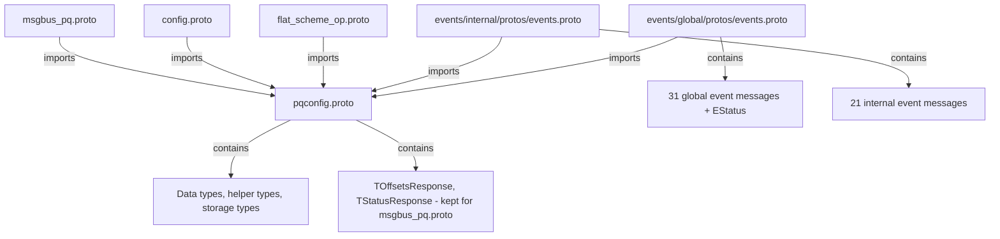

# Plan: Split pqconfig.proto into three files

## Overview

Split `ydb/core/protos/pqconfig.proto` so that event messages used via `TEventPB<>` in `internal.h` and `global.h` are moved to their respective `events.proto` files, while `pqconfig.proto` retains all non-event types.

**Key rules**:
- `events.proto` files can import from `pqconfig.proto`
- `pqconfig.proto` cannot import from `events.proto` files
- `events/internal` and `events/global` must NOT depend on each other
- Messages imported by `flat_scheme_op.proto`, `config.proto`, or `msgbus_pq.proto` MUST stay in `pqconfig.proto`
---


## External dependency analysis

Messages referenced by external proto files that MUST stay in `pqconfig.proto`:

### From flat_scheme_op.proto:
- `NKikimrPQ.ETopicPartitionStatus` — enum ✓ already in pqconfig.proto
- `NKikimrPQ.TPartitionKeyRange` — ✓ already in pqconfig.proto
- `NKikimrPQ.TPQTabletConfig` — ✓ already in pqconfig.proto
- `NKikimrPQ.TBootstrapConfig` — ✓ already in pqconfig.proto

### From config.proto:
- `NKikimrPQ.TPQConfig` — ✓ already in pqconfig.proto
- `NKikimrPQ.TPQClusterDiscoveryConfig` — ✓ already in pqconfig.proto

### From msgbus_pq.proto:
- `NKikimrPQ.THeartbeat` — ✓ already in pqconfig.proto
- `NKikimrPQ.TPartitionKeyRange` — ✓ already in pqconfig.proto
- `NKikimrPQ.TWriteId` — ✓ already in pqconfig.proto
- `NKikimrPQ.TPQTabletConfig` — ✓ already in pqconfig.proto
- `NKikimrPQ.TOffsetsResponse.TPartResult` — ⚠ `TOffsetsResponse` must stay in pqconfig.proto
- `NKikimrPQ.TStatusResponse.TPartResult` — ⚠ `TStatusResponse` must stay in pqconfig.proto
- `NKikimrPQ.TMessageGroupInfo.EState` — ✓ already in pqconfig.proto
- `NKikimrPQ.ETopicPartitionStatus` — ✓ already in pqconfig.proto

**Conclusion**: `TOffsetsResponse` and `TStatusResponse` must stay in pqconfig.proto because they are referenced by `msgbus_pq.proto`. Since `TStatusResponse.TErrorMessage` stays in pqconfig.proto, there is no need for a separate `TStatusResponseErrorMessage` type or a `common.proto` file. `TEvReportPartitionError` and `TBroadcastPartitionError` continue to reference `TStatusResponse.TErrorMessage` from pqconfig.proto.

---

## TEventPB usages in internal.h — 21 proto types to move to events/internal/protos/events.proto

| # | Proto type used in TEventPB |
|---|---|
| 1 | `NKikimrPQ::TEvSubDomainStatus` |
| 2 | `NKikimrPQ::TEvCheckPartitionStatusRequest` |
| 3 | `NKikimrPQ::TEvCheckPartitionStatusResponse` |
| 4 | `NKikimrPQ::TEvReadingPartitionStatusRequest` |
| 5 | `NKikimrPQ::TEvPartitionScaleStatusChanged` |
| 6 | `NKikimrPQ::TBroadcastPartitionError` |
| 7 | `NKikimrPQ::TEvMLPGetPartitionRequest` |
| 8 | `NKikimrPQ::TEvMLPGetPartitionResponse` |
| 9 | `NKikimrPQ::TEvMLPErrorResponse` |
| 10 | `NKikimrPQ::TEvMLPReadRequest` |
| 11 | `NKikimrPQ::TEvMLPReadResponse` |
| 12 | `NKikimrPQ::TEvMLPCommitRequest` |
| 13 | `NKikimrPQ::TEvMLPCommitResponse` |
| 14 | `NKikimrPQ::TEvMLPUnlockRequest` |
| 15 | `NKikimrPQ::TEvMLPUnlockResponse` |
| 16 | `NKikimrPQ::TEvMLPChangeMessageDeadlineRequest` |
| 17 | `NKikimrPQ::TEvMLPChangeMessageDeadlineResponse` |
| 18 | `NKikimrPQ::TEvMLPPurgeRequest` |
| 19 | `NKikimrPQ::TEvMLPPurgeResponse` |
| 20 | `NKikimrPQ::TEvMLPConsumerStatus` |
| 21 | `NKikimrPQ::TEvMLPUpdateExternalLockedMessageGroupsId` |

## TEventPB usages in global.h — 29 NKikimrPQ proto types to move to events/global/protos/events.proto

Note: `TOffsetsResponse` and `TStatusResponse` stay in pqconfig.proto because they are referenced by `msgbus_pq.proto`. `TStatusResponse::TErrorMessage` is used by `TEvReportPartitionError` and `TBroadcastPartitionError` — both reference it from pqconfig.proto directly.

| # | Proto type used in TEventPB |
|---|---|
| 1 | `NKikimrPQ::TUpdateConfig` |
| 2 | `NKikimrPQ::TUpdateBalancerConfig` |
| 3 | `NKikimrPQ::TRegisterReadSession` |
| 4 | `NKikimrPQ::TGetReadSessionsInfo` |
| 5 | `NKikimrPQ::TReadSessionsInfoResponse` |
| 6 | `NKikimrPQ::TGetPartitionsLocation` |
| 7 | `NKikimrPQ::TPartitionsLocationResponse` |
| 8 | `NKikimrPQ::TLockPartition` |
| 9 | `NKikimrPQ::TReleasePartition` |
| 10 | `NKikimrPQ::TPartitionReleased` |
| 11 | `NKikimrPQ::TUpdateConfigResponse` |
| 12 | `NKikimrPQ::TOffsets` |
| 13 | `NKikimrPQ::TStatus` |
| 14 | `NKikimrPQ::THasDataInfo` |
| 15 | `NKikimrPQ::THasDataInfoResponse` |
| 16 | `NKikimrPQ::TDropTablet` |
| 17 | `NKikimrPQ::TDropTabletResult` |
| 18 | `NKikimrPQ::TPartitionClientInfo` |
| 19 | `NKikimrPQ::TClientInfoResponse` |
| 20 | `NKikimrPQ::TGetPartitionIdForWrite` |
| 21 | `NKikimrPQ::TGetPartitionIdForWriteResponse` |
| 22 | `NKikimrPQ::TEvProposeTransaction` |
| 23 | `NKikimrPQ::TEvProposeTransactionResult` |
| 24 | `NKikimrPQ::TEvCancelTransactionProposal` |
| 25 | `NKikimrPQ::TEvPeriodicTopicStats` |
| 26 | `NKikimrPQ::TEvReadingPartitionFinishedRequest` |
| 27 | `NKikimrPQ::TEvReadingPartitionStartedRequest` |
| 28 | `NKikimrPQ::TEvOffloadStatus` |
| 29 | `NKikimrPQ::TEvBalancingSubscribe` |

Note: `TEvBalancingUnsubscribe` and `TEvBalancingSubscribeNotify` are also used in global.h but are not TEventPB — they are listed in the Step 5 message list below because they are event-related types that should move together.

---

## Implementation steps

### Step 1: Rewrite events/internal/protos/events.proto

**Keep only 21 messages:**
`TEvSubDomainStatus`, `TEvCheckPartitionStatusRequest`, `TEvCheckPartitionStatusResponse`, `TEvReadingPartitionStatusRequest`, `TEvPartitionScaleStatusChanged`, `TBroadcastPartitionError`, `TEvMLPGetPartitionRequest`, `TEvMLPGetPartitionResponse`, `TEvMLPErrorResponse`, `TEvMLPReadRequest`, `TEvMLPReadResponse`, `TEvMLPCommitRequest`, `TEvMLPCommitResponse`, `TEvMLPUnlockRequest`, `TEvMLPUnlockResponse`, `TEvMLPChangeMessageDeadlineRequest`, `TEvMLPChangeMessageDeadlineResponse`, `TEvMLPPurgeRequest`, `TEvMLPPurgeResponse`, `TEvMLPConsumerStatus`, `TEvMLPUpdateExternalLockedMessageGroupsId`

**Delete everything else** (77 messages + 8 enums).

**Imports:**
- `import "ydb/core/protos/pqconfig.proto"` - for `ETopicPartitionStatus`, `EScaleStatus`, `TPartitionScaleParticipants`, `TMLPMessage`, `TExternalLockedMessageGroupsId`, `TStatusResponse.TErrorMessage`
- `import "ydb/public/api/protos/ydb_status_codes.proto"` - for `Ydb.StatusIds.StatusCode`

**`TBroadcastPartitionError` keeps using `TStatusResponse.TErrorMessage`** — no change needed since `TStatusResponse` stays in pqconfig.proto.

### Step 2: Update events/internal/protos/ya.make

Remove unnecessary PEERDIRs. Keep:
```
PEERDIR(
    ydb/core/protos
    ydb/public/api/protos
)
```

### Step 3: Rewrite events/global/protos/events.proto

**Keep 31 messages + 2 enums:**

Messages: `TUpdateConfig`, `TUpdateBalancerConfig`, `TRegisterReadSession`, `TGetReadSessionsInfo`, `TReadSessionsInfoResponse`, `TGetPartitionsLocation`, `TPartitionsLocationResponse`, `TLockPartition`, `TReleasePartition`, `TPartitionReleased`, `TUpdateConfigResponse`, `TOffsets`, `TStatus`, `THasDataInfo`, `THasDataInfoResponse`, `TDropTablet`, `TDropTabletResult`, `TPartitionClientInfo`, `TClientInfoResponse`, `TGetPartitionIdForWrite`, `TGetPartitionIdForWriteResponse`, `TEvProposeTransaction`, `TEvProposeTransactionResult`, `TEvCancelTransactionProposal`, `TEvPeriodicTopicStats`, `TEvReadingPartitionFinishedRequest`, `TEvReadingPartitionStartedRequest`, `TEvOffloadStatus`, `TEvBalancingSubscribe`, `TEvBalancingUnsubscribe`, `TEvBalancingSubscribeNotify`

Enums: `ETabletState`, `EStatus`

**Delete everything else** (66 messages + 6 enums).

**Imports:**
- `import "ydb/core/protos/pqconfig.proto"` (single, remove duplicate)
- `import "ydb/public/api/protos/draft/persqueue_error_codes.proto"` - for `NPersQueue.NErrorCode.EErrorCode`
- `import "ydb/core/protos/base.proto"` - for `NKikimrProto.EReplyStatus`
- `import "ydb/library/actors/protos/actors.proto"` - for `NActorsProto.TActorId`
- `import "ydb/library/services/services.proto"` - for `NKikimrServices.EServiceKikimr`

**`TEvReportPartitionError` in global.h keeps using `NKikimrPQ::TStatusResponse::TErrorMessage`** — no change needed since `TStatusResponse` stays in pqconfig.proto.

### Step 4: Update events/global/protos/ya.make

Remove unnecessary PEERDIRs. Keep:
```
PEERDIR(
    ydb/core/protos
    ydb/library/actors/protos
    ydb/library/services
    ydb/public/api/protos
)
```

### Step 5: Delete from pqconfig.proto

Delete 52 messages + 2 enums (`EStatus`, `ETabletState`). See detailed list below.

**Messages to delete from pqconfig.proto (52):**
1. `TEvSubDomainStatus` (line 1134-1136)
2. `TEvCheckPartitionStatusRequest` (line 1138-1141)
3. `TEvCheckPartitionStatusResponse` (line 1143-1146)
4. `TEvReadingPartitionStatusRequest` (line 1149-1154)
5. `TEvPartitionScaleStatusChanged` (line 1177-1182)
6. `TBroadcastPartitionError` (line 923-928)
7. `TEvMLPGetPartitionRequest` (line 1337-1340)
8. `TEvMLPGetPartitionResponse` (line 1343-1347)
9. `TEvMLPErrorResponse` (line 1350-1354)
10. `TEvMLPReadRequest` (line 1357-1365)
11. `TEvMLPReadResponse` (line 1368-1370)
12. `TEvMLPCommitRequest` (line 1374-1379)
13. `TEvMLPCommitResponse` (line 1382-1383)
14. `TEvMLPUnlockRequest` (line 1387-1392)
15. `TEvMLPUnlockResponse` (line 1395-1396)
16. `TEvMLPChangeMessageDeadlineRequest` (line 1400-1410)
17. `TEvMLPChangeMessageDeadlineResponse` (line 1413)
18. `TEvMLPPurgeRequest` (line 1416-1420)
19. `TEvMLPPurgeResponse` (line 1423-1425)
20. `TEvMLPConsumerStatus` (line 1427-1435)
21. `TEvMLPUpdateExternalLockedMessageGroupsId` (line 1462-1466)
22. `TUpdateConfig` (line 530-534)
23. `TUpdateBalancerConfig` (line 536-570)
24. `TRegisterReadSession` (line 590-597)
25. `TGetReadSessionsInfo` (line 599-602)
26. `TReadSessionsInfoResponse` (line 631-649)
27. `TGetPartitionsLocation` (line 652-654)
28. `TPartitionsLocationResponse` (line 663-665)
29. `TLockPartition` (line 667-676)
30. `TReleasePartition` (line 679-689)
31. `TPartitionReleased` (line 691-697)
32. `TUpdateConfigResponse` (line 727-731)
33. `TOffsets` (line 733-735)
34. `TStatus` (line 760-764)
35. `THasDataInfo` (line 931-942)
36. `THasDataInfoResponse` (line 944-952)
37. `TDropTablet` (line 704-707)
38. `TDropTabletResult` (line 709-714)
39. `TPartitionClientInfo` (line 981-983)
40. `TClientInfoResponse` (line 985-990)
41. `TGetPartitionIdForWrite` (line 583-584)
42. `TGetPartitionIdForWriteResponse` (line 586-588)
43. `TEvProposeTransaction` (line 1073-1081)
44. `TEvProposeTransactionResult` (line 1095-1116)
45. `TEvCancelTransactionProposal` (line 1118-1120)
46. `TEvPeriodicTopicStats` (line 1122-1132)
47. `TEvReadingPartitionFinishedRequest` (line 1157-1163)
48. `TEvReadingPartitionStartedRequest` (line 1166-1170)
49. `TEvOffloadStatus` (line 1280-1290)
50. `TEvBalancingSubscribe` (line 1292-1296)
51. `TEvBalancingUnsubscribe` (line 1298-1302)
52. `TEvBalancingSubscribeNotify` (line 1304-1317)

**Enums to delete from pqconfig.proto (2):**
- `EStatus` (line 720-724) — moves to events/global
- `ETabletState` (line 699-702) — moves to events/global

Wait — `TTabletState` stays in pqconfig.proto and uses `ETabletState`. So `ETabletState` must stay in pqconfig.proto.

**Revised: Only delete `EStatus` enum from pqconfig.proto.** `ETabletState` stays because `TTabletState` (which stays in pqconfig.proto) uses it.

### Step 6: Update C++ code — no changes needed

Since `TStatusResponse` and `TStatusResponse::TErrorMessage` stay in pqconfig.proto, no C++ code changes are required for `TEvReportPartitionError`, `LogAndCollectError`, or `Errors` deque types. They all continue to use `NKikimrPQ::TStatusResponse::TErrorMessage` as before.

### Step 7: Update ya.make files

**events/internal/protos/ya.make** - update PEERDIRs:
```
PEERDIR(
    ydb/core/protos
    ydb/public/api/protos
)
```

**events/global/protos/ya.make** - update PEERDIRs:
```
PEERDIR(
    ydb/core/protos
    ydb/library/actors/protos
    ydb/library/services
    ydb/public/api/protos
)
```

---

## What REMAINS in pqconfig.proto after cleanup

**Messages (45):**
`TPartitionCounterData`, `TPartitionMeta`, `TPartitionTxMeta`, `TPQConfig`, `TChannelProfile`, `TMirrorPartitionConfig`, `TPartitionConfig`, `TPartitionKeyRange`, `TMessageGroup`, `TOffloadConfig`, `TPQTabletConfig`, `THeartbeat`, `TMessageGroupInfo`, `TBootstrapConfig`, `TReadSessionStatus`, `TReadSessionStatusResponse`, `TPartitionLocation`, `TBatchHeader`, `TUserInfo`, `TClientPosition`, `TClientInfo`, `TAggregatedCounters`, `TOffsetsResponse`, `TStatusResponse`, `TPQClusterDiscoveryConfig`, `TYdsNextToken`, `TYdsShardIterator`, `TKafkaProducerInstanceId`, `TPartitionOperation`, `TWriteId`, `TDataTransaction`, `TConfigTransaction`, `TError`, `TTabletState`, `TPartitionScaleParticipants`, `TPartitions`, `TTransaction`, `TTabletTxInfo`, `TMLPMessageId`, `TMLPMessageMeta`, `TMLPMessage`, `TMLPMetrics`, `TExternalLockedMessageGroupsId`, `TMLPStorageSnapshot`, `TMLPStorageWAL`, `TMessageDeduplicationIdWAL`

**Enums (7):**
`ETopicPartitionStatus`, `EConsumerScalingSupport`, `EOperation`, `EAccess`, `ETabletState`, `EScaleStatus`, `EReadWithKeepOrder`

---

## Dependency diagram


