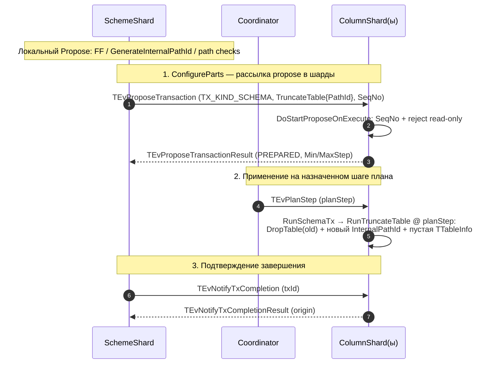

# Реализация TRUNCATE TABLE в ColumnShard

Документ описывает реализацию операции `TRUNCATE` колоночной таблицы. Основной
фокус — уровень ColumnShard (`ydb/core/tx/columnshard`), но отдельно разобран
протокол обмена сообщениями со SchemeShard (раздел 2). В конце — сравнение с
операцией `MoveTable`.

## 1. Общая идея

`TRUNCATE` колоночной таблицы реализован как «подмена идентификатора»:

- старая таблица (со всеми порциями данных) **логически удаляется** (drop) и
  отправляется в фоновую очистку;
- для того же внешнего `SchemeShardLocalPathId` аллоцируется **новый**
  `InternalPathId`;
- под новым `InternalPathId` регистрируется **пустая** таблица.

Таким образом, после применения TRUNCATE чтения идут по новому (пустому)
`InternalPathId`, а физические данные старого `InternalPathId` удаляются в фоне
через механизм `PathsToDrop`/GC.

Ключевое понятие: в ColumnShard есть два пространства идентификаторов:
- `TSchemeShardLocalPathId` — внешний id пути, которым оперирует SchemeShard;
- `TInternalPathId` — внутренний id, под которым в движке хранятся данные/порции.

Связь хранится в `TTablesManager::SchemeShardLocalToInternal`
(`SchemeShardLocalPathId → InternalPathId`). Барьер для чтений после TRUNCATE
**не** лежит в маппинге: при скане он вычисляется как min schema-version
текущего `InternalPathId` (или `CopyVersion` для copy-пути). После TRUNCATE
первая `AddTableVersion` нового id = версия усечения — чтения со старым
снапшотом **отклоняются** (hard cut), а не получают пустую таблицу (см. 5.4, 6.1).

## 2. Обмен сообщениями со SchemeShard

ColumnShard участвует в TRUNCATE как обычный участник распределённой схемной
транзакции (`TxTruncateColumnTable = 127`). Со стороны ColumnShard всё
взаимодействие сводится к приёму нескольких сообщений и ответам на них.
Перед рассылкой в шарды SchemeShard сам отклоняет операцию
(`StatusPreconditionFailed`), если выключен feature flag
`EnableTruncateColumnTable` (proto field **303**, default `false`) или
`ColumnShardConfig.GenerateInternalPathId`, либо путь не проходит проверки
(`IsColumnTable`, `NotReadOnlyColumnTable`, locks и т.д.) —
см. `schemeshard/olap/operations/truncate_table.cpp`.

### Сообщения и реакция ColumnShard

1. **`TEvProposeTransaction` (`TX_KIND_SCHEMA`, тело `TruncateTable{PathId}`,
   `SeqNo`)** — propose схемной транзакции (приходит на фазе ConfigureParts,
   уже после локальных проверок SS). ColumnShard выполняет
   `DoStartProposeOnExecute` (раздел 4): проверка глобального SeqNo и read-only.
   Ответ — **`TEvProposeTransactionResult`** со статусом `PREPARED` и диапазоном
   `planStep` (`Min/MaxStep`); для устаревшего SeqNo — `SCHEMA_CHANGED`, для
   read-only — `SCHEMA_ERROR`. Если путь на шарде неизвестен, propose проходит,
   а применение на плане будет no-op.
2. **`TEvPlanStep` (`planStep`)** — назначенный координатором шаг плана. На этом
   шаге ColumnShard исполняет транзакцию `RunSchemaTx → RunTruncateTable`
   (раздел 5) — собственно усечение: старый `InternalPathId` помечается dropped и
   уходит в фоновую очистку, аллоцируется новый `InternalPathId`, регистрируется
   пустая таблица.
3. **`TEvNotifyTxCompletion` (`txId`)** — запрос статуса завершения. Когда план для
   `txId` исполнен, ColumnShard отвечает **`TEvNotifyTxCompletionResult(origin)`**.

Повторная доставка сообщений и повтор плана для ColumnShard идемпотентны:
`DoOnTabletInit` для `kTruncateTable` — пустой; `RunTruncateTable` для
неизвестного/незамапленного пути или отсутствующей записи таблицы — no-op
(раздел 5). «Уже усечённый» живой путь при этом **не** no-op: маппинг указывает
на новый `InternalPathId`, и повторный TRUNCATE снова дропнет его и аллоцирует
следующий.

## 3. Транспорт схемной транзакции

- Protobuf: добавлено сообщение `TTruncateTable { optional uint64 PathId = 1; }`
  и новый вариант `TTruncateTable TruncateTable = 9;` в `oneof` тела
  `TSchemaTxBody` (`ydb/core/protos/tx_columnshard.proto`).
- Сериализация id пути: специализации
  `TSchemeShardLocalPathId::FromProto/ToProto` для `TTruncateTable`
  (`ydb/core/tx/columnshard/common/path_id.cpp`).
- Идентификаторы после rebase на `main` (занятые ранее номера сдвинуты):
  - `TxTruncateColumnTable = 127` (`schemeshard_subop_types.h`);
  - `EnableTruncateColumnTable = 303` (`feature_flags.proto`);
  - счётчики `COUNTER_IN_FLIGHT_OPS_TxTruncateColumnTable = 239`,
    `COUNTER_FINISHED_OPS_TxTruncateColumnTable = 151`
    (`counters_schemeshard.proto`).

## 4. Обработка в операторе схемной транзакции

`TSchemaTransactionOperator` (`transactions/operators/schema.cpp`):

- **Propose (`DoStartProposeOnExecute`)**, ветка `kTruncateTable`:
  - Проверка SeqNo выполняется по **глобальному** счётчику шарда
    (`LastSchemaSeqNo`), а не по per-path счётчику — `kTruncateTable` не входит в
    `switch`, который задаёт `targetPathId` (там только `kDropTable` и
    `kCopyTable`). То есть TRUNCATE сериализуется относительно всех схемных
    операций шарда; устаревший SeqNo → `SCHEMA_CHANGED`.
  - Содержательная проверка: если путь резолвится и таблица **read-only**
    (например, backup-копия через `CopyTable`), возвращается `SCHEMA_ERROR`
    («Cannot truncate read-only table ...»). Read-only —
    `TablesManager.GetTable(internalPathId).IsReadOnly(schemeShardLocalPathId)`.
    Если путь на шарде неизвестен, проверка пропускается (propose успешен).
  - Никаких изменений состояния маппинга на propose не делается, ожидания
    in-flight транзакций нет.
- **`DoOnTabletInit`**, ветка `kTruncateTable`: пустая (`break`). При рестарте
  ничего доустанавливать не нужно, т.к. вся работа делается идемпотентно на плане.
- **`DoGetOpType`**: тип операции «Scheme:TruncateTable».

## 5. Применение на плане

`TColumnShard::RunTruncateTable` (`columnshard_impl.cpp`), вызывается из
`RunSchemaTx` для `kTruncateTable`:

1. Резолвит `InternalPathId` по `SchemeShardLocalPathId`. Если путь неизвестен или
   уже удалён — **no-op** (только лог).
2. Если таблицы нет (`!HasTable`) — тоже no-op.
3. Вызывает `TablesManager.TruncateTable(...)`, получая новый `InternalPathId`.
4. Создаёт запись версии таблицы (`AddTableVersion`) для нового `InternalPathId`,
   ссылающуюся на **тот же** schema preset шарда
   (`GetSchemaPresets().begin()`), т.к. preset общий для всех таблиц шарда.
5. Обновляет счётчик `COUNTER_TABLES`.

`TTablesManager::TruncateTable` (`tables_manager.cpp`) — ядро операции:

1. `DropTable(schemeShardLocalPathId, oldPathId, version, db)` — помечает старый
   `InternalPathId` как dropped на версии `version` (и добавляет в `PathsToDrop`
   для фоновой очистки данных).
2. Удаляет из `SchemeShardLocalToInternal` маппинг для старого пути.
3. Аллоцирует новый `InternalPathId = MaxInternalPathId + 1`, обновляет
   `MaxInternalPathId`. Здесь стоит инвариант: операция имеет смысл только при
   включённом `GenerateInternalPathId` (иначе внутренний id обязан совпадать с
   внешним, а счётчик `MaxInternalPathId` не персистится между рестартами).
   На уровне ColumnShard это защищено `AFL_VERIFY(GenerateInternalPathId)`;
   отказ пользователю — на propose в SchemeShard
   (`StatusPreconditionFailed`, см. раздел 2).
  4. Регистрирует свежую пустую `TTableInfo` под новым `InternalPathId`
   (`RegisterTable`): пишет `TableInfo`/`TableInfoV1`, персистит
   `MaxInternalPathId`, обновляет маппинг `ss → newInternal`, и при наличии
   индекса вызывает `PrimaryIndex->RegisterTable`. Барьер снапшота появится
   следом через `AddTableVersion` в `RunTruncateTable` (та же plan-версия).

### 5.1. Восстановление маппинга после рестарта

После TRUNCATE в БД остаются **две** записи таблиц с одним и тем же
`SchemeShardLocalPathId`: старая (dropped) с `oldInternalPathId` и новая с
`newInternalPathId`. При загрузке `InitFromDB` порядок не гарантирован, поэтому
`AddTableInfo` детерминированно предпочитает «живую» (не-dropped) таблицу при
построении `SchemeShardLocalToInternal` — иначе маппинг мог бы указать на dropped
путь, и таблица стала бы нерезолвимой/незаписываемой после рестарта.

Барьер чтений после рестарта: `GetPathMappingValidFromOptional` берёт live id из
маппинга и считает `*Versions.begin()` (из загруженного `TableVersionInfo`) либо
`CopyVersion`. Отдельного поля/`ValidFrom` в маппинге нет.

Инвариант: первая `AddTableVersion` нового id после truncate — на версии truncate.

### 5.2. Фоновая очистка

`TryFinalizeDropPathOnComplete` при удалении данных старого `InternalPathId`
стирает маппинг `SchemeShardLocalToInternal` **только если он всё ещё указывает на
этот старый id** (после TRUNCATE маппинг уже на новый id, поэтому безусловное
стирание было бы ошибкой).

### 5.3. Очередь удаления при нескольких усечениях

`PathsToDrop` — упорядоченная map «версия дропа → набор `InternalPathId`». Каждый
`TRUNCATE` дропает текущий старый `InternalPathId` на **своём** plan-step
(уникальная версия) и аллоцирует новый. Поэтому при нескольких подряд усечениях
одной таблицы в очереди оказывается несколько записей — **разные `InternalPathId`
под разными версиями, но с одним `SchemeShardLocalPathId`**. Живой (последний)
`InternalPathId` в очередь не попадает. Несколько версий обрабатываются корректно и
независимо:

- **Очистка идёт по всей очереди.** `SetupCleanupPortions`/`SetupCleanupTables`
  берут весь `GetPathsToDrop()` и обрабатывают все накопленные пути, а не один.
- **Каждая версия чистится независимо и только когда это безопасно.**
  `StartCleanupPortions` сверяется с активными read-снапшотами
  (`GetSnapshotHolders()`) и `DataLocksManager`: пути, которые ещё кому-то нужны,
  ждут, остальные удаляются. То есть несколько версий — это несколько независимых
  «ворот».
- **Финализация одной версии не задевает остальные и живой маппинг.**
  `TryFinalizeDropPathOnComplete` удаляет ровно один `pathId` из его версии (и саму
  версию, если набор опустел) и стирает маппинг лишь при
  `it->second == pathId`; для старых id это всегда false.
- **Переживает рестарт.** `InitFromDB` заново отстраивает всю очередь из
  персистентных drop-версий, а `AddTableInfo` детерминированно выбирает живую
  таблицу для маппинга (см. 5.1).

Замечания:
- **Накопление, а не порча.** Корректность не страдает, но до завершения GC все
  старые версии занимают место (портации + записи `TableInfo`/версий схемы в БД).
  Частые усечения подряд → данные копятся, пока фон не догонит.
- **Долгий read-снапшот тормозит конкретную версию**, не блокируя очистку прочих.
- **Инвариант уникальности.** `AFL_VERIFY(PathsToDrop[version].emplace(pathId).second)`
  рассчитывает на уникальность пары (версия, `InternalPathId`); при штатном потоке
  версии разные, коллизий нет.

### 5.4. Барьер снапшота vs CopyVersion

Барьер truncate при запросе: `CopyVersion`, если путь — copy-алиас; иначе
`*TTableInfo::Versions.begin()` текущего `InternalPathId` из маппинга.

| | `CopyVersion` | Барьер truncate (derive) |
|---|---|---|
| Где | `TPathInfo` на dst после CopyTable | min `Versions` / CopyVersion живого id |
| Семантика | **пин**: отдать данные «как на момент копии» | **барьер**: `S < barrier` → reject |
| При `S < version` | `ResolveReadSnapshot` подменяет на CopyVersion | ошибка скана (`BAD_REQUEST`) |
| При `S >= version` | обычно читают ровно CopyVersion | новый (пустой/живой) `InternalPathId` |
| GC | пинит через `RegisterReadOnlyTableSnapshot` | не пинит для чтения старых данных |
| Персист | `TableInfoV1.CopyStep/TxId` | `TableVersionInfo` (первая версия нового id) |

## 6. Обработка записей и чтений, начатых до TRUNCATE

Важная особенность реализации: и для чтения, и для записи `InternalPathId`
**резолвится один раз** — в момент старта операции, по тогдашнему состоянию
маппинга `SchemeShardLocalToInternal`. TRUNCATE этот маппинг подменяет, но операции,
уже захватившие старый `InternalPathId`, продолжают работать с ним. При этом
TRUNCATE, в отличие от MoveTable, **не ждёт** завершения in-flight операций.

### 6.1. Чтения (scan)

`TTxScan` (`engines/reader/transaction/tx_scan.cpp`):

- запрошенный снапшот пропускается через
  `TablesManager.ResolveReadSnapshot(ssPathId, snapshot)` — для read-only/copy
  таблиц возвращается зафиксированная copy-version, для обычных — сам запрошенный
  снапшот;
- затем `IsPathMappingValidAt(ssPathId, snapshot)`: барьер = CopyVersion или
  min Versions текущего id; если `snapshot < barrier` → **`TEvScanError` /
  `BAD_REQUEST`** («snapshot too old for path mapping»);
- иначе `ssPathId` → `InternalPathId` по **текущему** маппингу
  (`BuildTableMetadataAccessor`).

Отсюда:

- **Скан, уже стартовавший до TRUNCATE** (успел зарезолвить старый
  `InternalPathId`): продолжает читать гранулу старого id, пока данные не
  вычищены фоном. Консистентен в рамках своего снапшота.
- **Скан после TRUNCATE на снапшоте `>= barrier`**: видит новый (пустой/живой)
  `InternalPathId`.
- **Скан после TRUNCATE на снапшоте `< barrier`**: **reject**, а не пустой
  результат. Это hard cut: TRUNCATE не даёт MVCC-дочитывания старых данных (в
  отличие от CopyTable + `CopyVersion`), но и не врёт пустой таблицей.

### 6.2. Записи (insert/upsert/delete)

Путь записи (`columnshard__write.cpp`):

- на `EvWrite` `schemeShardLocalPathId` → `InternalPathId` резолвится по текущему
  маппингу и **сохраняется** в метаданных операции (`writeMeta`/`Pack`), туда же
  попадает проверка `IsReadyForStartWrite` и проверка read-only;
- финализация записи (`TTxBlobsWritingFinished`,
  `blobs_action/transaction/tx_blobs_written.cpp`) работает уже с **зафиксированным**
  `InternalPathId`: пишет в гранулу `index.MutableGranuleVerified(Pack.GetPathId())`
  и проверяет `AFL_VERIFY(IsReadyForFinishWrite(writeMeta.GetPathId().InternalPathId,
  minReadSnapshot))`.

Поэтому запись, начатая до TRUNCATE, нацелена на **старый** `InternalPathId`:

- старый `InternalPathId` после TRUNCATE помечен dropped, но гранула ещё
  существует (до фоновой очистки), поэтому `MutableGranuleVerified(старый)` обычно
  проходит;
- поведение `IsReadyForFinishWrite(старый, minReadSnapshot)` зависит от соотношения
  `minReadSnapshot` (`GetMinSnapshotForNewReads()`) и версии усечения:
  - если `dropVersion < minReadSnapshot`, `HasTable(..., withDeleted=false, ...)`
    вернёт `false`, и сработает `AFL_VERIFY` — это потенциальный аварийный исход
    (abort таблетки);
  - иначе запись «успешно» ляжет в **старый, уже усечённый** `InternalPathId`, и
    эти данные будут затем вычищены фоном вместе со старой таблицей → фактическая
    потеря записи.

Ключевой момент: TRUNCATE **не сериализуется** с конкурентными записями того же
пути (нет ожидания in-flight транзакций и нет per-path-барьера на propose). Это
делает гонку «запись vs TRUNCATE» источником потенциальной потери данных или
срабатывания проверок-инвариантов. (Для сравнения, `MoveTable` явно дожидается всех
in-flight транзакций шарда перед завершением propose.)

## 7. Сравнение: CopyTable, MoveTable, TRUNCATE (на уровне ColumnShard)

Все три — схемные операции, по-разному манипулирующие связкой
`SchemeShardLocalPathId` ↔ `InternalPathId` ↔ данные:

- **CopyTable** — создаёт **новый внешний путь-алиас** на **те же** данные:
  `InternalPathId` переиспользуется, dst помечается **read-only** и привязывается к
  зафиксированной copy-version.
- **MoveTable** — **переименовывает** путь: меняет `SchemeShardLocalPathId`,
  **сохраняя** тот же `InternalPathId` и все данные.
- **TRUNCATE** — **подменяет** `InternalPathId` на новый пустой, старый (с данными)
  отправляет в drop + фоновую очистку.

### Поток CopyTable
- **Propose** (`schema.cpp`, `kCopyTable`): резолвит src (должен существовать),
  проверяет, что dst ещё не существует, вызывает `CopyTablePropose` — кладёт
  `src → internalPathId` в отдельный маппинг `CopyingLocalToInternal`, **не** трогая
  `SchemeShardLocalToInternal`. **Не ждёт** in-flight транзакций (умышленно: иначе
  были зависания при долгоживущих backup/export-транзакциях на тех же шардах).
- **OnTabletInit**: повторяет `CopyTablePropose`.
- **План** (`CopyTableProgress`/`CopyTablePlanStep`): добавляет dst как **алиас** на
  тот же `internalPathId` (`SchemeShardLocalToInternal[dst] = internalPathId`),
  фиксирует copy-version (`SetCopyVersion`), помечает dst как `ReadOnly`,
  регистрирует read-only-снапшот (`RegisterReadOnlyTableSnapshot`), чтобы данные
  оставались читаемыми на copy-version. Данные физически не копируются.

### Поток MoveTable
- **Propose** (`schema.cpp`, `kMoveTable`): резолвит src, проверяет, что dst ещё
  не существует, вызывает `MoveTablePropose` — переносит маппинг из
  `SchemeShardLocalToInternal` в промежуточный `RenamingLocalToInternal` (т.е.
  снимает src-маппинг «в полёт»). Затем **дожидается всех in-flight транзакций
  шарда** (`GetProgressTxController().GetTxs()` + `TWaitTxs`) прежде чем завершить
  propose.
- **OnTabletInit**: повторяет `MoveTablePropose` и заново ставит ожидание
  транзакций — состояние «в процессе переименования» восстанавливается при
  рестарте.
- **План** (`RunMoveTable` → `MoveTableProgress`): переименовывает
  `SchemeShardLocalPathId` в `TTableInfo` и БД, убирает из
  `RenamingLocalToInternal`, добавляет новый маппинг
  `SchemeShardLocalToInternal[new] = internalPathId`, при необходимости обновляет
  `TabletPathId`/`OwnerPath`. Данные не трогаются.

### Поток TRUNCATE
- **Propose** (`schema.cpp`, `kTruncateTable`): только проверка read-only
  (раздел 4). Маппинг не меняется, in-flight транзакции не ожидаются.
- **OnTabletInit**: no-op.
- **План** (`RunTruncateTable` → `TablesManager::TruncateTable`, раздел 5):
  `DropTable(old)` + аллокация нового `InternalPathId` + регистрация пустой
  `TTableInfo` + `AddTableVersion` (барьер = эта версия). Старые данные уходят в
  `PathsToDrop`/GC.

### Ключевые отличия

| Аспект | CopyTable | MoveTable | TRUNCATE |
|---|---|---|---|
| InternalPathId | **тот же** (dst — алиас src) | **тот же** | аллоцируется **новый** (`MaxInternalPathId+1`) |
| Данные | общие, не копируются; dst read-only | сохраняются полностью | старые → drop + фоновая очистка; новая таблица пустая |
| Маппинг на propose | src сохраняется; dst → `CopyingLocalToInternal` | src снимается в `RenamingLocalToInternal` | не меняется |
| Ожидание in-flight tx | **нет** (умышленно) | **есть** (`TWaitTxs` по всем tx шарда) | **нет** |
| OnTabletInit | повтор `CopyTablePropose` | повтор propose + повторное ожидание | no-op |
| Маппинги SSLocalPathId → InternalPathId | **два** (src и dst) на один internal | один (переименован на месте) | **две** записи таблиц на один SSLocalPathId → нужен детерминированный выбор живой |
| `MaxInternalPathId` | не трогает | не трогает | потребляет (требует `GenerateInternalPathId`) |
| read-only / copy-version | dst read-only, copy-version зафиксирована | n/a | n/a |
| SeqNo | per-path | глобальный шардовый | глобальный шардовый |
| Снимок старых данных для старых снапшотов | сохраняется (`RegisterReadOnlyTableSnapshot`) | n/a (данные не удаляются) | **не** сохраняется; `S < barrier` → reject |
| Конкурентная запись на старый id | n/a (данные не меняются) | исключена ожиданием tx | возможна (нет барьера) → потеря/`AFL_VERIFY` |
| Барьер чтений | CopyVersion (пин) | n/a | derive: min Versions нового id |

## 8. Потенциальные проблемы

### TRUNCATE
- **Hard cut вместо MVCC для старых чтений.** Маппинг подменяется на новый id;
  барьер = первая schema-version этого id (версия truncate). Новый скан со
  снапшотом `< barrier` получает ошибку («snapshot too old for path mapping»), а
  не пустую таблицу. Скан, уже зарезолвивший старый id до truncate, может
  дочитать старые данные до GC. Полноценного snapshot-isolation **нет** — в
  отличие от CopyTable; это осознанный компромисс.
- **Отсутствие ожидания in-flight транзакций.** В отличие от MoveTable, TRUNCATE
  не дожидается конкурентных операций над тем же путём. Запись, заплани­рованная до
  TRUNCATE, но завершающаяся после, может попасть в старый (dropped)
  `InternalPathId` и быть вычищенной фоном → риск «молчаливой» потери данных, либо
  привести к срабатыванию `AFL_VERIFY(IsReadyForFinishWrite(...))` в
  `TTxBlobsWritingFinished` (abort таблетки).
- **Зависимость от фоновой очистки.** Физическое удаление старых портаций
  асинхронно (`PathsToDrop`/GC); до завершения данные занимают место. Для больших
  таблиц очистка может быть длительной.
- **Требование `GenerateInternalPathId` и feature flag.** На SchemeShard propose
  отклоняется с `StatusPreconditionFailed`, если выключен
  `EnableTruncateColumnTable` («TRUNCATE TABLE is not supported for column
  tables») или `GenerateInternalPathId` («... requires GenerateInternalPathId to
  be enabled»). В ColumnShard остаётся `AFL_VERIFY(GenerateInternalPathId)`.
  Без генерации внутренний id обязан совпадать с внешним, а `MaxInternalPathId`
  не персистится — повторные TRUNCATE после рестарта могли бы переиспользовать
  внутренние id.
- **Неоднозначность маппинга после рестарта** (исторически): из-за двух записей с
  одним `SchemeShardLocalPathId`. Закрыто детерминированным выбором живой таблицы в
  `AddTableInfo`; барьер чтений восстанавливается из `TableVersionInfo`. Регрессия
  в порядке загрузки/учёте dropped-флага или первой schema-version способна снова
  сломать резолвинг/hard cut.
- **Грубость SeqNo.** TRUNCATE использует глобальный SeqNo шарда (а не per-path,
  как Drop/Copy), поэтому он сериализуется относительно любых схемных операций
  шарда; TRUNCATE с меньшим раундом, чем любая прошедшая на шарде схемная
  операция, будет отвергнут.

### MoveTable
- **Ожидание всех транзакций шарда.** `GetProgressTxController().GetTxs()`
  возвращает *все* транзакции шарда, а не только относящиеся к перемещаемому пути.
  При наличии долгоиграющих неотносящихся транзакций propose может «зависать»
  (та же проблема ранее наблюдалась в CopyTable, где от ожидания всех tx
  отказались).
- **Сложность восстановления.** Промежуточное состояние `RenamingLocalToInternal`
  нужно корректно переигрывать в `OnTabletInit`; ошибка в этом приводит к
  рассинхронизации маппинга.
- **«Дыра» в резолвинге между propose и планом.** На propose src-маппинг снимается,
  поэтому до применения на плане путь не резолвится для новых операций.

### CopyTable
- **Накопление read-only-снапшотов.** Каждая копия фиксирует copy-version и
  регистрирует read-only-снапшот; пока копии живы, соответствующие снапшоты данных
  нельзя вычистить, что удерживает старые портации от GC.
- **Общий `InternalPathId`/данные.** src и dst делят один `InternalPathId`,
  поэтому запись/усечение по одному пути затрагивает данные, видимые другому;
  именно поэтому dst делается read-only, а TRUNCATE для read-only-копии запрещён
  (раздел 4).
