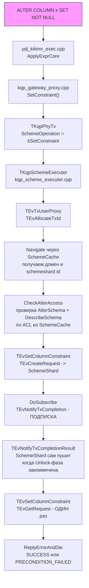
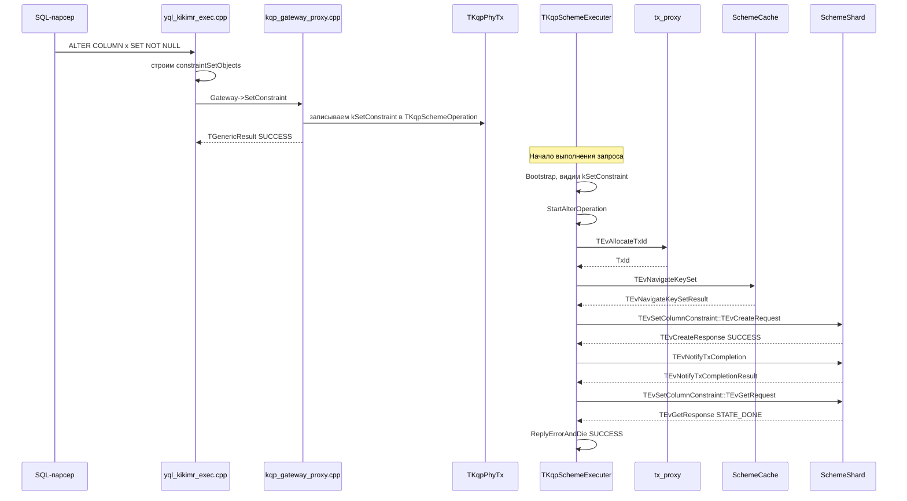

# План интеграции KQP: поддержка SQL SET NOT NULL

> **Версия 2** — уточнены: логика уведомлений (push, не поллинг), проверка прав (SchemeCache), полный список кодов ответа `TEvCreateResponse`.

## Краткое резюме

Подготовка со стороны SchemeShard **завершена** и достаточна. Слой KQP нужно расширить, чтобы маршрутизировать `ALTER TABLE ... ALTER COLUMN ... SET NOT NULL` через асинхронный путь `TEvSetColumnConstraint` — по аналогии с тем, как `ALTER TABLE ... ADD INDEX` маршрутизируется через `TEvIndexBuilder`. **tx_proxy не требует изменений** — он используется только для выделения TxId, а не для маршрутизации запросов к SchemeShard.

---

## Архитектура: аналогия с BUILD INDEX



---

## Что уже готово на стороне SchemeShard ✅

| Компонент | Статус |
|-----------|--------|
| `TEvSetColumnConstraint::TEvCreateRequest` / `TEvCreateResponse` | ✅ Готово |
| `TEvSetColumnConstraint::TEvGetRequest` / `TEvGetResponse` | ✅ Готово |
| Поле `TEvCreateResponse.TxId` (для `TEvNotifyTxCompletion`) | ✅ Готово |
| Enum состояния в `TEvGetResponse`: `STATE_DONE` означает успех | ✅ Готово |
| Персистентность, восстановление после рестарта, отслеживание прогресса | ✅ Готово |

---

## Анализ пробелов

### 1. [`../../protos/kqp_physical.proto`](../../protos/kqp_physical.proto) — неверный тип поля `SetConstraint`

**Текущее состояние** (строка 684):
```proto
NKikimrSchemeOp.TModifyScheme SetConstraint = 55;
```

**Проблема**: `TModifyScheme` предназначен для синхронных операций через tx_proxy. SET NOT NULL требует асинхронного пути, как BUILD INDEX, который использует `NKikimrIndexBuilder.TIndexBuildSettings BuildOperation = 4`. Тип необходимо изменить на `TSetColumnConstraintSettings`, чтобы `kqp_scheme_executer.cpp` мог извлечь путь к таблице и настройки.

**Исправление**: изменить тип поля (номер поля 55 безопасно переиспользовать, так как `kSetConstraint` нигде не обрабатывается в executer):
```proto
import "ydb/core/protos/set_column_constraint.proto";
// ...
NKikimrSetColumnConstraint.TSetColumnConstraintSettings SetConstraint = 55;
```

---

### 2. [`../../kqp/host/kqp_gateway_proxy.cpp`](../../kqp/host/kqp_gateway_proxy.cpp) — `SetConstraint()` возвращает NotImplemented

**Текущее состояние** (строка ~874):
```cpp
TFuture<TGenericResult> SetConstraint(const TString&, TVector<TSetColumnConstraintSettings>&&) override {
    TString error = "NotImplemented";
```

**Проблема**: это шлюз, используемый `yql_kikimr_exec.cpp` во время компиляции запроса. Он должен заполнять `TKqpSchemeOperation` полем `kSetConstraint` (по аналогии с тем, как `AlterTable` с `indexBuildSettings` производит `kBuildOperation`).

**Исправление**: реализовать `SetConstraint()` так, чтобы:
1. Построить `NKikimrSetColumnConstraint::TSetColumnConstraintSettings` из вектора `TSetColumnConstraintSettings`
2. Сохранить его в скомпилированном `TKqpSchemeOperation` под вариантом `SetConstraint`
3. Вернуть future, разрешённый как SUCCESS (сторона компиляции — реальное выполнение асинхронно в executer)

---

### 3. [`../../kqp/executer_actor/kqp_scheme_executer.cpp`](../../kqp/executer_actor/kqp_scheme_executer.cpp) — отсутствует `kSetConstraint` в 4 switch-операторах и новые обработчики

**Текущее состояние**: `kSetConstraint` НЕ обрабатывается ни в одном из 4 switch-операторов и попадает в `default: InternalError(...)`.

Четыре switch нуждаются в новом `case NKqpProto::TKqpSchemeOperation::kSetConstraint`:

#### Switch 1: `MakeSchemeOperationRequest()` (строка ~414)
```cpp
case NKqpProto::TKqpSchemeOperation::kSetConstraint: {
    return StartAlterOperation();  // как kBuildOperation и kCompactTable
}
```

#### Switch 2: `Navigate()` (строка ~906)
```cpp
case NKqpProto::TKqpSchemeOperation::kSetConstraint: {
    const auto& op = schemeOp.GetSetConstraint();
    path = op.GetTablePath();  // имя поля нужно уточнить в proto
    break;
}
```

#### Switch 3: `Handle(TEvNavigateKeySetResult)` (строка ~994)
```cpp
case NKqpProto::TKqpSchemeOperation::kSetConstraint: {
    const auto& op = schemeOp.GetSetConstraint();
    auto req = std::make_unique<NSchemeShard::TEvSetColumnConstraint::TEvCreateRequest>();
    req->Record.SetTxId(TxId);
    req->Record.SetDatabaseName(Database);
    req->Record.MutableSettings()->CopyFrom(op);
    if (UserToken) {
        req->Record.SetUserSID(UserToken->GetUserSID());
    }
    ForwardToSchemeShard(std::move(req));
    break;
}
```

#### Switch 4: `Handle(TEvNotifyTxCompletionResult)` (строка ~1097)
```cpp
case NKqpProto::TKqpSchemeOperation::kSetConstraint: {
    return GetSetColumnConstraintStatus();
}
```

#### Новые обработчики и вспомогательный метод:

**Все коды ответа `TEvCreateResponse` от SchemeShard** (из [`schemeshard_set_column_constraint__create.cpp`](schemeshard_set_column_constraint__create.cpp:20)):

| Код | Причина | Действие KQP |
|-----|---------|--------------|
| `SUCCESS` | Операция принята и запущена | `DoSubscribe()` |
| `UNSUPPORTED` | Feature flag `EnableSetColumnConstraint` выключен | `ReplyErrorAndDie(UNSUPPORTED, issues)` |
| `BAD_REQUEST` | Нет настроек / нет колонок / дубль колонок / колонка не существует | `ReplyErrorAndDie(BAD_REQUEST, issues)` |
| `ALREADY_EXISTS` | Операция с таким TxId уже существует | `ReplyErrorAndDie(ALREADY_EXISTS, issues)` |
| `OVERLOADED` | Превышена квота схемных операций | `ReplyErrorAndDie(OVERLOADED, issues)` |
| Прочие (например, `SCHEME_ERROR`) | Ошибка проверки пути домена или таблицы | `ReplyErrorAndDie(status, issues)` |

```cpp
void GetSetColumnConstraintStatus() {
    auto request = std::make_unique<NSchemeShard::TEvSetColumnConstraint::TEvGetRequest>();
    request->Record.SetDatabaseName(Database);
    request->Record.SetOperationId(TxId);
    ForwardToSchemeShard(std::move(request));
}

void Handle(NSchemeShard::TEvSetColumnConstraint::TEvCreateResponse::TPtr& ev) {
    const auto& response = ev->Get()->Record;
    auto issuesProto = response.GetIssues();
    const auto status = response.GetStatus();

    if (status == Ydb::StatusIds::SUCCESS) {
        // Операция принята: подписываемся на завершение lock-транзакции
        DoSubscribe();
    } else {
        // UNSUPPORTED, BAD_REQUEST, ALREADY_EXISTS, OVERLOADED,
        // SCHEME_ERROR и прочие — сразу сообщаем об ошибке клиенту
        ReplyErrorAndDie(status, &issuesProto);
    }
}

void Handle(NSchemeShard::TEvSetColumnConstraint::TEvGetResponse::TPtr& ev) {
    auto& record = ev->Get()->Record;
    if (record.GetStatus() != Ydb::StatusIds::SUCCESS) {
        // Внутренняя ошибка: GetRequest не должен возвращать ошибку для существующей операции
        NYql::TIssues responseIssues;
        NYql::IssuesFromMessage(record.GetIssues(), responseIssues);
        NYql::TIssue issue(TStringBuilder()
            << "Failed to get SET NOT NULL operation status. Status: " << record.GetStatus());
        for (const auto& i : responseIssues) {
            issue.AddSubIssue(MakeIntrusive<NYql::TIssue>(i));
        }
        NYql::TIssues issues;
        issues.AddIssue(std::move(issue));
        return InternalError(issues);
    }
    const auto state = record.GetSetColumnConstraint().GetState();
    using State = Ydb::Table::SetColumnConstraintState;
    if (state == State::STATE_DONE) {
        return ReplyErrorAndDie(Ydb::StatusIds::SUCCESS, NYql::TIssues{});
    } else {
        // Операция завершилась не в STATE_DONE (например, данные не прошли валидацию)
        return ReplyErrorAndDie(Ydb::StatusIds::PRECONDITION_FAILED,
            TStringBuilder() << "SET NOT NULL operation finished in unexpected state: " << state);
    }
}
```

#### Обновление STATEFN `ExecuteState` — регистрация новых обработчиков:
```cpp
hFunc(NSchemeShard::TEvSetColumnConstraint::TEvCreateResponse, Handle);
hFunc(NSchemeShard::TEvSetColumnConstraint::TEvGetResponse, Handle);
```

#### Добавить include:
```cpp
#include <ydb/core/tx/schemeshard/schemeshard_set_column_constraint.h>
```

---

### 4. [`../../kqp/gateway/kqp_ic_gateway.cpp`](../../kqp/gateway/kqp_ic_gateway.cpp) — изменений не требует

`SetConstraint()` в IC gateway (строка 918) возвращает `NotImplemented` — это нормально. IC gateway используется при прямом вызове, а не через скомпилированный физический план. Реальное выполнение идёт через `TKqpSchemeExecuter`. **Изменений не требуется.**

---

### 5. tx_proxy — изменений не требует

`StartAlterOperation()` выделяет TxId через tx_proxy (`TEvTxUserProxy::TEvAllocateTxId`). Это только выделение ID без маршрутизации схемных операций. Реальный запрос к SchemeShard отправляется напрямую через tablet pipe в `ForwardToSchemeShard()`. **tx_proxy не маршрутизирует и не авторизует `TEvSetColumnConstraint` — изменений не нужно.**

---

## Итоговый список изменений по файлам

| Файл | Изменение |
|------|-----------|
| [`../../protos/kqp_physical.proto`](../../protos/kqp_physical.proto) | Изменить тип поля `SetConstraint = 55` с `NKikimrSchemeOp.TModifyScheme` на `NKikimrSetColumnConstraint.TSetColumnConstraintSettings`; добавить import |
| [`../../kqp/host/kqp_gateway_proxy.cpp`](../../kqp/host/kqp_gateway_proxy.cpp) | Реализовать `SetConstraint()` — заполнять `TKqpSchemeOperation::kSetConstraint` из `TSetColumnConstraintSettings` |
| [`../../kqp/executer_actor/kqp_scheme_executer.cpp`](../../kqp/executer_actor/kqp_scheme_executer.cpp) | Добавить `kSetConstraint` в 4 switch; добавить 2 новых `Handle()`; добавить `GetSetColumnConstraintStatus()`; обновить STATEFN; добавить include |
| [`../../kqp/gateway/kqp_ic_gateway.cpp`](../../kqp/gateway/kqp_ic_gateway.cpp) | Изменений не требует |
| tx_proxy | Изменений не требует |

---

## Полная диаграмма выполнения



---

## Список задач для реализации

### Основная реализация KQP
```
[ ] Изменить тип поля SetConstraint = 55 в kqp_physical.proto на TSetColumnConstraintSettings
[ ] Добавить import set_column_constraint.proto в kqp_physical.proto
[ ] Реализовать SetConstraint() в kqp_gateway_proxy.cpp — заполнять TKqpSchemeOperation::kSetConstraint
[ ] Добавить case kSetConstraint в MakeSchemeOperationRequest() в kqp_scheme_executer.cpp
[ ] Добавить case kSetConstraint в Navigate() в kqp_scheme_executer.cpp
[ ] Добавить case kSetConstraint в Handle(TEvNavigateKeySetResult) в kqp_scheme_executer.cpp
[ ] Добавить case kSetConstraint в Handle(TEvNotifyTxCompletionResult) в kqp_scheme_executer.cpp
[ ] Реализовать Handle(TEvSetColumnConstraint::TEvCreateResponse) в kqp_scheme_executer.cpp
[ ] Реализовать Handle(TEvSetColumnConstraint::TEvGetResponse) в kqp_scheme_executer.cpp
[ ] Добавить метод GetSetColumnConstraintStatus() в kqp_scheme_executer.cpp
[ ] Зарегистрировать новые hFunc в STATEFN ExecuteState в kqp_scheme_executer.cpp
[ ] Добавить include schemeshard_set_column_constraint.h в kqp_scheme_executer.cpp
```

### Тесты: kqp_constraints_ut.cpp — тест `SetNotNull`
Тест закомментирован целиком (строки 1759–1885). Требуется **полное переписывание**, не просто раскомментирование:

| Проблема | Старый код | Правильный код |
|----------|-----------|----------------|
| Неверный feature flag | `SetEnableChangeNotNullConstraint(true)` | `SetEnableSetColumnConstraint(true)` |
| Несуществующий тип события | `TEvDataShard::TEvCheckConstraintCreateRequest::EventType` | `TEvDataShard::TEvValidateRowConditionRequest::EventType` |
| Устаревший паттерн перехвата | `SetObserverFunc` + `DispatchEvents` | `TBlockEvents<TEvDataShard::TEvValidateRowConditionRequest>` (как в `ut_set_column_constraint.cpp`) |
| Ожидаемый статус ошибки | `EStatus::GENERIC_ERROR` | Уточнить: какой статус возвращает KQP когда данные не проходят валидацию |
| Сообщение об ошибке при вставке NULL во время валидации | `"All not null columns should be initialized"` | Уточнить: актуальное сообщение из `yql_kikimr_type_ann.cpp` при `SetNotNullInProgress` |

```
[ ] Раскомментировать и переписать тест SetNotNull в kqp_constraints_ut.cpp:
    - заменить feature flag на EnableSetColumnConstraint
    - заменить TEvCheckConstraintCreateRequest на TEvValidateRowConditionRequest
    - переписать перехват событий через TBlockEvents вместо SetObserverFunc
    - уточнить и исправить ожидаемые статусы и сообщения об ошибках
```

### Тесты: kqp_qs_queries_ut.cpp — тесты `AlterTable_SetNotNull_*`
Два теста закомментированы (строки 5475–5588). Сами тесты **не перехватывают события рантайма** — они просто проверяют конечный результат SQL-запросов. После реализации KQP-уровня они должны заработать почти без изменений:

| Тест | Проблема | Действие |
|------|----------|----------|
| `AlterTable_SetNotNull_Invalid` | Строка ошибки `"One of the shards report CHECKING_NOT_NULL_ERROR at Filling stage..."` — это старое сообщение | Уточнить актуальное сообщение из `schemeshard_set_column_constraint__progress.cpp` |
| `AlterTable_SetNotNull_Valid` | Структура теста корректна | Раскомментировать и проверить |

```
[ ] Раскомментировать AlterTable_SetNotNull_Invalid в kqp_qs_queries_ut.cpp и исправить ожидаемое сообщение об ошибке
[ ] Раскомментировать AlterTable_SetNotNull_Valid в kqp_qs_queries_ut.cpp
```

