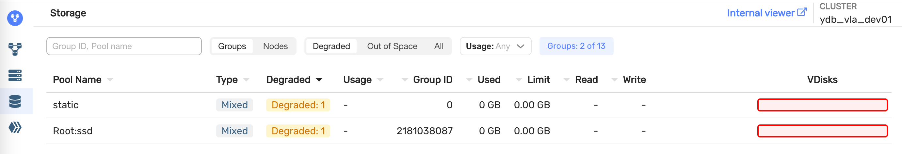

# {{ ydb-short-name }} updating

{{ ydb-short-name }} is a distributed system that supports rolling restart without downtime or performance degradation.

## Update procedure {#upgrade-order}

The basic scenario is updating the executable file and restarting each node one by one:

1. Updating and restarting storage nodes.
1. Updating and restarting dynamic nodes.

The shutdown and startup process is described on the [Safe restart and shutdown of nodes](../maintenance/manual/node_restarting.md) page.
You must update {{ ydb-short-name }} nodes one by one and monitor the cluster status after each step in [{{ ydb-short-name }} Monitoring](../maintenance/embedded_monitoring/ydb_monitoring.md): make sure the `Storage` tab has no pools in the `Degraded` status (as shown in the example below). Otherwise, stop the update process.

## Version compatibility {#version-compatability}

All minor versions within a major version are compatible for updates. Major versions are consistently compatible. To update to the next major version, you must first update to the latest minor release of the current major version. For example:

* X.Y.* → X.Y.*: Update is possible, all minor versions within a single major version are compatible.
* X.Y.Z (the latest available version in X.Y.*) → X.Y+1.* : Update is possible, major versions are consistent.
* X.Y.* → X.Y+2.*: Update is impossible, major versions are inconsistent.
* X.Y.* → X.Y-2.*: Update is impossible, major versions are inconsistent.

A list of available versions can be found on the [download page](https://ydb.tech/en/docs/downloads/).



**Examples of compatible versions:**

v.22.2.5	->	v.22.2.47: Update is possible.
v.22.2.47	->	v.22.4.21: Update is possible.
v.22.2.40	->	v.22.4.21: Update is impossible, first upgrade to the latest version (v.22.2.47).
v.22.2.47	->	v.22.5.5: Update is impossible, upgrade to the next major version (v.22.4).*



## Checking update results {#upgrade_check}

You can check the updated node versions on the `Nodes` page in Monitoring.
