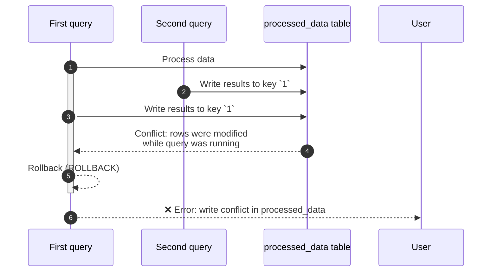
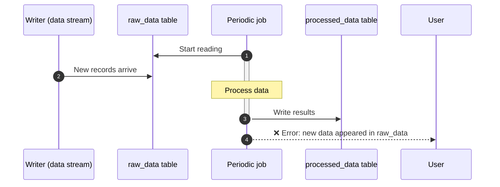

# Known limitations

This section lists important {{ydb-short-name}} behaviors to consider when designing applications and writing queries. For each item, the current behavior and possible workarounds are described.

## Transactions and isolation

### Transaction isolation levels

{{ydb-short-name}} supports different isolation levels for row-oriented (OLTP) and column-oriented (OLAP) tables.

- [Row-oriented tables](../concepts/datamodel/table.md#row-oriented-tables). Support transactions with [Serializable](../concepts/transactions.md#modes), `Online Read-Only`, and other isolation levels. This provides strict consistency for OLTP workloads.

- [Column-oriented tables](../concepts/datamodel/table.md#column-oriented-tables). All operations run in `Serializable` mode. This ensures that any analytical transaction works with a consistent snapshot of data, as if no further changes were made in the database.

The following sections describe how `Serializable` isolation works in the context of analytical (OLAP) queries.

### Serializable isolation with concurrent data access

The `Serializable` isolation level prevents read anomalies but imposes certain requirements on ETL/ELT pipeline design. Conflicts occur when data that a transaction has read or is about to modify has been modified by another transaction that has already committed.

#### Write-Write Conflict

Two concurrent tasks write to the same key range in the target table. The first task that started but runs slower will be aborted on commit, because the second, faster task has already changed those rows.



Workarounds:

- **Partition the workload:** split input data so that concurrent queries write to different tables or keys. For example, process data by day or by user IDs in separate jobs;
- **Use staging tables:** each job writes to its own temporary table. After all jobs finish, data is moved into the final table in a single transaction using `INSERT INTO ... SELECT FROM`.

#### Read-Write Conflict

A long-running analytical query reads from table `raw_data` while data is still being written to it. By the time the query finishes reading and processing, the source table has changed. {{ ydb-short-name }} detects this and aborts the query to guarantee a consistent snapshot.



##### Workaround

Use staging tables: create a temporary table with the required data and run further processing against it. This fixes the snapshot and avoids conflicts.

```sql
CREATE TABLE temp_snapshot AS SELECT * FROM raw_data WHERE ...;
-- Then work only with temp_snapshot
INSERT INTO processed_data SELECT process(t.*) FROM temp_snapshot AS t;
```

### Modifying queries to both column and row tables in one transaction are not allowed

Within a single transaction, you cannot run data-modifying (DML) operations on both row-oriented and column-oriented tables.

#### Workaround

Split the logic into two sequential transactions. Run the row table operation first, and after it completes successfully run the column table operation (or the other way around, depending on your business logic).

## Syntax specifics

### Common Table Expression (CTE) is not supported

YQL does not support the `WITH ... AS (CTE)` syntax. Instead, use named expressions with variables that start with `$`.

#### Workaround

Use named expressions. They are a syntactic analogue of CTEs and help decompose complex queries.

You can assign a name starting with `$` to part of a query using named expressions. That expression can be reused within the same query. Both table and scalar expressions are supported.

```sql
-- parameter declaration
DECLARE $days AS Int32;
$cutoff = CurrentUtcTimestamp() - $days * Interval("P1D"); -- scalar named expression

-- table named expression
$base = (
  SELECT *
  FROM raw_events
  WHERE event_ts >= $cutoff -- use scalar variable
);

-- use named expression
SELECT * FROM $base WHERE event_ts > CurrentUtcTimestamp()
```

{{ ydb-short-name }} guarantees that when a named expression is used multiple times within one transaction, the same data is read. This is ensured by the [Serializable](../concepts/transactions.md#modes) transaction isolation level.

### Correlated subqueries are not supported

A correlated subquery is a subquery that references columns from the outer query. YQL does not support such subqueries.
Most uses of correlated subqueries can be replaced with `JOIN` and aggregate functions.

#### EXISTS

Rewrite `EXISTS` as `INNER JOIN` with `DISTINCT`.

Original query:

```sql
SELECT a.* FROM A a WHERE EXISTS (
  SELECT 1 FROM B b WHERE b.key = a.key AND b.flag = 1
);
```

##### Workaround

```sql
$B_match = (
  SELECT key
  FROM B
  WHERE flag = 1
  GROUP BY key
);

SELECT DISTINCT a.*
FROM A AS a
JOIN $B_match AS b
ON b.key = a.key;
```

#### Subquery with aggregate

Scalar subquery with aggregate → aggregation + JOIN

Original query:

```sql
SELECT a.*, (SELECT MAX(ts) FROM B b WHERE b.user_id = a.user_id) AS last_ts
FROM A a;
```

##### Workaround

```sql
$B_last = (
  SELECT user_id, MAX(ts) AS last_ts
  FROM B
  GROUP BY user_id
);

SELECT a.*, bl.last_ts
FROM A AS a
LEFT JOIN $B_last AS bl
ON bl.user_id = a.user_id;
```

#### NOT EXISTS

`NOT EXISTS` → anti-join

Original query

```sql
SELECT a.* FROM A a WHERE NOT EXISTS (
  SELECT 1 FROM B b WHERE b.key = a.key AND b.flag = 1
);
```

##### Workaround

```sql
$B_keys = (SELECT DISTINCT key FROM B);

SELECT a.* FROM A AS a LEFT ONLY JOIN $B_keys AS b ON b.key = a.key;
```

### Only equi-JOIN is supported

JOIN conditions may only use the equality operator (=). Non-equi joins (>, <, >=, <=, BETWEEN) are not supported. You can move an inequality condition into the WHERE clause after a CROSS JOIN.



CROSS JOIN produces a Cartesian product. This approach is not recommended for large tables, as it can cause a large increase in intermediate data and hurt performance. Use it only when one table is very small or both tables have been filtered down to a small size.



Original query:

```sql
SELECT e.event_id, e.user_id, e.ts
FROM events AS e
JOIN periods AS p
ON e.user_id = p.user_id
 AND e.ts >= p.start_ts
```

#### Workaround

```sql
SELECT e.event_id, e.user_id, e.ts
FROM events AS e
CROSS JOIN periods AS p
WHERE e.user_id = p.user_id
  AND e.ts >= p.start_ts
```

## Data import with federated queries

{{ydb-short-name}} supports [federated queries](../concepts/federated_query/index.md) to external data sources (such as ClickHouse, PostgreSQL, and others). This mechanism is intended for quick ad-hoc analytics and joining data on the fly, but is not optimal for bulk or regular loading of large volumes of data (ETL/ELT). When using federated queries for import, you may run into limitations on supported data types and query execution.

### Workaround

1. Export data from your DBMS to an open format (CSV is recommended) into a {{ objstorage-name }} bucket. Use the `INSERT INTO ... SELECT FROM` command to read from an external table bound to your bucket in {{ objstorage-name }}. This approach allows efficient parallel reads.
2. For continuous replication or complex pipelines, use standard industry tools that integrate with {{ydb-short-name }}:
    - Change Data Capture (CDC): tools such as Debezium can capture changes from your OLTP database transaction log and deliver them to {{ydb-short-name}}.
    - ETL/ELT frameworks: systems like Apache Spark or Apache NiFi have connectors to {{ydb-short-name}} and let you build flexible, powerful data processing and loading pipelines.

Limitation lists:

- [ClickHouse](../concepts/federated_query/clickhouse.md#limitations)
- [Greenplum](../concepts/federated_query/greenplum.md#limitations)
- [Microsoft SQL Server](../concepts/federated_query/ms_sql_server.md#limitations)
- [MySQL](../concepts/federated_query/mysql.md#limitations)
- [PostgreSQL](../concepts/federated_query/postgresql.md#limitations)
- [YDB](../concepts/federated_query/ydb.md#limitations)

```sql
-- Parameters (example as variables)
DECLARE $yc_key    AS String;
DECLARE $yc_secret AS String;

-- 1) External S3 source with Yandex Cloud endpoint
CREATE EXTERNAL DATA SOURCE s3_backup_ds
WITH (
  SOURCE_TYPE = "S3",
  LOCATION    = "https://storage.yandexcloud.net",  -- YC endpoint
  AUTH_METHOD = "AWS",
  AWS_ACCESS_KEY_ID     = $yc_key,
  AWS_SECRET_ACCESS_KEY = $yc_secret
);

-- 2) External "table" (folder with CSV in bucket)
CREATE EXTERNAL TABLE s3_my_columnstore_table_backup
WITH (
  DATA_SOURCE = "s3_backup_ds",
  LOCATION    = "s3://my-bucket/ydb-backups/processed_data/full/",  -- path in Object Storage
  FORMAT      = "CSV"
)(
  id Uint64,
  event_dt Datetime,
  value String
  -- ... other columns of your CS table ...
);

-- 3) Export
INSERT INTO s3_my_columnstore_table_backup
SELECT * FROM my_columnstore_table;

-- 4) Restore data
INSERT INTO my_columnstore_table
SELECT *
FROM s3_my_columnstore_table_backup;
```

## Partition count is fixed at creation time

In {{ydb-short-name}}, the number of partitions (data segments) for a column table is set once at creation and cannot be changed later.

Choosing the right partition count is an important part of schema design.

- Too few partitions: can lead to uneven load on compute nodes (hotspots) and limit query parallelism.
- Too many partitions: can create excessive load on the database control plane (Scheme Shard) and increase query overhead.

### Workaround

- Initial partition count: as a rough estimate, you can use the formula `(number of nodes * 4)`. This helps utilize cluster resources for parallel queries.
- Choose the partition count with expected data growth and cluster size in mind.
- The total number of partitions across all tables in one database must not exceed **2000**.
- To increase the partition count, create a new table and migrate data with `CREATE TABLE (PRIMARY KEY (a, b)) PARTITION BY HASH(a) WITH(STORE=COLUMN, PARTITION_COUNT=96) new_table AS SELECT * FROM old_table;`.

## No secondary indexes or skip indexes

Analytical query performance with column storage is achieved through mechanisms based on physical data layout: columnar storage, partitioning, and ordering by primary key.

### Workaround

Pay close attention to partitioning and primary keys as described in the [{#T}](../dev/primary-key/column-oriented.md) section.

## Mixing OLTP and OLAP in one database is not recommended

OLTP and OLAP workloads have opposite resource requirements, and mixing them usually degrades performance for both.

- OLTP (row tables) is many short, fast transactions (key-based read/write) that are latency-sensitive.
- OLAP (column tables) is typically long, resource-intensive queries that scan large amounts of data, perform aggregation, and use CPU, memory, and I/O heavily.

When a heavy OLAP query runs, it can monopolize cluster resources, so fast OLTP queries queue up and their latency increases.

Mixing OLTP and OLAP workloads in one database is not recommended. OLAP workloads can negatively affect OLTP and increase query execution time.

### Workaround

For stable, predictable performance in both tiers, use two separate {{ ydb-short-name }} databases: one for OLTP and one for OLAP. To sync data between them, use Change Data Capture (CDC) and the [{#T}](../concepts/transfer.md) service, which streams changes from the OLTP database to the OLAP database.
