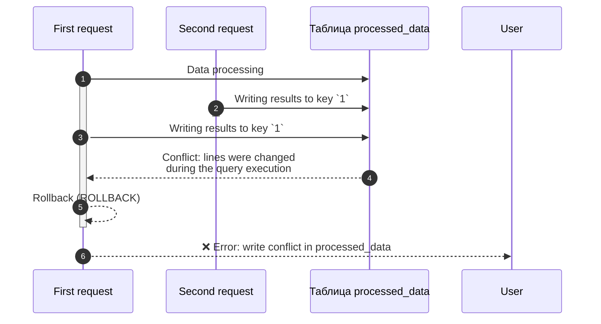
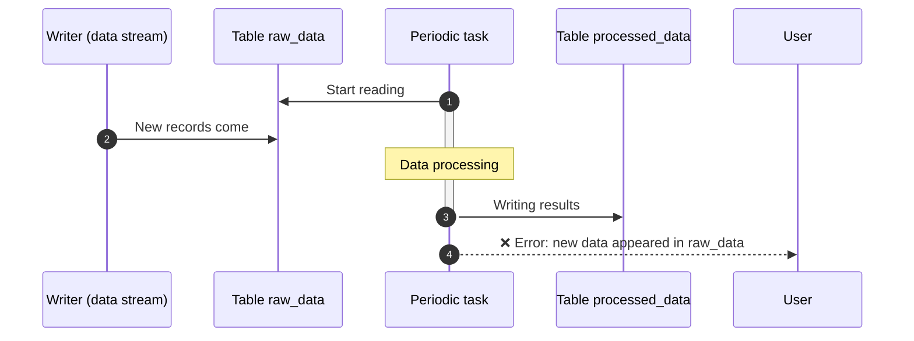

# Limitations

This section collects important features of {{ydb-short-name}} that must be considered when designing applications and writing queries. For each feature, the current behavior and possible workarounds are described.

## Transactions and isolation

### Transaction isolation levels

{{ydb-short-name}} supports different isolation levels for row-oriented (OLTP) and column-oriented (OLAP) tables.

- [Row-oriented tables](../concepts/datamodel/table.md#row-oriented-tables). Support transactions with [Serializable](../concepts/transactions.md#modes), `Online Read-Only`, and other isolation levels. This ensures strict consistency for OLTP workloads.

- [Column-oriented tables](../concepts/datamodel/table.md#column-oriented-tables). All operations are performed in the `Serializable` mode. This guarantees that any analytical transaction works with a consistent data slice, as if no changes had occurred in the database.

The following section discusses the features of working with the `Serializable` mode in the context of analytical (OLAP) queries.

### Features of Serializable isolation when working with data in parallel

The `Serializable` isolation level guarantees the absence of read anomalies, but imposes certain requirements on the design of ETL/ELT pipelines. Conflicts occur if data that a transaction has read or is about to change has been changed by another, already completed transaction.

#### Write-Write Conflict

Two parallel tasks try to write data to the same key range in the output table. The first task, which started execution but works slower, will be canceled when the commit attempt is made because the second, faster task has already changed these lines.



Possible solutions:

- **Partitioning of the load:** divide the input data so that parallel requests write data to different tables or keys. For example, process data by day or by user identifiers in different tasks;
- **Using intermediate tables:** each task writes the result to its own temporary table. After all tasks are completed, the data from the temporary tables is transferred to the final table in one transaction using `INSERT INTO ... SELECT FROM`.

#### Read-Write Conflict

A long analytical query reads data from the `raw_data` table, which is also being written to at the same time. By the time the query completes reading and processing, the original table has already changed. {{ ydb-short-name }} detects this and cancels the query to ensure consistency of the slice.



##### Solution

Using intermediate tables: create a temporary table with the necessary data and perform further processing with it. This fixes the data state and eliminates conflicts.

```sql
CREATE TABLE temp_snapshot AS SELECT * FROM raw_data WHERE ...;
-- Further work only with temp_snapshot
INSERT INTO processed_data SELECT process(t.*) FROM temp_snapshot AS t;
```

### Modifying queries to column-oriented and row-oriented tables are prohibited

It is not possible to perform data modification (DML) operations simultaneously for both row-oriented and column-oriented tables within a single transaction.

#### Solution

Separate the logic into two sequential transactions. First, perform the operation on the row-oriented table, and after its successful completion, perform the operation on the column-oriented table (or vice versa, depending on the business logic).

## Syntax features

### Common table expression (CTE) are not supported

YQL does not support the syntax `WITH ... AS (CTE)`. Instead, the mechanism of named expressions is used with variables starting with the `$` sign.

#### Solution

Using named expressions (named expressions). This is a syntactic equivalent of CTE, which allows you to decompose complex queries.

Part of the query can be extracted into a separate expression and given a name starting with `$` using the mechanism of named expressions. Such an expression can be used multiple times within a single query. It supports both table and scalar expressions.

```sql
-- declaration of a parameter
DECLARE $days AS Int32;
$cutoff = CurrentUtcTimestamp() - $days * Interval("P1D"); -- creation of a scalar named expression

-- creation of a table named expression
$base = (
  SELECT *
  FROM raw_events
  WHERE event_ts >= $cutoff -- use of a scalar variable
);

-- use of a named expression
SELECT * FROM $base WHERE event_ts > CurrentUtcTimestamp()
```

{{ ydb-short-name }} guarantees that when a named expression is used multiple times within a single transaction, the same data will be read. This is ensured by the transaction isolation level [Serializable](../concepts/transactions.md#modes).

### Correlated subqueries are not supported

A correlated subquery is a subquery that references columns from an external query. In YQL, such subqueries are not supported.
Most cases of using correlated subqueries can be replaced with `JOIN` and aggregate functions.

#### EXISTS

Conversion of `EXISTS` → `INNER JOIN` using `DISTINCT`.

Original query:

```sql
SELECT a.* FROM A a WHERE EXISTS (
  SELECT 1 FROM B b WHERE b.key = a.key AND b.flag = 1
);
```

##### Solution

```sql
$B_match = (
  SELECT key
  FROM B
  WHERE flag = 1
  GROUP BY key
);

SELECT DISTINCT a.*
FROM A AS a
JOIN $B_match AS b
ON b.key = a.key;
```

#### Subquery with an aggregate

Scalar subquery with an aggregate → aggregation + JOIN

Original query:

```sql
SELECT a.*, (SELECT MAX(ts) FROM B b WHERE b.user_id = a.user_id) AS last_ts
FROM A a;
```

##### Solution

```sql
$B_last = (
  SELECT user_id, MAX(ts) AS last_ts
  FROM B
  GROUP BY user_id
);

SELECT a.*, bl.last_ts
FROM A AS a
LEFT JOIN $B_last AS bl
ON bl.user_id = a.user_id;
```

#### NOT EXISTS

`NOT EXISTS` → anti-JOIN

Original query

```sql
SELECT a.* FROM A a WHERE NOT EXISTS (
  SELECT 1 FROM B b WHERE b.key = a.key AND b.flag = 1
);
```

##### Solution

```sql
$B_keys = (SELECT DISTINCT key FROM B);

SELECT a.* FROM A AS a LEFT ONLY JOIN $B_keys AS b ON b.key = a.key;
```

### Only equi-JOIN (JOIN by equality) is supported

Conditions in JOIN can only contain the equality operator (=). JOINs by inequality (>, <, >=, <=, BETWEEN) are not supported. The inequality condition can be moved to the WHERE section after CROSS JOIN.



CROSS JOIN creates a Cartesian product of tables. This approach is not recommended for large tables, as it leads to an explosive growth of intermediate data and degradation of performance. Use it only if one of the tables is very small or both tables have been pre-filtered to a small size.



Original query:

```sql
SELECT e.event_id, e.user_id, e.ts
FROM events AS e
JOIN periods AS p
ON e.user_id = p.user_id
 AND e.ts >= p.start_ts
```

#### Solution

```sql
SELECT e.event_id, e.user_id, e.ts
FROM events AS e
CROSS JOIN periods AS p
WHERE e.user_id = p.user_id
  AND e.ts >= p.start_ts
```

## Importing data using federated queries

{{ydb-short-name}} supports [federated queries](../concepts/federated_query/index.md) to external data sources (such as ClickHouse, PostgreSQL, etc.). This mechanism is designed for quick ad-hoc analytics and data "on the fly" merging, but is not an optimal tool for mass and regular loading of large volumes of data (ETL/ELT). When using federated queries for import, you may encounter limitations on supported data types and query execution.

### Solution

1. Export data from your database to one of the open formats (recommended `CSV`) to the {{ objstorage-name }} bucket. Use the `INSERT INTO ... SELECT FROM` command to read data from an external table associated with your bucket in {{ objstorage-name }}. This approach allows efficient parallel reading of data.
2. For continuous replication or building complex pipelines, use standard industry tools that integrate with {{ydb-short-name }}:
    - Change Data Capture (CDC): tools like Debezium can capture changes from the transaction log of your OLTP database and deliver them to {{ydb-short-name}}.
    - ETL/ELT frameworks: systems such as Apache Spark or Apache NiFi have connectors to {{ydb-short-name}} and allow building flexible and powerful pipelines for data processing and loading.

List of limitations:

- [ClickHouse](../concepts/federated_query/clickhouse.md#limitations)
- [Greenplum](../concepts/federated_query/greenplum.md#limitations)
- [Microsoft SQL Server](../concepts/federated_query/ms_sql_server.md#limitations)
- [MySQL](../concepts/federated_query/mysql.md#limitations)
- [PostgreSQL](../concepts/federated_query/postgresql.md#limitations)
- [YDB](../concepts/federated_query/ydb.md#limitations)

```sql
-- Parameters (for example — as variables)
DECLARE $yc_key    AS String;
DECLARE $yc_secret AS String;

-- 1) External S3 source with Yandex Cloud endpoint
CREATE EXTERNAL DATA SOURCE s3_backup_ds
WITH (
  SOURCE_TYPE = "S3",
  LOCATION    = "https://storage.yandexcloud.net",  -- endpoint YC
  AUTH_METHOD = "AWS",
  AWS_ACCESS_KEY_ID     = $yc_key,
  AWS_SECRET_ACCESS_KEY = $yc_secret
);

-- 2) External "table" (folder with CSV in the bucket)
CREATE EXTERNAL TABLE s3_my_columnstore_table_backup
WITH (
  DATA_SOURCE = "s3_backup_ds",
  LOCATION    = "s3://my-bucket/ydb-backups/processed_data/full/",  -- path in Object Storage
  FORMAT      = "CSV"
)(
  id Uint64,
  event_dt Datetime,
  value String
  -- ... other columns of your CS-table ...
);

-- 3) Export
INSERT INTO s3_my_columnstore_table_backup
SELECT * FROM my_columnstore_table;

-- 4) Data recovery
INSERT INTO my_columnstore_table
SELECT *
FROM s3_my_columnstore_table_backup;
```

## The number of partitions is fixed when creating

In {{ydb-short-name}} the number of partitions (data segments) for a column-oriented table is set once when it is created and cannot be changed later.

The correct choice of the number of partitions is an important aspect of data schema design.

- Too few partitions: can lead to uneven loading of computational nodes (hotspots) and limit the parallelism of query execution.
- Too many partitions: can create excessive load on the database management component (Scheme Shard) and increase the overhead of processing queries.

### Solution

- Initial number of partitions: for a basic estimate of the number of partitions, you can use the formula `(number of nodes * 4)`. This will allow you to maximally utilize the resources of the cluster when executing parallel queries.
- Choose the number of partitions taking into account the expected growth of data volume and the increase in the number of nodes in the cluster.
- The total number of partitions in all tables of a database should not exceed **2000**.
- If you need to increase the number of partitions, you can create a new table and transfer the data to it using the query `CREATE TABLE (PRIMARY KEY (a, b)) PARTITION BY HASH(a) WITH(STORE=COLUMN, PARTITION_COUNT=96) new_table AS SELECT * FROM old_table;`.

## Secondary indexes and skip indexes are not supported

The performance of analytical queries with column-oriented data storage is achieved through mechanisms based on physical data organization: column storage, partitioning, sorting by primary key.

### Solution

Pay special attention to the partitioning keys and primary keys, as described in the section [{#T}](../dev/primary-key/column-oriented.md).

## It is not recommended to mix OLTP and OLAP in one database

OLTP and OLAP loads impose opposite requirements for resources, and their mixing almost always leads to mutual performance degradation.

- OLTP load (row-oriented tables) is a set of short, fast transactions (read/write by key), critical to latency.
- OLAP load (column-oriented tables) is usually long and resource-intensive queries that scan large volumes of data, perform aggregation, and actively consume CPU, memory, and disk input/output.

When a heavy OLAP query starts executing, it can monopolize the resources of the cluster, causing fast OLTP queries to queue up and their response time to increase.

It is not recommended to mix OLTP and OLAP loads in one database. OLAP loads can negatively affect OLTP, increasing the time to execute queries.

### Solution

To ensure stable and predictable performance for both loops, use two separate databases {{ ydb-short-name }}: one for OLTP, one for OLAP. Use the Change Data Capture (CDC) mechanism and the [{#T}](../concepts/transfer.md) service to deliver changes from the OLTP database to the OLAP database in a streaming mode.

