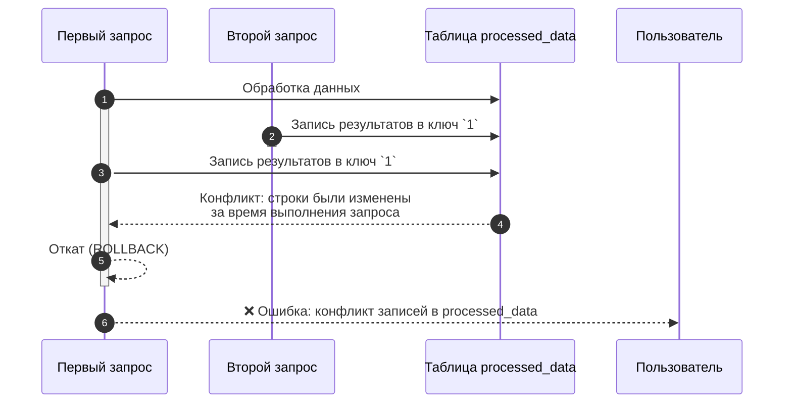
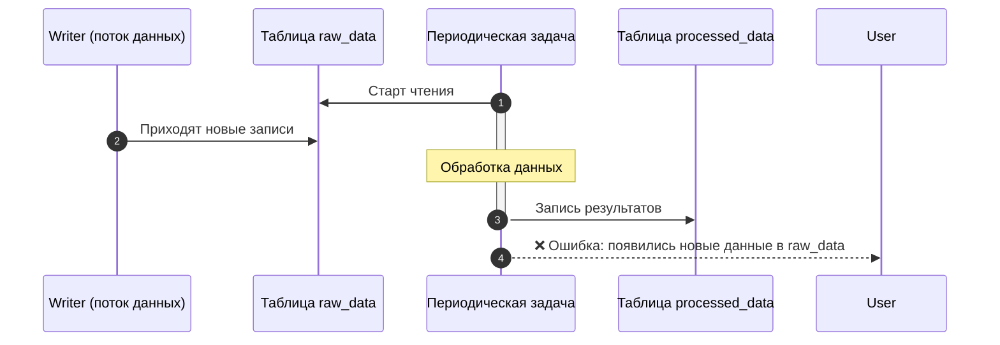

# Known limitations

This section covers important features of {{ydb-short-name}} that you need to consider when designing applications and writing queries. For each feature, the current behavior and possible workarounds are described.

## Transactions and isolation

### Transaction isolation levels

{{ydb-short-name}} supports different isolation levels for row-based (OLTP) and column-based (OLAP) tables.

- [Row-based tables](../concepts/datamodel/table.md#row-oriented-tables). They support transactions with isolation levels [Serializable](../concepts/transactions.md#modes), `Online Read-Only`, and others. This ensures strict consistency for OLTP workloads.
- [Column-based tables](../concepts/datamodel/table.md#column-oriented-tables). All operations are performed in `Serializable` mode. This guarantees that any analytical transaction works with a consistent snapshot of data, as if no further changes were occurring in the database.

The following discusses the specifics of working with `Serializable` mode in the context of analytical (OLAP) queries.

### Features of Serializable isolation with concurrent data access

The `Serializable` isolation level guarantees no read anomalies but imposes certain requirements on the design of ETL/ELT pipelines. Conflicts occur if data that a transaction has read or intends to modify has been changed by another, already completed transaction.

#### Write-write conflict

Two concurrent tasks attempt to write data to the same key range in the output table. The first task, which started execution but is slower, will be canceled upon commit attempt because the second, faster task has already modified those rows.





Solution options:

- **Load partitioning:** split the input data so that parallel queries write data to different tables or keys. For example, process data by day or by user IDs in separate tasks.
- **Using intermediate tables:** each task writes its result to its own temporary table. After all tasks complete, data from the temporary tables is moved to the final table in a single transaction using `INSERT INTO ... SELECT FROM`.

#### Read-write conflict

A long-running analytical query reads data from the `raw_data` table, into which writes are still occurring at the same time. By the time the query finishes reading and processing, the source table has already changed. {{ ydb-short-name }} detects this and cancels the query to guarantee snapshot consistency.





##### Solution

Using intermediate tables: Create a temporary table with the required data and perform further processing with it. This fixes the data state and eliminates conflicts.


```sql
CREATE TABLE temp_snapshot AS SELECT * FROM raw_data WHERE ...;
-- Next, we work only with temp_snapshot
INSERT INTO processed_data SELECT process(t.*) FROM temp_snapshot AS t;
```


### Modifying queries to column-based and row-based tables simultaneously are prohibited

Within a single transaction, it is impossible to perform data modification operations (DML) simultaneously for both row-based and column-based tables.

#### Solution

Split the logic into two sequential transactions. First, perform the operation on the row-based table, and after its successful completion, on the column-based table (or vice versa, depending on business logic).

## Syntax specifics

### Common table expressions (CTEs) are not supported

YQL does not support the `WITH ... AS (CTE)` syntax. Instead, it uses the named expression mechanism with variables starting with the `$` sign.

#### Solution

Use named expressions. This is a syntactic equivalent of CTE that allows decomposing complex queries.

A part of a query can be extracted into a separate expression and given a name starting with `$` using the named expression mechanism. Such an expression can be used multiple times within a single query. Usage is supported for both table and scalar expressions.


```sql
-- parameter declaration
DECLARE $days AS Int32;
$cutoff = CurrentUtcTimestamp() - $days * Interval("P1D"); -- creating a scalar named expression

-- creating a table named expression
$base = (
  SELECT *
  FROM raw_events
  WHERE event_ts >= $cutoff -- using a scalar variable
);

-- using a named expression
SELECT * FROM $base WHERE event_ts > CurrentUtcTimestamp()
```


{{ ydb-short-name }} guarantees that when a named expression is used multiple times within a single transaction, the same data will be read. This is ensured by the [Serializable](../concepts/transactions.md#modes) transaction isolation level.

### Lack of support for correlated subqueries

A correlated subquery is a subquery that references columns from an outer query. Such subqueries are not supported in YQL.
Most use cases of correlated subqueries can be replaced using `JOIN` and aggregate functions.

#### EXISTS

Transformation of `EXISTS` → `INNER JOIN` using `DISTINCT`.

Original query:


```sql
SELECT a.* FROM A a WHERE EXISTS (
  SELECT 1 FROM B b WHERE b.key = a.key AND b.flag = 1
);
```


##### Solution


```sql
$B_match = (
  SELECT key
  FROM B
  WHERE flag = 1
  GROUP BY key
);

SELECT DISTINCT a.*
FROM A AS a
JOIN $B_match AS b
ON b.key = a.key;
```


#### Subquery with aggregate

Scalar subquery with aggregate → aggregation + JOIN

Original query:


```sql
SELECT a.*, (SELECT MAX(ts) FROM B b WHERE b.user_id = a.user_id) AS last_ts
FROM A a;
```


##### Solution


```sql
$B_last = (
  SELECT user_id, MAX(ts) AS last_ts
  FROM B
  GROUP BY user_id
);

SELECT a.*, bl.last_ts
FROM A AS a
LEFT JOIN $B_last AS bl
ON bl.user_id = a.user_id;
```


#### NOT EXISTS

`NOT EXISTS` → anti-join

Original query


```sql
SELECT a.* FROM A a WHERE NOT EXISTS (
  SELECT 1 FROM B b WHERE b.key = a.key AND b.flag = 1
);
```


##### Solution


```sql
$B_keys = (SELECT DISTINCT key FROM B);

SELECT a.* FROM A AS a LEFT ONLY JOIN $B_keys AS b ON b.key = a.key;
```


### Support for equi-JOIN only

JOIN conditions can only contain the equality operator (=). Non-equi joins (>, <, >=, <=, BETWEEN) are not supported. The inequality condition can be moved to the WHERE clause after a CROSS JOIN.



CROSS JOIN creates a Cartesian product of tables. This approach is not recommended for large tables as it leads to an explosive growth of intermediate data volume and performance degradation. Use it only if one of the tables is very small or both tables have been pre-filtered to a small size.



Original query:


```sql
SELECT e.event_id, e.user_id, e.ts
FROM events AS e
JOIN periods AS p
ON e.user_id = p.user_id
 AND e.ts >= p.start_ts
```


#### Solution


```sql
SELECT e.event_id, e.user_id, e.ts
FROM events AS e
CROSS JOIN periods AS p
WHERE e.user_id = p.user_id
  AND e.ts >= p.start_ts
```


## Importing data using federated queries

{{ydb-short-name}} supports [federated queries](../concepts/query_execution/federated_query/index.md) to external data sources (such as ClickHouse, PostgreSQL, etc.). This mechanism is designed for fast ad-hoc analytics and on-the-fly data joining, but is not an optimal tool for bulk and regular loading of large data volumes (ETL/ELT). When using federated queries for import, you may encounter limitations on supported data types and query execution.

### Solution

1. Export data from your DBMS to one of the open formats (recommended `CSV`) into a {{ objstorage-name }} bucket. Use the `INSERT INTO ... SELECT FROM` command to read data from an external table associated with your bucket in {{ objstorage-name }}. This approach allows efficient parallelization of data reading.
2. For continuous replication tasks or building complex pipelines, use standard industry tools that integrate with {{ydb-short-name }}:

   - Change Data Capture (CDC): tools like Debezium can capture changes from the transaction log of your OLTP database and deliver them to {{ydb-short-name}}.
   - ETL/ELT frameworks: systems such as Apache Spark or Apache NiFi have connectors to {{ydb-short-name}} and allow building flexible and powerful data processing and loading pipelines.

List of limitations:






```sql
-- Parameters (for example, as variables)
DECLARE $yc_key    AS String;
DECLARE $yc_secret AS String;

-- 1) External S3 source with Yandex Cloud endpoint
CREATE EXTERNAL DATA SOURCE s3_backup_ds
WITH (
  SOURCE_TYPE = "S3",
  LOCATION    = "https://storage.yandexcloud.net",  -- endpoint YC
  AUTH_METHOD = "AWS",
  AWS_ACCESS_KEY_ID     = $yc_key,
  AWS_SECRET_ACCESS_KEY = $yc_secret
);

-- 2) External "table" (directory with CSV in bucket)
CREATE EXTERNAL TABLE s3_my_columnstore_table_backup
WITH (
  DATA_SOURCE = "s3_backup_ds",
  LOCATION    = "s3://my-bucket/ydb-backups/processed_data/full/",  -- path in Object Storage
  FORMAT      = "CSV"
)(
  id Uint64,
  event_dt Datetime,
  value String
  -- ... other columns of your CSV table ...
);

-- 3) Export
INSERT INTO s3_my_columnstore_table_backup
SELECT * FROM my_columnstore_table;

-- 4) Data recovery
INSERT INTO my_columnstore_table
SELECT *
FROM s3_my_columnstore_table_backup;
```


## Number of partitions is fixed at creation

In {{ydb-short-name}}, the number of partitions (data segments) for a columnar table is set once at creation and cannot be changed later.

Choosing the correct number of partitions is an important aspect of data schema design.

- Too few partitions: may lead to uneven load on compute nodes (hotspots) and limit query parallelism.
- Too many partitions: may create excessive load on the database management component (Scheme Shard) and increase query processing overhead.

### Solution

- Initial number of partitions: for a basic estimate of the number of partitions, you can use the formula `(number of nodes * 4)`. This will maximize cluster resource utilization when executing parallel queries.
- Choose the number of partitions considering the expected growth of data volume and increase in the number of nodes in the cluster.
- The total number of partitions across all tables in a single database must not exceed **2000**.
- If you need to increase the number of partitions, you can create a new table and move data into it using the `CREATE TABLE (PRIMARY KEY (a, b)) PARTITION BY HASH(a) WITH(STORE=COLUMN, PARTITION_COUNT=96) new_table AS SELECT * FROM old_table;` query.

## No secondary indexes or skip indexes

The performance of analytical queries with columnar data storage is achieved through mechanisms based on physical data organization: columnar storage, partitioning, sorting by primary key.

### Solution

Pay special attention to partitioning keys and primary keys, as described in the [{#T}](../dev/primary-key/column-oriented.md) section.

## Mixing OLTP and OLAP in the same database is not recommended

OLTP and OLAP workloads impose opposite resource requirements, and mixing them almost always leads to mutual performance degradation.

- OLTP workload (row-based tables) is a set of short, fast transactions (key-based read/write) that are latency-critical.
- OLAP workload (column-based tables) is typically long-running and resource-intensive queries that scan large volumes of data, perform aggregation, and actively consume CPU, memory, and disk I/O.

When a heavy OLAP query starts executing, it can monopolize cluster resources, causing fast OLTP queries to queue up and increasing their response time.

It is not recommended to combine OLTP and OLAP workloads in the same database. OLAP workloads can negatively affect OLTP, increasing query execution time.

### Solution

To ensure stable and predictable performance for both workloads, use two separate {{ ydb-short-name }} databases: one for OLTP and another for OLAP. To synchronize data between them, use the Change Data Capture (CDC) mechanism and the [{#T}](../concepts/transfer.md) service, which allows streaming changes from the OLTP database to the OLAP database.
