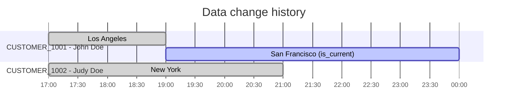

# Using the merge process to implement SCD2 in {{ ydb-full-name }}

This article describes the implementation of the [Slowly Changing Dimensions Type 2 (SCD2)](./index.md#scd2) pattern in {{ ydb-full-name }} using the change merge process.

## Tools used

To populate data into the SCD2 table in this article, the following combination of features available in {{ ydb-short-name }} will be used:

1. The source table `dimension_scd_changes`, containing information about attributes, their values, and moments of data changes.
1. The target table `dimension_scd2_final` to store the resulting data.
1. An external application should periodically run a query to merge changes accumulated in the `dimension_scd_changes` table into the `dimension_scd2_final` table.
1. To deliver data from staging tables into SCD2 format, it is convenient to use the built-in {{ydb-short-name}} [transfer mechanism](../../../concepts/transfer.md).



The tables `dimension_scd_changes`, `dimension_scd2_final` are given for illustration. For actual queries, you will need to adapt the structure of tables and their attributes accordingly.



## Creating a table to receive all Changes `dimension_scd_changes`

```sql
CREATE TABLE dimension_scd_changes (
    id Utf8 NOT NULL, -- Business key
    attribute1 Utf8,  -- Data attribute
    attribute2 Utf8,  -- Data attribute
    change_time Timestamp NOT NULL, -- Moment of data change
    operation Utf8, -- Type of data change
    PRIMARY KEY (change_time, id)
)
PARTITION BY HASH(change_time, id)
WITH (
    STORE=COLUMN
)
```

Table field descriptions:

- `id` — business key of the record;
- `attribute1`, `attribute2` — dimension attributes;
- `change_time` — timestamp when the data changed;
- `operation` — type of change: `CREATE`, `UPDATE`, or `DELETE`.

The primary key is created as `PRIMARY KEY (change_time, id)` because there may be multiple changes on the same business key, and it is important to store all those changes. For details on choosing the primary key and partitioning key, see the documentation: [choosing a primary key](../../../dev/primary-key/column-oriented.md) and [choosing a partition key](../../../dev/primary-key/column-oriented.md).

## Creating the final SCD2 table `dimension_scd2_final`

```sql
CREATE TABLE dimension_scd2_final (
    id Utf8 NOT NULL, -- Business key
    attribute1 Utf8,  -- Data attribute
    attribute2 Utf8,  -- Data attribute
    valid_from Timestamp NOT NULL, -- Timestamp from which the data is valid
    valid_to Timestamp,            -- Timestamp until which the data is valid.
                                   -- If the data is currently valid, then valid_to is NULL
    is_current Uint8,              -- Indicator that the data is currently valid.
    is_deleted Uint8,              -- Indicator that the data was deleted. If deleted, is_current = FALSE
    PRIMARY KEY (valid_from, id)
)
PARTITION BY HASH(valid_from, id)
WITH(
    STORE=COLUMN
)
```

Table field descriptions:

- `id` — business key of the record;
- `attribute1`, `attribute2` — dimension attributes;
- `valid_from` — timestamp from which the record becomes valid;
- `valid_to` — timestamp until which the record was valid, or `NULL` for current records;
- `is_current` — flag indicating if the record is current (1 for current, 0 for historical);
- `is_deleted` — flag indicating if the record was deleted (1 if deleted, 0 otherwise).

The primary key is created as `PRIMARY KEY (valid_from, id)` for the same reasons as above: there may be multiple changes per key, and all those changes must be stored.

## Loading data into the change table

You can use any available method to load data into the change table, as well as the automatic delivery of changes using the [transfer](../../../concepts/transfer.md) mechanism.

Example query for explicitly loading changes:

```sql
UPSERT INTO dimension_scd_changes (id, attribute1, attribute2, change_time, operation)
VALUES ('CUSTOMER_1001', 'John Doe', 'Los Angeles', Unwrap(CAST('2025-08-22T17:00:00Z' as Timestamp)), 'CREATE');

UPSERT INTO dimension_scd_changes (id, attribute1, attribute2, change_time, operation)
VALUES ('CUSTOMER_1002', 'John Doe', 'New York', Unwrap(CAST('2025-08-22T17:00:00Z' as Timestamp)), 'CREATE');

UPSERT INTO dimension_scd_changes (id, attribute1, attribute2, change_time, operation)
VALUES ('CUSTOMER_1001', 'John Doe', 'San Francisco', Unwrap(CAST('2025-08-22T19:00:00Z' as Timestamp)), 'UPDATE');

UPSERT INTO dimension_scd_changes (id, attribute1, attribute2, change_time, operation)
VALUES ('CUSTOMER_1002', 'John Doe', 'New York', Unwrap(CAST('2025-08-22T21:00:00Z' as Timestamp)), 'DELETE');
```

## Query for applying changes in SCD2 format

A special query is used to transform data from the changes table into SCD2 format and load it into the final table. This query should be run regularly—with whatever frequency you want to update data in the final table. For automatic execution, you can use the {{ ydb-short-name }} [integration](../../../integrations/orchestration/airflow.md) with Apache Airflow™:

```sql
-- Step 1: Read all new events from the `dimension_scd_changes` table.
-- This named expression ($changes) serves as the initial dataset for all subsequent processing in this run.
$changes = (
    SELECT
        id,
        attribute1,
        attribute2,
        change_time,
        String::AsciiToUpper(operation) AS op
    FROM dimension_scd_changes
);

-- Step 2: Filter events, keeping only those not yet present in the target table.
-- The goal of this step is to ensure read-level idempotency, avoiding reprocessing
-- of already loaded data in case of a script failure and restart.
$unprocessed_data = (
    SELECT
        chg.id AS id,
        chg.attribute1 AS attribute1,
        chg.attribute2 AS attribute2,
        chg.change_time AS change_time,
        chg.op AS op
    FROM $changes AS chg
    LEFT JOIN dimension_scd2_final AS scd
        ON chg.id = scd.id AND chg.change_time = scd.valid_from -- Look for records by each entity (id) and change timestamp
    WHERE scd.id IS NULL -- Exclude rows already transferred to the dimension_scd2_final table earlier
);

-- Step 3: Find active records (`is_current=1`) in the target table that have received updates.
-- Generate "closing" versions for them, setting `valid_to` to the timestamp
-- of the earliest change from the new batch ($unprocessed_data).
$close_open_intervals = (
    SELECT
        target.id AS id,
        target.attribute1 as attribute1,
        target.attribute2 as attribute2,
        target.valid_from as valid_from,
        0ut AS is_current, -- The closing record is no longer current
        unprocessed_data.change_time AS valid_to,
        target.is_deleted as is_deleted
    FROM dimension_scd2_final AS target
    INNER JOIN (
        SELECT
            id,
            MIN(change_time) AS change_time
        FROM $unprocessed_data
        GROUP BY id
    ) AS unprocessed_data
    ON target.id = unprocessed_data.id
    WHERE target.is_current = 1ut
);

-- Step 4: Transform the stream of unprocessed events into versioned records (rows to insert).
-- Here, all necessary attributes for new versions are calculated: `valid_to`, `is_current`, `is_deleted`.
$updated_data = (
    SELECT
        t.id AS id,
        t.attribute1 AS attribute1,
        t.attribute2 AS attribute2,
        t.is_deleted AS is_deleted,
        -- Logic for the `is_current` flag: it is set to 1 only for the last
        -- record in the chain (`next_change_time IS NULL`), and only if it is not
        -- a delete operation (`is_deleted == 0`).
        IF(t.next_change_time IS NOT NULL OR t.is_deleted == 1ut, 0ut, 1ut) AS is_current,
        t.change_time AS valid_from,
        t.next_change_time AS valid_to
    FROM (
        -- Subquery calculates the delete flag (`is_deleted`)
        -- and the timestamp of the next event (`next_change_time`) using the LEAD window function.
        SELECT
            unprocessed_data.id AS id,
            unprocessed_data.attribute1 AS attribute1,
            unprocessed_data.attribute2 AS attribute2,
            unprocessed_data.op AS op,
            unprocessed_data.change_time AS change_time,
            IF(unprocessed_data.op = "DELETE", 1ut, 0ut) AS is_deleted,
            LEAD(unprocessed_data.change_time) OVER (PARTITION BY id ORDER BY unprocessed_data.change_time) AS next_change_time
        FROM $unprocessed_data AS unprocessed_data
    ) AS t
);

-- Step 5: Atomically apply all calculated changes to the target table.
-- UPSERT will update existing records (from $close_open_intervals) and insert new ones (from $updated_data).
UPSERT INTO dimension_scd2_final (id, attribute1, attribute2, is_current, is_deleted, valid_from, valid_to)
SELECT
    id,
    attribute1,
    attribute2,
    is_current,
    is_deleted,
    valid_from,
    valid_to
FROM $close_open_intervals
UNION ALL
SELECT
    id,
    attribute1,
    attribute2,
    is_current,
    is_deleted,
    valid_from,
    valid_to
FROM $updated_data;

-- Step 6: Clear the staging table of processed records.
DELETE FROM dimension_scd_changes ON
SELECT id, change_time FROM $changes;
```

## Demonstration of work

In the example below, the entity **Customer** is considered:

- business key — field `id`,
- attributes — `attribute1` (full name) and `attribute2` (city).

At `2025-08-22 17:00` two customers are created (John in Los Angeles - with id `CUSTOMER_1001` and Judy in New York with id `CUSTOMER_1002`), at `2025-08-22 19:00` customer `CUSTOMER_1001` updates his city to San Francisco `UPDATE`, and at `2025-08-22 21:00` customer `CUSTOMER_1002` is deleted `DELETE`.

| id             | attribute1 | attribute2    | change\_time     | operation |
| -------------- | ---------- | ------------- | ---------------- | --------- |
| CUSTOMER\_1001 | John Doe   | Los Angeles   | 2025-08-22 17:00 | CREATE    |
| CUSTOMER\_1002 | Judy Doe   | New York      | 2025-08-22 17:00 | CREATE    |
| CUSTOMER\_1001 | John Doe   | San Francisco | 2025-08-22 19:00 | UPDATE    |
| CUSTOMER\_1002 | Judy Doe   | New York      | 2025-08-22 21:00 | DELETE    |

The SCD2 process converts such events into interval‑based record versions with the `valid_from` and `valid_to` fields. For example, `CUSTOMER_1001` will have two sequential versions: first with the city LA, then with the city SF (the current record, where `valid_to = NULL`). `CUSTOMER_1002` will have one outdated version and a final record with flags `is_deleted=1` and `is_current=0`, indicating that the user has been deleted.

Below are the original events and their corresponding versions in the final table.



| id             | attribute1 | attribute2    | valid\_from      | valid\_to        | is\_current | is\_deleted |
| -------------- | ---------- | ------------- | ---------------- | ---------------- | ----------- | ----------- |
| CUSTOMER\_1001 | John Doe   | Los Angeles   | 2025-08-22 17:00 | 2025-08-22 19:00 | 0           | 0           |
| CUSTOMER\_1001 | John Doe   | San Francisco | 2025-08-22 19:00 | NULL             | 1           | 0           |
| CUSTOMER\_1002 | Judy Doe   | New York      | 2025-08-22 17:00 | 2025-08-22 21:00 | 0           | 0           |
| CUSTOMER\_1002 | Judy Doe   | New York      | 2025-08-22 21:00 | NULL             | 0           | 1           |

## Retrieving data from the SCD2 table

### Retrieving actual data

```sql
SELECT
    id,
    attribute1,
    attribute2,
    valid_from,
    valid_to
FROM dimension_scd2_final
WHERE is_current = 1ut;
```

Result:

| id             | attribute1 | attribute2    | valid\_from      | valid\_to        | is\_current | is\_deleted |
| -------------- | ---------- | ------------- | ---------------- | ---------------- | ----------- | ----------- |
| CUSTOMER\_1001 | John Doe   | San Francisco | 2025-08-22 19:00 | NULL             | 1           | 0           |

### Retrieving data at a specific point in time

```sql
$as_of = Timestamp("2025-08-22T19:11:30.000000Z");

SELECT
    id,
    attribute1,
    attribute2,
    valid_from,
    valid_to
FROM dimension_scd2_final
WHERE valid_from <= $as_of
        AND (valid_to IS NULL OR valid_to > $as_of) -- Get records that were valid at the $as_of time
        AND is_deleted = 0ut -- Only records that are not deleted
```

Result:

| id             | attribute1 | attribute2    | valid\_from      | valid\_to        |
| -------------- | ---------- | ------------- | ---------------- | ---------------- |
| CUSTOMER\_1001 | John Doe   | San Francisco | 2025-08-22 19:00 | NULL             |
| CUSTOMER\_1002 | Judy Doe   | New York      | 2025-08-22 17:00 | 2025-08-22 21:00 |

### Retrieving the history of changes for a specific record

```sql
SELECT
    id,
    attribute1,
    attribute2,
    valid_from,
    valid_to,
    is_current,
    is_deleted
FROM dimension_scd2_final
WHERE id = 'CUSTOMER_1001'
ORDER BY valid_from;
```

Result:

| id             | attribute1 | attribute2    | valid\_from      | valid\_to        | is\_current | is\_deleted |
| -------------- | ---------- | ------------- | ---------------- | ---------------- | ----------- | ----------- |
| CUSTOMER\_1001 | John Doe   | Los Angeles   | 2025-08-22 17:00 | 2025-08-22 19:00 | 0           | 0           |
| CUSTOMER\_1001 | John Doe   | San Francisco | 2025-08-22 19:00 | NULL             | 1           | 0           |
