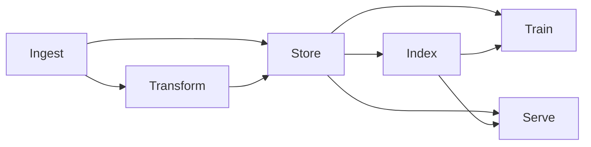

# AI Database

## What is an AI Database?

The explosive growth of modern [artificial intelligence](https://en.wikipedia.org/wiki/Artificial_intelligence) (AI) and [machine learning](https://en.wikipedia.org/wiki/Machine_learning) (ML) has stretched the limits of traditional data platforms. Classical relational databases excel at storing well-structured business records, while NoSQL systems sacrificed consistency for horizontal scale. Neither was designed for today's AI realities: petabytes of heterogeneous, rapidly arriving data; complex, often **unstructured** formats like free text and images; and queries that ask *"find things semantically similar to this example"*.

Enter the **AI database**, a specialized class of data systems engineered from the ground up to ingest, store, index, and serve AI workloads. These modern databases move beyond the traditional query paradigm of "find exact matches" to enable "find similar items" through vector operations. Their core capabilities include:

* **Flexible schemas** able to evolve with data without downtime
* **Distributed, shared-nothing clusters** that linearly add capacity
* **Native vector indexes** for high-dimensional similarity queries and embeddings storage
* **In-place analytics** so models can train or infer close to the data, reducing costly data movement
* **Predictable low latency** even when managing billions of rows and complex neural network operations

**{{ ydb-short-name }}** exemplifies these traits with [ACID transactions](transactions.md), [automatic sharding](datamodel/table.md), [exactly-once streaming ingestion](topic.md), [JSON support](../yql/reference/builtins/json.md), and [vector search](vector_search.md) capabilities, all exposed via gRPC API and SQL.

## AI Database Core Concepts and Technology Foundations

An **AI database** is a distributed data platform whose storage model, indexing structures, and query engine are expressly optimized for AI/ML pipelines and applications. Unlike traditional databases focused on exact matches and simple aggregations, AI databases excel at similarity-based operations and large-scale pattern recognition.

1. **Multi-modal data support** Modern AI systems process diverse data types simultaneously: structured tables, semi-structured JSON documents, unstructured text, images, and audio. For example, a recommendation system might combine user profile tables, product catalogs, image features, and text descriptions to generate recommendations.

2. **Vector representation and similarity search.** Neural networks encode semantic meaning as dense vectors (embeddings), requiring databases capable of efficiently finding "nearest neighbors" in high-dimensional space. This enables semantic search (for example, "find articles similar to this one"), image matching (for example, "find products visually similar to this one"), and recommendation systems based on latent features rather than explicit tags.

3. **Horizontal scalability and fault tolerance.** Typical AI training datasets have grown from gigabytes to petabytes, while production inference systems handle millions of requests per second. AI databases must keep up with such high load and scale horizontally across hundreds of nodes while maintaining resilience against hardware failures, network partitions, and availability zone outages.

4. **In-database analytics.** Moving large datasets between multiple transactional and analytical systems and timely updating them introduces latency and bandwidth bottlenecks. Modern AI databases are [converged](converged-database.md) to streamline data usage and minimize integration and network costs.

5. **Flexible consistency models.** Different AI workloads have different consistency requirements. Model training might prioritize read throughput over strict consistency, while requirements for feature serving for real-time decisions are often tighter. Eventual consistency is rarely acceptable as you don't want the most crucial pieces of data to suddenly become inaccessible or outdated due to some internal database processes like resharding or scaling. AI databases offer tunable consistency levels optimized for different stages of the AI lifecycle.

## AI Database Scalability for Large ML Dataset Workflows

AI datasets expand faster than hardware costs drop. AI databases are therefore forced to embrace *horizontal* scaling as scaling *vertically* is insufficient:

* **Automatic sharding.** Each table, index, or data stream is divided into shards distributed across cluster nodes. Shards auto-split when they exceed configurable thresholds. For example, in {{ ydb-short-name }}, tables are divided into [tablets](glossary.md#tablet) that automatically split as the write throughput or data volume grows, and they merge back if peak load is behind or if a major subset of data has been deleted.

* **Elastic rebalancing.** New nodes join the cluster, immediately share computing workload, and take responsibility for subsets of data. When nodes leave, data is redistributed to maintain the required redundancy level. This enables seamless scaling from a prototype to production clusters with hundreds of nodes.

* **High-throughput ingestion.** Exactly-once data streams (like [{{ ydb-short-name }} Topics](topic.md)) can funnel millions of events per second into transactional tables that downstream ML jobs can query within milliseconds. This capability is essential for real-time feature engineering and online learning scenarios.

* **Parallel query execution.** The query planner decomposes complex operations into parallel fragments executed across shards. Each shard processes its data independently, with results merged by coordinating nodes. This parallelization applies to both traditional SQL operations and vector similarity searches.

* **Tiered storage.** Recent "hot" data resides on NVMe SSDs, while older data automatically migrates to cheaper storage or external object stores, yet remains queryable through the same syntax. This multi-temperature approach optimizes cost while maintaining accessibility for long-tail analyses.

## AI Database Role in a Typical AI Workflow

A typical **large-dataset AI workflow** leveraging AI Database involves these stages:

1. **Ingest** raw documents, telemetry, and images at scale to the database either directly or with streaming interfaces
2. **Transform** raw data to generate features or embeddings using user-defined functions or integrated ML frameworks
3. **Store** embeddings, features, and metadata in optimized formats in addition to the original data
4. **Index** embeddings with specialized vector indexes for efficient similarity search
5. **Train** models by scanning features in parallel from a consistent snapshot
6. **Serve** data for [Retrieval Augmented Generation](rag.md) with low-latency point queries and [vector similarity searches](vector_search.md)

The following diagram illustrates this flow:

Such pipelines form a continuous loop: end-user interactions with AI models and served data are collected, ingested back, and continually used for improving further generations of models.

## Compare Types of AI Databases for Vector Search and ML Workloads

The AI database landscape spans several architectural approaches, each optimized for different workloads:

| AI Database Category | Primary Strengths | Common AI Tasks |
|----------|-------------------|-----------------|
| **Vector-native AI Databases** | High-dimensional similarity search, specialized ANN algorithms | Semantic search, image retrieval, recommendation systems |
| **[Distributed SQL](distributed-sql.md) with Vector Support** | Strict ACID, complex joins, vector operations | Feature stores, model metadata management, hybrid relational/vector workloads |
| **Document and Key-Value with Vector Support** | Schemaless, fast key lookups, nested JSON, vector fields | Semi-structured logs, user profiles, prompt histories |
| **Specialized ML Feature Stores** | Feature versioning, lineage tracking, point-in-time correctness | Feature engineering, training dataset creation, feature serving |

Modern data storage and processing systems increasingly blend these approaches. {{ ydb-short-name }} exemplifies this hybrid architecture, providing Distributed SQL capabilities with vector search functionality, supporting both structured data processing and embedding-based similarity queries in a [unified platform](universal-database.md). This [convergence](converged-database.md) reflects the reality that AI applications rarely rely on a single data model or query pattern.

## How to Choose the Best AI Database for Your Machine Learning Stack

Selecting the right AI database requires evaluating your workload characteristics against the platform's capabilities:

1. **Match data and query patterns for neural network applications**
   * For text and embeddings, ensure [native vector indexes](../dev/vector-indexes.md) with appropriate search algorithms
   * For structured analytics requiring complex joins, prioritize SQL expressiveness
   * For heterogeneous data combining structured, semi-structured, and vector representations, seek [unified systems](universal-database.md) that minimize integration complexity

2. **Assess scale and performance requirements for AI workloads**
   * Measure current data volumes and estimate growth over 12-24 months and beyond
   * Benchmark typical query patterns, paying special attention to p99 latency rather than averages
   * Profile vector dimensionality, index size, and QPS requirements for [similarity searches](vector_search.md)
   * Consider both bulk ingestion throughput and point update performance

3. **Balance consistency and throughput for ML data processing**
   * For safety-critical applications like fraud detection, prioritize strong consistency guarantees
   * For analytical workloads, consider snapshot isolation that balances consistency and performance
   * For high-volume training data ingestion, evaluate systems that can scale out easily

4. **Evaluate integration with your ML infrastructure**
   * Test client SDKs in your primary development languages
   * Assess SQL dialect compatibility with your existing tools and queries
   * Verify support for your deployment environment (Kubernetes, cloud-specific services)
   * Consider DevOps experience, monitoring capabilities, and disaster recovery options

5. **Address security and governance requirements for AI data management**
   * Evaluate authentication mechanisms and role-based access control granularity
   * Verify encryption capabilities (at-rest and in-transit)
   * Check compliance with relevant regulations (GDPR, CCPA, HIPAA, PCI DSS)
   * Assess audit logging and lineage tracking capabilities

6. **Calculate total cost of ownership for your AI database solution**
   * Compare managed service pricing models across projected workloads
   * For self-hosted options, estimate infrastructure and operational costs
   * Consider per-node licensing, data transfer costs, and storage pricing tiers
   * Factor in performance optimization costs and specialized expertise requirements

7. **Assess ecosystem maturity and vendor stability**
   * Evaluate community size, contribution activity, and release cadence
   * Review documentation quality, support options, and training resources
   * Assess vendor financial stability and commitment to the product



A proof-of-concept implementation with representative data volumes and query patterns remains the most reliable evaluation method. Focus on your most critical workloads and performance requirements rather than attempting to test every feature.



## Top AI Database Use Cases and Applications

AI databases power a diverse range of applications across industries:

* **E-commerce recommendation systems.** Vector embeddings represent product attributes and user preferences, enabling real-time personalized recommendations even for cold-start users. For example, a fashion retailer might combine product image embeddings, text descriptions, and user browsing patterns to suggest visually and functionally similar items.

* **Fraud detection and risk management.** Transaction features are transformed into numerical vectors that allow detection of anomalous patterns within milliseconds of submission. By combining historical behavior patterns with real-time context, financial institutions can identify potentially fraudulent transactions before they complete.

* **Healthcare diagnostics and medical image analysis.** Medical imaging scans are encoded as vectors, allowing clinicians to retrieve similar cases from historical databases. For instance, radiologists can find previous patients with similar lung CT patterns to assist in diagnosis and treatment planning.

* **Content discovery and personalized media.** Content embedding vectors capture semantic meaning, style, and topic, enabling discovery beyond explicit metadata matches. Media platforms use these capabilities to surface relevant content based on nuanced understanding of user preferences rather than simplistic category matches.

* **Conversational AI, chatbots, and RAG systems.** [Retrieval-augmented generation](rag.md) platforms use vector search to identify relevant context before generating natural language responses. By grounding language models in relevant information retrieved from knowledge bases, these systems deliver more accurate, factual, and useful responses.

* **Autonomous systems and IoT data processing.** Self-driving vehicles, drones, and robots generate telemetry streams that are indexed for pattern analysis and anomaly detection. Fleet-wide learning leverages the collective experiences of all deployed units, accelerating capability improvement.

Across these applications, AI databases deliver two critical capabilities:

1. Efficient management of the massive datasets required for training sophisticated models.
2. Low-latency, high-throughput serving of model features, predictions, and recommendations in production environments.

## Future Trends in AI Database Technology

The AI database landscape continues to evolve alongside advancements in AI/ML techniques:

1. **Unified multi-model engines**
   * **Opportunity:** simplify architecture by supporting tabular, document, vector, and streaming data in one platform
   * **Challenge:** maintaining performance and functionality parity with specialized systems
   * **Practical impact:** reduced integration complexity and operational overhead

2. **AI-powered query optimization**
   * **Opportunity:** automatic index selection, workload classification, and resource allocation
   * **Challenge:** ensuring predictable performance and explainable optimization decisions
   * **Practical impact:** lower administrative overhead and improved resource utilization

3. **Hardware acceleration integration**
   * **Opportunity:** GPU/TPU-assisted vector search, quantization, and on-database inference
   * **Challenge:** balancing specialized hardware costs against performance benefits
   * **Practical impact:** orders-of-magnitude speedups for specific vector operations

4. **Edge-to-cloud data synchronization**
   * **Opportunity:** process sensitive data locally while benefiting from centralized models
   * **Challenge:** managing consistency across intermittently connected systems
   * **Practical impact:** improved privacy and latency for distributed applications

5. **Semantic compression techniques**
   * **Opportunity:** store high-dimensional vectors more efficiently through quantization and transformations
   * **Challenge:** balancing compression ratios against recall accuracy
   * **Practical impact:** reduced storage costs and improved query performance

6. **Regulatory compliance automation**
   * **Opportunity:** built-in lineage tracking, differential privacy, and purpose limitation
   * **Challenge:** adapting to evolving global privacy frameworks
   * **Practical impact:** simplified compliance workflows and reduced legal risk

The overarching challenge is adding these capabilities without increasing cognitive complexity for developers and operators. Ideally, advanced features should be presented through simple, intuitive interfaces that hide implementation details while exposing meaningful configuration options.

## AI Database: The Future of Machine Learning Infrastructure

AI databases represent a fundamental evolution in data management architecture, optimized for the unique characteristics of machine learning workflows and AI-powered applications. By integrating specialized indexing techniques, distributed processing capabilities, and vector operations into robust database foundations, these systems bridge the gap between traditional data management and AI infrastructure.

**{{ ydb-short-name }}** exemplifies this evolution, combining the reliability of a distributed SQL database with the specialized capabilities required for AI workloads. Its [ACID transaction guarantees](transactions.md), automatic sharding, and vector search functionality enable organizations to build sophisticated AI applications without sacrificing data integrity or operational simplicity.

As organizations increasingly embed AI into their core products and operations, the line between database systems and AI infrastructure continues to blur. The next generation of data platforms will seamlessly integrate storage, indexing, processing, and inference capabilities, providing an intelligent substrate for applications rather than just passive storage.

Teams that understand the principles and architectures outlined in this guide will be well-positioned to select, deploy, and evolve the data infrastructure that powers their AI initiatives—ultimately delivering more intelligent, responsive, and valuable applications to their users.

## FAQs About AI Databases

### What is the difference between a vector database and an AI database?

A vector database primarily focuses on storing and retrieving high-dimensional vectors (embeddings) efficiently, while an AI database offers a more comprehensive solution including vector operations, traditional data storage, transaction support, and often ML-specific capabilities like feature stores.

### Can traditional SQL databases be used for AI workloads?

Traditional SQL databases can support basic AI workloads with extensions (like PostgreSQL's pgvector), but they typically lack the scale, performance, and specialized vector indexing that dedicated AI databases provide for production ML applications.

### What vector similarity algorithms do AI databases use?

Most AI databases usually reuse existing libraries implementing common approximate nearest neighbor (ANN) search algorithms like HNSW (Hierarchical Navigable Small World), IVF (Inverted File Index), PQ (Product Quantization). {{ ydb-short-name }} uses more scalable vector indexes based on [K-means trees](../dev/vector-indexes.md) that can be both prefixed and covering.

### How do AI databases handle different embedding models?

AI databases are model-agnostic and can store vectors from any embedding model. They typically support configurable distance metrics (cosine, Euclidean, dot product) to accommodate different embedding spaces and semantic retrieval requirements.

### What's the relationship between AI databases and LLM applications?

AI databases often serve as the retrieval component in [Retrieval Augmented Generation (RAG) architectures](rag.md), storing document embeddings and providing relevant context to LLMs through [vector similarity search](vector_search.md).

