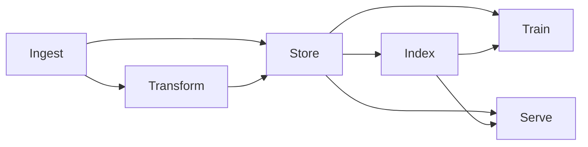

# AI Database

## What is an AI Database?

An **AI database** is a data management system designed to handle the specific requirements of [artificial intelligence](https://en.wikipedia.org/wiki/Artificial_intelligence) (AI) and [machine learning](https://en.wikipedia.org/wiki/Machine_learning) (ML) workloads. Traditional relational databases are optimized for structured data and exact-match queries, while AI applications often require handling unstructured data formats and similarity-based queries.

AI databases extend conventional database functionality to support:

* **Multi-modal data types** including structured tables, JSON documents, text, and vector embeddings
* **Vector similarity search** using high-dimensional embeddings for semantic matching
* **Horizontal scaling** to handle large datasets typical in ML applications
* **Stream processing** for real-time data ingestion and feature updates
* **Integrated analytics** to support both transactional and analytical workloads

{{ ydb-short-name }} implements AI database capabilities through [vector search](vector_search.md), [ACID transactions](transactions.md), [automatic sharding](datamodel/table.md), [streaming data ingestion](topic.md), and [JSON processing](../yql/reference/builtins/json.md) functionality. These features are accessible through standard SQL and gRPC APIs.

## Core Concepts

AI databases are distributed data platforms with storage models, indexing structures, and query engines optimized for AI/ML workloads. They support similarity-based operations and pattern recognition alongside traditional relational operations.

### Multi-modal Data Support

AI systems process diverse data types, including structured tables, semi-structured JSON documents, and unstructured content. A recommendation system, for example, may combine user profile tables, product catalogs, image features, and text descriptions.

### Vector Representation and Similarity Search

Neural networks encode semantic meaning as dense vectors (embeddings). AI databases provide efficient nearest neighbor search in high-dimensional vector spaces, enabling:

- Semantic search based on content similarity
- Image and media matching
- Recommendation systems using learned features

### Horizontal Scalability

AI datasets range from gigabytes to petabytes, while production systems may handle millions of requests per second. AI databases scale horizontally across multiple nodes while maintaining fault tolerance against hardware failures and network partitions.

### Converged Analytics

AI databases integrate transactional and analytical capabilities to avoid data movement between separate systems. This [converged](universal-database.md) approach reduces latency and simplifies data pipeline architecture.

### Consistency Models

AI workloads have varying consistency requirements:

- Model training may prioritize throughput over strict consistency
- Real-time feature serving requires stronger consistency guarantees
- AI databases provide configurable consistency levels for different use cases

## Scalability Architecture

AI databases implement horizontal scaling to handle large ML datasets and high-throughput workloads:

### Automatic Sharding

Tables, indexes, and data streams are divided into shards distributed across cluster nodes. Shards automatically split when they exceed configurable size or throughput thresholds. In {{ ydb-short-name }}, tables are partitioned into [tablets](glossary.md#tablet) that split and merge based on workload patterns.

### Elastic Rebalancing

Nodes can join or leave the cluster dynamically. New nodes immediately participate in workload distribution, while departing nodes trigger data redistribution to maintain redundancy levels.

### High-throughput Ingestion

Streaming systems like [{{ ydb-short-name }} Topics](topic.md) provide exactly-once delivery semantics for ingesting millions of events per second into transactional tables, supporting real-time feature engineering and online learning.

### Parallel Query Execution

Query planners decompose operations into parallel fragments executed across shards. This parallelization applies to both traditional SQL operations and vector similarity searches.

## AI Database in ML Workflows

AI databases support the following stages in ML data pipelines:

1. **Data Ingestion** - Load raw documents, telemetry, and media files through direct APIs or streaming interfaces
2. **Data Transformation** - Generate features or embeddings using user-defined functions or integrated processing frameworks
3. **Data Storage** - Store embeddings, features, and metadata alongside original source data
4. **Vector Indexing** - Create specialized indexes for efficient similarity search operations
5. **Model Training** - Access features through parallel scans with consistent snapshots
6. **Data Serving** - Provide low-latency access for [Retrieval Augmented Generation](rag.md) and [vector similarity searches](vector_search.md)

The following diagram illustrates the common data flow:

These workflows often form continuous loops where model interactions generate new data that feeds back into the training process.

## AI Database Categories

AI databases implement different architectural approaches:

| Category | Primary Capabilities | Use Cases |
|----------|---------------------|-----------|
| **Vector-native Databases** | High-dimensional similarity search, specialized ANN algorithms | Semantic search, image retrieval, recommendation systems |
| **[Distributed SQL](distributed-sql.md) with Vector Support** | ACID transactions, complex joins, vector operations | Feature stores, model metadata management, hybrid workloads |
| **Document and Key-Value with Vector Support** | Schema flexibility, fast key lookups, nested JSON, vector fields | Semi-structured logs, user profiles, prompt histories |
| **ML Feature Stores** | Feature versioning, lineage tracking, point-in-time correctness | Feature engineering, training dataset creation, feature serving |

Modern data storage and processing systems increasingly blend these approaches. {{ ydb-short-name }} provides distributed SQL capabilities with vector search functionality, supporting both structured data processing and similarity queries in a [unified platform](universal-database.md). This convergence addresses the requirement for multiple data models and query patterns in AI applications.

## Use Cases

### E-commerce Recommendation Systems

Vector embeddings represent product attributes and user preferences for real-time personalized recommendations. Systems can combine product image embeddings, text descriptions, and user behavior patterns to identify similar items.

### Fraud Detection and Risk Management

Transaction features are encoded as vectors for anomaly detection. Real-time scoring combines historical behavior patterns with current transaction context to identify potentially fraudulent activity.

### Healthcare and Medical Image Analysis

Medical imaging data is converted to vector representations for similarity-based case retrieval. Clinicians can query historical databases to find patients with similar diagnostic patterns.

### Content Discovery and Media

Content embeddings capture semantic meaning, style, and topic information. This enables content discovery based on similarity rather than explicit metadata matching.

### Conversational AI and RAG Systems

[Retrieval-augmented generation](rag.md) systems use vector search to identify relevant context before generating responses. This grounds language model outputs in retrieved information from knowledge bases.

### IoT and Telemetry Processing

Sensor data and telemetry streams are processed for pattern analysis and anomaly detection. This supports applications like autonomous vehicle fleets and industrial monitoring systems.

These applications require AI databases to provide:

1. Efficient storage and retrieval for large-scale training datasets
2. Low-latency serving for real-time inference and recommendations

## Summary

AI databases represent an evolution in data management architecture for machine learning workflows. These systems integrate specialized indexing techniques, distributed processing capabilities, and vector operations with traditional database foundations.

{{ ydb-short-name }} implements AI database capabilities by combining distributed SQL functionality with specialized features for AI workloads. Its [ACID transaction guarantees](transactions.md), automatic sharding, and vector search capabilities support AI applications while maintaining data correctness.

AI databases address the convergence of traditional data management and AI infrastructure requirements. Modern data platforms integrate storage, indexing, processing, and serving capabilities to support the full ML lifecycle from training to inference.

## FAQ

### What is the difference between a vector database and an AI database?

A vector database primarily focuses on storing and retrieving high-dimensional vectors (embeddings) efficiently, while an AI database offers a more comprehensive solution including vector operations, traditional data storage, transaction support, and often ML-specific capabilities like feature stores.

### Can traditional SQL databases be used for AI workloads?

Traditional SQL databases can support basic AI workloads with extensions (such as PostgreSQL's pgvector), but they typically lack the scale, performance, and specialized vector indexing required for production ML applications.

### What vector similarity algorithms do AI databases use?

Most AI databases reuse existing libraries implementing common approximate nearest neighbor (ANN) search algorithms like HNSW (Hierarchical Navigable Small World), IVF (Inverted File Index), and PQ (Product Quantization). {{ ydb-short-name }} uses more scalable vector indexes based on [K-means trees](../dev/vector-indexes.md) that can be both prefixed and covering.

### How do AI databases handle different embedding models?

AI databases are model-agnostic and can store vectors from any embedding model. They typically support configurable distance metrics (cosine, Euclidean, dot product) to accommodate different embedding spaces and semantic retrieval requirements.

### What's the relationship between AI databases and LLM applications?

AI databases serve as the retrieval component in [Retrieval Augmented Generation (RAG) architectures](rag.md), storing document embeddings and providing context to LLMs through [vector similarity search](vector_search.md).

Additionally, LLMs can generate and run arbitrary SQL queries via [Model Context Protocol (MCP)](../reference/languages-and-apis/mcp/index.md).

