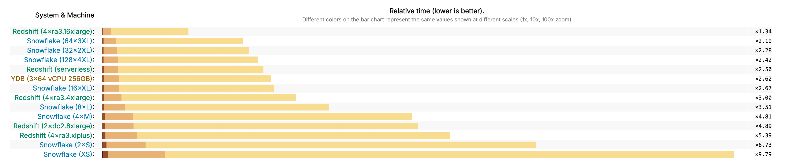

# BI analytics and data visualization

The interactivity of BI dashboards directly depends on the performance of the underlying database. {{ydb-short-name}} was designed as a high-performance analytical platform that executes queries in sub-second time, enabling analysts to work with data interactively.

This is achieved through key architectural features:

* columnar storage: queries read only the columns specified in the request from disk, which reduces the volume of I/O operations;
* MPP architecture: each query is parallelized across all available compute nodes of the cluster, harnessing all available resources for its execution;
* decentralized architecture: the absence of a single master node enables efficient processing of multiple concurrent queries from BI systems.

## Performance in independent benchmarks

Although synthetic tests do not always reflect real-world workloads, they serve as a good starting point for performance comparison. [ClickBench](https://benchmark.clickhouse.com/#system=+Rf%7Cnof%7CYD&type=-&machine=-ca2%7Cgle%7C6ax%7Cae-%7C6ale%7Cgel%7C3al&cluster_size=-&opensource=-&tuned=+n&metric=hot&queries=-) is an independent benchmark for analytical DBMSs, developed by the creators of ClickHouse.

On a set of 43 analytical queries, {{ydb-short-name}} shows competitive results, outperforming many popular open-source and cloud analytical databases. This confirms the engine's high performance on typical OLAP queries.

## Integrations with BI platforms

{{ ydb-short-name }} supports the following BI platforms:

* [Yandex DataLens](../../../integrations/visualization/datalens.md);
* [Apache Superset](../../../integrations/visualization/superset.md);
* [Grafana](../../../integrations/visualization/grafana.md);
* [Polymatica](https://wiki.polymatica.ru/display/PDTNUG1343/YDB+Server).
