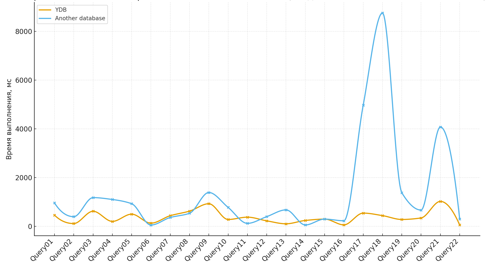

# Data transformation and preparation (ETL/ELT)

Data preparation for analysis is a key stage in building a data warehouse. {{ydb-short-name}} supports all standard data transformation approaches, allowing you to choose the most suitable tool for a specific task: from pure SQL to complex pipelines on Apache Spark.

## ELT

Data transformations using SQL are often the most performant, since all processing occurs directly within the {{ydb-short-name}} engine without moving data to and from external systems. The logic is described in SQL and executed by the distributed MPP engine, which is optimized for analytical operations.

### Performance in the TPC-H benchmark

The performance of ELT operations directly depends on the execution speed of complex analytical queries. The industry-standard benchmark for evaluating such queries is [TPC-H](https://www.tpc.org/tpch/).

A comparison with another distributed analytical DBMS on the TPC-H query set shows that {{ydb-short-name}} demonstrates more stable performance, especially when executing queries that contain:

* connections (`JOIN`) of a large number of tables (five or more);
* nested subqueries used for filtering;
* aggregations (`GROUP BY`) followed by complex filtering of the results.

{width=600}

This stability indicates the high efficiency of the {{ ydb-short-name }} cost-based query optimizer in building execution plans for complex SQL patterns typical of real-world ELT processes. For a data warehouse (DWH) platform, this means predictable data update times and a reduced risk of uncontrolled performance degradation in the production environment.

### Key use cases

* Building data marts: use the familiar [`INSERT INTO ... SELECT FROM ...`](../../../yql/reference/syntax/insert_into.md) syntax to create aggregated tables (data marts) from raw data;
* joining OLTP and OLAP data: {{ydb-short-name}} allows you to join data from both transactional (row-based) and analytical (column-based) tables in a single query. This enables you to enrich "cold" analytical data with up-to-date information from the OLTP system without the need for duplication;
* bulk updates: for "blind" writes of large volumes of data without existence checks, you can use the [`UPSERT INTO`](../../../yql/reference/syntax/upsert_into.md) operator.

### Managing SQL pipelines with dbt {#dbt}

To manage complex SQL pipelines, use the [dbt plugin](../../../integrations/migration/dbt.md). This plugin allows data engineers to describe data models as `SELECT` queries, and dbt automatically builds a dependency graph between models and executes them in the correct order. This approach helps implement software engineering principles (testing, documentation, versioning) when working with SQL code.

## ETL

### Complex transformations using external frameworks {#external-etl}

For tasks that require complex logic in programming languages (Python, Scala, Java), integration with ML pipelines, or processing large volumes of data, it is convenient to use external frameworks for distributed processing.

Apache Spark is one of the most popular tools for such tasks, and a [dedicated connector](../../../integrations/ingestion/spark.md) to {{ydb-short-name}} has been developed for it. If your company uses other similar solutions (e.g., Apache Flink), they can also be used to build ETL processes using the [JDBC driver](../../../reference/languages-and-apis/jdbc-driver/index.md).

A key advantage of {{ydb-short-name}} when working with such systems is its architecture, which allows for parallel data reading. {{ydb-short-name}} has no dedicated master node for exports, so external tools can read information directly from all storage nodes. This ensures high-speed reads and linear scalability.

## Pipeline orchestration

Orchestrators are used to run pipelines on a schedule and manage dependencies.

* Apache Airflow: an [Apache Airflow provider](../../../integrations/orchestration/airflow.md) is supported for orchestrating data in {{ydb-short-name}}. It can be used to create DAGs that run `dbt run`, execute YQL scripts, or initiate Spark jobs.
* built-in mechanisms: For some tasks, an external orchestrator is not required. {{ydb-short-name}} can perform some operations automatically:
   
    * TTL-based data expiration: automatically cleans up partitions after a specified time;
    * automatic compaction: data merging and optimization processes for the LSM tree run in the background, eliminating the need to regularly run commands like `VACUUM`;
* other orchestrators: if your company uses a different tool (e.g., Dagster, Prefect) or a custom scheduler, you can use it to run the same commands. Most orchestrators can execute shell scripts, allowing you to call the YDB CLI, [dbt](#dbt) run, and other utilities.

## Integration with other ETL tools via JDBC

{{ydb-short-name}} provides a [JDBC driver](../../../reference/languages-and-apis/jdbc-driver/index.md), enabling the use of a wide range of existing ETL tools, such as [Apache NiFi](https://nifi.apache.org/) and other JDBC-compliant systems.