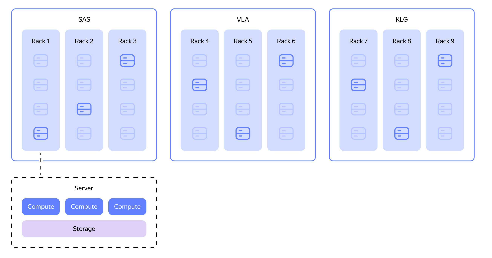

# Data Storage

Efficient data storage is the foundation of any analytical warehouse. {{ ydb-short-name }} uses a columnar format, a storage and compute disaggregation architecture, and automatic maintenance processes to ensure high performance and a low total cost of ownership.

## Columnar tables {#column_table}

Data in [columnar tables](../../../concepts/datamodel/table.md#column-oriented-tables) is stored by columns instead of rows. This approach is the standard for OLAP systems and offers two key advantages:

1. Reduced read volume: when a query (e.g., `SELECT column_a, column_b FROM...`) is executed, only the data from the columns involved in the query is read from the disk.
2. Data compression: data of the same type within a column compresses better than heterogeneous data in a row. {{ ydb-short-name }} uses the `LZ4` compression algorithm.

## Architecture with storage and compute disaggregation {#disaggregation}

Storage and compute disaggregation is an architectural principle of {{ ydb-short-name }}. The nodes responsible for data storage (storage nodes) and the nodes that execute queries (dynamic nodes) are separate. This allows you to:

* scale resources independently: if you run out of disk space, you add storage nodes. If you lack CPU for queries, you add compute nodes. This differs from systems where storage and compute resources are tightly coupled;
* redistribute load quickly: redistributing compute load between nodes does not require physical data movement; only metadata is transferred.

## Automatic storage optimization {#zero_admin}

{{ydb-short-name}} is designed to minimize manual maintenance operations.

* Automatic data compaction: Data is stored in [LSM-like](../../../concepts/mvcc.md#organizaciya-hraneniya-dannyh-mvcc) structures; data merging and optimization processes run continuously in the background. You do not need to run VACUUM or similar commands.
* Automatic data deletion: To manage the data lifecycle, use the [TTL-based deletion](../../../concepts/ttl.md) mechanism.

## Built-in fault tolerance {#reliability}

{{ydb-short-name}} was designed from the ground up as a fault-tolerant system and supports [various data placement modes](../../../concepts/topology.md#cluster-config) to protect against hardware, rack, or even entire data center failures.

{width=800}
