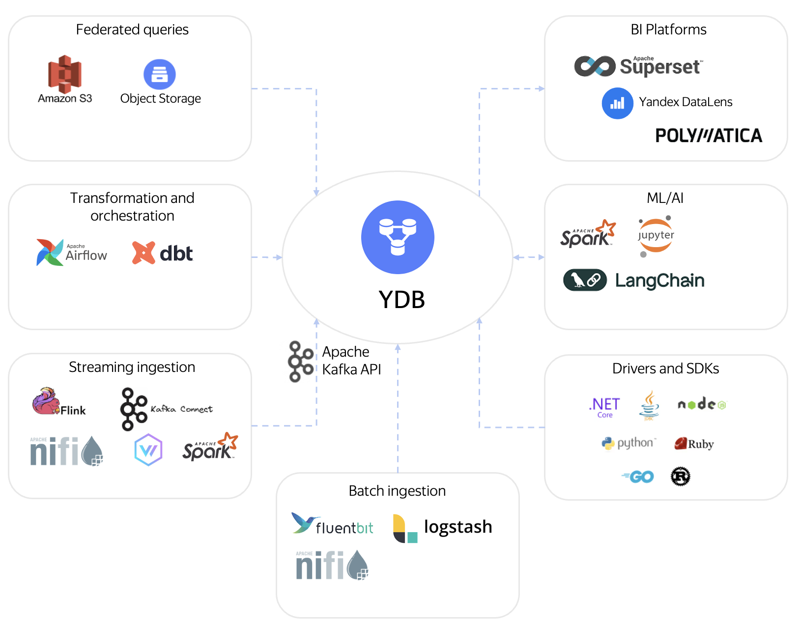

# Overview

{{ ydb-short-name }} is a distributed, fault-tolerant database that provides components for building a data warehouse (DWH) on a unified platform.

Using {{ ydb-short-name }} allows you to consolidate the functionality of several technologies (for example, separate systems for streaming, storage, and analytics) into a single solution. You can use familiar tools and approaches while gaining the benefits of a distributed system.

## Data Ingestion {#ingest}

The platform is designed to handle streaming and batch data ingestion at large scale.

- Streaming processing: Built-in topic system with Kafka API support for integration with existing systems. Plugins for [Fluent Bit](../../integrations/ingestion/fluent-bit.md) and [Logstash](../../integrations/ingestion/logstash.md) are available for log collection.
- Batch loading: [BulkUpsert](../../recipes/ydb-sdk/bulk-upsert.md) API for efficiently loading large data sets and a connector for Apache Spark to integrate with data processing platforms.
- Connection via standard interfaces: [JDBC-driver](../../reference/languages-and-apis/jdbc-driver/index.md) and native [SDK](../../recipes/ydb-sdk/index.md).

## Data Storage {#store}

The core of the storage system is — [column-oriented tables](../../concepts/datamodel/table.md#column-oriented-tables) with built-in compression, optimized for analytical workloads.

- Separation of storage and compute: A key feature of {{ydb-short-name}}, enabling independent scaling of disk space and computing resources.
- Minimized administration: Background processes for (compaction) and TTL-based data removal reduce the need for manual operations.

## Query Execution {#execution}

{{ ydb-short-name }} is an Massively Parallel Processing (MPP) DBMS with no dedicated master node. All nodes perform the same roles, and the system scales horizontally by dynamically adding or removing compute resources.

- Cost-Based Optimizer (CBO): Selects the optimal query execution plan by analyzing data statistics.
- Spilling mechanism: Enables execution of queries whose intermediate results do not fit in RAM by offloading them to disk.
- Workload Manager: Manages resource allocation among queries, isolating different types of workloads.

## Data Transformation {#transformation}

Data transformation is supported using standard approaches and tools.

- ELT with SQL: Use `INSERT INTO ... SELECT` to build data marts. For managing complex SQL pipelines, integration with [dbt](../../integrations/migration/dbt.md) is available.
- ETL with Apache Spark: Run ETL jobs on Apache Spark using the [parallel connector](../../integrations/ingestion/spark.md).
- Orchestration: Automate pipelines with [Apache Airflow](../../integrations/orchestration/airflow.md).

## Federated Queries {#federated}

{{ydb-short-name}} allows you to run queries on data stored in S3-compatible storage without preloading it. This simplifies working with data stored in a data lake.

## Data Analysis and Visualization (BI and ML) {#bi-ml}

You can use industry-standard tools for data analysis:

- BI tools: [Yandex DataLens](../../integrations/visualization/datalens.md), [Apache Superset](../../integrations/visualization/superset.md), [Grafana](../../integrations/visualization/grafana.md).
- ML tools: Use [Jupyter Notebook](../../integrations/gui/jupyter.md) and [Apache Spark](../../integrations/ingestion/spark.md) for data preparation and machine learning model training.