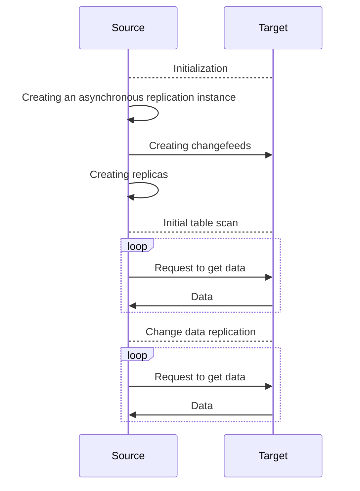

# Asynchronous replication

Asynchronous replication allows synchronizing data between {{ ydb-short-name }} [databases](glossary.md#database) in near real time. Asynchronous replication can also be used for data migration between databases with minimal downtime for applications that work with these databases. Such databases can be located in the same {{ ydb-short-name }} [cluster](glossary.md#cluster) as well as in different clusters.

## Overview {#how-it-works}

Asynchronous replication is based on [Change Data Capture](cdc.md) and deals with logical data. The following diagram shows the replication process:

As follows from the diagram above, asynchronous replication involves two databases:

1. **Source**. A database with [replication objects](glossary.md#replicated-object).
2. **Target**. A database in which an [asynchronous replication instance](glossary.md#async-replication-instance) and [replicas](glossary.md#replica-object) will be created.

Asynchronous replication consists of the following stages:

* [Initialization](#init).
* [Initial table scan](#initial-scan).
* [Change data replication](#replication-of-changes).

### Initialization {#init}

Initialization of asynchronous replication includes the following:

* Creating an asynchronous replication instance on the target database by using the [CREATE ASYNC REPLICATION](../yql/reference/syntax/create-async-replication.md) YQL expression.
* Establishing a connection with the source database. To connect with the source, the target database uses the [connection parameters](../yql/reference/syntax/create-async-replication.md#params) specified when the  asynchronous replication instance was created.



The user account that is used to connect to the source database must have the following [permissions](../security/short-access-control-notation.md#access-rights):

* Read permissions for schema objects and directory objects
* Create, update, delete, and read permissions for changefeeds



* The following objects are created for replication objects on the source:
  * [changefeeds](glossary.md#changefeed) on the source
  * [replicas](glossary.md#replica-object) on the target



Replicas are created under the user account that was used to create the asynchronous replication instance.



### Initial table scan {#initial-scan}

During the [initial table scan](cdc.md#initial-scan) the source data is exported to changefeeds. The target runs [consumers](topic.md#consumer) that read the source data from the changefeeds and write it to replicas.

You can get the progress of the initial table scan from the [description](../reference/ydb-cli/commands/scheme-describe.md) of the asynchronous replication instance.

### Change data replication {#replication-of-changes}

After the initial table scan is completed, the consumers read the change data and write it to replicas.

Each change data block has its *creation time* ($created\_at$). Consumers track the *reception time* of the change data ($received\_at$). Thus, you can use the following formula to calculate the *replication lag*:

$$
replication\_lag = received\_at - created\_at
$$

You can also get the replication lag from the [description](../reference/ydb-cli/commands/scheme-describe.md) of the asynchronous replication instance.

## Restrictions {#restrictions}

* The set of replication objects is immutable and is generated when {{ ydb-short-name }} creates an asynchronous replication instance.
* {{ ydb-short-name }} supports the following types of replication objects:

  * [row-based tables](datamodel/table.md#row-oriented-tables)
  * [directories](datamodel/dir.md)

    {{ ydb-short-name }} will replicate all row-based tables that are located in the given directories and subdirectories at the time the asynchronous replication instance is created.

* During asynchronous replication, you cannot [add or delete columns](../yql/reference/syntax/alter_table/columns.md) in the source tables.
* During asynchronous replication, replicas are available only for reading.

## Error handling during asynchronous replication {#error-handling}

Possible errors during asynchronous replication can be grouped into the following classes:

* **Temporary failures**, such as transport errors, system overload, etc. Requests will be resent until they are processed successfully.
* **Critical errors**, such as access violation errors, schema errors, etc. Replication will be aborted, and the [description](../reference/ydb-cli/commands/scheme-describe.md) of the asynchronous replication instance will include the text of the error.



Currently, asynchronous replication that is aborted due to a critical error cannot be resumed. In this case, you must [drop](../yql/reference/syntax/drop-async-replication.md) and [create](../yql/reference/syntax/create-async-replication.md) a new asynchronous replication instance.



For more information about error classes and how to address them, refer to [Error handling](../reference/ydb-sdk/error_handling.md).

## Asynchronous replication completion {#done}

Completion of asynchronous replication might be an end goal of data migration from one database to another. In this case the client stops writing data to the source, waits for the zero replication lag, and completes replication. After the replication process is completed, replicas become available both for reading and writing. Then you can switch the load from the source database to the target database and complete data migration.



You cannot resume completed asynchronous replication.





{{ ydb-short-name }} currently supports only **forced** completion of asynchronous replication, when no additional checks are performed for data consistency, replication lag, etc.



To complete asynchronous replication, use the [ALTER ASYNC REPLICATION](../yql/reference/syntax/alter-async-replication.md) YQL expression.

## Dropping an asynchronous replication instance {#drop}

When you drop an asynchronous replication instance:

* Changefeeds are deleted in the source tables.
* The source tables are unlocked, and you can add and delete columns again.
* Optionally, all replicas are deleted.
* Asynchronous replication instance is deleted.

To drop an asynchronous replication instance, use the [DROP ASYNC REPLICATION](../yql/reference/syntax/drop-async-replication.md) YQL expression.
