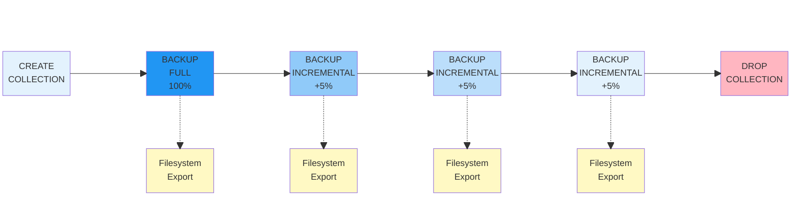
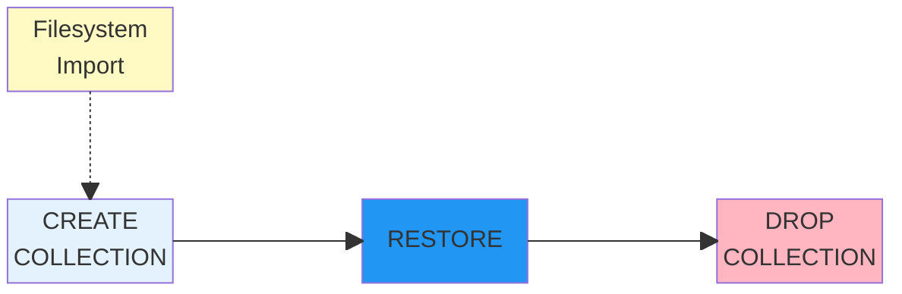

# Backup Collections

Backup collections provide an advanced backup solution for YDB that organizes full and incremental backups into managed collections. This approach is designed for production workloads requiring efficient disaster recovery and point-in-time recovery capabilities.

## What are backup collections? {#what-are-backup-collections}

A backup collection is a named set of coordinated backups for selected database objects. Collections organize related backups and ensure they can be restored together consistently, providing:



Currently only tables are supported. Support for other objects is planned for future releases.



- **Organization**: Related backups are grouped into logical collections.
- **Recovery flexibility**: Enables recovery to any point in time when one of the backups in the collection was made.

## Core concepts {#core-concepts}

### Backup collection {#backup-collection}

A named container that groups backups for a specific set of database objects (currently tables only). Collections ensure that all included objects are backed up consistently.

### Full backup {#full-backup}

A complete snapshot of all selected tables at a specific point in time. Serves as the baseline for subsequent incremental backups and contains all data needed for independent restoration.

### Incremental backup {#incremental-backup}

Captures only the changes (inserts, updates, deletes) since the previous backup in the chain. Significantly smaller than full backups for datasets with limited changes.

### Backup chain {#backup-chain}

An ordered sequence of backups starting with a full backup followed by zero or more incremental backups. Each incremental backup depends on all previous backups in the chain for complete restoration.

## Backup workflow {#backup-workflow}



### Collection creation {#collection-creation}

Creates a named container that coordinates backups across multiple database objects. All objects in the collection share the same backup configuration and storage location. Once created, the object list is fixed and cannot be modified.

[See operations guide](../maintenance/manual/backup-collections.md#create-collection)

### Initial full backup {#initial-full-backup}

Creates a transactionally consistent snapshot of all objects in the collection at a specific point in time. This baseline backup contains all data and schemas, and can be restored independently without requiring other backups. A full backup is required before you can create any incremental backups.

[See operations guide](../maintenance/manual/backup-collections.md#create-backup)

### Incremental backups {#incremental-backups-creation}

Captures only the data that has changed since the previous backup, which significantly reduces storage requirements. **Important**: There is no built-in scheduler, so you must trigger incremental backups manually or use an external scheduling system. To restore from an incremental backup, you need the entire backup chain starting from the initial full backup.

[See operations guide](../maintenance/manual/backup-collections.md#create-backup)

### Drop collection {#backup-collection-cleanup}

When a backup collection is no longer needed, drop it to remove all associated metadata and free up resources. This permanently deletes the collection definition and all backups in the chain. Only drop collections after ensuring you no longer need the backups or have safely archived them to external storage.

[See operations guide](../maintenance/manual/backup-collections.md#cleanup)

## Restore workflow {#restore-workflow}



### Import from filesystem {#restore-import}

If your backups are stored in external storage (filesystem or object storage), import them back into the cluster using YDB CLI import operations. Import all backups in the chain in the correct order, starting from the full backup followed by incremental backups. This step is only needed if you're restoring from external storage.

[See YDB CLI export/import](../reference/ydb-cli/export-import/index.md)

### Create collection for restore {#restore-collection-creation}

Create a new collection that defines where the restored data will be placed. The collection structure should match the original backup collection, including the same table names and paths. This prepares the target location for the restoration process.

[See operations guide](../maintenance/manual/backup-collections.md#restore-backup)

### Restore backup {#restore-execution}

Execute the restore operation to recover data from a specific backup in the chain. You can restore from any backup point (full or incremental), and the system will automatically apply all necessary changes from the backup chain up to that point. The restore operation ensures transactional consistency across all tables in the collection.

[See operations guide](../maintenance/manual/backup-collections.md#restore-backup)

### Drop collection {#restore-cleanup}

After successfully restoring and verifying your data, drop the restore collection to clean up metadata and free resources. This is an optional cleanup step that helps maintain a tidy backup catalog.

[See operations guide](../maintenance/manual/backup-collections.md#cleanup)

## Operational guidance {#operational-guidance}

### Chain management {#chain-management-details}

You are responsible for tracking and maintaining your backup chains. Use `ydb scheme ls` to view the chain structure and identify which backups can be safely deleted. Be careful when removing backups to avoid breaking chain dependencies, as incremental backups rely on their parent backups being available.

To move backups to external storage (filesystem or object storage like S3), use manual export or dump operations via YDB CLI. Each backup in the chain must be exported/dumped separately. When restoring from external storage, use import and restore operations via YDB CLI. Preserve the chain order during export/import to ensure successful restoration.

[See YDB CLI export/import](../reference/ydb-cli/export-import/index.md) | [See monitoring guide](../maintenance/manual/backup-collections.md#monitoring) | [See cleanup procedures](../maintenance/manual/backup-collections.md#cleanup)

## Architecture and components {#architecture}

### Storage structure {#storage-structure}

Backup collections are stored in a dedicated directory structure within the database:

```text
/Root/test1/.backups/collections/
├── backup_collection_1/
│   ├── 20250821141425Z_full/       # Full backup
│   │   ├── table_1/
│   │   └── table_2/
│   └── 20250821141519Z_incremental/ # Incremental backup
│       ├── table_1/
│       └── table_2/
└── backup_collection_2/
    ├── 20250820093012Z_full/       # Full backup
    │   └── table_3/
    ├── 20250820140000Z_incremental/ # First incremental
    │   └── table_3/
    └── 20250821080000Z_incremental/ # Second incremental
        └── table_3/
```

Each backup contains:

- Table schemas at backup time.
- Data files (full or incremental changes).

### Storage backends {#storage-backends}

#### Cluster storage {#cluster-storage}

Backups are stored within the YDB cluster itself, providing:

- **High availability**: Leverages cluster replication and fault tolerance.
- **Performance**: Fast backup and restore operations.
- **Integration**: Seamless integration with cluster operations.
- **Security**: Uses cluster security mechanisms.

```sql
WITH ( STORAGE = 'cluster' )
```

#### External storage {#external-storage}

Currently, external storage requires manual export/import operations. Use [export/import operations](../reference/ydb-cli/export-import/index.md) to move backups to external storage systems.

Example commands to export a backup collection:

```bash
# Export entire collection directory to S3
ydb export s3 --s3-endpoint storage.yandexcloud.net \
  --bucket my-backups \
  --item src=.backups/collections/my_collection,dst=my_collection

# Or export to filesystem
ydb tools dump --path .backups/collections/my_collection \
  --output /path/to/local/backup
```

### Background operations {#background-operations}

All backup operations run asynchronously in the background, allowing you to:

- Continue normal database operations during backups.
- Monitor progress using YDB CLI operation commands.
- Handle large datasets without blocking other activities.

## How backup collections work internally {#how-they-work}

### Backup creation process {#backup-creation-process}

1. **Transaction isolation**: Backup starts from a consistent snapshot point
2. **Change tracking**: For incremental backups, only changes since last backup are captured and stored in a [changefeed](cdc.md)
3. **Change materialization**: When incremental backup is called, the changefeed is compacted into incremental backup tables

### Incremental backup mechanism {#incremental-backup-mechanism}



Incremental backups use change tracking to identify:

- **New rows**: Added since last backup.
- **Modified rows**: Changed data in existing rows.  
- **Deleted rows**: Removed data (tombstone records).
- **Schema changes**: Currently not supported.



### Relation to incremental backups {#relation-to-incremental-backups}

Backup collections are the foundation for incremental backup functionality:

- **Collections enable incrementals**: You must have a collection to create incremental backups.
- **Chain management**: Collections manage the sequence of full and incremental backups.
- **Consistency**: All tables in a collection are backed up consistently.

Without backup collections, only full export/import operations are available.

## When to use backup collections {#when-to-use}

**Recommended scenarios:**

- Production environments requiring regular backup schedules (note: scheduling must be implemented externally using cron or similar tools).
- Large datasets where incremental changes are much smaller than total data size.
- Scenarios requiring backup chains for efficiency.

**Consider traditional export/import for:**

- Small databases or individual tables.
- One-time data migration tasks.
- Development/testing environments.
- Simple backup scenarios without incremental needs.

## Benefits and limitations {#benefits-limitations}

### Benefits

- **Storage efficiency**: Incremental backups use significantly less storage compared to storing multiple full backups.
- **Faster backups**: Only changes are processed after initial full backup (note: change capture still incurs storage and cpu costs).
- **SQL interface**: Familiar SQL commands for backup management.
- **Background processing**: Non-blocking operations.

### Current limitations

- **Cluster storage only**: External storage requires manual export/import.
- **No collection modification**: Cannot add/remove tables after creation.
- **No partial restore**: Partial restores from collections must be managed externally.

## See also {#see-also}

- [General backup concepts](backup.md) - Overview of all backup approaches in YDB
- [Operations guide](../maintenance/manual/backup-collections.md) - Step-by-step instructions and practical examples
- [Common recipes](../recipes/backup-collections.md) - Real-world usage scenarios and best practices
