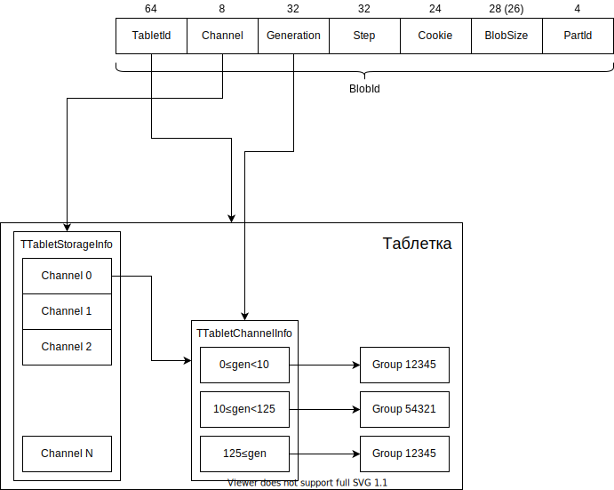

## Tablets {#tablets}

Special microservices called *tablets* are run on each node. Each tablet has a specific type and ID and is a singleton meaning that only one tablet with a specific ID can be running in the entire cluster at any given time. A tablet can launch on any suitable node. *Generation* is an important property of a tablet that increases with each subsequent launch. Please note that the distributed nature of the system and various kinds of issues, such as problems with network partitioning, may result in a situation whereby the same tablet will actually be running on two different nodes at the same time. However, BlobStorage  guarantees that only one of them will be able successfully  to complete operations that change its state and that the generation that each successful operation runs in will not decrease over time.

You can find out on what node the tablet in the current generation is running through the *StateStorage* service. To send messages to tablets, use a special set of libraries named *tablet pipe*. With it, knowing the ID of the target tablet, you can easily send the desired message to it.

A tablet can be divided into two parts: the basic tablet and the user logic.

The basic tablet is a set of tables, each of which may consist of one or more key columns of an arbitrary type and a set of data columns. Each table may have its own schema. In addition, tables can be created and deleted while the tablet is running. The interface of the basic tablet lets you perform read and update operations on these tables.

User logic is located between the basic tablet and the user and lets you process specific requests for this type of tablet reliably saving changes to BlobStorage. A running tablet commonly uses a template that stores all data in memory reading it only at the start, and synchronously changes the data in memory and in storage after a successful commit.

### How does a tablet store data and what are they like? {#storage}

A basic tablet is an [LSM tree](../../../glossary.md#lsm-tree) that holds all of its table data. One level below the basic tablet is BlobStorage that, roughly speaking, is KeyValue storage that stores binary large objects (blobs). *BLOB* is a binary fragment from 1 byte to 10 MB in size, which has a fixed ID (that is usually called *BlobId* and is of the TLogoBlobID type) and contains related data. Storage is immutable, meaning that only one value corresponds to each ID and it cannot change over time. You can write and read a blob and then delete it when you no longer need it.

To learn more about blobs and distributed storages, see [here](../../distributed_storage.md).

For BlobStorage, blobs are an opaque entity. A tablet can store several types of blobs. The most frequently written blob is a (recovery) log blob. A tablet's log is arranged as a list of blobs, each containing information about the change being made to the tables. When run, the tablet finds the last blob in the log and then recursively reads all related blobs following the links. The log may also contain links to snapshot blobs, which contain data from multiple log blobs after a merge (the merge operation in the LSM tree).

The tablet writes blobs of different types to different *channels*. A channel specifies the branch of storage to store blobs in and performs various functions, such as:

1. Selecting a storage type (different channels may be linked to different types of storage devices: SSD, HDD, or NVMe).
2. Load balancing, because each channel has a limit on IOPS, available space and bandwidth.
3. Specifying the data type. When restoring the log, only the blobs from the null channel are read, which lets you distinguish them from other blobs.

### Tablet channel history {#history}

As mentioned previously, each group has a constant amount of data that fits into it and shares the bandwidth's throughput and number of operations per second out to all consumers. The load on tablets may vary. As a result a group may become overloaded. In this regard, the concept of history is introduced, with which, for each tablet, knowing a blob's Channel and Generation, you can determine the group that this blob is written to.

This mechanism works as follows:

For each channel, the TTabletStorageInfo structure contains the TTabletChannelInfo substructure with generation ranges and the group number corresponding to each range. The ranges are strictly adjacent to each other, the last range is open. Group numbers may overlap in different ranges and even across different channels: this is legal and quite common.

When writing a blob, a tablet selects the most recent range for the corresponding channel since a write is always performed on behalf of a tablet's current generation. When reading a blob, the group number is fetched based on the BlobId.Generation of the blob being read.
