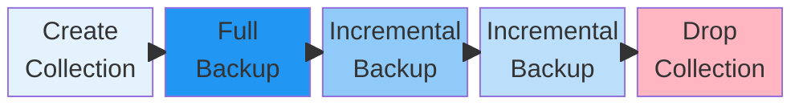

# Backup Collection

A backup collection is a [schema object](index.md) that enables [point-in-time recovery](https://en.wikipedia.org/wiki/Point-in-time_recovery) for selected [row-oriented tables](table.md#row-oriented-tables). Backup collections organize full and incremental backups into managed chains, allowing efficient disaster recovery and protection against accidental data loss such as erroneous deletions or modifications.



For practical instructions on creating and managing backup collections, see the [Backup and Recovery guide](../../devops/backup-and-recovery.md#backup-collections).



## Overview

Backup collections address common backup challenges for production workloads:

- **Storage efficiency**: Incremental backups capture only changes since the previous backup, significantly reducing storage requirements compared to multiple full backups.
- **Consistent recovery**: All tables in a collection are backed up from the same global snapshot, ensuring referential integrity across tables during restoration.
- **Point-in-time recovery**: Restore data to any point when a backup was created within the chain.

For a comparison with other backup methods (export/import, dump/restore), see [Backup concepts](../backup.md).

## Key Concepts

These terms are essential to understanding backup collections. For detailed definitions, see the [glossary](../glossary.md#backup-collection).

- **[Full backup](../glossary.md#backup)**: A complete snapshot of all data in the collection at a specific point in time. Serves as the foundation for subsequent incremental backups.
- **[Incremental backup](../glossary.md#backup)**: Captures only changes (inserts, updates, deletes) since the previous backup. Requires the entire backup chain for restoration.
- **[Backup chain](../glossary.md#backup-chain)**: An ordered sequence starting with a full backup followed by zero or more incremental backups.

## Limitations

Before using backup collections, understand these constraints:

- **Row-oriented tables only**: [Column-oriented tables](table.md#column-oriented-tables) are not supported.
- **One collection per table**: A table can only belong to one backup collection at a time. To back up a table in a different collection, you must first remove it from the existing collection by dropping that collection.
- **Immutable membership**: Once created, the table list in a collection cannot be modified. To add new tables, create a new collection that includes all desired tables.
- **No partial restore**: You cannot restore individual tables from a collection; the entire collection is restored together.
- **External scheduling required**: {{ ydb-short-name }} does not provide built-in backup scheduling. Use external tools like cron for automated backups.

## Architecture

Backup collections use a copy-on-write mechanism combined with [changefeeds](../cdc.md) for efficient incremental backups. This section explains how the components work together.

### How Backup Collections Work

The following diagram illustrates the backup workflow:



**Collection creation** defines which tables to include and creates the schema object. This is a fast, metadata-only operation.

**Full backup** creates a consistent snapshot of all tables in the collection. Key characteristics:

- Uses a **global snapshot** that ensures referential integrity across all tables in the collection.
- Creates **changefeeds** on each table to track subsequent modifications.
- Uses **copy-on-write**: The backup is created quickly by referencing existing data; actual data copying occurs only when source data is modified.

**Incremental backup** captures all changes since the previous backup:

- Reads accumulated changes from the changefeeds created during the full backup.
- Records all modifications: inserts, updates, and deletes (as tombstone records).
- Compacts changefeed data into incremental backup tables.



Schema changes (ALTER TABLE) to tables in a backup collection are not tracked by incremental backups. If you need to modify the schema of a backed-up table, create a new full backup after the schema change to ensure the backup chain reflects the new structure.



### Storage

Backup collections are stored within the {{ ydb-short-name }} cluster in a dedicated directory structure:

```text
/Root/database/.backups/collections/
├── my_collection/
│   ├── 20250821141425Z_full/
│   │   ├── table_1/
│   │   └── table_2/
│   └── 20250821151519Z_incremental/
│       ├── table_1/
│       └── table_2/
```

#### Cluster Storage

By default, backups are stored within the cluster, benefiting from:

- Cluster replication and fault tolerance
- Fast backup and restore operations
- Integrated security mechanisms

#### External Storage



Cluster-stored backups do not protect against cluster-wide failures (such as total cluster loss or catastrophic data center events). For disaster recovery scenarios, regularly export backup collections to external storage (S3-compatible storage or filesystem) using [export/import operations](../../reference/ydb-cli/export-import/index.md).



To export backups to external storage, use the {{ ydb-short-name }} CLI:

- `ydb export s3` for S3-compatible storage
- `ydb tools dump` for filesystem storage

Each backup in the chain must be exported separately. Preserve the chain order during export/import to ensure successful restoration.

### Background Operations

All backup and restore operations run asynchronously, allowing normal database operations to continue. Monitor progress using `ydb operation list incbackup`.

## Restoring from Backups

Restoration recovers data from a backup chain to a specified point in time.

### Restore Workflow

1. **Import from external storage** (if applicable): If backups were exported, import the full backup and all incremental backups up to the desired restore point.

2. **Create restore collection**: Define the target location for restored data.

3. **Execute restore**: The system applies the full backup and all incremental backups in sequence to reach the specified restore point.

4. **Cleanup**: After verifying the restored data, optionally drop the restore collection.

The restore operation maintains transactional consistency across all tables in the collection.

## See Also

- [Backup concepts](../backup.md): Overview of all backup approaches in {{ ydb-short-name }}
- [Backup and Recovery guide](../../devops/backup-and-recovery.md#backup-collections): Practical operations guide
- [Recipes and examples](../../recipes/backup-collections.md): Common scenarios and examples
