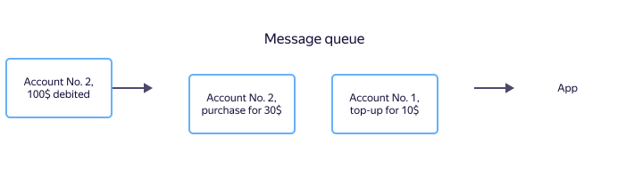
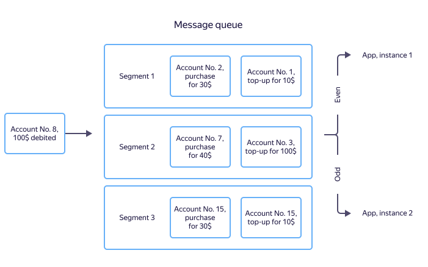

# Topic

A topic in {{ ydb-short-name }} is an entity for storing unstructured messages, designed to deliver them to multiple subscribers. In fact, a topic is a named set of messages.

A writer application writes messages to a topic. Reader applications are independent of each other; they receive, or "read", messages from the topic in the order they were written. The topic implements the [publisher-subscriber](https://en.wikipedia.org/wiki/Publish%E2%80%93subscribe_pattern) architectural pattern.

The {{ ydb-short-name }} topic has the following properties:

* At-least-once guarantees when reading messages by subscribers.
* Exactly-once guarantees when publishing messages (message deduplication).
* Guarantees of sequential message processing ([FIFO](https://en.wikipedia.org/wiki/Message_queue)) for messages published with the same [source identifier](#producer-id).
* Scaling of message throughput for messages published with different sequence identifiers.

## Messages {#message}

Data is transmitted as message streams. A message is the smallest indivisible unit of user information. Messages consist of a body and attributes, as well as additional system properties. The content of messages is a set of bytes that is not interpreted by {{ ydb-short-name }} in any way.

Messages can contain user attributes in the "key-value" format. They are returned together with the message body when reading. User attributes allow the reader to decide whether to process the message without unpacking the message body. Message attributes are set when initializing a write session. This means that all messages written within a single write session will have the same attributes when read.

## Partitioning {#partitioning}

For horizontal scaling, a topic is divided into separate elements, *partitions*, which are units of parallelism. Each partition has a limited throughput; the recommended write speed is up to 1 MB/s.



Currently, reducing the number of partitions in a topic is only supported by deleting and recreating the topic with fewer partitions.



There are two types of partitions:

- **Active.** All partitions by default; both writing and reading are possible.
- **Inactive.** Only reading is possible from them. Inactive partitions appear after a partition split when [auto-partitioning](#autopartitioning) is enabled. Inactive partitions are automatically deleted when all messages from such a partition have been deleted after the retention period expires.

### Offset {#offset}

All messages within a partition have a unique sequence number called `offset` (offset). The offset increases monotonically as new messages are written.

## Auto-partitioning {#autopartitioning}

The number of topic partitions and their throughput are set when creating the topic and determine the total write throughput of the topic. If the maximum required write speed to the topic is unknown at creation time or will change over time, you can use auto-partitioning to dynamically scale the topic. If auto-partitioning up is enabled on the topic, the number of partitions in such a topic automatically increases as the write speed grows (see [Auto-partitioning modes](#autopartitioning_modes) for details).

### Guarantees {#autopartitioning_guarantee}

1. The SDK and server provide exactly-once write guarantees in case of partition splits. This means that any message will be written either to the parent partition or to one of the child partitions. A message cannot be written to both the parent and child partitions simultaneously. Moreover, a message cannot be written to a single partition multiple times.
2. The SDK and server ensure the order of reading. First, data will be read from parent partitions, and only then from child partitions.
3. Thus, the guarantees of exactly-once write and read order continue to hold for a specific [source identifier (producer-id)](#producer-id).

### Auto-partitioning modes {#autopartitioning_modes}

The following auto-partitioning modes are available for any topic.

#### Disabled (DISABLED)

Auto-partitioning is disabled. In this case, the number of partitions remains unchanged and automatic scaling does not occur.

The initial number of partitions is specified when creating a topic. When manually changing the number of partitions in this mode, new partitions are added. All previously existing partitions remain active.

#### Increase (UP)

Auto-partitioning is enabled on the topic in the 'up' direction, meaning that when the write speed increases, the number of partitions increases. When the write speed decreases, the number of partitions remains unchanged.

The algorithm for increasing the number of partitions: if within a specified time the write speed to a partition exceeds the specified threshold (as a percentage of the maximum write speed to the partition), that partition is split into two. The original partition becomes inactive and data can only be read from it. When the message retention period for that partition expires and all messages are deleted, the partition itself is also deleted. Two new child partitions become active, and both reading and writing are possible in them.

#### Pause (PAUSED)

Auto-partitioning on the topic is paused. Automatic increase in the number of partitions does not occur. If necessary, you can re-enable the partition increase mode.

Examples of YQL queries for switching a topic to different auto-partitioning modes can be found [here](../../yql/reference/syntax/alter-topic.md#autopartitioning).

### Limitations {#autopartitioning_constraints}

The following limitations apply when using auto-partitioning:

1. If auto-partitioning is enabled on a topic, it cannot be disabled, only paused.
2. If auto-partitioning is enabled on a topic, writing to or reading from such a topic via the [Kafka API protocol](../../reference/kafka-api/index.md) is not possible.
3. Auto-partitioning cannot be enabled on a topic with the storage mode by location.

## Sources {#producer-id}

A source identifier, `producer_id`, is a way to order a set of messages. The order of written messages is preserved within `producer_id`.

On first use, the source identifier `producer_id` is bound to a [partition](#partitioning) of the topic using a round-robin algorithm, and all messages with this `producer_id` end up in the same partition. The binding is removed if no new messages using this source identifier appear within 14 days.



The recommended maximum number of `producer_id` is up to 100,000 per partition over the last 14 days. For reference, this is approximately 5 new `producer_id` per minute around the clock.



### When Message Processing Order Matters

Consider a financial application whose task is to calculate the user's account balance and allow or deny debiting funds.

To solve such problems, you can use a [message queue](https://en.wikipedia.org/wiki/Message_queue). When a deposit, withdrawal, or purchase is made, a message with the account ID, amount, and operation type is written to the queue. The application processes incoming messages and calculates the balance.

For correct balance calculation, the order of message processing is important. If a user first deposits funds and then makes a purchase, the messages with information about these operations must be processed by the application in the same sequence. Otherwise, a business logic error may occur, and, for example, the application will reject the purchase due to insufficient funds. Message queues have mechanisms for guaranteed delivery order, but they cannot ensure the order of messages within a single queue for arbitrary data volumes.

When multiple application instances read messages from a stream, one instance may receive the deposit message and another the withdrawal message. In this case, there is no instance that is guaranteed to have correct balance information. To solve this problem, you can store data in a DBMS, exchange information between application instances, build a distributed cache, and so on.

In {{ ydb-short-name }}, you can write data so that messages from one source arrive at the same application instance. To do this, messages from each source are written with their unique source identifiers (`producer_id`), and a message sequence number from the source (`seqno`) is used to protect against duplicates. In {{ ydb-short-name }}, messages with the same `producer_id` end up in the same partition. When reading from a topic, each reader instance serves its own subset of partitions, thus eliminating the need for synchronization between instances. For example, using this approach, you can ensure that messages about transactions for the same account always end up in the same partition and are processed by the application instance associated with that partition.

Below is an example where all transactions for accounts with even identifiers are sent to the first application instance, and those with odd identifiers to the second.

### If the processing order is not important {#no-dedup}

For some tasks, the order of message processing is not critical. For example, sometimes it is important just to deliver the data, and the storage system will handle ordering.

For such cases, you can use a simplified write mode called "write without deduplication". In this mode, you do not need to specify message source identifiers ( [`producer_id`](#producer-id) ) and message sequence numbers — [`sequence number`](#seqno). Write without deduplication is faster and consumes fewer server resources, but message ordering and deduplication do not occur on the server. This means that if you send the same message again (for example, after a crash and subsequent restart of the writing process), it may be written more than once.

## Message sequence numbers {#seqno}

All messages from a single source have a sequence number, [`sequence number`](#seqno), used for deduplication. The message sequence number must monotonically increase within the pair `topic`, `source`. When the server receives a message with a sequence number less than or equal to the maximum recorded for the pair `topic`, `source`, the message will be skipped as a duplicate. Gaps in the sequence of message numbers are allowed. Message sequence numbers must be unique only within the pair `topic`, `source`.

Not used if the [write mode without deduplication](#no-dedup) is selected.

### Examples of message sequence numbers {#seqno-examples}

| Type | Example | Description |
| --- | --- | --- |
| File | Offset of transmitted data from the beginning of the file | You cannot delete rows from the beginning of the file, as this will lead to either skipping part of the data, resulting in duplicates, or losing part of the data. |
| Database table | Auto-increment record identifier |  |

## Message retention period {#retention-time}

Each topic has a defined message retention period. After the retention period expires, messages are automatically deleted.
The exception is data that has not yet been acknowledged by an ["important"](#important-consumer) reader — it will be stored until the reader processes it.
If there is a reader with an explicitly specified [availability time](#availability-period-consumer), the retention period of unprocessed messages is extended to the specified value.

## Data compression {#message-codec}

When transmitting, the writer application indicates that the message can be compressed using one of the supported codecs. The codec name is passed during writing and stored with the message, and is also returned on reading. Message compression is performed individually for each message; batch compression is not supported. Data compression and decompression operations are performed on the reader and writer application side.

The list of supported codecs is explicitly specified in each topic. Attempting to write data to a topic with an unsupported codec will result in a write error.

| Codec | Description |
| --- | --- |
| `raw` | No compression. |
| `gzip` | Compression using the [gzip](https://en.wikipedia.org/wiki/Gzip) algorithm. |



| `lzop` | Compression using the [lzop](https://en.wikipedia.org/wiki/Lzop) algorithm. |



| `zstd` | Compression using the [zstd](https://en.wikipedia.org/wiki/Zstd) algorithm. |

## Reader {#consumer}

A reader is a named entity for reading data from a topic. The reader contains read positions confirmed by the reader for each topic read on its behalf.

A read session is a client connection to a topic for receiving messages on behalf of a reader. Read sessions work through the Topic API. One reader can establish multiple read sessions: in this case, topic partitions are distributed among these sessions. To work with read sessions, it is recommended to use the {{ ydb-short-name }} SDK (see [Working with topics](../../reference/ydb-sdk/topic.md)).

### Read position {#consumer-offset}

A read position is the saved [offset](#offset) of the reader for each topic partition. The read position is saved by the reader after sending an acknowledgment of the read data. When a new read session is established, messages are delivered to the reader starting from the saved read position. This allows users to avoid storing the read position on their side.

### Read limit from a single partition {#partition-max-in-flight-bytes}

The `partition_max_in_flight_bytes` parameter can be set when creating a read session.

This parameter sets the upper limit of in-flight data — the amount of data for a single partition that has already been sent by the server in read responses but not yet confirmed by a commit of the offset.

- `0` — no separate in-flight limit per partition is applied;
- positive value — when the limit is reached, the server temporarily stops delivering new batches for this partition until the client commits and reduces in-flight.

A value that is too small, with slow processing or infrequent commits, may cause read pauses on the partition. In such a case, increase the limit or commit more often.

### Important reader {#important-consumer}

A reader can have the "important" attribute. The presence of this attribute means that messages in the topic will not be deleted until the reader reads and acknowledges them. This attribute can be set for the most critical readers that must process all data even during long downtime.



Since a long downtime of an important reader can lead to all available storage space being used by unread messages, it is necessary to monitor the read lag of important readers.



### Message availability time for the reader {#availability-period-consumer}

A reader can be assigned a time period of availability during which messages from the topic that it has not yet processed will be available to it.

This option allows you to extend the message retention time in a topic from the [retention time](#retention-time) up to the specified availability time if the reader does not acknowledge processing.
Unlike the ["important"](#important-consumer) reader flag, this parameter limits the maximum age of messages that will be stored in the topic.
If the option is not set or all readers acknowledge processing without a large delay (less than the topic's [retention time](#retention-time)), the data will be deleted according to the usual rules.

## Protocols for working with topics {#topic-protocols}

The {{ ydb-short-name }} SDK is used for working with topics (see [Working with topics](../../reference/ydb-sdk/topic.md)).

The Kafka API protocol version 3.4.0 is also partially supported (see [Working with Kafka API](../../reference/kafka-api/index.md)).

## Transactions involving topics {#topic-transactions}

{{ ydb-short-name }} supports working with topics within [transactions](../transactions.md).

### Transactional reading from a topic {#topic-transactions-read}

Data in topics is not modified when reading from a topic. Therefore, when reading from a topic within a transaction, the only transactional operation is changing the offset. When reading transactionally via the SDK, offsets are not committed. Deferred offset commit occurs automatically when the transaction is committed; the SDK hides this from the user.

### Transactional writing to a topic {#topic-transactions-write}

When writing transactionally to a topic, data is stored outside the partition until commit, and then published (becomes visible) at the moment of transaction commit. The data will be added to the end of the partition at sequential offsets. Visibility of own changes in topics within transactions involving topics is not supported.

### Limitations when working with topics in a transaction {#topic-transactions-constraints}

Transactions do not impose additional restrictions on working with topics. Within a transaction, you can write large amounts of data to a topic, write to multiple partitions, and read with multiple consumers.

Nevertheless, it is recommended to choose the transaction mode taking into account the specifics of transactional work with topics: data is published at the moment of transaction commit. That is, if the transaction is long-running, the data will become visible only after a significant amount of time.
