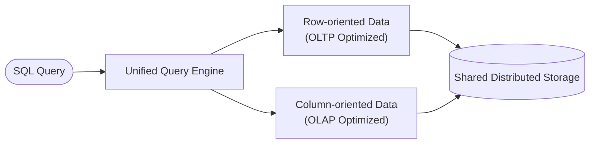

# Hybrid Transactional/Analytical Processing (HTAP)

## What is HTAP?

Hybrid Transactional/Analytical Processing (HTAP) is a database architecture that enables concurrent processing of [online transactional (OLTP)](https://en.wikipedia.org/wiki/Online_transaction_processing) and [analytical (OLAP)](https://en.wikipedia.org/wiki/Online_analytical_processing) workloads within the same platform. HTAP systems run real-time analytical queries on fresh operational data, eliminating the need for separate OLTP and OLAP systems. This document explains HTAP's core concepts, {{ ydb-short-name }}'s HTAP architecture, and how it scales to large datasets.

## Introduction – Motivation and Context

Traditionally, organizations separate online transaction processing systems from online analytical processing systems. This separation introduces data latency and architecture complexity, as analytical insights are based on data that lags behind current business events.

HTAP approach removes this separation by unifying OLTP and OLAP on the same platform. In 2014, Gartner coined the term HTAP to describe this architecture. HTAP enables analytics to run in real time on the same data that transactions are modifying. By eliminating separate environments for transactions and analytics, organizations reduce analytic staleness and simplify their data architecture.

## Core Concepts of HTAP

Core concepts in HTAP systems include:

- **Single source of truth:** HTAP maintains one unified dataset for both transactional and analytical purposes. The operational database serves as the source for analytics.
- **Mixed workload concurrency:** HTAP processes short transactions and complex read-only queries simultaneously on the same data.
- **Elimination of ETL and unnecessary delays:** HTAP removes the need to export and transform transactional data for analytical use.
- **Balance of OLTP and OLAP characteristics:** HTAP employs appropriate data structures and storage formats for different workloads. {{ ydb-short-name }} employs a hybrid storage engine with both row-based and column-based storage formats.
- **Real-time analytical processing:** HTAP enables analytics to be embedded into operational workflows, allowing systems to act on insights immediately.

## Typical Use Cases for HTAP

- **Fraud detection**: Analyzing transaction patterns in real-time while processing new transactions
- **Real-time business intelligence**: Creating operational dashboards with up-to-the-minute data
- **Inventory and pricing optimization**: Making stock and pricing decisions based on current sales data
- **Personalization systems**: Generating recommendations based on fresh user behavior data, see [{#T}](rag.md)
- **Operational monitoring**: Analyzing system metrics while the system continues to process transactions

## Architecture and Key Components

{{ ydb-short-name }}'s HTAP architecture addresses the different demands of transaction processing and analytical querying:

- **Unified storage with dual table formats:** {{ ydb-short-name }} uses [row-oriented storage](./datamodel/table.md#row-oriented-tables) for transactional operations and [column-oriented storage](./datamodel/table.md#column-oriented-tables) for analytical workloads. Row-oriented tables are designed for OLTP workloads with frequent inserts and lookups, while column-oriented tables are optimized for OLAP queries scanning large portions of few columns. The storage engine optimizes data layout depending on the table's intended use, while logically they behave as one database.

- **Distributed architecture and scalability:** {{ ydb-short-name }} is a distributed database built to scale horizontally across clusters of machines for high throughput and storage capacity. It automatically shards data across nodes and ensures [strong consistency](distributed-sql.md) using a consensus algorithm based on [Calvin](https://cs.yale.edu/homes/yu-ren/Calvin_Sigmod12.pdf). {{ ydb-short-name }}'s architecture is designed to scale across thousands of servers and handle petabytes of data.

- **Smart query optimizer:** {{ ydb-short-name }} employs a [sophisticated query optimizer](optimizer.md) that plans queries across heterogeneous workloads. For example, the optimizer decides whether to use an index, in which order to execute a multi-way join, or which filters to push down to where data resides. {{ ydb-short-name }} uses both [rule-based and cost-based optimization](optimizer.md) approaches.

- **Workload isolation and resource management:** {{ ydb-short-name }} uses [multi-version concurrency control (MVCC)](mvcc.md) to allow long-running analytical queries to access a stable data snapshot without blocking concurrent writes. {{ ydb-short-name }} prevents interference between OLTP and OLAP workloads through workload isolation techniques. The system classifies queries to ensure that heavy analytical queries don't impact transaction processing.

- **Memory and disk hierarchy:** {{ ydb-short-name }} uses a tiered storage approach where hot data and indexes may reside in memory or on SSD for fast access, while colder data can be stored on slower disks or even offloaded to external S3-compatible object store services. This balances performance and cost-effectiveness for large datasets.

Below is a simplified HTAP architecture diagram:

You can learn more about {{ ydb-short-name }}'s [Distributed Storage](glossary.md#distributed-storage) in [{#T}](topology.md).

## Integrating HTAP with Other {{ ydb-short-name }} Features

{{ ydb-short-name }} extends its HTAP capabilities by integrating with other database features:

- **[Topics](topic.md)**: Stream processing for real-time data pipelines
- **[Vector search](vector_search.md)**: Similarity search for AI applications
- **[Change data capture (CDC)](cdc.md)**: Capture table changes for downstream processing
- **[Federated queries](federated_query/index.md)**: Access data in external systems like S3-compatible object stores, PostgreSQL, or ClickHouse

Together, these features form {{ ydb-short-name }}'s [converged database](converged-database.md) approach, which unifies multiple data processing paradigms in a single system.

## Conclusion

{{ ydb-short-name }} unifies OLTP and OLAP workloads, enabling real-time insights while simplifying data architecture. By processing transactions and analytics in the same database, organizations can make data-driven decisions with minimal latency. {{ ydb-short-name }}'s implementation provides a scalable, consistent HTAP platform suitable for demanding applications.