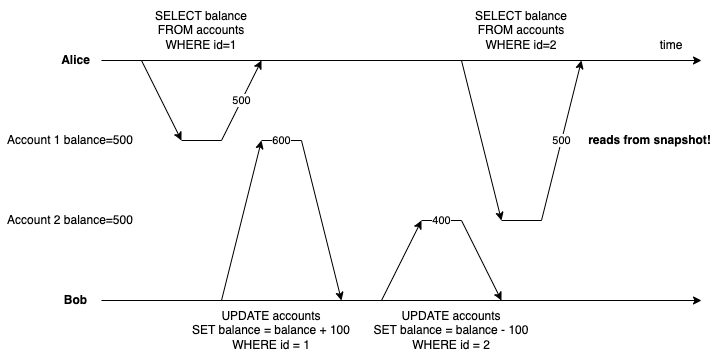
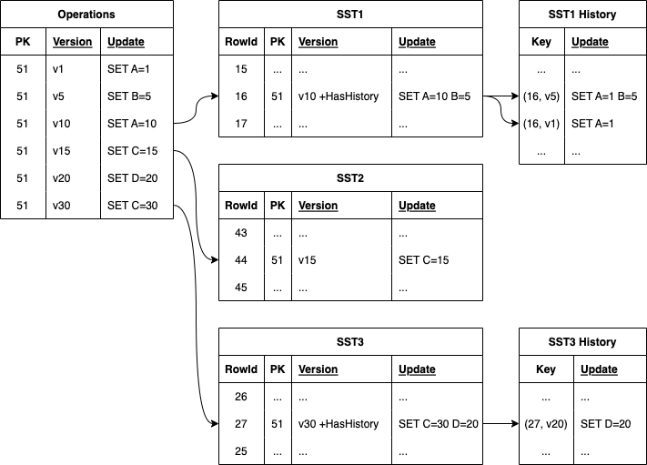
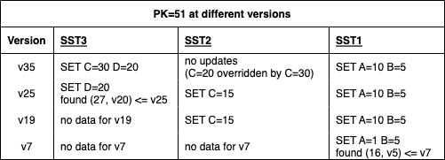
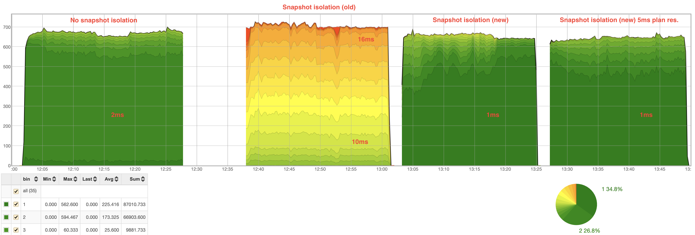

# Multi-Version Concurrency Control (MVCC)

This article describes how YDB uses MVCC.

## YDB transactions

YDB transactions run at serializable isolation level by default, which in layman's terms means it's as if they executed in some serial order without overlapping. While technically any order is allowed, in practice, YDB also guarantees non-stale reads (modifications committed before the transaction started will be visible). With YDB you may run these transactions interactively (users may have client-side logic between queries), which uses optimistic locks for conflict detection. When two transactions overlap in time and have conflicts (e.g. both transactions read the same key, observe its current value, and then try to update it) one of them will commit successfully, but the other will abort and will need to be retried.

YDB is a distributed database that splits OLTP tables into DataShard tablets, partitioned using the table's primary key, and each storing up to ~2GB of user data. Tablets are fault-tolerant replicated state machines over the shared log and shared storage, which may quickly migrate between different compute nodes. DataShards tablets implement low-level APIs for accessing corresponding partition data and support distributed transactions.

Distributed transactions in YDB are based on the ideas of [Calvin](https://cs.yale.edu/homes/thomson/publications/calvin-sigmod12.pdf), distributing deterministic transactions across multiple participants using a predetermined order of transactions. Every participant receives a substream of the global transaction stream (that involves this participant). Since each participant receives deterministic transactions in the same relative order, the database as a whole eventually reaches a consistent deterministic state (where each participant reached the same decision to commit or abort), even when different participants execute their substreams at different speeds. It's important to note that this does not make YDB eventually consistent and transactions always observe a consistent state at their point in time. Deterministic distributed transactions have a limitation in that they need to know all participants ahead of time, but YDB uses them as a building block, executing multiple deterministic transactions as phases of a larger user transaction. In practice, only the final commit phase runs as a distributed transaction since YDB tries to transform other phases into simple single-shard operations as much as possible while preserving serializable isolation guarantees.

Having a predetermined order of transactions becomes a concurrency bottleneck, as when you have a slow transaction that has to wait for something, all transactions down the line have to wait as well. This necessitates a good out-of-order execution engine, that is able to reorder transactions that don't conflict while preserving externally visible guarantees. Out-of-order execution alone can't help when transactions actually conflict, however. One example from the past is when a wide read was waiting for data from a disk it blocked all writes that fell into the same range, stalling the pipeline. Implementing MVCC reads lifted that restriction.

## What is MVCC

MVCC (Multi-Version Concurrency Control) is a way to improve database concurrency by storing multiple row versions as they have been at different points in time. This allows readers to keep reading from a database snapshot without blocking writers. Databases don't overwrite rows but make a modified copy of them instead, tagged with some version information, keeping older row versions intact. Older row versions are garbage collected eventually, e.g. when there are no readers left that could possibly read them.

A simple and naive way of adding MVCC to a sorted KV store is to store multiple values for each key, e.g. using keys tagged with a version suffix and skipping versions that are not visible to the current transaction/snapshot. Many databases go this route one way or another. Bear in mind, that such a naive approach leads to data bloat, as multiple copies of data need to be stored and older versions may be difficult to find and remove. It also causes degraded range query performance, as the query execution engine needs to skip over many unnecessary versions, until it finds the right one, or until it finds the next key.

## Why YDB needs MVCC

YDB table shards store data in a sorted KV store, implemented as a write-optimized [LSM tree](glossary.md#lsm), and historically they did not use MVCC. Since the order of transactions is predetermined externally (using Coordinators, somewhat similar to sequencers in the original Calvin paper), YDB heavily relies on reordering transaction execution at each participant, which is correct as long as such reordering cannot be observed externally, and it doesn't change the final outcome. Without MVCC reordering is impeded by read-write conflicts, e.g. when a write cannot start execution until a particularly wide read is complete. With MVCC writes no longer need to wait for conflicting reads to complete, and reads only ever need to wait for preceding conflicting writes to commit. This makes the out-of-order engine's job easier and improves the overall throughput.

| Timestamp | Statement | Without MVCC | With MVCC | Description |
| --- | --- | --- | --- | --- |
| v1000:123 | `UPSERT` | ☑️ | ☑️ | Executed |
| v1010:124 | `SELECT` | ⏳ | ⏳ | Reading from disk |
| v1020:126 | `UPSERT` | ❌ | ☑️ | UPSERT without MVCC has to wait for SELECT to finish |
| v1030:125 | `SELECT` | ❌ | ⏳ | SELECT needs to wait for UPSERT to finish before reading from disk |

YDB without MVCC also had to take additional steps to preserve data consistency. Interactive transactions may consist of multiple read operations, where each read was performed at a different point in time, and YDB had to perform special checks to ensure conflicting transactions did not perform writes between the read and commit time. This was not ideal for our users, as even pure read-only transactions were often failing with serializability errors and had to be retried.

After implementing MVCC using global versions (shared with deterministic distributed transactions), it became possible to perform reads in a transaction using a global snapshot. This means pure read-only transactions no longer fail with serializability errors and rarely need to be retried by the user, improving throughput in read-heavy use cases. Transactions also acquired a "repeatable read" property, which means if you perform several selects from the same table transaction will not fail and observe the same (globally consistent) result.

## How YDB stores MVCC data

DataShard tablets currently store a single table partition in a write-optimized LSM tree, where for each primary key we store row operation with a set of column updates. During searches, we merge updates from multiple levels and get the final row state. Compactions similarly merge updates from multiple levels and write a resulting aggregate row update.

One of our design goals when adding MVCC was minimal degradation to existing workloads, and that meant queries, especially range queries, with the most recent version needed to be fast. That meant using common approaches like adding a version suffix to keys was out of the question. Instead, when a row in an [SST](glossary.md#sst) (sorted string table, part of an LSM tree) has multiple versions we only store the most recent version in the main data page, marking it with a flag signaling "history" data is present. Older row versions are stored in a special "history" companion SST, where for each marked row id we store row versions in descending order. When we read from a snapshot, we detect if the most recent row version is too recent, and perform a binary search in the history SST instead. Once we found a row version corresponding to a snapshot we apply its updates to the final row state. We also use the fact that LSM tree levels roughly correspond to their write time, allowing us to stop searching once the first matching row is found for a given snapshot. For each level below that we only need to apply the most recent row to the final row state, which limits the number of merges to at most the number of levels, which is usually small.

Rows in SSTs are effectively deltas, nonetheless, they are stored as pre-merged from the viewpoint of a given SST, which helps with both search and compaction complexity. Let's imagine a hypothetical situation where the user writes 1 million updates to some key K, each time modifying one of a multitude of columns. As a write-optimized storage, we prefer blind writes and don't read the full row before updating and writing a new updated row, instead, we write an update that says "update column C for key K". If we didn't store pre-merged state at each level, soon there would have been 1 million deltas for the key K, each at a different version. Then each read would potentially need to consider applying all 1 million deltas to the row. Instead, we merge updates at the same level into aggregate updates, starting with memtable (where the previous row state is always in memory and we don't need to read from disk). When compacting several levels into a new SST we only need to iterate over each update version and merge it with the most recent version in the SSTs below, this limits either merge complexity at compaction (the number of merges for each version is limited by the number of levels) and at read time, while still allowing us to perform blind writes.

Eventually, we mark version ranges as deleted and no longer readable, after which compactions allow us to garbage collect unnecessary row versions automatically (unreachable versions are skipped over and not emitted when writing new SSTs). We also store a small per-version histogram for each SST, so we can detect when too much unnecessary data accumulates in the LSM tree and trigger additional compactions for garbage collection.

## How YDB uses MVCC

MVCC allows DataShards to improve the reordering of transactions, but we can do even better by leveraging global snapshots, so we use global timestamps as version tags, which correspond to global order already used by deterministic distributed transactions. This allows us to create global snapshots by choosing a correct global timestamp. Using such snapshots to read from DataShards effectively allows the database to observe a consistent snapshot at that point in logical time.

When we perform the first read in an interactive or multi-stage transaction, we choose a snapshot timestamp that is guaranteed to include all previously committed transactions. Currently, this is just a timestamp that corresponds to the last timestamp sent out by Coordinators. This timestamp may be slightly in the future (as some transactions in-flight from Coordinators to DataShards may not have started executing yet), but usually not by much, and since transactions are inflight they are expected to be executed soon. Most importantly this timestamp is guaranteed to be equal to or larger than any commit timestamp already observed by the client, so when this timestamp is generated for new reads, those reads are guaranteed to include all previously finished writes.

We then use this snapshot for reads without any additional coordination between participants, as snapshots are already guaranteed to be globally consistent across the database. To guarantee snapshots include all relevant changes and are not modified later, DataShards may need to wait until they received all write transactions that must have happened before that snapshot, but only conflicting writes need to execute before the read may start. DataShards also guarantee that any data observed by the snapshot is frozen and won't be modified later by concurrent transactions (effectively guaranteeing repeatable read), but this only applies to observed changes. Anything not yet observed is in a state of flux and is free to be modified until logical time advances well past the snapshot at every participant in the database. An interesting consequence of this is that some later writes may be reordered before the snapshot, which is allowed under serializable snapshot isolation.

When interactive transactions perform writes their changes are buffered and the final distributed commit transaction checks (using optimistic locks) that transaction did not have any conflicting changes between its read (snapshot) and commit time, which effectively simulates moving all reads forward to the commit point in time, only committing when it's possible. Interactive transactions also detect when they read from "history" data and mark such transactions as read-only, since we already know moving this read forward in time (to a future commit timestamp) would be impossible. If a user attempts to perform writes in such a transaction we return a serialization error without any additional buffering or communication. If it turns out a transaction was read-only there's no serialization violation (we have been reading from a consistent snapshot after all), and we only need to perform some cleanup, returning success to the user. Before YDB introduced global MVCC snapshots we had to always check locks at commit time, which made it a struggle to perform wide reads under a heavy write load.

## Keeping fast KeyValue performance

While YDB supports complicated distributed transactions between multiple shards and tables, it's important to also support fast single-shard transactions. Internally such transactions are called "immediate" and they historically don't use any additional coordination. For example when a transaction only reads or writes a single key in a table we only want to communicate with a single shard that the key belongs to and nothing else. At first glance it runs contrary to the use of global MVCC timestamps, however, we may use local uncoordinated timestamps (possibly different at each DataShard), which are still correct global timestamps. Each distributed transaction is assigned a timestamp that consists of two numbers (step, txId), where a step is a coordination tick, often configured to increase every 10ms, and txId is a globally unique transaction id. Immediate transactions don't have a step, since they are not processed by coordinators, and while txId is unique it is not guaranteed to always increase, so we cannot use it for write timestamps without risking these timestamps going back in time. There's an important distinction, however, since immediate transactions don't have to be repeatable, their read/write timestamp does not have to be unique. That's why we allow them to share a timestamp with some next transaction in the queue (effectively executing "just before" that transaction). When the queue is empty we use a broadcasted coordinator time (the maximum step acknowledged by shards, so shard is guaranteed there will be no transactions up to that step's end) and a maximum number as txId (effectively executing "just before" that step ends).

Assigning such non-unique timestamps to immediate transactions guarantees there's always some new non-decreasing timestamp that allows them to execute without delay (subject to other out-of-order execution restrictions). It also helps with compactions, as we may have thousands of these transactions executed at the same timestamp, and all of that history is compacted into a single final row version for that step. This allows us to only keep versions in history that need to be consistent across multiple shards.

## Prioritizing reads

An interesting conundrum happened when we tried to enable MVCC snapshots for the first time, there was a severe degradation in read latency under some workloads! This was because time in YDB usually "ticks" every 10ms (tuned to be similar on par with typical multi-datacenter commit time of 4ms), and single-shard writes use "current time" as part of their timestamp. This meant snapshot reads had to wait for the next tick until the read timestamp is "closed" for new writes, as well as make sure it is actually safe. This added quite a bit of latency to reads, which in hindsight was entirely expected.

We had to go back to the drawing board and find ways to prioritize reads without penalizing writes too much. What we ended up doing was to "close" the read timestamp as soon as we perform a repeatable snapshot read, while choosing some "future" timestamp for new single-shard writes, that is guaranteed to not corrupt previously read snapshots (ensuring repeatable read). However, since that write timestamp is in the future, and we must ensure any new snapshot includes committed data, we delay responses until that future timestamp matches the current timestamp, and pretend this new data is not committed (e.g. when running concurrent single-shard reads) until timestamps finally match. Interestingly, since writes are already in flight to storage and must be committed first in at least one other datacenter, this wait did not add much to average write latency even with many snapshot reads, but it did wonders to read latency:

