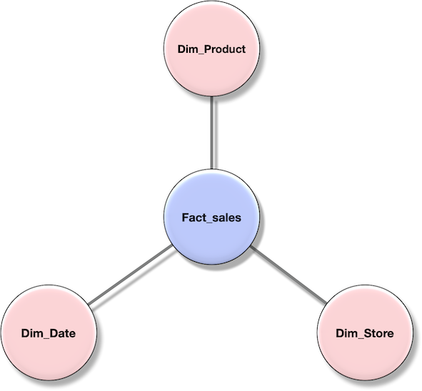

# Query Optimization in {{ ydb-short-name }}

{{ ydb-short-name }} uses two types of query optimizers: a rule-based optimizer and a cost-based optimizer. The cost-based optimizer is used for complex queries, typically analytical ([OLAP](https://en.wikipedia.org/wiki/Online_analytical_processing)), while rule-based optimization works on all queries.

A query plan is a graph of operations, such as reading data from a source, filtering a data stream by a predicate, or performing more complex operations such as [JOIN](../yql/reference/syntax/select/join.md) and [GROUP BY](../yql/reference/syntax/select/group-by.md). Optimizers in {{ ydb-short-name }} take an initial query plan as input and transform it into a more efficient plan that is equivalent to the initial one in terms of the returned result.

## Rule-Based Optimizer

A significant part of the optimizations in {{ ydb-short-name }} applies to almost any query plan, eliminating the need to analyze alternative plans and their costs. The rule-based optimizer consists of a set of heuristic rules that are applied whenever possible. For example, it is beneficial to filter out data as early as possible in the execution plan for any query. Each optimizer rule comprises a condition that triggers the rule and a rewriting logic that is executed when the plan is applied. Rules are applied iteratively as long as any rule conditions match.

## Cost-Based Query Optimizer

The cost-based optimizer is used for more complex optimizations, such as choosing an optimal join order and join algorithms. The cost-based optimizer considers a large number of alternative execution plans for each query and selects the best one based on the cost estimate for each option. Currently, this optimizer only works with plans that contain [JOIN](../yql/reference/syntax/select/join.md) operations. It chooses the best order for these operations and the most efficient algorithm implementation for each join operation in the plan.

The cost-optimizer consists of three main components:

* Plan enumerator
* Cost estimation function
* Statistics module, which is used to estimate statistics for the cost function

### Plan Enumerator

The current Cost-based optimizer in {{ ydb-short-name }} enumerates all useful join trees, for which the join conditions are defined. It first builds a join hypergraph, where the nodes are tables and edges are join conditions. Depending on how the original query is written, the join hypergraph may have quite different topologies, ranging from simple chain-like graphs to complex cliques. The resulting topology of the join graph determines how many possible alternative plans need to be considered by the optimizer.

For example, a star is a common topology in analytical queries, where a main fact table is joined to multiple dimension tables:

```sql
SELECT
    P.Brand,
    S.Country AS Countries,
    SUM(F.Units_Sold)

FROM Fact_Sales F
INNER JOIN Dim_Date D    ON (F.Date_Id = D.Id)
INNER JOIN Dim_Store S   ON (F.Store_Id = S.Id)
INNER JOIN Dim_Product P ON (F.Product_Id = P.Id)

WHERE D.Year = 1997 AND  P.Product_Category = 'tv'

GROUP BY
    P.Brand,
    S.Country
```

In this query graph, all `Dim...` tables are joined to the `Fact_Sales` fact table:



Common topologies also include chains and cliques. A "chain" is a topology where tables are connected to each other sequentially and each table participates in no more than one join. A "clique" is a fully connected graph where each table is connected to every other table.

In practice, OLAP queries often have a topology that is a combination of "star" and "chain" topologies, while complex topologies like "cliques" are very rare.

The topology significantly impacts the number of alternative plans that the optimizer needs to consider. Therefore, the cost-based optimizer limits the number of joins that are compared by exhaustive search, depending on the topology of the original plan. The capabilities of exact optimization in {{ ydb-short-name }} are listed in the following table:

| Topology | Number of supported joins |
| -------- | ------------------------- |
| Chain | 110 |
| Star | 18 |
| Clique | 15 |

{{ ydb-short-name }} uses a modification of the [DPHyp](https://www.researchgate.net/publication/47862092_Dynamic_Programming_Strikes_Back) algorithm to search for the best join order. DPHyp is a modern dynamic programming algorithm for query optimization that avoids enumerating unnecessary alternatives and allows you to optimize plans with `JOIN` operators, complex predicates, and even `GROUP BY` and `ORDER BY` operators.

### Cost Estimation Function

To compare plans, the optimizer needs to estimate their costs. The cost function estimates the time and resources required to execute an operation in {{ ydb-short-name }}. The primary parameters of the cost function are estimates of the input data size for each operator and the size of its output. These estimates are based on statistics collected from {{ ydb-short-name }} tables, along with an analysis of the plan itself.

### Statistics for the Cost-Based Optimizer {#statistics}

The cost-based optimizer relies on table statistics and individual column statistics. {{ ydb-short-name }} collects and maintains these statistics in the background. You can manually force statistics collection using the [ANALYZE](../yql/reference/syntax/analyze.md) query.

The current set of table statistics includes:

* Number of records
* Table size in bytes

The current set of column statistics includes:

* [Count-min sketch](https://en.wikipedia.org/wiki/Count%E2%80%93min_sketch)

### Cost Optimization Levels

In {{ ydb-short-name }}, you can configure the cost optimization level via the [CostBasedOptimizationLevel](../yql/reference/syntax/pragma.md#costbasedoptimizationlevel) pragma.