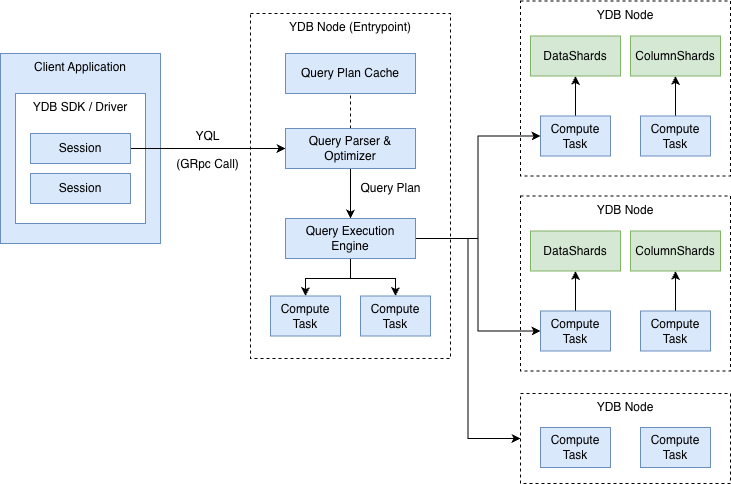

# Query Execution

This article provides an overview of query execution in {{ ydb-short-name }}. It is intended to familiarize users with the capabilities and limitations of {{ ydb-short-name }}'s query execution engine, including key features such as the supported query language and execution flow. The article also introduces essential terminology and concepts related to query processing, which are used throughout the rest of the documentation.

{{ ydb-short-name }} provides a unified query interface capable of efficiently handling diverse workloads — from high-throughput [Online Transaction Processing (OLTP)](https://en.wikipedia.org/wiki/Online_transaction_processing) to large-scale analytical [Online Analytical Processing (OLAP)](https://en.wikipedia.org/wiki/Online_analytical_processing) queries. With this approach, applications can run transactional and analytical queries transparently, without having to use different APIs for different workloads.

{{ ydb-short-name }} uses a distributed query execution engine designed for high scalability and efficiency in large, distributed environments. When you run a query, {{ ydb-short-name }} automatically breaks the work down across multiple nodes, taking advantage of data locality — processing data where it is stored whenever possible. This reduces unnecessary data movement across the network. Additionally, {{ ydb-short-name }} leverages advanced features like compute pushdown, where filters and computations are pushed closer to the data storage layer, further improving performance. These techniques enable {{ ydb-short-name }} to efficiently handle complex queries and large workloads across clusters of machines.

## General Workflow

This section provides a step-by-step overview of how SQL queries are handled in {{ ydb-short-name }}. Understanding this process helps you become familiar with {{ ydb-short-name }} components and gain insight into what happens under the hood.

1. **Connecting to the Database**
Your application uses one of the [official {{ ydb-short-name }} SDKs](../reference/ydb-sdk/index.md) to connect to the database. The SDK automatically manages a pool of sessions, logical connections required to execute queries. Behind the scenes, each session is physically connected to one of the nodes in the {{ ydb-short-name }} cluster. When you need to run a query, the SDK provides a session from this pool, so you don’t need to manage connections manually.

2. **Starting a Transaction and Sending a Query**
With your session in hand, your application can begin a new transaction. You then issue your query in the [YQL query language](../yql/reference/index.md) based on your application logic and send it to the {{ ydb-short-name }} cluster using the session.

3. **Parsing and Plan Cache Lookup**
On the server side, the {{ ydb-short-name }} node that receives your query first parses and analyzes it for correctness. Before planning execution, {{ ydb-short-name }} checks whether a physical execution plan for this query already exists in the query cache. If a cached plan is found, it can be reused to save time and resources.

4. **Query Optimization and Plan Preparation**
If no existing plan is found in the cache, {{ ydb-short-name }}'s query optimizer creates a new physical query plan. This plan determines the most efficient way to execute your query across the distributed cluster. For more detailed information about query optimization and query plans, see the [{#T}](optimizer.md) article.

5. **Distributed Query Execution**
Using the prepared physical plan, {{ ydb-short-name }} starts distributed execution of the query. Work is distributed across multiple nodes in the database, with each node undertaking a part of the computation or data access as defined by the plan. This parallel processing enables fast and scalable query execution, even on large datasets.

6. **Streaming Results Back to the Client**
For queries that produce results (such as `SELECT` statements), they are returned to your application as one or more result sets, which look like strongly typed tables. Instead of sending all results at once, YDB streams the data back in portions (parts). This allows your application to start processing results immediately and handle large result sets efficiently without needing to load everything into memory at once.

7. **Continuing or Completing the Transaction**
After receiving and processing the results, your application can choose to continue the transaction by sending additional queries within the same transaction context, or complete the transaction by committing it to save changes.

Further details and explanations of the concepts introduced in this section are provided in the following sections.

## Sessions {#sessions}

A session in {{ ydb-short-name }} is a logical "connection" to the database that maintains the context required to execute queries and manage transactions. Sessions store transaction state and other essential context, enabling a series of related queries to be executed as part of a single transaction. Most query execution operations occur within the context of an active session.

Sessions are designed to be long-living objects. One of their key roles is to enable efficient load balancing: by distributing sessions and their associated queries across different nodes in the cluster, {{ ydb-short-name }} can make better use of resources and achieve high availability and scalability.

In practice, you don’t need to worry about creating, reusing, or closing sessions yourself. All official {{ ydb-short-name }} SDKs provide session pooling out of the box. A session pool automatically manages the lifecycle of sessions—creating them when needed, reusing existing ones, and returning them to the pool—so that you can focus on writing your application’s logic rather than handling session management details.

## Transactions

Every query in {{ ydb-short-name }} is executed within the context of a transaction, ensuring data consistency and reliability. Transactions can be managed either explicitly, or by specifying appropriate transaction control parameters during query execution.

{{ ydb-short-name }} also supports [Interactive transactions](./glossary.md#interactive-transaction), which give you the flexibility to execute multiple queries within the same transaction, while allowing your application to perform custom logic between those queries. This makes it possible to build complex workflows that require several related operations to be treated as a single atomic unit.

For comprehensive information on transactions and the available transaction modes in {{ ydb-short-name }}, see the [Transactions](transactions.md) article.

## Retries

{{ ydb-short-name }} employs [Optimistic concurrency control](https://en.wikipedia.org/wiki/Optimistic_concurrency_control) for transaction management. This means that a transaction may be aborted during execution if {{ ydb-short-name }} detects a conflict and cannot guarantee the requested isolation level — for example, when two transactions attempt to modify the same data concurrently. Additionally, because {{ ydb-short-name }} operates as a distributed system across potentially large clusters, some nodes may become temporarily unavailable due to network partitions, hardware failures, or maintenance. Such events can also cause transaction failures that require retries.

Retries should always be handled at the transaction level, not at the level of individual queries. In [Interactive transactions](glossary.md#interactive-transaction), the sequence of queries and their intermediate results may influence subsequent operations, making it unsafe or impossible to retry only a single failed query. Therefore, if a query fails due to a conflict or a transient error, the entire transaction should be retried from the beginning to ensure correctness and consistency.

All official {{ ydb-short-name }} SDKs provide built-in retry logic and transaction management helpers to simplify application development. By using the standard transaction methods provided by your SDK, you automatically get correct and robust retry behavior without having to implement it manually. For details about retry mechanisms in specific SDKs, see the [{#T}](../reference/ydb-sdk/error_handling.md).

## Query language

Queries for {{ ydb-short-name }} are written in [YQL](./glossary.md#yql) — an SQL dialect designed with scalable distributed databases in mind. While YQL is not fully ANSI SQL compatible, it closely follows familiar SQL syntax and concepts for most common use cases, making it easy to learn for those with SQL experience. The complete language reference is available in the [YQL documentation](../yql/reference/index.md).

Most interactions with {{ ydb-short-name }} are performed using YQL, making it the primary tool for querying and managing data in {{ ydb-short-name }}. Because of this, understanding YQL’s features and capabilities is essential for effectively working with {{ ydb-short-name }}. Learning YQL enables you to take full advantage of the database’s advanced query functionality, express complex business logic, and utilize {{ ydb-short-name }}’s distributed architecture efficiently.

YQL supports most common SQL constructs, including:

- [Data Manipulation Language (DML)](https://en.wikipedia.org/wiki/Data_manipulation_language) — `SELECT`, `INSERT`, `REPLACE`, `UPDATE`, `DELETE`, `UPSERT`.
- [Data Definition Language (DDL)](https://en.wikipedia.org/wiki/Data_definition_language) — `CREATE`, `ALTER`, `DROP` for tables, indexes, and other schema objects.
- Joins — all standard `JOIN` types, plus special joins such as `LEFT SEMI`, `RIGHT SEMI`, and `ANY` joins.
- Aggregations — `GROUP BY` and window functions.
- [Named expressions](../yql/reference/syntax/expressions.md#named-nodes) for better query text organization.
- A collection of built-in functions for processing various data types, empowering users to handle complex logic directly in queries.
- Pragmas and hints to fine-tune execution plans.

## Result Sets

When you execute a query in {{ ydb-short-name }}, the result can consist of one or more result sets. Each result set is similar to a table: it contains rows and columns, where every column has a defined, explicit data type. This strong typing guarantees that the structure of the returned data is always predictable and consistent.

Result sets in {{ ydb-short-name }} can be arbitrarily large. To efficiently handle large amounts of data, {{ ydb-short-name }} streams result sets back to the client in parts (chunks). This streaming approach lets clients begin processing the results right away without waiting for the entire result set to be transferred. As a result, applications can handle large datasets quickly and with minimal memory usage.

## Limitations

When working with queries in {{ ydb-short-name }}, there are several important limitations to keep in mind:

* **No schema transactions**
{{ ydb-short-name }} does not support schema transactions. This means that DDL statements (such as creating or altering tables) cannot be combined with DML statements (such as inserts, updates, or deletes) within the same transaction or query.

* **Large updates and optimistic locking**
{{ ydb-short-name }} uses optimistic concurrency control. When performing very large updates or deletes within a transaction, the probability of lock conflicts increases, making such operations impractical. For bulk modifications, it is recommended to use [`BATCH UPDATE`](../yql/reference/syntax/batch-update.md) / [`BATCH DELETE`](../yql/reference/syntax/batch-delete.md) statements.

* **Transaction size limits**
The amount of data that can be written in a single transaction is limited. For detailed thresholds, see the [{#T}](./limits-ydb.md#query) section.

For a full overview of {{ ydb-short-name }} limitations, see [{#T}](./limits-ydb.md).
