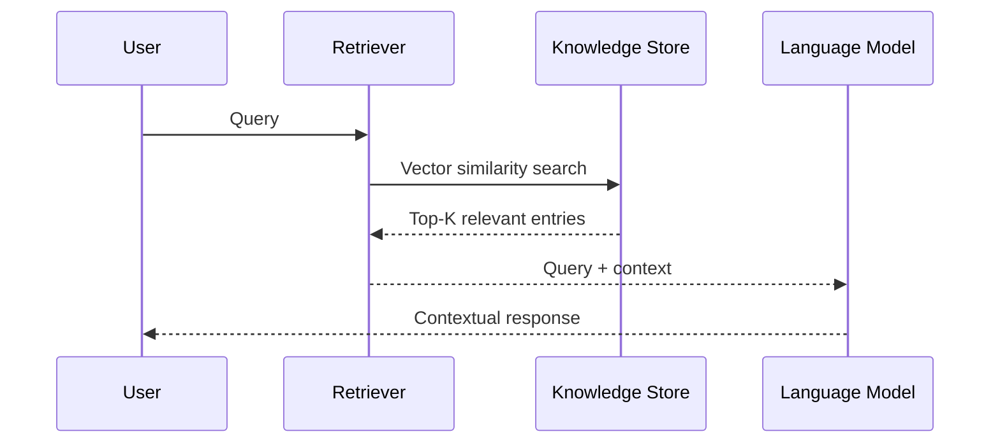

# Retrieval Augmented Generation (RAG)

Retrieval Augmented Generation (RAG) is a technique that combines [Large Language Models (LLMs)](https://en.wikipedia.org/wiki/Large_language_model) with information retrieval systems. RAG systems retrieve relevant information from external knowledge sources before generating responses, rather than relying solely on pre-trained model knowledge.

## Overview

LLMs are trained on static datasets and may generate incorrect or outdated information when queried about topics not covered in their training data. RAG addresses this limitation by implementing a retrieval step: the system searches external knowledge sources for relevant context before generating responses.

RAG systems reduce hallucinations, improve factual accuracy, and provide source attribution for generated content.

## Use Cases

RAG systems are commonly applied in:

- **Documentation systems**: Technical question answering with source attribution
- **Support systems**: Context-aware troubleshooting using documentation and case histories
- **Research tools**: Information synthesis across scientific literature and data repositories
- **Decision support**: Contextual analysis for data-driven decision making
- **Report generation**: Content creation with supporting evidence from original sources

## Architecture

RAG systems implement a two-stage process:

1. **Retrieval**: Search for relevant information using [vector search](vector_search.md), keyword matching, or hybrid approaches
2. **Generation**: Provide the query and retrieved context to an LLM for response generation

## Components

RAG implementations typically include:

1. **Query interface**: API or user interface for receiving queries
2. **Orchestration layer**: Coordinates retrieval and generation processes
3. **Embedding pipeline**: Converts source data into vector representations for indexing
4. **Knowledge base**: Data repository with [vector indexes](../dev/vector-indexes.md) for similarity search
5. **Prompt formatting**: Structures queries and context for optimal LLM performance
6. **Language model**: Generates responses based on query and retrieved context
7. **Response processing**: Formats and delivers final output

## Implementation Patterns

| Pattern | Implementation | Application |
|---------|----------------|-------------|
| **Basic RAG** | Single retrieval-generation cycle | Question answering systems |
| **Conversational RAG** | Dialog state management | Interactive assistants |
| **Segmented RAG** | Domain-specific index partitioning | Multi-domain knowledge bases |
| **Iterative RAG** | Multi-stage retrieval with refinement | High-precision information retrieval |

## Technical Challenges

Common challenges in RAG implementation:

1. **Context window optimization**: Balancing comprehensive context with model token limits
2. **Retrieval quality**: Implementing appropriate embedding models and query reformulation
3. **Hybrid queries**: Combining vector search with structured data predicates
4. **Context relevance**: Applying filtering and re-ranking to improve retrieved content quality
5. **Performance optimization**: Tuning vector index configurations for specific workload patterns

## Scaling Considerations

RAG system scaling involves balancing retrieval quality, response latency, and resource costs:

### Vector Index Scaling

When implementing RAG solutions, technical scaling requires balancing quality, performance, and costs. {{ ydb-short-name }}'s [K-means tree-based vector indexes](../dev/vector-indexes.md) offer significant advantages over in-memory structures like HNSW. While in-memory data structures provide fast search, they are complicated to construct and update, and they especially struggle when indexes grow too large to fit in RAM. {{ ydb-short-name }}'s distributed architecture enables horizontal scaling for expanding vector collections, with indexes efficiently and reliably managed similarly to tables with original data. This approach maintains performance while managing costs even as knowledge bases grow exponentially. Techniques like approximate search and scalar quantization further optimize resource usage, ensuring consistent query performance without requiring expensive memory upgrades as your vector data scales.

### Performance Optimization

- **Approximate search**: Reduces computation cost for large vector collections
- **Quantization**: Compresses vector representations to reduce storage and memory requirements
- **Caching**: Improves response times for frequently accessed content
- **Index tuning**: Configure parameters based on dataset characteristics and query patterns

## Summary

RAG combines information retrieval with language model generation to address limitations in pre-trained model knowledge. Implementation requires vector search capabilities for retrieval and integration with language model APIs for generation. Database systems can support RAG through [vector indexing](vector_search.md) and [framework integration](../integrations/vectorsearch/langchain.md) to provide the infrastructure for retrieval-based AI applications.
