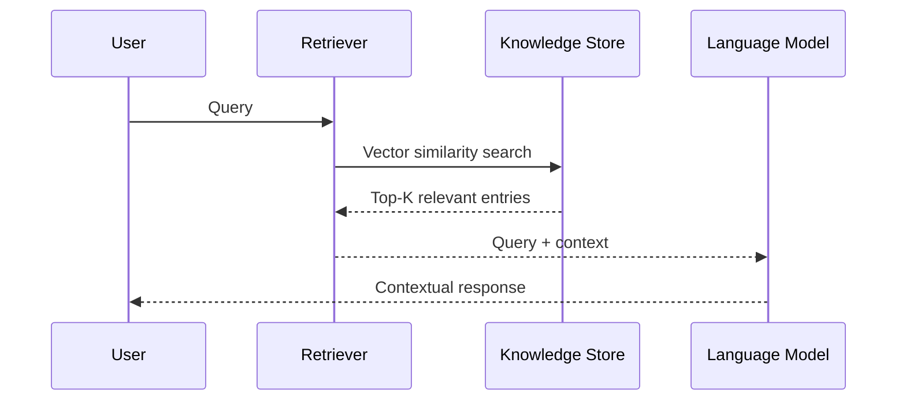

# Retrieval Augmented Generation (RAG)

Retrieval Augmented Generation (RAG) is an approach that combines [large language models](https://en.wikipedia.org/wiki/Large_language_model) (LLMs) with information retrieval to produce more accurate, data-grounded outputs. Instead of relying solely on pre-trained knowledge, RAG systems retrieve relevant information from external sources like [AI databases](ai-database.md) to augment the generative model's context.

## Motivation

LLMs have inherent limitations in their static training data. When queried about unseen or time-sensitive topics, they may generate incorrect information which is often referred to as *hallucination*. RAG addresses this by implementing a retrieval step before generation: the system searches an authoritative knowledge source for relevant context before producing a response. This grounding in actual data reduces hallucinations, improves accuracy, and enables source traceability.

Common use cases where implementing a RAG pipeline significantly improves end-user experience:

- **Documentation access** – Answering technical questions with documentation source attribution.
- **Support systems** – Context-aware troubleshooting from product documentation and historical cases.
- **Research tools** – Information synthesis across published scientific papers and data repositories.
- **Decision support** – Contextual analysis tools for data-driven decision making.
- **Data analysis** – Report generation with supporting evidence from original data sources.

## Core RAG Architecture

Retrieval Augmented Generation follows a specific implementation pattern:

1. **Retrieval** – Find relevant pieces of information from a knowledge source using [vector search](vector_search.md), keyword matching, point lookups, or hybrid approaches.
2. **Generation** – Supply the original query plus retrieved context to an AI model, which generates a response informed by that context.

High-level demonstration of the workflow:

A typical RAG implementation includes:

1. **Query interface** – Receives user queries (API, chat interface, etc.).
2. **Orchestration layer** – Coordinates the retrieval and generation processes.
3. **Embedding pipeline** – Process for converting the original data (text, images or other kinds of media) into vector representations stored in a search index.
4. **Knowledge base** – Structured or unstructured data repository, typically supplemented with [vector indexes](../dev/vector-indexes.md) for efficient similarity search.
5. **Prompt engineering** – Formats the LLM query for optimal model performance based on the original user request and the retrieved context.
6. **Language model** – Text generation system that produces the final response based on the query augmented with retrieved context.
7. **Response generation** – Produces the final output based on retrieved information.

## RAG Implementation Types

| Type | Technical Implementation | Use Case |
|------|-------------|------------------|
| **Basic RAG** | Single retrieval-generation cycle per query | Question answering systems |
| **Conversational RAG** | State management for dialog context | Interactive assistants |
| **Segmented RAG** | Domain-specific index partitioning | Multi-domain knowledge bases |
| **Iterative RAG** | Multi-stage retrieval with feedback loops | High-precision information retrieval |

## Technical Selection Criteria

When planning a specific RAG pipeline implementation, consider the following:

1. **Data characteristics** – Determine appropriate embedding models based on content type (text, media, or structured data).
2. **Scale requirements** – Select between [exact search](vector_search.md#vector-search-exact) for smaller datasets or [indexed approaches](vector_search.md#vector-search-index) for large-scale deployments.
3. **Performance targets** – Configure vector index parameters and caching strategies to meet latency and quality requirements.
4. **Update frequency** – Implement appropriate index maintenance strategies based on data volatility.
5. **Security requirements** – Apply access control mechanisms for sensitive data.
6. **Integration architecture** – Research and leverage ready-made integrations to minimize boilerplate code in your application.
7. **Evaluation framework** – Implement quantitative metrics for measuring retrieval precision and response accuracy.

## Technical Challenges and Solutions

1. **Context window optimization** – Balance between comprehensive context and model token limits.
2. **Retrieval quality** – Implement domain-specific embedding models and query reformulation.
3. **Structured data integration** – Combine vector search with traditional predicates for hybrid queries.
4. **Context relevance** – Apply filters and re-ranking to ensure retrieved content is relevant.
5. **Performance tuning** – Optimize vector index configurations to match workload characteristics.

## Scaling RAG Systems

When implementing RAG solutions, technical scaling requires balancing quality, performance, and costs. {{ ydb-short-name }}'s [K-means tree-based vector indexes](../dev/vector-indexes.md) offer significant advantages over in-memory structures like HNSW. While in-memory data structures provide fast search, they are complicated to construct and update, and they especially struggle when indexes grow too large to fit in RAM. {{ ydb-short-name }}'s distributed architecture enables horizontal scaling for expanding vector collections, with indexes efficiently and reliably managed similarly to tables with original data. This approach maintains performance while managing costs even as knowledge bases grow exponentially. Techniques like approximate search and scalar quantization further optimize resource usage, ensuring consistent query performance without requiring expensive memory upgrades as your vector data scales.

## Conclusion

Retrieval Augmented Generation creates a bridge between stored knowledge and language model capabilities. By implementing efficient vector search systems based on {{ ydb-short-name }}'s vector storage and processing capabilities, organizations can develop AI applications that provide accurate, verifiable, and current information. {{ ydb-short-name }}'s [vector search](vector_search.md) features and [integration with RAG frameworks](../integrations/vectorsearch/langchain.md) provide the technical foundation for implementing production-grade RAG systems.
