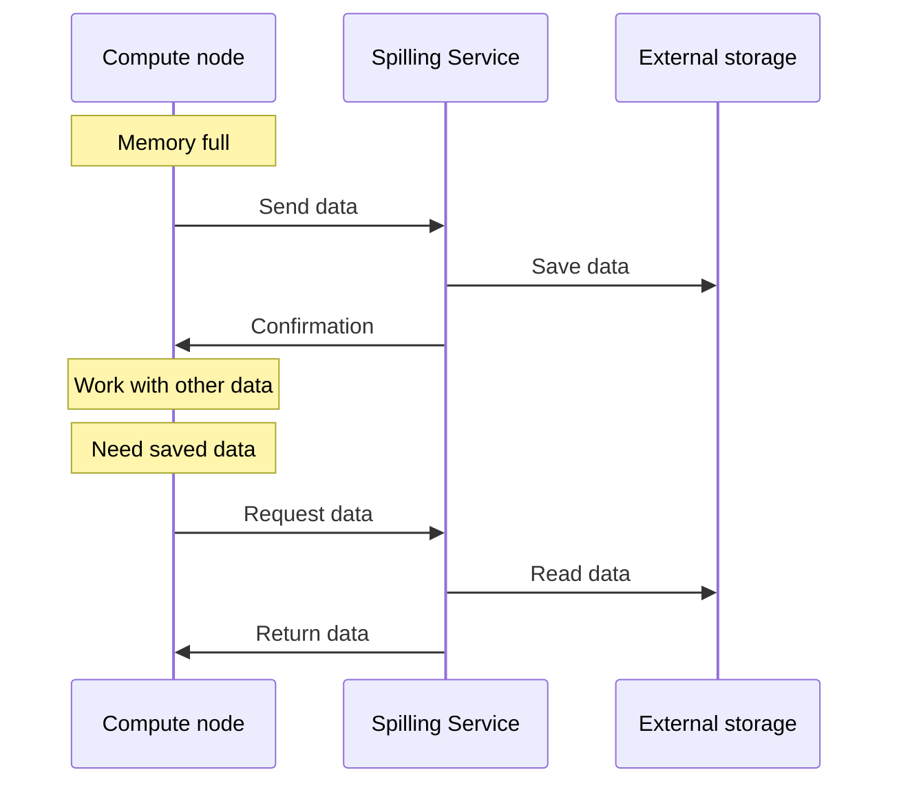

# Spilling

## Spilling in General

**Spilling** is a memory management mechanism that temporarily offloads data exceeding available cluster RAM capacity to external storage. Spilling enables execution of user queries that require processing large data volumes exceeding available RAM.

In data processing systems, including {{ ydb-short-name }}, spilling is essential for:

- processing queries with large data volumes when intermediate results don't fit in RAM;
- executing complex analytical operations (aggregations, sorting, table joins) over large datasets;
- optimizing query performance through intermediate materialization of part of the data in external memory, which in certain scenarios can accelerate overall execution time.

Spilling operates based on the memory hierarchy principle:

1. **Random Access Memory (RAM)** — fast but limited.
2. **External storage** — slower but more capacious.

When memory usage approaches the limit, the system:

- serializes part of the data
- saves it to external storage
- frees the corresponding memory
- loads data back into memory, when necessary, to continue computations

## Spilling in {{ ydb-short-name }}

### Spilling Architecture in {{ ydb-short-name }}

The spilling mechanism in {{ ydb-short-name }} includes two main levels: the backend—a service for storing data in external storage, and the frontend—components that interact with this service and manage memory. Currently, a local disk is used as the external storage.

#### Spilling Service

This component is an [actor service](glossary.md#actor-service) that initializes at node startup. The service is designated as the **Spilling Service**.

The service processes tasks (or events, in terms of the [actor system](glossary.md#actor-system)). Events can include the following types of jobs:

* saving data blobs
* loading data blobs
* deleting data blobs

The main function of the service is to implement storage that saves data blobs by a client-provided identifier and ensures blob retrieval by that identifier.

Main service components:

- **Task queue**: The service maintains an internal queue of read and write operations. All spilling requests are placed in this queue and processed asynchronously.
- **Thread pool**: A pool of worker threads is used to perform I/O operations. The number of threads is [configurable](../devops/configuration-management/configuration-v2/spilling-config.md#workerscount) and affects service performance.
- **File management**: The service automatically creates, deletes, and manages files on disk.
- **Resource monitoring**: The service monitors disk space usage, the number of active operations, and other performance metrics.

#### Data Storage

Data is saved in files on the local file system. The Spilling Service ensures:

* distribution of records between files
* file deletion
* data lifecycle management

In case of an unexpected restart, obsolete files are automatically deleted.

#### Components Using Spilling

System components are integrated with the Spilling Service and interact with it through actor system events:

- **Memory state monitoring**: Compute nodes continuously monitor memory state through the allocator. The allocator informs nodes about decreasing free memory volume. However, the system does not wait for complete memory exhaustion, since the spilling process also requires additional memory resources for serialization and buffering.
- **Event dispatch**: When spilling is required, the compute component (data transfer channel or compute core) performs the following actions:

    1. Serializes data into a blob
    2. Generates a unique identifier for the blob
    3. Creates a spilling request with the blob and generated identifier
    4. Sends the request to the Spilling Service
    5. Releases resources and enters waiting mode, allowing other tasks to utilize computational resources

- **Waiting for results**: After sending the request, the compute component releases resources for other tasks and enters waiting mode, allowing the system to optimally utilize cluster computing resources until the external storage write is complete.
- **Response handling**: The Spilling Service processes the request and returns a write confirmation for the specified identifier or an error message. The compute component can continue only after receiving confirmation.

##### Spilling Workflow Diagram

- **Data reading**: When data recovery is needed, the component sends a read request with the blob identifier. The Spilling Service reads data from external storage and returns a response with the recovered data. During data loading, freed computational resources are utilized for processing other tasks.

### Types of Spilling in {{ ydb-short-name }}

{{ ydb-short-name }} implements two main types of spilling operating at different levels of the computational process. These types work independently and can activate simultaneously within a single query, providing comprehensive memory management.

#### Compute Node Spilling

{{ ydb-short-name }} compute cores automatically offload intermediate data to disk when executing operations that require significant memory. This type of spilling is implemented at the level of individual computational operations and activates when memory limits are reached.

Main usage scenarios:

* **Aggregations** — when grouping large data volumes, the system offloads intermediate hash tables to disk  
* **Sorting** — when sorting results exceed available memory, external sorting is applied using temporary files  
* **Join operations** — when joining large tables, the Grace Hash Join algorithm is used with data partitioning and offloading to disk  

##### Operation mechanism

Compute nodes contain specialized objects for monitoring memory usage. When data volume approaches the set limit:

1. The system switches to spilling mode
2. Data is serialized and divided into blocks (buckets)
3. Part of the blocks is transferred to the Spilling Service for disk storage
4. Metadata about data location is kept in memory
5. When necessary, data is loaded back and processed

#### 2. Channel Spilling

This type of spilling operates at the level of data transfer between different query execution stages. Data transfer channels automatically buffer and offload data when buffers overflow. This helps avoid blocking the data-generating node execution even when one of the receiving nodes is not ready to accept data.

**Operation mechanism:**

Data transfer channels continuously monitor their state:

1. **Buffering**: Incoming data accumulates in channel internal buffers
2. **Fill control**: System tracks buffer fill levels
3. **Automatic spilling**: When limits are reached, data is automatically serialized and transferred to Spilling Service
4. **Continued operation**: Channel continues accepting new data after freeing memory space
5. **Recovery**: When the next stage is ready, data is read from external storage and passed further

## See also

- [Spilling configuration](../devops/configuration-management/configuration-v2/spilling-config.md)
- [{{ ydb-short-name }} monitoring](../devops/observability/monitoring.md)
- [Performance diagnostics](../troubleshooting/performance/index.md)