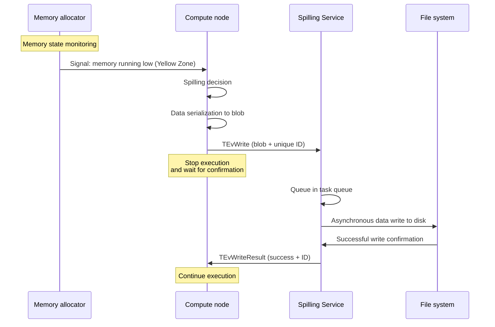
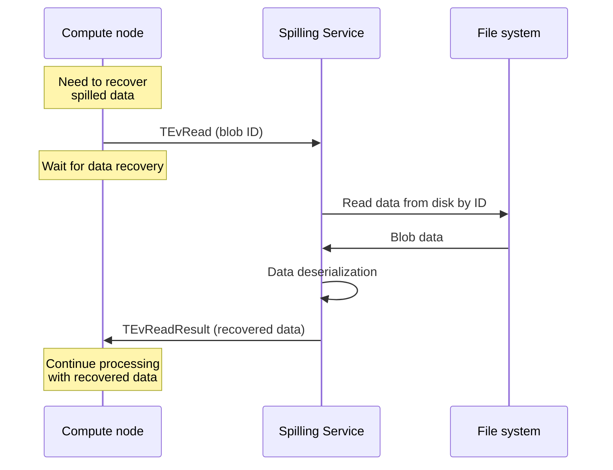

# Spilling

## Spilling concept

**Spilling** is a memory management mechanism that temporarily offloads data exceeding available RAM capacity to external storage. This allows operations to continue without crashes and efficiently utilizes resources under memory constraints.

In data processing systems, including {{ ydb-short-name }}, spilling is essential for:

- processing data volumes that exceed available RAM;
- preventing "Out of Memory" (OOM) errors;
- stable operation under peak loads and unpredictable memory usage scenarios.

## Spilling principles

### Core concepts

Spilling operates based on the memory hierarchy principle:

1. **Random Access Memory (RAM)** — fast but limited resource.
2. **External storage** — slower but more capacious.

When memory usage approaches the limit, the system:

- serializes part of the data;
- saves it to external storage;
- frees the corresponding memory;
- when necessary — loads data back into memory to continue computations.


## Spilling in {{ ydb-short-name }}

### Spilling architecture in {{ ydb-short-name }}

The spilling mechanism in {{ ydb-short-name }} includes two main levels: backend - a service for storing data in external storage, and frontend - components that interact with this service and manage memory.

#### Spilling Service

This component is an [actor service](glossary.md#actor-service) that initializes at node startup. The service is designated as **Spilling Service**.

The service processes tasks (or events in terms of the [actor system](glossary.md#actor-system)). Events can contain the following types of jobs:

* saving data blobs.
* loading data blobs.
* deleting data blobs.

The main function of the service is to implement storage that saves data blobs by client-provided identifier and ensures blob retrieval by that identifier.

Main service components:

**Task queue**: The service maintains an internal queue of read and write operations. All spilling requests are placed in this queue and processed asynchronously.

**Thread pool**: A pool of worker threads is used to perform I/O operations. The number of threads is [configurable](../devops/configuration-management/configuration-v2/spilling-config.md#workerscount) and affects service performance.

**File management**: The service automatically creates, deletes, and manages files on disk.

**Resource monitoring**: The service monitors disk space usage, number of active operations, and other performance metrics.

#### Data storage

Data is saved in files on the local file system. Spilling Service ensures:

* distribution of records between files;
* file deletion;
* data lifecycle management.

In case of unexpected restart, obsolete files are automatically deleted.

#### Components using spilling

System components are integrated with Spilling Service and interact with it through actor system events:

**Memory state monitoring**: Compute nodes continuously monitor memory state through the allocator. The allocator informs nodes about decreasing free memory volume. However, the system does not wait for complete memory exhaustion, since the spilling process also requires additional memory resources for serialization and buffering.

**Event dispatch**: When spilling necessity is detected, the compute component (data transfer channel or compute core) performs the following actions:

1. Serializes data into a blob
2. Generates a unique identifier for the blob
3. Creates a spilling event (`TEvWrite`) with the blob and generated identifier
4. Sends the event to Spilling Service
5. **Suspends execution** and enters waiting state

**Waiting for results**: After sending the event, the compute component hands over execution to other components and stops executing itself until the blob is physically written to disk.

**Response handling**: Spilling Service processes the event and returns a new `TEvWriteResult` event with write confirmation for the specified identifier or `TEvError` in case of error. Compute component can only continue after receiving confirmation.

**Spilling interaction diagram:**

**Data write process (spilling):**



**Data read process (recovery):**



**Data reading**: When data recovery is needed, the component sends a `TEvRead` event with blob identifier. Spilling Service reads data from disk and returns a `TEvReadResult` event with recovered data. Computations are also suspended while waiting for data.

### Types of spilling in {{ ydb-short-name }}

{{ ydb-short-name }} implements two main types of spilling operating at different levels of the computational process:

#### 1. Compute Node Spilling

{{ ydb-short-name }} compute cores automatically offload intermediate data to disk when executing operations requiring significant memory. This type of spilling is implemented at the level of individual computational operations and activates when memory limits are reached.

**Main usage scenarios:**

* **Aggregations** — when grouping large data volumes, the system offloads intermediate hash tables to disk
* **Sorting** — when sorting results exceeding available memory, external sorting is applied using temporary files
* **Join operations** — when joining large tables, Grace Hash Join algorithm is used with data partitioning and offloading to disk

**Operation mechanism:**

Compute nodes contain specialized objects for monitoring memory usage. When data volume approaches the set limit:

1. System switches to spilling mode
2. Data is serialized and divided into blocks (buckets)
3. Part of blocks is transferred to Spilling Service for disk storage
4. Metadata about data location is kept in memory
5. When necessary, data is loaded back and processed

```sql
-- Example query that may trigger spilling in compute cores
SELECT
    user_id,
    COUNT(*) as orders_count,
    SUM(amount) as total_amount
FROM orders
GROUP BY user_id
ORDER BY total_amount DESC;
```

#### 2. Channel Spilling

This type of spilling operates at the level of data transfer between different query execution stages. Data transfer channels automatically buffer and offload data when buffers overflow. This helps avoid blocking the data-generating node execution even when the receiving node is not ready to accept data.

**Operation mechanism:**

Data transfer channels continuously monitor their state:

1. **Buffering**: Incoming data accumulates in channel internal buffers
2. **Fill control**: System tracks buffer fill levels (NoLimit, SoftLimit, HardLimit)
3. **Automatic spilling**: When limits are reached, data is automatically serialized and transferred to Spilling Service
4. **Continued operation**: Channel continues accepting new data after freeing memory space
5. **Recovery**: When the next stage is ready, data is read from disk and passed further

#### Integration of spilling types

Both spilling types work together and can activate simultaneously within one query. For example, when executing a complex analytical query:

## See also

- [Spilling configuration](../devops/configuration-management/configuration-v2/spilling-config.md)
- [{{ ydb-short-name }} monitoring](../devops/observability/monitoring.md)
- [Performance diagnostics](../troubleshooting/performance/index.md) 