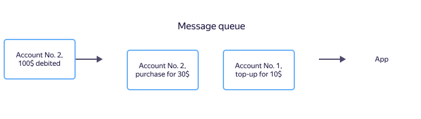
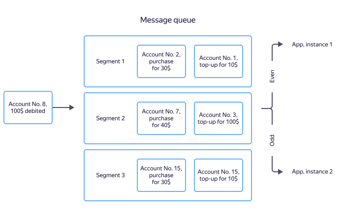

# Topic

A topic in {{ ydb-short-name }} is an entity for storing unstructured messages and delivering them to multiple subscribers. Basically, a topic is a named set of messages.

A producer app writes messages to a topic. Consumer apps are independent of each other, they receive and read messages from the topic in the order they were written there. Topics implement the [publish-subscribe](https://en.wikipedia.org/wiki/Publish–subscribe_pattern)(https://ru.wikipedia.org/wiki/Издатель-подписчик_(шаблон_проектирования)) architectural pattern.

{{ ydb-short-name }} topics have the following properties:

* At-least-once delivery guarantees when messages are read by subscribers.
* Exactly-once delivery guarantees when publishing messages (to ensure there are no duplicate messages).
* [FIFO](https://en.wikipedia.org/wiki/Message_queue) message processing guarantees for messages published with the same [source ID](#producer-id).
* Message delivery bandwidth scaling for messages published with different sequence IDs.

## Messages {#message}

Data is transferred as message streams. A message is the minimum atomic unit of user information. A message consists of a body and attributes and additional system properties. The content of a message is an array of bytes which is not interpreted by {{ydb-short-name}} in any way.

Messages may contain user-defined attributes in "key-value" format. They are returned along with the message body when reading the message. User-defined attributes let the consumer decide whether it should process the message without unpacking the message body. Message attributes are set when initializing a write session. This means that all messages written within a single write session will have the same attributes when reading them.

## Partitioning {#partitioning}

To enable horizontal scaling, a topic is divided into `partitions` that are units of parallelism. Each partition has a limited bandwidth. The recommended write speed is 1 MBps.



As for now, you can only reduce the number of partitions in a topic by deleting and recreating a topic with a smaller number of partitions.



### Offset {#offset}

All messages within a partition have a unique sequence number called an `offset` An offset monotonically increases as new messages are written.

## Message sources and groups {#producer-id}

Messages are ordered using the `producer_id` and `message_group_id`. The order of written messages is maintained within pairs: <producer ID, message group ID>.

When used for the first time, a pair of <producer ID, message group ID> is linked to a topic's [partition](#partition) using the round-robin algorithm and all messages with this pair of IDs get into the same partition. The link is removed if there are no new messages using this producer ID for 14 days.



The recommended maximum number of <producer ID, message group ID> pairs is up to 100 thousand per partition in the last 14 days.





### When the message processing order is important

Let's consider a finance application that calculates the balance on a user's account and permits or prohibits debiting the funds.

For such tasks, you can use a [message queue](https://en.wikipedia.org/wiki/Message_queue). When you top up your account, debit funds, or make a purchase, a message with the account ID, amount, and transaction type is registered in the queue. The application processes incoming messages and calculates the balance.

To accurately calculate the balance, the message processing order is crucial. If a user first tops up their account and then makes a purchase, messages with details about these transactions must be processed by the app in the same order. Otherwise there may be an error in the business logic and the app will reject the purchase as a result of insufficient funds. There are guaranteed delivery order mechanisms, but they cannot ensure a message order within a single queue on an arbitrary data amount.

When several application instances read messages from a stream, a message about account top-ups can be received by one instance and a message about debiting by another. In this case, there's no guaranteed instance with accurate balance information. To avoid this issue, you can, for example, save data in the DBMS, share information between application instances, and implement a distributed cache.

{{ ydb-short-name }} can write data so that messages from one source (for example, about transactions from one account) arrive at the same application instance. The source of a message is identified by the source_id, while the sequence number of a message from the source is used to ensure there are no duplicate messages. {{ydb-short-name}} arranges data streams so that messages from the same source arrive at the same partition. As a result, transaction messages for a given account will always arrive at the same partition and be processed by the application instance linked to this partition. Each of the instances processes its own subset of partitions and there's no need to synchronize the instances.

Below is an example when all transactions on accounts with even ids are transferred to the first instance of the application, and with odd ones — to the second.

### When the processing order is not important {#no-dedup}

For some tasks, the message processing order is not critical. For example, it's sometimes important to simply deliver data that will then be ordered by the storage system.

For such tasks, the 'no-deduplication' mode can be used. In this scenario neither [`producer_id`](#producer-id) or [`source_id`](#source-id) are specified in write session setup and [`sequence numbers`](#seqno) are also not used for messages. The no-deduplication mode offers better perfomance and requires less server resources, but there is no message ordering or deduplication on the server side, which means that some message sent to the server multiple times (for example due to network instablity or writer process crash) also may be written to the topic multiple times.



We strongly recommend that you don't use random or pseudo-random source IDs. We recommend using a maximum of 100 thousand different source IDs per partition.





#### Source ID {#source-id}

A source ID is an arbitrary string up to 2048 characters long. This is usually the ID of a file server or some other ID.

#### Sample source IDs {#source-id-examples}

| Type | ID | Description |
--- | --- | ---
| File | Server ID | Files are used to store application logs. In this case, it's convenient to use the server ID as a source ID. |
| User actions | ID of the class of user actions, such as "viewing a page", "making a purchase", and so on. | It's important to handle user actions in the order they were performed by the user. At the same time, there is no need to handle every single user action in one application. In this case, it's convenient to group user actions by class. |

### Message group ID {#group-id}

A message group ID is an arbitrary string up to 2048 characters long. This is usually a file name or user ID.

#### Sample message group IDs {#group-id-examples}

| Type | ID | Description |
--- | --- | ---
| File | Full file path | All data from the server and the file it hosts will be sent to the same partition. |
| User actions | User ID | It's important to handle user actions in the order they were performed. In this case, it's convenient to use the user ID as a source ID. |

## Message sequence numbers {#seqno}

All messages from the same source have a [`sequence number`](#seqno) used for their deduplication. A message sequence number should monotonically increase within a `topic`, `source` pair. If the server receives a message whose sequence number is less than or equal to the maximum number written for the `topic`, `source` pair, the message will be skipped as a duplicate.  Some sequence numbers in the sequence may be skipped. Message sequence numbers must be unique within the `topic`, `source` pair.

Sequence numbers are not used if [no-deduplication mode](#no-dedup) is enabled.

### Sample message sequence numbers {#seqno-examples}

| Type | Example | Description |
--- | --- | ---
| File | Offset of transferred data from the beginning of a file | You can't delete lines from the beginning of a file, since this will lead to skipping some data as duplicates or losing some data. |
| DB table | Auto-increment record ID |

## Message retention period {#retention-time}

The message retention period is set for each topic. After it expires, messages are automatically deleted. An exception is data that hasn't been read by an [important](#important-consumer) consumer: this data will be stored until it's read.

## Data compression {#message-codec}

When transferring data, the producer app indicates that a message can be compressed using one of the supported codecs. The codec name is passed while writing a message, saved along with it, and returned when reading the message. Compression applies to each individual message, no batch message compression is supported. Data is compressed and decompressed on the producer and consumer apps end.

Supported codecs are explicitly listed in each topic. When making an attempt to write data to a topic with a codec that is not supported, a write error occurs.

| Codec | Description |
--- | ---
| `raw` | No compression. |
| `gzip` | [Gzip](https://en.wikipedia.org/wiki/Gzip) compression. |

`lzop` | [lzop](https://en.wikipedia.org/wiki/Lzop) compression.

`zstd` | [zstd](https://en.wikipedia.org/wiki/Zstd) compression.

## Consumer {#consumer}

A consumer is a named entity that reads data from a topic. A consumer contains committed consumer offsets for each topic read on their behalf.

### Consumer offset {#consumer-offset}

A consumer offset is a saved [offset](#offset) of a consumer by each topic partition. It's saved by a consumer after sending commits of the data read. When a new read session is established, messages are delivered to the consumer starting with the saved consumer offset. This lets users avoid saving the consumer offset on their end.

### Important consumer {#important-consumer}

A consumer may be flagged as "important". This flag indicates that messages in a topic won't be removed until the consumer reads and confirms them. You can set this flag for most critical consumers that need to handle all data even if there's a long idle time.



As a long timeout of an important consumer may result in full use of all available free space by unread messages, be sure to monitor important consumers' data read lags.


