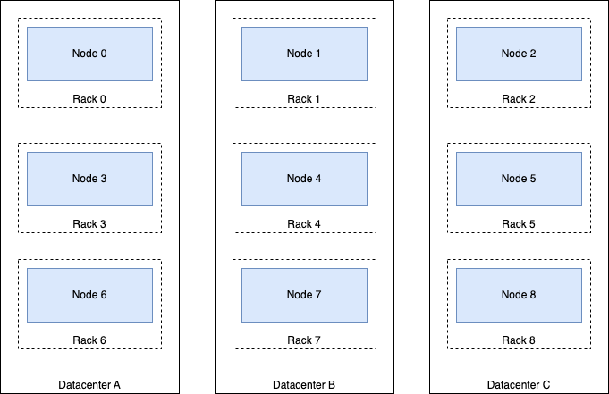
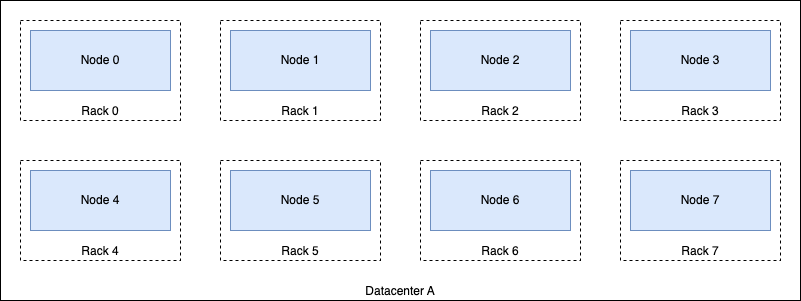

# {{ ydb-short-name }} Cluster Topology

A {{ ydb-short-name }} cluster consists of [storage](glossary.md#storage-node) and [database](glossary.md#database-node) nodes. As the data stored in {{ ydb-short-name }} is available only via queries and API calls, both types of nodes are essential for [database availability](#database-availability). However, [distributed storage](glossary.md#distributed-storage) consisting of storage nodes has the most impact on the cluster's fault tolerance and ability to persist data reliably. During the initial cluster deployment, an appropriate distributed storage [operating mode](#cluster-config) needs to be chosen according to the expected workload and [database availability](#database-availability) requirements. The operation mode cannot be changed after the initial cluster setup, making it one of the key decisions to consider when planning a new {{ ydb-short-name }} deployment.

## Cluster Operating Modes {#cluster-config}

Cluster topology is based on the chosen distributed storage operating mode, which needs to be determined according to the fault tolerance requirements. {{ ydb-short-name }}'s failure model is based on the concepts of [fail domain](glossary.md#fail-domain) and [fail realm](glossary.md#fail-realm).

The following {{ ydb-short-name }} distributed storage operating modes are available:

- `mirror-3-dc`. Data is replicated to 3 failure realms (usually availability zones or data centers) using 3 failure domains (usually racks) within each realm. {{ ydb-short-name }} cluster remains available even if one failure realm completely fails; additionally, one failure domain in the remaining zones can fail at the same time. This mode is recommended for multi-datacenter clusters with high availability requirements.

  

- `block-4-2`. [Erasure coding](https://en.wikipedia.org/wiki/Erasure_code) is applied with two blocks of redundancy added to the four blocks of source data. Storage nodes are placed in at least 8 failure domains (usually racks). {{ ydb-short-name }} cluster remains available if any two domains fail, continuing to record all 6 data parts in the remaining domains. This mode is recommended for clusters deployed within a single availability zone or data center.

  

- `none`. There is no redundancy. Any hardware failure causes data to become unavailable or permanently lost. This mode is only recommended for development and functional testing.



Server failure refers to both total and partial unavailability. For example, the failure of a single disk is also considered a server failure in this context.



Fault-tolerant operation modes of distributed storage require a significant amount of hardware to provide the maximum level of high availability guarantees supported by {{ ydb-short-name }}. However, for some use cases, the investment into hardware might be too high upfront. Therefore, {{ ydb-short-name }} offers variations of these operation modes that require less hardware while still providing a reasonable level of fault tolerance. The requirements and guarantees of all these operation modes and their variants are shown in the table below, while the implications of choosing a particular mode are discussed further in the article.

| Mode | Storage volume multiplier | Minimum number of nodes | Fail domain | Fail realm | Number of data centers | Number of server racks |
| --- | --- | --- | --- | --- | --- | --- |
| `mirror-3-dc`, can stand a failure of a data center and 1 rack in one of the remaining data centers | 3 | 9 ([12 recommended](*recommended-node-count)) | Rack | Data center | 3 | 3 in each data center |
| `mirror-3-dc` *(reduced)*, can stand a failure of a data center and 1 server in one of the two other data centers | 3 | 12 | ½ a rack | Data center | 3 | 6 |
| `mirror-3-dc` *(3 nodes)*, can stand a failure of a single server, or a failure of a data center | 3 | 3 | Server | Data center | 3 | Doesn't matter |
| `block-4-2`, can stand a failure of 2 racks | 1.5 | 8 ([10 recommended](*recommended-node-count)) | Rack | Data center | 1 | 8 |
| `block-4-2` *(reduced)*, can stand a failure of 1 rack | 1.5 | 10 | ½ a rack | Data center | 1 | 5 |
| `none`, no fault tolerance | 1 | 1 | Node | Node | 1 | 1 |



The storage volume multiplier specified above only applies to the fault tolerance factor. Other influencing factors (for example, [slot](glossary.md#slot) fragmentation and granularity) must be taken into account for storage capacity planning.



For information about how to set the {{ ydb-short-name }} cluster topology, see [{#T}](../reference/configuration/domains_config.md#domains-blob).

### Reduced Configurations {#reduced}

If it is impossible to use the [recommended amount](#cluster-config) of hardware, you can divide servers within a single rack into two dummy fail domains. In this configuration, the failure of one rack results in the failure of two domains instead of just one. In such reduced configurations, {{ ydb-short-name }} will continue to operate if two domains fail. The minimum number of racks in a cluster is five for `block-4-2` mode and two per data center (e.g., six in total) for `mirror-3-dc` mode.

The minimal fault-tolerant configuration of a {{ ydb-short-name }} cluster uses the 3 nodes variant of `mirror-3-dc` operating mode, which requires only three servers with three disks each. In this configuration, each server acts as both a fail domain and a fail realm, and the cluster can withstand the failure of only a single server. Each server must be located in an independent data center to provide reasonable fault tolerance.

{{ ydb-short-name }} clusters configured with one of these approaches can be used for production environments if they don't require stronger fault tolerance guarantees.

## Capacity and Performance Considerations {#capacity}

The system can function with fail domains of any size. However, if there are few domains with varying numbers of disks, the number of storage groups that can be created will be limited. In such cases, hardware in overly large fail domains may be underutilized. If all hardware is fully utilized, significant differences in domain sizes may prevent reconfiguration.

For example, consider a cluster in `block-4-2` mode with 15 racks. The first rack contains 20 servers, while the other 14 racks each contain 10 servers. To fully utilize the 20 servers from the first rack, {{ ydb-short-name }} will create groups that include 1 disk from this largest fail domain in each group. Consequently, if any other fail domain's hardware fails, the load cannot be redistributed to the hardware in the first rack.

{{ ydb-short-name }} can group disk drives of different vendors, capacities, and speeds. The resulting characteristics of a group depend on the set of the worst characteristics of the hardware serving the group. Generally, the best results can be achieved by using homogeneous hardware.



Hardware from the same batch is more likely to have similar defects and may fail simultaneously. It is essential to consider this when building large-scale {{ ydb-short-name }} clusters.



Therefore, the optimal initial hardware configurations for production {{ ydb-short-name }} clusters are as follows:

* **A cluster hosted in one availability zone**: This setup uses the `block-4-2` mode and consists of nine or more racks, each with an identical number of servers.
* **A cluster hosted in three availability zones**: This setup uses the `mirror-3-dc` mode and is distributed across three data centers, with four or more racks in each, all containing an identical number of servers.

## Database Availability {#database-availability}

A [database](glossary.md#database) within a {{ ydb-short-name }} cluster is available if both its storage and compute resources are operational:

- All [storage groups](glossary.md#storage-group) allocated for the database must be operational, i.e., stay within the allowed level of failures.
- The compute resources of the currently available [database nodes](glossary.md#database-node) (primarily the amount of main memory) must be sufficient to start all the [tablets](glossary.md#tablet) managing objects like [tables](glossary.md#table) or [topics](glossary.md#topic) within the database and to handle user sessions.

To survive an entire data center outage at the database level, assuming a cluster configured with the `mirror-3-dc` operating mode:

- The [storage nodes](glossary.md#storage-node) need to have at least double the I/O bandwidth and disk capacity compared to what is required for normal operation. In the worst case, the load on the remaining nodes during the maximum allowed outage might triple, but that's only temporary until self-heal restores failed disks in operating data centers.
- The [database nodes](glossary.md#database-node) must be evenly distributed between all 3 data centers and include sufficient resources to handle the entire workload when running in just 2 of the 3 data centers. To achieve this, database nodes in each datacenter need at least 35% extra spare CPU and RAM resources when running normally without ongoing failures. If database nodes are typically utilized above this threshold, consider adding more of them or moving them to servers with more resources.

## See Also

* [Documentation for DevOps Engineers](../devops/index.md)
* [{#T}](../reference/configuration/domains_config.md#domains-blob)
* [Example Cluster Configuration Files](https://github.com/ydb-platform/ydb/tree/main/ydb/deploy/yaml_config_examples/)
* [{#T}](../contributor/distributed-storage.md)

[*recommended-node-count]: Using fewer than this number of nodes will limit the cluster's ability to [self-heal](../maintenance/manual/selfheal.md).